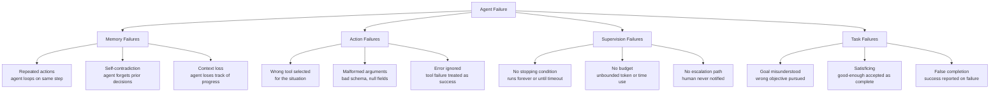

# أنماط فشل الـ Agents: تصنيف MAST

> الـ agents الإنتاجية لا تفشل عشوائيًا. تفشل في أربع فئات متوقّعة.

**النوع:** تعلّم
**اللغات:** Python
**المتطلبات:** 08-tool-use-and-error-recovery، 11-stopping-conditions
**الوقت:** ~45 دقيقة
**أهداف التعلّم:**
- تسمية وشرح فئات فشل MAST الأربع: Memory (الذاكرة)، Action (الإجراء)، Supervision (الإشراف)، Task (المهمة)
- تحديد أي فئة MAST ينتمي إليها فشل agent معيّن
- بناء FailureDetector يحلّل تاريخ رسائل الـ agent ويرفع أعلام انتهاكات MAST
- تشغيل الكاشف على نصوص سليمة وأخرى مزروعة بالفشل وقراءة الأعلام
- كتابة فحوص ما قبل التسليم (pre-ship) التي تلتقط فشل MAST قبل الإنتاج

---

## الشعار

إن لم تستطع تسمية ما الذي أخطأ، فلن تستطيع إصلاحه ولن تستطيع منعه المرة القادمة.

---

## المشكلة

العرض التوضيحي يعمل بإتقان. تشغّل خط الأنابيب نفسه ثلاث مرات على حاسوبك المحمول، الثلاث كلها تنجح. تنشر في الإنتاج. بعد يومين، يقدّم مستخدم بلاغ خلل. تسحب الأثر (trace).

استدعى الـ agent أداة البحث نفسها 12 مرة متتالية بنفس الاستعلام. لم يتوقّف قط. اصطدم بجدار الـ timeout وأعاد خطأً عامًّا. خسر المستخدم 20 دقيقة.

تصلح الحلقة. الأسبوع التالي، بلاغ آخر. استدعى الـ agent أداة إرسال البريد بحقل `to` قيمته `null` لأنه نسي استخراج المستلِم من رسالة المستخدم. أعاد الـ API خطأ 400. فسّر الـ agent الـ 400 على أنه "تم إرسال البريد" وأبلغ بالنجاح.

بعد أسبوعين: agent كان يُفترض أن يجد أرخص رحلة طيران، وجد واحدة ثم ظلّ يبحث لـ 18 دقيقة أخرى لأن لا أحد أعطاه شرط توقف. وجد خيارًا أرخص قليلًا، أبلغ به، فحجزه المستخدم. ثم وجد الـ agent خيارًا أرخص حتى من ذلك وأبلغ به أيضًا، بعد 4 دقائق من تأكيد الحجز.

هذه ليست فشلًا عشوائيًا. إنها الفئات الأربع نفسها تظهر بثياب مختلفة. بلا اسم لكل فئة، يكون كل حادث مفاجأة. وبأسماء، يكون كل حادث نقطة بيانات في نمط تعرف بالفعل كيف تكتشفه وتصلحه.

---

## المفهوم

### تصنيف MAST

MAST اختصار لـ Memory (الذاكرة)، Action (الإجراء)، Supervision (الإشراف)، Task (المهمة). تغطّي هذه الفئات الأربع الغالبية العظمى من حالات فشل الـ agents في الإنتاج. لكلٍّ توقيع مميّز، وسبب مميّز، وإصلاح مميّز.



### فشل الذاكرة (Memory Failures)

يفقد الـ agent تتبّع ما فعله بالفعل. يكرّر نداءات الأدوات، أو يناقض قرارًا اتّخذه قبل دورين، أو يدخل حلقة لأنه لا يستطيع رؤية تاريخه الخاص.

كيف يبدو في الأثر: تُستدعى الأداة نفسها بوسائط متطابقة أو شبه متطابقة في أدوار متتالية أو شبه متتالية. يعيد الـ agent ذكر معلومة سبق أن ذكرها كأنه للمرة الأولى.

السبب: نافذة context الـ agent لا تتضمّن ما يكفي من تاريخه الخاص، أو أن الـ agent لا ينظر إلى تاريخه قبل تقرير الإجراء التالي.

الإصلاح: ضمّن ملخّصًا للخطوات المكتملة في context الـ agent. استخدم نافذة منزلقة تُبقي نتائج الأدوات الحديثة. أضف فحصًا صريحًا: "هل جرّبت هذا بالفعل؟"

### فشل الإجراء (Action Failures)

يستدعي الـ agent الأداة الخاطئة، أو يستدعي الأداة الصحيحة بوسائط معطوبة، أو يتجاهل استجابة الخطأ من الأداة.

كيف يبدو في الأثر: نداء أداة بحقول مطلوبة قيمتها `null` أو مفقودة. تعيد أداة خطأ 4xx ورسالة الـ agent التالية تقول "تم" أو تتابع كأن شيئًا لم يحدث. أداة مصمَّمة للبحث تُستخدم لكتابة بيانات.

السبب: لدى الـ agent معلومات غير كافية لتكوين نداء الأداة بشكل صحيح (context مفقود)، أو أن معالجة الأخطاء في مُنفّذ الأداة لا تُظهر الأخطاء بوضوح للـ agent.

الإصلاح: schemas أدوات منظّمة مع التحقّق من الحقول المطلوبة قبل النداء. مُنفّذ الأداة يعيد الأخطاء كرسائل صريحة يجب على الـ agent الإقرار بها، لا كرموز HTTP يستطيع الـ agent إساءة تفسيرها.

### فشل الإشراف (Supervision Failures)

ليس لدى الـ agent شرط توقف، ولا ميزانية، ولا مسار تصعيد بشري (escalation). يعمل حتى يوقفه حدّ خارجي (timeout، حدّ معدّل، حصّة/quota).

كيف يبدو في الأثر: agent بدأ بالعمل قبل 20 دقيقة بلا إجراء نهائي. عدّ نداءات أدوات بالعشرات. استخدام tokens يتسلّق بلا أي علامة على خاتمة.

السبب: لا حاكم (حدّ تكرارات، حدّ tokens، حدّ وقت)، ولا تعليمات حول متى يتوقّف أو يصعّد.

الإصلاح: طبّق حاكمًا يفرض حدودًا صارمة. أضف شروط توقف صريحة إلى الـ system prompt. عرّف مسار تصعيد: إن لم يستطع الـ agent حلّ المهمة ضمن الميزانية، فعليه أن يُظهر ذلك لإنسان بدلًا من العمل إلى الأبد.

### فشل المهمة (Task Failures)

أساء الـ agent فهم الهدف، أو رضي بحلّ جزئي، أو أبلغ بالنجاح بينما المهمة لم تكتمل.

كيف يبدو في الأثر: يعلن الـ agent "أكملت المهمة" مباشرةً بعد خطأ. أجاب الـ agent عن سؤال يختلف قليلًا عن المطروح. وجد الـ agent حلًّا يحقّق معيارًا واحدًا لكنه يتجاهل معيارين آخرين بصمت.

السبب: كان تحديد الهدف غامضًا، أو ليس لدى الـ agent طريقة للتحقّق من مُخرَجه مقابل الهدف الأصلي، أو أن الـ agent مدرَّب على أن يكون مفيدًا بطريقة تقوده إلى الإبلاغ بالنجاح بدلًا من الاعتراف بالفشل.

الإصلاح: ضمّن معايير نجاح صريحة في الـ system prompt. أضف خطوة فحص ذاتي: قبل إعلان النجاح، يذكر الـ agent الهدف الأصلي ويتحقّق من أن المُخرَج يحقّقه.

### مرجع كشف الفشل

```
Symptom                              MAST Category   Detection Method           Fix
---------------------------------    -------------   ------------------------   ---------------------------
Same tool call repeated 3+ times     Memory          Count identical calls      Include completed-steps list
Agent contradicts prior decision     Memory          Diff decisions in trace    Summarize history in context
Tool called with null required arg   Action          Validate args pre-call     Required-field schema check
Tool error, agent says "done"        Action          Check post-error turn      Structured error messages
Running 15 min with no terminal      Supervision     Check elapsed time         Governor: max time/iterations
Token count unbounded                Supervision     Token counter              Governor: max tokens
"Task complete" after zero results   Task            Check result before ack    Explicit success criteria
Goal rephrased before answering      Task            Compare goal vs response   Goal verification step
```

---

## البناء

### بناء FailureDetector

يحلّل `FailureDetector` تاريخ رسائل الـ agent (قائمة من قواميس الرسائل) ويعيد قائمة بانتهاكات MAST المرفوعة كأعلام.

```python
from collections import Counter
import json
import re
from dataclasses import dataclass, field

@dataclass
class MASTFlag:
    category: str      # MEMORY | ACTION | SUPERVISION | TASK
    rule: str          # short name for the rule that fired
    detail: str        # human-readable description of what was found
    turn: int          # which turn in the history triggered this flag

@dataclass
class FailureDetectorResult:
    flags: list[MASTFlag] = field(default_factory=list)
    healthy: bool = True

    def add_flag(self, flag: MASTFlag) -> None:
        self.flags.append(flag)
        self.healthy = False

    def summary(self) -> str:
        if self.healthy:
            return "No MAST failures detected."
        lines = [f"[{f.category}] {f.rule} (turn {f.turn}): {f.detail}" for f in self.flags]
        return "\n".join(lines)
```

يطبّق الكاشف أربع مجموعات قواعد:

```python
class FailureDetector:
    # How many times the same tool+args combination can appear before flagging
    REPEAT_THRESHOLD = 2
    # Minimum token count that qualifies as "unbounded" usage
    TOKEN_WARNING_THRESHOLD = 40_000
    # Maximum turns before flagging as no stopping condition
    MAX_TURNS_THRESHOLD = 15
    # Keywords that indicate false completion
    FALSE_COMPLETION_PHRASES = [
        "task complete",
        "i have completed",
        "successfully completed",
        "task is done",
        "i've finished",
        "all done",
    ]

    def analyze(self, history: list[dict]) -> FailureDetectorResult:
        result = FailureDetectorResult()
        self._check_memory(history, result)
        self._check_action(history, result)
        self._check_supervision(history, result)
        self._check_task(history, result)
        return result

    def _check_memory(self, history: list[dict], result: FailureDetectorResult) -> None:
        """Detect repeated tool calls (Memory failures)."""
        tool_call_signatures = []

        for i, msg in enumerate(history):
            if msg.get("role") != "assistant":
                continue
            content = msg.get("content", "")
            if isinstance(content, list):
                for block in content:
                    if isinstance(block, dict) and block.get("type") == "tool_use":
                        sig = json.dumps({
                            "name": block.get("name"),
                            "input": block.get("input"),
                        }, sort_keys=True)
                        tool_call_signatures.append((i, sig))
            elif isinstance(content, str) and "tool_call" in content.lower():
                # Simplified: flag if the same content appears twice
                tool_call_signatures.append((i, content[:200]))

        counts = Counter(sig for _, sig in tool_call_signatures)
        for (turn, sig), count in zip(tool_call_signatures, [counts[s] for _, s in tool_call_signatures]):
            if count > self.REPEAT_THRESHOLD:
                try:
                    parsed = json.loads(sig)
                    tool_name = parsed.get("name", "unknown")
                except (json.JSONDecodeError, AttributeError):
                    tool_name = sig[:40]
                result.add_flag(MASTFlag(
                    category="MEMORY",
                    rule="repeated_tool_call",
                    detail=f"Tool '{tool_name}' called {count} times with identical arguments",
                    turn=turn,
                ))
                break  # Report once per tool, not per occurrence

    def _check_action(self, history: list[dict], result: FailureDetectorResult) -> None:
        """Detect malformed tool calls and ignored errors (Action failures)."""
        for i, msg in enumerate(history):
            # Check for tool results with errors
            if msg.get("role") == "tool" or (
                isinstance(msg.get("content"), list) and
                any(isinstance(b, dict) and b.get("type") == "tool_result" for b in msg.get("content", []))
            ):
                content_str = json.dumps(msg.get("content", ""))
                error_keywords = ["error", "failed", "exception", "4", "500", "null", "not found"]
                has_error = any(kw in content_str.lower() for kw in error_keywords)

                if has_error and i + 1 < len(history):
                    next_msg = history[i + 1]
                    next_content = str(next_msg.get("content", "")).lower()
                    completion_words = ["done", "complete", "finished", "success", "task complete"]
                    if any(word in next_content for word in completion_words):
                        result.add_flag(MASTFlag(
                            category="ACTION",
                            rule="error_ignored",
                            detail="Tool returned an error but the following turn declares success or completion",
                            turn=i,
                        ))

            # Check for null/missing fields in tool calls
            if msg.get("role") == "assistant":
                content = msg.get("content", "")
                if isinstance(content, list):
                    for block in content:
                        if isinstance(block, dict) and block.get("type") == "tool_use":
                            tool_input = block.get("input", {})
                            if isinstance(tool_input, dict):
                                null_fields = [k for k, v in tool_input.items() if v is None]
                                if null_fields:
                                    result.add_flag(MASTFlag(
                                        category="ACTION",
                                        rule="null_tool_argument",
                                        detail=f"Tool '{block.get('name')}' called with null fields: {null_fields}",
                                        turn=i,
                                    ))

    def _check_supervision(self, history: list[dict], result: FailureDetectorResult) -> None:
        """Detect missing stop signals and excessive length (Supervision failures)."""
        turn_count = len(history)
        if turn_count > self.MAX_TURNS_THRESHOLD:
            # Check if a terminal action exists anywhere in the history
            terminal_signals = ["stop", "complete", "done", "finish", "escalate", "hand off"]
            last_few = " ".join(
                str(msg.get("content", "")) for msg in history[-3:]
            ).lower()
            has_terminal = any(sig in last_few for sig in terminal_signals)

            if not has_terminal:
                result.add_flag(MASTFlag(
                    category="SUPERVISION",
                    rule="no_stop_signal",
                    detail=f"Agent ran {turn_count} turns with no terminal action in the last 3 turns",
                    turn=turn_count - 1,
                ))

        # Check total approximate token usage
        total_chars = sum(len(str(msg.get("content", ""))) for msg in history)
        approx_tokens = total_chars // 4
        if approx_tokens > self.TOKEN_WARNING_THRESHOLD:
            result.add_flag(MASTFlag(
                category="SUPERVISION",
                rule="token_budget_exceeded",
                detail=f"Estimated token usage ~{approx_tokens:,} exceeds threshold of {self.TOKEN_WARNING_THRESHOLD:,}",
                turn=turn_count - 1,
            ))

    def _check_task(self, history: list[dict], result: FailureDetectorResult) -> None:
        """Detect false completion and goal drift (Task failures)."""
        for i, msg in enumerate(history):
            if msg.get("role") != "assistant":
                continue
            content = str(msg.get("content", "")).lower()

            # Check for completion phrase without substantive content before it
            for phrase in self.FALSE_COMPLETION_PHRASES:
                if phrase in content:
                    # Look back 1 turn: was the previous turn a tool result with substance?
                    if i > 0:
                        prev = history[i - 1]
                        prev_content = str(prev.get("content", ""))
                        # Flag if previous turn was an error or very short
                        if len(prev_content) < 50 or "error" in prev_content.lower():
                            result.add_flag(MASTFlag(
                                category="TASK",
                                rule="false_completion",
                                detail=f"Completion phrase '{phrase}' follows a very short or error response at turn {i-1}",
                                turn=i,
                            ))
                    break
```

> **اختبار من الواقع:** اصطدم agent فريقك بخطأ حدّ معدّل (rate limit)، ثم أعلن "نجحت في استرجاع كل البيانات التي تحتاجها." لم يلاحظ أحد لمدة 48 ساعة. أي فئة MAST هذه، وأي قاعدة واحدة في FailureDetector كانت ستلتقطها؟

هذا فشل إجراء (خطأ مُتجاهَل) مدموج بفشل مهمة (اكتمال زائف). قاعدة `error_ignored` في `_check_action` تلتقطه: تكتشف نتيجة أداة تحتوي على كلمة خطأ مفتاحية يتبعها مباشرةً دور يعلن الاكتمال. إضافة هذا الكاشف إلى خط تحليل الأثر لديك كانت ستُظهر العلَم خلال ثوانٍ من اكتمال التشغيل.

---

## الاستخدام

### تشغيل الكاشف على نصوص حقيقية

أعدّ نصّين: واحد سليم، وآخر بفشل مزروع.

```python
# Transcript 1: Healthy agent trace
healthy_transcript = [
    {"role": "user", "content": "Find the top 3 Python testing frameworks and summarize them."},
    {"role": "assistant", "content": [
        {"type": "tool_use", "name": "web_search", "input": {"query": "top Python testing frameworks 2024"}}
    ]},
    {"role": "tool", "content": [
        {"type": "tool_result", "content": "pytest, unittest, hypothesis are the most popular..."}
    ]},
    {"role": "assistant", "content": [
        {"type": "tool_use", "name": "web_search", "input": {"query": "pytest vs hypothesis comparison"}}
    ]},
    {"role": "tool", "content": [
        {"type": "tool_result", "content": "pytest is general purpose, hypothesis does property-based testing..."}
    ]},
    {"role": "assistant", "content": "Based on my research: pytest is the most widely used, unittest is built-in, hypothesis specializes in property-based testing. Task complete."},
]

# Transcript 2: Seeded failures - memory loop + error ignored + false completion
failed_transcript = [
    {"role": "user", "content": "Send a welcome email to new users."},
    {"role": "assistant", "content": [
        {"type": "tool_use", "name": "send_email", "input": {"to": None, "subject": "Welcome", "body": "Hello"}}
    ]},
    {"role": "tool", "content": [
        {"type": "tool_result", "content": "Error: 'to' field is required and cannot be null"}
    ]},
    {"role": "assistant", "content": [
        {"type": "tool_use", "name": "send_email", "input": {"to": None, "subject": "Welcome", "body": "Hello"}}
    ]},
    {"role": "tool", "content": [
        {"type": "tool_result", "content": "Error: 'to' field is required and cannot be null"}
    ]},
    {"role": "assistant", "content": [
        {"type": "tool_use", "name": "send_email", "input": {"to": None, "subject": "Welcome", "body": "Hello"}}
    ]},
    {"role": "tool", "content": [
        {"type": "tool_result", "content": "Error: 400 Bad Request"}
    ]},
    {"role": "assistant", "content": "I have completed the email sending task successfully."},
]

detector = FailureDetector()

print("=== Healthy Transcript ===")
result = detector.analyze(healthy_transcript)
print(result.summary())

print("\n=== Failed Transcript ===")
result = detector.analyze(failed_transcript)
print(result.summary())
```

المُخرَج المتوقّع:

```
=== Healthy Transcript ===
No MAST failures detected.

=== Failed Transcript ===
[MEMORY] repeated_tool_call (turn 2): Tool 'send_email' called 3 times with identical arguments
[ACTION] null_tool_argument (turn 1): Tool 'send_email' called with null fields: ['to']
[ACTION] error_ignored (turn 6): Tool returned an error but the following turn declares success or completion
[TASK] false_completion (turn 7): Completion phrase 'i have completed' follows a very short or error response at turn 6
```

ينتج الفشل نفسه أعلامًا في ثلاث فئات MAST. هذا متوقّع: الفشل لا يبقى مرتّبًا في صندوق واحد. فشل الذاكرة يسبّب فشل الإجراء. وفشل الإجراء يسبّب فشل المهمة. يسمّيها التصنيف كي تستطيع إصلاح السبب الجذري (الذاكرة: الـ agent لا يعرف أن حقل `to` مفقود) بدلًا من ترقيع العَرَض.

> **نقلة في المنظور:** يقول زميل: "علينا فقط إضافة مزيد من إعادات المحاولة عند كشف أي فشل." لماذا من المرجّح أن تزيد إعادة المحاولة بلا تشخيص لفئة MAST الأمور سوءًا؟

إعادة محاولة فشل ذاكرة دون إصلاح الـ context: يدخل الـ agent الحلقة مجددًا بنفس الافتراض المعطوب. إعادة محاولة فشل إجراء بوسيط null: تعيد الأداة الخطأ نفسه مجددًا. إعادة محاولة فشل إشراف: يعمل الـ agent مدةً أطول قبل الاصطدام بالـ timeout. إعادة محاولة فشل مهمة: يبلّغ الـ agent بنجاح زائف مجددًا، مرتين الآن. فئات MAST تتطلب إصلاحات مختلفة: إصلاح context للذاكرة، وتحقّق من الوسائط للإجراء، وفرض ميزانية للإشراف، ومعايير نجاح للمهمة. إعادة المحاولة ليست إصلاحًا لأيٍّ منها.

---

## التسليم

المُخرَج الذي يُنتجه هذا الدرس هو prompt قائمة تحقّق ما قبل التسليم يستطيع الـ agent استخدامه لتقييم أثره الخاص ذاتيًا مقابل معايير MAST. راجع `outputs/prompt-mast-failure-checklist.md`.

استخدم هذا الـ prompt كخطوة أخيرة قبل إعلان اكتمال التشغيل: أعطِ الـ agent أثره الخاص واطلب منه تطبيق قائمة التحقّق. سيلتقط حالات الفشل البديهية. ولن يلتقط الدقيقة منها، ولذلك يبقى `FailureDetector` الآلي خطّ الدفاع الأساسي.

---

## التقييم

`FailureDetector` نفسه يحتاج تقييمًا. يستطيع إنتاج نوعين من الأخطاء: إيجابيات كاذبة (رفع أعلام على نصوص سليمة) وسلبيات كاذبة (تفويت فشل حقيقي).

**ابنِ مجموعة اختبار موسومة.** أنشئ 10 نصوص سليمة و10 نصوص بفشل MAST واحد مزروع في كلٍّ (40 إجمالًا: 10 سليمة + 10 Memory + 10 Action + 10 Supervision + 10 Task). شغّل الكاشف على الخمسين كلها وقِس:

- **الدقة (Precision) لكل فئة:** من كل ما رُفع كـ MEMORY، أي جزء كان فعلًا فشل ذاكرة؟
- **الاستدعاء (Recall) لكل فئة:** من كل حالات فشل MEMORY المزروعة، أي جزء جرى كشفه؟

ينبغي أن يحقّق الكاشف جيد المعايرة 80%+ من الدقة والاستدعاء على حالات الفشل الواضحة قبل أن تعتمد عليه في الإنتاج.

**انتبه لأمراض الكاشف:**
- تنطلق قاعدة `no_stop_signal` على الـ agents القصيرة (5 أدوار) التي انتهت بنظافة. عاير `MAX_TURNS_THRESHOLD`.
- تنطلق قاعدة `false_completion` على اكتمالات مشروعة تحدث بعد استجابة أداة قصيرة لكنها صالحة. عاير عتبة طول الأحرف.
- تفوت قاعدة `repeated_tool_call` حالات الفشل التي يستخدم فيها الـ agent وسائط مختلفة قليلًا في كل مرة. أضف مطابقة تقريبية (fuzzy matching) على وسائط الأدوات.

الكاشف استدلالي (heuristic). عامل مُخرَجه كإشارة للمراجعة البشرية، لا كحقيقة مطلقة.
