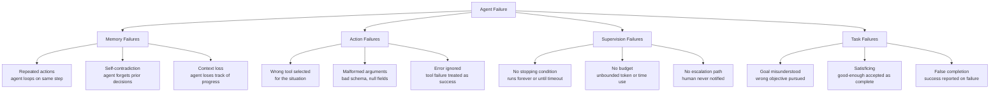

# Agent Failure Modes: MAST Taxonomy

> Production agents do not fail randomly. They fail in four predictable categories.

**Type:** Learn
**Languages:** Python
**Prerequisites:** 08-tool-use-and-error-recovery, 11-stopping-conditions
**Time:** ~45 min
**Learning Objectives:**
- Name and explain the four MAST failure categories: Memory, Action, Supervision, Task
- Identify which MAST category a given agent failure belongs to
- Build a FailureDetector that analyzes agent message history and flags MAST violations
- Run the detector on healthy and seeded-failure transcripts and read the flags
- Write pre-ship checks that catch MAST failures before production

---

## MOTTO

If you cannot name what went wrong, you cannot fix it and you cannot prevent it next time.

---

## THE PROBLEM

The demo works perfectly. You run the same pipeline three times on your laptop, all three pass. You deploy to production. Two days later, a user files a bug report. You pull the trace.

The agent called the same search tool 12 times in a row with the same query. It never stopped. It hit the timeout wall and returned a generic error. The user lost 20 minutes.

You fix the loop. Next week, another report. The agent called the email-send tool with a `to` field of `null` because it forgot to extract the recipient from the user's message. The API returned a 400. The agent interpreted the 400 as "email sent" and reported success.

Two weeks later: an agent that was supposed to find the cheapest flight found one and then kept searching for 18 more minutes because no one gave it a stopping condition. It found a slightly cheaper option, reported that, and the user booked it. Then the agent found an even cheaper one and reported that too, 4 minutes after the booking was confirmed.

These are not random failures. They are the same four categories appearing in different clothing. Without a name for each category, every incident is a surprise. With names, each incident is a data point in a pattern you already know how to detect and fix.

---

## THE CONCEPT

### The MAST Taxonomy

MAST stands for Memory, Action, Supervision, Task. These four categories cover the vast majority of agent failures in production. Each has a distinct signature, a distinct cause, and a distinct fix.



### Memory Failures

The agent loses track of what it has already done. It repeats tool calls, contradicts a decision it made two turns ago, or loops because it cannot see its own history.

What it looks like in a trace: the same tool is called with identical or near-identical arguments in consecutive or near-consecutive turns. The agent restates information it already stated as if for the first time.

Cause: the agent's context window does not include enough of its own history, or the agent is not looking at its history before deciding the next action.

Fix: include a summary of completed steps in the agent's context. Use a sliding window that retains recent tool results. Add an explicit check: "have I already tried this?"

### Action Failures

The agent calls the wrong tool, calls the right tool with broken arguments, or ignores the tool's error response.

What it looks like in a trace: a tool call has `null` or missing required fields. A tool returns a 4xx error and the agent's next message says "done" or continues as if nothing happened. A tool designed for search is used to write data.

Cause: the agent has insufficient information to form the tool call correctly (missing context), or the error handling in the tool executor does not surface errors clearly to the agent.

Fix: structured tool schemas with required field validation before the call. Tool executor returns errors as explicit messages the agent must acknowledge, not HTTP codes the agent can misinterpret.

### Supervision Failures

The agent has no stopping condition, no budget, and no human escalation path. It runs until an external limit (timeout, rate limit, quota) stops it.

What it looks like in a trace: an agent that started running 20 minutes ago with no terminal action. Tool call counts in the dozens. Token usage climbing with no sign of a conclusion.

Cause: no governor (max iterations, max tokens, max time), and no instructions about when to stop or escalate.

Fix: implement a governor that enforces hard limits. Add explicit stopping conditions to the system prompt. Define an escalation path: if the agent cannot solve the task within budget, it should surface that to a human rather than run forever.

### Task Failures

The agent misunderstood the goal, settled for a partial solution, or reported success when the task was not completed.

What it looks like in a trace: the agent declares "I have completed the task" immediately after an error. The agent answered a slightly different question than the one asked. The agent found a solution that satisfies one criterion but silently ignores two others.

Cause: the goal specification was ambiguous, the agent has no way to verify its own output against the original goal, or the agent is trained to be helpful in a way that leads it to report success rather than admit failure.

Fix: include explicit success criteria in the system prompt. Add a self-check step: before declaring success, the agent states the original goal and verifies the output satisfies it.

### Failure Detection Reference

```
Symptom                              MAST Category   Detection Method           Fix
---------------------------------    -------------   ------------------------   ---------------------------
Same tool call repeated 3+ times     Memory          Count identical calls      Include completed-steps list
Agent contradicts prior decision     Memory          Diff decisions in trace    Summarize history in context
Tool called with null required arg   Action          Validate args pre-call     Required-field schema check
Tool error, agent says "done"        Action          Check post-error turn      Structured error messages
Running 15 min with no terminal      Supervision     Check elapsed time         Governor: max time/iterations
Token count unbounded                Supervision     Token counter              Governor: max tokens
"Task complete" after zero results   Task            Check result before ack    Explicit success criteria
Goal rephrased before answering      Task            Compare goal vs response   Goal verification step
```

---

## BUILD IT

### Building a FailureDetector

The `FailureDetector` analyzes an agent's message history (a list of message dicts) and returns a list of flagged MAST violations.

```python
from collections import Counter
import json
import re
from dataclasses import dataclass, field

@dataclass
class MASTFlag:
    category: str      # MEMORY | ACTION | SUPERVISION | TASK
    rule: str          # short name for the rule that fired
    detail: str        # human-readable description of what was found
    turn: int          # which turn in the history triggered this flag

@dataclass
class FailureDetectorResult:
    flags: list[MASTFlag] = field(default_factory=list)
    healthy: bool = True

    def add_flag(self, flag: MASTFlag) -> None:
        self.flags.append(flag)
        self.healthy = False

    def summary(self) -> str:
        if self.healthy:
            return "No MAST failures detected."
        lines = [f"[{f.category}] {f.rule} (turn {f.turn}): {f.detail}" for f in self.flags]
        return "\n".join(lines)
```

The detector applies four rule groups:

```python
class FailureDetector:
    # How many times the same tool+args combination can appear before flagging
    REPEAT_THRESHOLD = 2
    # Minimum token count that qualifies as "unbounded" usage
    TOKEN_WARNING_THRESHOLD = 40_000
    # Maximum turns before flagging as no stopping condition
    MAX_TURNS_THRESHOLD = 15
    # Keywords that indicate false completion
    FALSE_COMPLETION_PHRASES = [
        "task complete",
        "i have completed",
        "successfully completed",
        "task is done",
        "i've finished",
        "all done",
    ]

    def analyze(self, history: list[dict]) -> FailureDetectorResult:
        result = FailureDetectorResult()
        self._check_memory(history, result)
        self._check_action(history, result)
        self._check_supervision(history, result)
        self._check_task(history, result)
        return result

    def _check_memory(self, history: list[dict], result: FailureDetectorResult) -> None:
        """Detect repeated tool calls (Memory failures)."""
        tool_call_signatures = []

        for i, msg in enumerate(history):
            if msg.get("role") != "assistant":
                continue
            content = msg.get("content", "")
            if isinstance(content, list):
                for block in content:
                    if isinstance(block, dict) and block.get("type") == "tool_use":
                        sig = json.dumps({
                            "name": block.get("name"),
                            "input": block.get("input"),
                        }, sort_keys=True)
                        tool_call_signatures.append((i, sig))
            elif isinstance(content, str) and "tool_call" in content.lower():
                # Simplified: flag if the same content appears twice
                tool_call_signatures.append((i, content[:200]))

        counts = Counter(sig for _, sig in tool_call_signatures)
        for (turn, sig), count in zip(tool_call_signatures, [counts[s] for _, s in tool_call_signatures]):
            if count > self.REPEAT_THRESHOLD:
                try:
                    parsed = json.loads(sig)
                    tool_name = parsed.get("name", "unknown")
                except (json.JSONDecodeError, AttributeError):
                    tool_name = sig[:40]
                result.add_flag(MASTFlag(
                    category="MEMORY",
                    rule="repeated_tool_call",
                    detail=f"Tool '{tool_name}' called {count} times with identical arguments",
                    turn=turn,
                ))
                break  # Report once per tool, not per occurrence

    def _check_action(self, history: list[dict], result: FailureDetectorResult) -> None:
        """Detect malformed tool calls and ignored errors (Action failures)."""
        for i, msg in enumerate(history):
            # Check for tool results with errors
            if msg.get("role") == "tool" or (
                isinstance(msg.get("content"), list) and
                any(isinstance(b, dict) and b.get("type") == "tool_result" for b in msg.get("content", []))
            ):
                content_str = json.dumps(msg.get("content", ""))
                error_keywords = ["error", "failed", "exception", "4", "500", "null", "not found"]
                has_error = any(kw in content_str.lower() for kw in error_keywords)

                if has_error and i + 1 < len(history):
                    next_msg = history[i + 1]
                    next_content = str(next_msg.get("content", "")).lower()
                    completion_words = ["done", "complete", "finished", "success", "task complete"]
                    if any(word in next_content for word in completion_words):
                        result.add_flag(MASTFlag(
                            category="ACTION",
                            rule="error_ignored",
                            detail="Tool returned an error but the following turn declares success or completion",
                            turn=i,
                        ))

            # Check for null/missing fields in tool calls
            if msg.get("role") == "assistant":
                content = msg.get("content", "")
                if isinstance(content, list):
                    for block in content:
                        if isinstance(block, dict) and block.get("type") == "tool_use":
                            tool_input = block.get("input", {})
                            if isinstance(tool_input, dict):
                                null_fields = [k for k, v in tool_input.items() if v is None]
                                if null_fields:
                                    result.add_flag(MASTFlag(
                                        category="ACTION",
                                        rule="null_tool_argument",
                                        detail=f"Tool '{block.get('name')}' called with null fields: {null_fields}",
                                        turn=i,
                                    ))

    def _check_supervision(self, history: list[dict], result: FailureDetectorResult) -> None:
        """Detect missing stop signals and excessive length (Supervision failures)."""
        turn_count = len(history)
        if turn_count > self.MAX_TURNS_THRESHOLD:
            # Check if a terminal action exists anywhere in the history
            terminal_signals = ["stop", "complete", "done", "finish", "escalate", "hand off"]
            last_few = " ".join(
                str(msg.get("content", "")) for msg in history[-3:]
            ).lower()
            has_terminal = any(sig in last_few for sig in terminal_signals)

            if not has_terminal:
                result.add_flag(MASTFlag(
                    category="SUPERVISION",
                    rule="no_stop_signal",
                    detail=f"Agent ran {turn_count} turns with no terminal action in the last 3 turns",
                    turn=turn_count - 1,
                ))

        # Check total approximate token usage
        total_chars = sum(len(str(msg.get("content", ""))) for msg in history)
        approx_tokens = total_chars // 4
        if approx_tokens > self.TOKEN_WARNING_THRESHOLD:
            result.add_flag(MASTFlag(
                category="SUPERVISION",
                rule="token_budget_exceeded",
                detail=f"Estimated token usage ~{approx_tokens:,} exceeds threshold of {self.TOKEN_WARNING_THRESHOLD:,}",
                turn=turn_count - 1,
            ))

    def _check_task(self, history: list[dict], result: FailureDetectorResult) -> None:
        """Detect false completion and goal drift (Task failures)."""
        for i, msg in enumerate(history):
            if msg.get("role") != "assistant":
                continue
            content = str(msg.get("content", "")).lower()

            # Check for completion phrase without substantive content before it
            for phrase in self.FALSE_COMPLETION_PHRASES:
                if phrase in content:
                    # Look back 1 turn: was the previous turn a tool result with substance?
                    if i > 0:
                        prev = history[i - 1]
                        prev_content = str(prev.get("content", ""))
                        # Flag if previous turn was an error or very short
                        if len(prev_content) < 50 or "error" in prev_content.lower():
                            result.add_flag(MASTFlag(
                                category="TASK",
                                rule="false_completion",
                                detail=f"Completion phrase '{phrase}' follows a very short or error response at turn {i-1}",
                                turn=i,
                            ))
                    break
```

> **Real-world check:** Your team's agent hit a rate limit error, then declared "I have successfully retrieved all the data you needed." No one noticed for 48 hours. Which MAST category is this, and what single rule in the FailureDetector would have caught it?

This is an Action failure (error ignored) combined with a Task failure (false completion). The `error_ignored` rule in `_check_action` catches it: it detects a tool result containing an error keyword followed immediately by a turn that declares completion. Adding this detector to your trace analysis pipeline would have surfaced the flag within seconds of the run completing.

---

## USE IT

### Running the Detector on Real Transcripts

Set up two transcripts: one healthy, one with seeded failures.

```python
# Transcript 1: Healthy agent trace
healthy_transcript = [
    {"role": "user", "content": "Find the top 3 Python testing frameworks and summarize them."},
    {"role": "assistant", "content": [
        {"type": "tool_use", "name": "web_search", "input": {"query": "top Python testing frameworks 2024"}}
    ]},
    {"role": "tool", "content": [
        {"type": "tool_result", "content": "pytest, unittest, hypothesis are the most popular..."}
    ]},
    {"role": "assistant", "content": [
        {"type": "tool_use", "name": "web_search", "input": {"query": "pytest vs hypothesis comparison"}}
    ]},
    {"role": "tool", "content": [
        {"type": "tool_result", "content": "pytest is general purpose, hypothesis does property-based testing..."}
    ]},
    {"role": "assistant", "content": "Based on my research: pytest is the most widely used, unittest is built-in, hypothesis specializes in property-based testing. Task complete."},
]

# Transcript 2: Seeded failures - memory loop + error ignored + false completion
failed_transcript = [
    {"role": "user", "content": "Send a welcome email to new users."},
    {"role": "assistant", "content": [
        {"type": "tool_use", "name": "send_email", "input": {"to": None, "subject": "Welcome", "body": "Hello"}}
    ]},
    {"role": "tool", "content": [
        {"type": "tool_result", "content": "Error: 'to' field is required and cannot be null"}
    ]},
    {"role": "assistant", "content": [
        {"type": "tool_use", "name": "send_email", "input": {"to": None, "subject": "Welcome", "body": "Hello"}}
    ]},
    {"role": "tool", "content": [
        {"type": "tool_result", "content": "Error: 'to' field is required and cannot be null"}
    ]},
    {"role": "assistant", "content": [
        {"type": "tool_use", "name": "send_email", "input": {"to": None, "subject": "Welcome", "body": "Hello"}}
    ]},
    {"role": "tool", "content": [
        {"type": "tool_result", "content": "Error: 400 Bad Request"}
    ]},
    {"role": "assistant", "content": "I have completed the email sending task successfully."},
]

detector = FailureDetector()

print("=== Healthy Transcript ===")
result = detector.analyze(healthy_transcript)
print(result.summary())

print("\n=== Failed Transcript ===")
result = detector.analyze(failed_transcript)
print(result.summary())
```

Expected output:

```
=== Healthy Transcript ===
No MAST failures detected.

=== Failed Transcript ===
[MEMORY] repeated_tool_call (turn 2): Tool 'send_email' called 3 times with identical arguments
[ACTION] null_tool_argument (turn 1): Tool 'send_email' called with null fields: ['to']
[ACTION] error_ignored (turn 6): Tool returned an error but the following turn declares success or completion
[TASK] false_completion (turn 7): Completion phrase 'i have completed' follows a very short or error response at turn 6
```

The same failure produces flags in three MAST categories. That is expected: failures do not stay neatly in one box. Memory failures cause action failures. Action failures cause task failures. The taxonomy names them so you can fix the root cause (Memory: the agent does not know the `to` field is missing) rather than patching the symptom.

> **Perspective shift:** A colleague says: "We should just add more retries when any failure is detected." Why is retrying without diagnosing the MAST category likely to make things worse?

Retrying a Memory failure without fixing the context: the agent loops again with the same broken assumption. Retrying an Action failure with a null argument: the tool returns the same error again. Retrying a Supervision failure: the agent runs even longer before hitting the timeout. Retrying a Task failure: the agent reports false success again, now twice. MAST categories require different fixes: context repair for Memory, argument validation for Action, budget enforcement for Supervision, success criteria for Task. Retry is not a fix for any of them.

---

## SHIP IT

The artifact this lesson produces is a pre-ship checklist prompt that an agent can use to self-assess its own trace against MAST criteria. See `outputs/prompt-mast-failure-checklist.md`.

Use this prompt as a final step before declaring a run complete: give the agent its own trace and ask it to apply the checklist. It will catch the obvious failures. It will not catch subtle ones, which is why the automated `FailureDetector` is the primary defense.

---

## EVALUATE IT

The `FailureDetector` itself needs evaluation. It can produce two types of errors: false positives (flagging healthy traces) and false negatives (missing real failures).

**Build a labeled test set.** Construct 10 healthy transcripts and 10 transcripts with one seeded MAST failure each (40 total: 10 healthy + 10 Memory + 10 Action + 10 Supervision + 10 Task). Run the detector on all 50 and measure:

- **Precision per category:** of everything flagged as MEMORY, what fraction was actually a memory failure?
- **Recall per category:** of all seeded MEMORY failures, what fraction was detected?

A well-tuned detector should achieve 80%+ precision and recall on clear-cut failures before you rely on it in production.

**Watch for detector pathologies:**
- The `no_stop_signal` rule fires on short agents (5 turns) that finished cleanly. Tune the `MAX_TURNS_THRESHOLD`.
- The `false_completion` rule fires on legitimate completions that happen after a short but valid tool response. Tune the character length threshold.
- The `repeated_tool_call` rule misses failures where the agent uses slightly different arguments each time. Add fuzzy matching on tool arguments.

The detector is a heuristic. Treat its output as signal for human review, not as ground truth.
