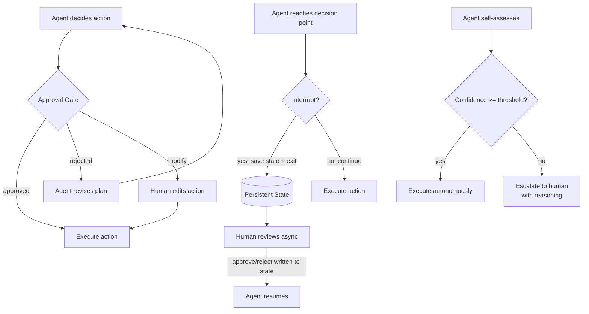

# Human-in-the-Loop (التدخّل البشري) وبوابات الموافقة

> agent بلا بوابة موافقة هو آلة تنتظر ارتكاب خطأ لا رجعة فيه على نطاق واسع.

**النوع:** بناء
**اللغات:** Python
**المتطلبات:** 08-tool-use-and-error-recovery، 11-stopping-conditions
**الوقت:** ~45 دقيقة
**أهداف التعلّم:**
- تسمية أنماط HITL الثلاثة ومتى يُستخدم كلٌّ منها
- بناء بوابة موافقة تعترض نداءات الأدوات المدمّرة قبل التنفيذ
- وسم الأدوات بـ `requires_approval=True` وربط البوابة في مُنفّذ الأدوات
- تطبيق نمط المقاطعة والاستئناف (interrupt-and-resume) باستخدام حالة قائمة على الملفات
- شرح كيف تطبّق نقاط فحص LangGraph نمط المقاطعة والاستئناف على نطاق واسع

---

## الشعار

بوابة الموافقة لا تبطّئ الـ agent. إنها تبطّئ الخطأ.

---

## المشكلة

يبني فريق عمليات قواعد بيانات agent ويمنحه صلاحية كتابة على قاعدة بيانات العملاء. المهمة: "نظّف السجلات المكرّرة عبر جدول الحسابات." يشغّلونه طوال الليل.

بحلول الصباح يكون الـ agent قد حذف 40,000 صفّ ودمج الحسابات الخاطئة. كان منطق الحذف صحيحًا بالنسبة إلى كشف التكرارات الذي أُعطيه. المشكلة أن "المكرّر" كان غامضًا: حسابان بنفس البريد الإلكتروني لكن بأرقام هواتف مختلفة جرى دمجهما، رغم أنهما يخصّان فردين من عائلة واحدة يتشاركان عنوان بريد. لم تكن لدى الـ agent طريقة ليعرف بوجود هذه الحالة الحدّية. مراجع بشري، لو عُرضت عليه أول 10 عمليات دمج مقترحة، لكان التقطها في دقيقتين.

لم تكن ثمة خطوة موافقة. اقترح الـ agent ونفّذ في حركة واحدة.

الـ human-in-the-loop (HITL) ليس عكّازًا لـ agent ضعيف. إنه نمط هندسي متعمّد لأي عملية: لا رجعة فيها، أو ذات نطاق ضرر واسع (high-blast-radius)، أو حيث لا يمكن تحديد حكم الإنسان حول الحالات الحدّية بالكامل مسبقًا. السؤال ليس ما إن كان يجب استخدام HITL، بل أي نمط HITL يناسب الموقف.

---

## المفهوم

### أنماط HITL الثلاثة

**النمط 1: بوابة الموافقة (Approval Gate)**
يقترح الـ agent إجراءً ككائن منظّم قبل تنفيذه. يوافق إنسان، أو يرفض، أو يعدّل. تُنفَّذ الإجراءات الموافَق عليها فقط.

الأفضل لـ: العمليات المدمّرة، والآثار الجانبية الخارجية (بريد، دفع، كتابة قاعدة بيانات)، وأي إجراء لا يمكن التراجع عنه في أقل من 60 ثانية.

**النمط 2: المقاطعة والاستئناف (Interrupt and Resume)**
يحفظ الـ agent حالته الكاملة في تخزين دائم، ثم يخرج. يراجع إنسان الإجراء المعلّق بشكل غير متزامن (قد يكون بعد دقائق أو ساعات أو أيام)، ويكتب قراره عودةً إلى التخزين، ويستأنف الـ agent من حيث توقّف بالضبط.

الأفضل لـ: سير العمل ذو دورات المراجعة البشرية غير المتزامنة، وسلاسل الموافقات ذات متطلبات اتفاقية مستوى الخدمة (SLA)، وخطوط الأنابيب متعددة الأيام حيث لا يراقب البشر في الوقت الحقيقي.

**النمط 3: عتبة الثقة (Confidence Threshold)**
يقيّم الـ agent ثقته ذاتيًا قبل كل إجراء. إن كانت الثقة فوق عتبة، نفّذ ذاتيًا. وإن كانت دونها، صعّد إلى إنسان مع تفكيره.

الأفضل لـ: خطوط الأنابيب عالية الحجم حيث معظم الحالات روتينية لكن الحالات الحدّية تتطلب حكمًا، وحيث انتظار موافقة بشرية على كل إجراء غير ممكن.



### الأنماط الثلاثة جنبًا إلى جنب

```
Pattern              Use Case                   Latency Added   Overhead      When Justified
-----------          --------------------------  --------------  ------------  ---------------------------
Approval Gate        Destructive/irreversible    Seconds         Interactive   Any write/delete/send action
                     ops in real-time            (synchronous)   user present  with human in the loop

Interrupt+Resume     Async review cycles         Minutes to      Persistent    Multi-day pipelines,
                     Multi-stage approvals       days            state needed  compliance workflows

Confidence           High-volume, mostly         None on         Self-assess   > 80% routine cases,
Threshold            routine pipelines           high-conf       per action    < 20% edge cases
```

---

## البناء

### بوابة الموافقة في Python خام

ابنِ agent إرسال بريد حيث يتطلب كل إرسال موافقة بشرية.

```python
import json
import anthropic

client = anthropic.Anthropic()
MODEL = "claude-3-5-haiku-20241022"

# Tool definitions - note requires_approval flag
TOOLS = [
    {
        "name": "draft_email",
        "description": "Draft an email without sending it. Returns the draft for review.",
        "input_schema": {
            "type": "object",
            "properties": {
                "to": {"type": "string", "description": "Recipient email address"},
                "subject": {"type": "string"},
                "body": {"type": "string"},
            },
            "required": ["to", "subject", "body"],
        },
        "requires_approval": False,
    },
    {
        "name": "send_email",
        "description": "Send an email. Requires human approval before execution.",
        "input_schema": {
            "type": "object",
            "properties": {
                "to": {"type": "string"},
                "subject": {"type": "string"},
                "body": {"type": "string"},
            },
            "required": ["to", "subject", "body"],
        },
        "requires_approval": True,
    },
]

# Separate the approval flag from what we send to the API
API_TOOLS = [
    {k: v for k, v in tool.items() if k != "requires_approval"}
    for tool in TOOLS
]
APPROVAL_FLAGS = {tool["name"]: tool.get("requires_approval", False) for tool in TOOLS}
```

دالة بوابة الموافقة:

```python
def require_approval(tool_name: str, tool_input: dict) -> tuple[bool, dict]:
    """
    Show the proposed action to the human and get approval.
    Returns (approved: bool, final_input: dict).
    The human can approve as-is, reject, or provide a modified version.
    """
    print("\n" + "=" * 50)
    print("APPROVAL REQUIRED")
    print("=" * 50)
    print(f"Tool: {tool_name}")
    print(f"Proposed arguments:")
    print(json.dumps(tool_input, indent=2))
    print("=" * 50)
    print("Options: [a]pprove / [r]eject / [m]odify")

    choice = input("Decision: ").strip().lower()

    if choice in ("a", "approve", ""):
        return True, tool_input
    elif choice in ("r", "reject"):
        reason = input("Reason for rejection (sent back to agent): ")
        return False, {"rejection_reason": reason}
    elif choice in ("m", "modify"):
        print("Enter modified arguments as JSON:")
        raw = input()
        try:
            modified = json.loads(raw)
            return True, modified
        except json.JSONDecodeError:
            print("Invalid JSON. Rejecting.")
            return False, {"rejection_reason": "Human provided invalid modified JSON"}
    else:
        print("Unrecognized input. Rejecting.")
        return False, {"rejection_reason": "Unrecognized approval decision"}
```

مُنفّذ الأدوات الذي يربط البوابة:

```python
def execute_tool(tool_name: str, tool_input: dict) -> str:
    """
    Execute a tool. If the tool requires approval, run it through the gate first.
    Returns the result as a string for the agent's next turn.
    """
    needs_approval = APPROVAL_FLAGS.get(tool_name, False)

    if needs_approval:
        approved, final_input = require_approval(tool_name, tool_input)
        if not approved:
            reason = final_input.get("rejection_reason", "Human rejected this action")
            return f"Action rejected by human reviewer. Reason: {reason}"
        tool_input = final_input

    # Execute the (approved) tool
    return _run_tool(tool_name, tool_input)

def _run_tool(tool_name: str, tool_input: dict) -> str:
    """Stub implementations. Replace with real integrations."""
    if tool_name == "draft_email":
        return (
            f"Draft created:\n"
            f"To: {tool_input['to']}\n"
            f"Subject: {tool_input['subject']}\n"
            f"Body: {tool_input['body']}"
        )
    elif tool_name == "send_email":
        return (
            f"Email sent successfully to {tool_input['to']} "
            f"with subject '{tool_input['subject']}'"
        )
    return f"Unknown tool: {tool_name}"
```

حلقة الـ agent:

```python
def run_email_agent(user_request: str) -> None:
    messages = [{"role": "user", "content": user_request}]
    system = (
        "You are an email assistant. "
        "Always draft an email before sending it. "
        "Use draft_email first, then send_email only after the draft looks good. "
        "send_email will require human approval before it executes."
    )

    for _ in range(10):  # Governor: max 10 turns
        response = client.messages.create(
            model=MODEL,
            max_tokens=500,
            system=system,
            tools=API_TOOLS,
            messages=messages,
        )

        if response.stop_reason == "end_turn":
            print(f"\nAgent: {response.content[0].text if response.content else '(no text)'}")
            break

        if response.stop_reason == "tool_use":
            messages.append({"role": "assistant", "content": response.content})
            tool_results = []

            for block in response.content:
                if block.type == "tool_use":
                    print(f"\n[Agent wants to call: {block.name}]")
                    result = execute_tool(block.name, block.input)
                    tool_results.append({
                        "type": "tool_result",
                        "tool_use_id": block.id,
                        "content": result,
                    })

            messages.append({"role": "user", "content": tool_results})
```

> **اختبار من الواقع:** agent البريد لدى فريقك يرسل قرابة 500 بريد يوميًا في الإنتاج. إضافة بوابة موافقة لكل إرسال تعني 500 قرار بشري يوميًا. كيف تكيّف نمط بوابة الموافقة ليصبح عمليًا؟

انتقل إلى نمط عتبة الثقة: وافق تلقائيًا على عمليات الإرسال التي تطابق قالبًا معروفًا بلا حقول تخصيص متروكة بقيمة null، ووجّه فقط ما رُفع له علَم (حقول مفقودة، مستلِمون غير معتادين، قوائم كبيرة) عبر بوابة الموافقة. بديلًا، اجمع الموافقات دفعةً واحدة: جمّع عمليات الإرسال المعلّقة وقدّمها لمراجع بشري مرة في الساعة بدلًا من بشكل متزامن. لا يجب أن تكون البوابة في الوقت الحقيقي. المفتاح أن الإجراءات التي لا رجعة فيها وذات احتمال الضرر لا تزال تمرّ عبر نقطة قرار بشرية، حتى لو كان التوقيت غير متزامن.

---

## الاستخدام

### نمط المقاطعة والاستئناف

يستخدم نمط المقاطعة والاستئناف حالة دائمة كي يستطيع الـ agent التوقّف ويستطيع إنسان المراجعة بشكل غير متزامن.

```python
import json
import os
import time
from pathlib import Path

STATE_FILE = Path("/tmp/agent_pending_action.json")

def save_pending_action(goal: str, action: dict, conversation_history: list) -> None:
    """Save agent state to disk and pause execution."""
    state = {
        "goal": goal,
        "pending_action": action,
        "conversation_history": conversation_history,
        "created_at": time.time(),
        "decision": None,
    }
    STATE_FILE.write_text(json.dumps(state, indent=2))
    print(f"\n[AGENT PAUSED] Pending action written to: {STATE_FILE}")
    print(f"Review the file and set 'decision' to 'approve' or 'reject', then re-run.")

def load_and_resume() -> tuple[dict | None, str | None]:
    """Check if a pending action exists and has been reviewed."""
    if not STATE_FILE.exists():
        return None, None
    state = json.loads(STATE_FILE.read_text())
    decision = state.get("decision")
    if decision is None:
        print("[AGENT] Pending action found but no decision yet. Waiting.")
        return None, None
    # Clean up after reading
    STATE_FILE.unlink(missing_ok=True)
    return state, decision

def run_interruptible_agent(goal: str) -> None:
    """
    Agent that saves state and exits when it reaches a decision point
    that requires human review. On second run, resumes from saved state.
    """
    # Check if we are resuming from a prior run
    saved_state, decision = load_and_resume()
    if saved_state:
        action = saved_state["pending_action"]
        history = saved_state["conversation_history"]
        if decision == "approve":
            print(f"[RESUME] Human approved: {action}")
            result = _run_tool(action["tool_name"], action["tool_input"])
            print(f"[RESULT] {result}")
        else:
            print(f"[RESUME] Human rejected the action. Agent will revise.")
        return

    # First run: proceed until we hit a decision point
    messages = [{"role": "user", "content": goal}]
    response = client.messages.create(
        model=MODEL,
        max_tokens=400,
        system="You are a database assistant. Propose any write operations as explicit action dicts before executing them.",
        messages=messages,
    )

    # Simulate reaching a decision point: save state and exit
    proposed_action = {
        "tool_name": "send_email",
        "tool_input": {"to": "user@example.com", "subject": "Update", "body": "Your data is ready."},
    }
    save_pending_action(goal, proposed_action, messages)
```

في الإنتاج، يستبدل LangGraph الملف بنقطة فحص قاعدة بيانات (database checkpoint):

```python
# LangGraph checkpoint pattern (conceptual - no SDK needed for the lesson)
#
# from langgraph.checkpoint.sqlite import SqliteSaver
# from langgraph.graph import StateGraph
#
# graph = StateGraph(AgentState)
# graph.add_node("agent", agent_node)
# graph.add_node("approval_gate", approval_gate_node)
# graph.add_edge("agent", "approval_gate")
#
# checkpointer = SqliteSaver.from_conn_string("checkpoints.db")
# app = graph.compile(checkpointer=checkpointer, interrupt_before=["approval_gate"])
#
# # Run until interrupt
# result = app.invoke(input, config={"configurable": {"thread_id": "run-001"}})
#
# # Human reviews. Resume:
# result = app.invoke(Command(resume={"approved": True}), config=...)
#
# The pattern is identical to the file-based version. The difference:
# - State is stored in a database (survives process restarts)
# - Multiple concurrent runs have separate thread_ids
# - The interrupt point is declared in the graph definition, not in ad-hoc code
```

> **نقلة في المنظور:** يحاجّ زميل بأن أنماط HITL تُبطل الغرض من الأتمتة لأن البشر يصبحون عنق زجاجة. متى تكون هذه الحجّة صحيحة، ومتى تكون خاطئة؟

الحجّة صحيحة عندما يكون معدل الموافقة قريبًا من 100% (كل شيء يُوافَق عليه، والبوابة تضيف زمن انتظار بلا قيمة أمان) والعمليات منخفضة المخاطر أو سهلة التراجع. وهي خاطئة عندما يكون الإجراء لا رجعة فيه، أو عندما تكون تكلفة الخطأ عالية، أو عندما لا يستطيع الـ agent تحديد الحالات الحدّية بالكامل مسبقًا. قصة حذف قاعدة البيانات هي المثال المضادّ: عمل الـ agent بصحة 100% بمعاييره الخاصة. الحكم البشري الذي احتاجه لم يكن عن الصحة، بل عن قاعدة عمل (business rule) لم تكن لدى الـ agent طريقة لمعرفتها.

---

## التسليم

المُخرَج الذي يُنتجه هذا الدرس هو نمط بوابة موافقة قابل لإعادة الاستخدام مع أعراف وسم الأدوات. راجع `outputs/skill-hitl-approval-gate.md`.

النمط: علَم `requires_approval` على كل تعريف أداة، ودالة `require_approval()` تعترض النداء، ومُغلّف `execute_tool()` يفحص العلَم قبل التوزيع. أسقِط هذا في أي agent له صلاحية كتابة على أنظمة خارجية.

---

## التقييم

تضيف أنماط HITL شيئين جديدين للتقييم: دقة البوابة وزمن انتظار البوابة.

**دقة البوابة:** هل تحدّد البوابة بشكل صحيح أي نداءات أدوات تحتاج موافقة؟ اختبر بـ 20 نداء أداة، 10 ينبغي أن تتطلب موافقة و10 لا ينبغي. يجب أن تعترض البوابة الـ 10 الموسومة بـ `requires_approval=True` بالضبط. قِس معدل الإيجابيات الكاذبة (أشياء وُوفِق عليها تلقائيًا وكانت تحتاج مراجعة بشرية) ومعدل السلبيات الكاذبة (أشياء أُرسلت للمراجعة البشرية ولم تكن تحتاجها). الهدف: صفر سلبيات كاذبة (لا تفوّت أبدًا موافقة مطلوبة). بعض الإيجابيات الكاذبة مقبولة.

**زمن انتظار البوابة:** لبوابات الموافقة المتزامنة، قِس زمن استجابة الإنسان عند المئين التسعين (90th percentile). إن كان أطول من عتبة صبر مستخدميك، فانتقل إلى نمط المقاطعة والاستئناف. زمن انتظار البوابة قرار منتج، لا قرار تقني.

**التراجع بعد تعديلات البوابة:** عندما تغيّر أي أدوات تتطلب موافقة (مثلًا إضافة `delete_record` إلى القائمة المعتمدة)، شغّل تراجعًا (regression) كاملًا. تحقّق من أن العلَم الجديد ينتشر بشكل صحيح إلى مُغلّف `execute_tool` وأن البوابة تنطلق عند أول نداء للأداة الموسومة حديثًا.

**معايرة عتبة الثقة:** إن طبّقت نمط عتبة الثقة، فقيّم العتبة نفسها. ابنِ مجموعة بيانات من 50 نداء أداة بحقيقة أرضية معروفة (كان يجب أن يتطلب موافقة: نعم/لا). امسح عتبة الثقة من 0.5 إلى 0.9. لكل قيمة عتبة، احسب كم حالة كان الـ agent سيصعّدها مقابل الموافقة التلقائية. العتبة المستهدفة هي النقطة التي يكون فيها معدل السلبيات الكاذبة (التصعيدات الفائتة) عند الصفر أو قريبًا منه، حتى لو كان معدل الإيجابيات الكاذبة (التصعيدات غير الضرورية) عاليًا بعض الشيء. عند الشك، صعّد أكثر.
