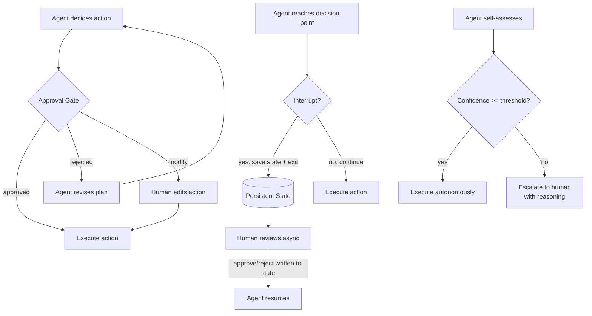

# Human-in-the-Loop and Approval Gates

> An agent with no approval gate is a machine waiting to make an irreversible mistake at scale.

**Type:** Build
**Languages:** Python
**Prerequisites:** 08-tool-use-and-error-recovery, 11-stopping-conditions
**Time:** ~45 min
**Learning Objectives:**
- Name the three HITL patterns and when to use each
- Build an approval gate that intercepts destructive tool calls before execution
- Tag tools with `requires_approval=True` and wire the gate into the tool executor
- Implement the interrupt-and-resume pattern using file-based state
- Explain how LangGraph checkpoints implement interrupt-and-resume at scale

---

## MOTTO

The approval gate does not slow down the agent. It slows down the mistake.

---

## THE PROBLEM

A database operations team builds an agent and gives it write access to the customer database. The task: "clean up duplicate records across the accounts table." They run it overnight.

By morning the agent has deleted 40,000 rows and merged the wrong accounts. The deletion logic was correct for the duplicate detection it was given. The problem was that "duplicate" was ambiguous: two accounts with the same email but different phone numbers were merged, even though they belonged to two family members who shared an email address. The agent had no way to know this edge case existed. A human reviewer, shown the first 10 proposed merges, would have caught it in two minutes.

There was no approval step. The agent proposed and executed in a single motion.

Human-in-the-loop (HITL) is not a crutch for a weak agent. It is a deliberate engineering pattern for any operation that is: irreversible, high-blast-radius, or where human judgment about edge cases cannot be fully specified in advance. The question is not whether to use HITL, but which HITL pattern fits the situation.

---

## THE CONCEPT

### Three HITL Patterns

**Pattern 1: Approval Gate**
The agent proposes an action as a structured object before executing it. A human approves, rejects, or modifies. Only approved actions execute.

Best for: destructive operations, external side-effects (email, payment, database write), any action that cannot be undone in under 60 seconds.

**Pattern 2: Interrupt and Resume**
The agent saves its full state to persistent storage, then exits. A human reviews the pending action asynchronously (could be minutes, hours, or days later), writes their decision back to storage, and the agent resumes from exactly where it stopped.

Best for: workflows with async human review cycles, approval chains with SLA requirements, multi-day pipelines where humans are not watching in real-time.

**Pattern 3: Confidence Threshold**
The agent self-assesses its confidence before each action. If confidence is above a threshold, it executes autonomously. If below, it escalates to a human with its reasoning.

Best for: high-volume pipelines where most cases are routine but edge cases require judgment, and where waiting for human approval on every action is not feasible.



### The Three Patterns Side by Side

```
Pattern              Use Case                   Latency Added   Overhead      When Justified
-----------          --------------------------  --------------  ------------  ---------------------------
Approval Gate        Destructive/irreversible    Seconds         Interactive   Any write/delete/send action
                     ops in real-time            (synchronous)   user present  with human in the loop

Interrupt+Resume     Async review cycles         Minutes to      Persistent    Multi-day pipelines,
                     Multi-stage approvals       days            state needed  compliance workflows

Confidence           High-volume, mostly         None on         Self-assess   > 80% routine cases,
Threshold            routine pipelines           high-conf       per action    < 20% edge cases
```

---

## BUILD IT

### Approval Gate in Raw Python

Build an email-sending agent where every send requires human approval.

```python
import json
import anthropic

client = anthropic.Anthropic()
MODEL = "claude-3-5-haiku-20241022"

# Tool definitions - note requires_approval flag
TOOLS = [
    {
        "name": "draft_email",
        "description": "Draft an email without sending it. Returns the draft for review.",
        "input_schema": {
            "type": "object",
            "properties": {
                "to": {"type": "string", "description": "Recipient email address"},
                "subject": {"type": "string"},
                "body": {"type": "string"},
            },
            "required": ["to", "subject", "body"],
        },
        "requires_approval": False,
    },
    {
        "name": "send_email",
        "description": "Send an email. Requires human approval before execution.",
        "input_schema": {
            "type": "object",
            "properties": {
                "to": {"type": "string"},
                "subject": {"type": "string"},
                "body": {"type": "string"},
            },
            "required": ["to", "subject", "body"],
        },
        "requires_approval": True,
    },
]

# Separate the approval flag from what we send to the API
API_TOOLS = [
    {k: v for k, v in tool.items() if k != "requires_approval"}
    for tool in TOOLS
]
APPROVAL_FLAGS = {tool["name"]: tool.get("requires_approval", False) for tool in TOOLS}
```

The approval gate function:

```python
def require_approval(tool_name: str, tool_input: dict) -> tuple[bool, dict]:
    """
    Show the proposed action to the human and get approval.
    Returns (approved: bool, final_input: dict).
    The human can approve as-is, reject, or provide a modified version.
    """
    print("\n" + "=" * 50)
    print("APPROVAL REQUIRED")
    print("=" * 50)
    print(f"Tool: {tool_name}")
    print(f"Proposed arguments:")
    print(json.dumps(tool_input, indent=2))
    print("=" * 50)
    print("Options: [a]pprove / [r]eject / [m]odify")

    choice = input("Decision: ").strip().lower()

    if choice in ("a", "approve", ""):
        return True, tool_input
    elif choice in ("r", "reject"):
        reason = input("Reason for rejection (sent back to agent): ")
        return False, {"rejection_reason": reason}
    elif choice in ("m", "modify"):
        print("Enter modified arguments as JSON:")
        raw = input()
        try:
            modified = json.loads(raw)
            return True, modified
        except json.JSONDecodeError:
            print("Invalid JSON. Rejecting.")
            return False, {"rejection_reason": "Human provided invalid modified JSON"}
    else:
        print("Unrecognized input. Rejecting.")
        return False, {"rejection_reason": "Unrecognized approval decision"}
```

The tool executor that wires the gate:

```python
def execute_tool(tool_name: str, tool_input: dict) -> str:
    """
    Execute a tool. If the tool requires approval, run it through the gate first.
    Returns the result as a string for the agent's next turn.
    """
    needs_approval = APPROVAL_FLAGS.get(tool_name, False)

    if needs_approval:
        approved, final_input = require_approval(tool_name, tool_input)
        if not approved:
            reason = final_input.get("rejection_reason", "Human rejected this action")
            return f"Action rejected by human reviewer. Reason: {reason}"
        tool_input = final_input

    # Execute the (approved) tool
    return _run_tool(tool_name, tool_input)

def _run_tool(tool_name: str, tool_input: dict) -> str:
    """Stub implementations. Replace with real integrations."""
    if tool_name == "draft_email":
        return (
            f"Draft created:\n"
            f"To: {tool_input['to']}\n"
            f"Subject: {tool_input['subject']}\n"
            f"Body: {tool_input['body']}"
        )
    elif tool_name == "send_email":
        return (
            f"Email sent successfully to {tool_input['to']} "
            f"with subject '{tool_input['subject']}'"
        )
    return f"Unknown tool: {tool_name}"
```

The agent loop:

```python
def run_email_agent(user_request: str) -> None:
    messages = [{"role": "user", "content": user_request}]
    system = (
        "You are an email assistant. "
        "Always draft an email before sending it. "
        "Use draft_email first, then send_email only after the draft looks good. "
        "send_email will require human approval before it executes."
    )

    for _ in range(10):  # Governor: max 10 turns
        response = client.messages.create(
            model=MODEL,
            max_tokens=500,
            system=system,
            tools=API_TOOLS,
            messages=messages,
        )

        if response.stop_reason == "end_turn":
            print(f"\nAgent: {response.content[0].text if response.content else '(no text)'}")
            break

        if response.stop_reason == "tool_use":
            messages.append({"role": "assistant", "content": response.content})
            tool_results = []

            for block in response.content:
                if block.type == "tool_use":
                    print(f"\n[Agent wants to call: {block.name}]")
                    result = execute_tool(block.name, block.input)
                    tool_results.append({
                        "type": "tool_result",
                        "tool_use_id": block.id,
                        "content": result,
                    })

            messages.append({"role": "user", "content": tool_results})
```

> **Real-world check:** Your team's email agent is sending approximately 500 emails per day in production. Adding an approval gate to every send would mean 500 human decisions per day. How would you adapt the approval gate pattern to make this workable?

Switch to the confidence threshold pattern: auto-approve sends that match a known template with no personalization fields left as null, and route only the flagged ones (missing fields, unusual recipients, large lists) through the approval gate. Alternatively, batch the approvals: group pending sends and present them to a human reviewer once per hour rather than synchronously. The gate does not have to be real-time. The key is that irreversible actions with potential for harm still pass through a human decision point, even if the timing is async.

---

## USE IT

### Interrupt and Resume Pattern

The interrupt-and-resume pattern uses persistent state so the agent can pause and a human can review asynchronously.

```python
import json
import os
import time
from pathlib import Path

STATE_FILE = Path("/tmp/agent_pending_action.json")

def save_pending_action(goal: str, action: dict, conversation_history: list) -> None:
    """Save agent state to disk and pause execution."""
    state = {
        "goal": goal,
        "pending_action": action,
        "conversation_history": conversation_history,
        "created_at": time.time(),
        "decision": None,
    }
    STATE_FILE.write_text(json.dumps(state, indent=2))
    print(f"\n[AGENT PAUSED] Pending action written to: {STATE_FILE}")
    print(f"Review the file and set 'decision' to 'approve' or 'reject', then re-run.")

def load_and_resume() -> tuple[dict | None, str | None]:
    """Check if a pending action exists and has been reviewed."""
    if not STATE_FILE.exists():
        return None, None
    state = json.loads(STATE_FILE.read_text())
    decision = state.get("decision")
    if decision is None:
        print("[AGENT] Pending action found but no decision yet. Waiting.")
        return None, None
    # Clean up after reading
    STATE_FILE.unlink(missing_ok=True)
    return state, decision

def run_interruptible_agent(goal: str) -> None:
    """
    Agent that saves state and exits when it reaches a decision point
    that requires human review. On second run, resumes from saved state.
    """
    # Check if we are resuming from a prior run
    saved_state, decision = load_and_resume()
    if saved_state:
        action = saved_state["pending_action"]
        history = saved_state["conversation_history"]
        if decision == "approve":
            print(f"[RESUME] Human approved: {action}")
            result = _run_tool(action["tool_name"], action["tool_input"])
            print(f"[RESULT] {result}")
        else:
            print(f"[RESUME] Human rejected the action. Agent will revise.")
        return

    # First run: proceed until we hit a decision point
    messages = [{"role": "user", "content": goal}]
    response = client.messages.create(
        model=MODEL,
        max_tokens=400,
        system="You are a database assistant. Propose any write operations as explicit action dicts before executing them.",
        messages=messages,
    )

    # Simulate reaching a decision point: save state and exit
    proposed_action = {
        "tool_name": "send_email",
        "tool_input": {"to": "user@example.com", "subject": "Update", "body": "Your data is ready."},
    }
    save_pending_action(goal, proposed_action, messages)
```

In production, LangGraph replaces the file with a database checkpoint:

```python
# LangGraph checkpoint pattern (conceptual - no SDK needed for the lesson)
#
# from langgraph.checkpoint.sqlite import SqliteSaver
# from langgraph.graph import StateGraph
#
# graph = StateGraph(AgentState)
# graph.add_node("agent", agent_node)
# graph.add_node("approval_gate", approval_gate_node)
# graph.add_edge("agent", "approval_gate")
#
# checkpointer = SqliteSaver.from_conn_string("checkpoints.db")
# app = graph.compile(checkpointer=checkpointer, interrupt_before=["approval_gate"])
#
# # Run until interrupt
# result = app.invoke(input, config={"configurable": {"thread_id": "run-001"}})
#
# # Human reviews. Resume:
# result = app.invoke(Command(resume={"approved": True}), config=...)
#
# The pattern is identical to the file-based version. The difference:
# - State is stored in a database (survives process restarts)
# - Multiple concurrent runs have separate thread_ids
# - The interrupt point is declared in the graph definition, not in ad-hoc code
```

> **Perspective shift:** A colleague argues that HITL patterns defeat the purpose of automation because humans become a bottleneck. When is this argument valid, and when is it wrong?

The argument is valid when the approval rate is near 100% (everything gets approved, the gate adds latency for no safety value) and the operations are low-risk or easily reversible. It is wrong when the action is irreversible, when the error cost is high, or when the agent cannot fully specify the edge cases in advance. The database deletion story is the counterexample: the agent ran 100% correctly by its own criteria. The human judgment it needed was not about correctness, it was about a business rule the agent had no way to know.

---

## SHIP IT

The artifact this lesson produces is a reusable approval gate pattern with tool tagging conventions. See `outputs/skill-hitl-approval-gate.md`.

The pattern: a `requires_approval` flag on each tool definition, a `require_approval()` function that intercepts the call, and a `execute_tool()` wrapper that checks the flag before dispatch. Drop this into any agent that has write access to external systems.

---

## EVALUATE IT

HITL patterns add two new things to evaluate: gate accuracy and gate latency.

**Gate accuracy:** does the gate correctly identify which tool calls need approval? Test with 20 tool calls, 10 that should require approval and 10 that should not. The gate should intercept exactly the 10 marked with `requires_approval=True`. Measure false positive rate (auto-approved things that needed human review) and false negative rate (sent to human review things that did not need it). Target: zero false negatives (never miss a required approval). Some false positives are acceptable.

**Gate latency:** for synchronous approval gates, measure the 90th percentile human response time. If it is longer than your users' patience threshold, switch to the interrupt-and-resume pattern. Gate latency is a product decision, not a technical one.

**Regression after gate modifications:** when you change which tools require approval (e.g., adding `delete_record` to the approved list), run a full regression. Check that the new flag propagates correctly to the `execute_tool` wrapper and that the gate fires on the first call to the newly flagged tool.

**Confidence threshold calibration:** if you implement the confidence threshold pattern, evaluate the threshold itself. Build a dataset of 50 tool calls with known ground truth (should have required approval: yes/no). Sweep the confidence threshold from 0.5 to 0.9. For each threshold value, compute how many cases the agent would have escalated vs auto-approved. The target threshold is the point where the false-negative rate (missed escalations) is at or near zero, even if the false-positive rate (unnecessary escalations) is somewhat high. When in doubt, escalate more.
