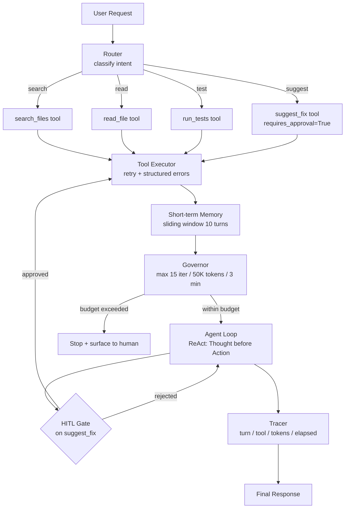

# المشروع الختامي: agent إنتاجي مع guardrails و tracing

> "ابنِ لي agent" و "ابنِ لي agent إنتاجيًا" طلبان مختلفان.

**النوع:** بناء
**اللغات:** Python
**المتطلبات:** كل دروس المرحلة 04
**الوقت:** ~90 دقيقة
**أهداف التعلّم:**
- تجميع كل أنماط المرحلة 04 في agent إنتاجي واحد متماسك
- تطبيق حاكم (governor) يفرض ميزانيات للتكرار والـ tokens والوقت
- توصيل بوابة موافقة بشرية (HITL) على أدوات تغيير الكود
- إضافة تفكير على نمط ReAct (Thought-before-Action) في كل دور
- تجهيز الـ agent بـ spans للتتبّع على نمط OTel يدويًا
- كتابة وتشغيل منظومة تقييم انحدارية (regression eval harness) على مجموعة اختبار ذهبية (golden test set)

---

## الشعار

الـ agent الإنتاجي ليس عرضًا توضيحيًا بمزايا أكثر. إنه نظام بعقود صريحة: ماذا سيفعل، وما الذي سيرفضه، وكيف سيفشل، وكيف سيُلاحَظ.

---

## المشكلة

يصل فريقًا مهمة: "ابنِ لي agent مساعد لقاعدة الكود يستطيع البحث في الملفات، وقراءة الكود، وتشغيل الاختبارات، واقتراح الإصلاحات."

الإصدار الأول يُنجَز في عصرية واحدة. يستدعي ثلاث أدوات في حلقة حتى يقول Claude إنه انتهى. يعمل رائعًا في العرض التوضيحي.

الإصدار الأول في الإنتاج:
- يعمل 20 دقيقة على استعلام لمستودع كبير قبل أن تنتهي مهلته (لا governor)
- استدعاء "suggest fix" يحرّر ملفًا إنتاجيًا دون مراجعة (لا بوابة HITL)
- يفشل بصمت حين يُرجع مُشغّل الاختبارات خطأً (لا معالجة أخطاء منظَّمة)
- من المستحيل تصحيح سبب استغراق تشغيل معيّن 45 ثانية (لا tracing)
- بعد تغيير prompt، مجهول هل تحسّنت جودة البحث أم تراجعت (لا منظومة تقييم)

الفجوة بين الإصدار الأول والـ agent الإنتاجي هي كل ما في هذه المرحلة، مجمَّعًا معًا.

---

## المفهوم

### حزمة الـ agent الإنتاجي (Production Agent Stack)

لكل نمط من المرحلة 04 موضع في الحزمة. لا شيء منها اختياري في الإنتاج.



### لماذا توجد كل طبقة

```
Layer               Without It                       With It
------------------  -------------------------------  ---------------------------------
Router              Agent guesses what to do         Intent is classified first, cheaper
Governor            Runs until timeout or OOM        Hard budget: fail fast, fail loud
Tool Executor       Silent failures misreported      Errors surface as structured messages
Short-term Memory   Agent forgets prior turns        Last 10 turns in every context
HITL Gate           Code changes without review      suggest_fix needs human sign-off
ReAct Reasoning     Decisions are opaque             Thought: logged before every Action
Tracer              Impossible to debug              Every turn logged with metrics
Eval Harness        Prompt changes are unknowable    Golden set: before/after comparison
```

---

## البناء

### المساعد الكامل لقاعدة الكود

انظر `code/main.py` للتطبيق الكامل. يستعرض هذا القسم كل طبقة.

**الطبقة 1: تعريفات الأدوات والـ Stubs**

أربع أدوات، واحدة منها بـ `requires_approval=True`.

```python
TOOLS = [
    {
        "name": "search_files",
        "description": "Search for files or code patterns in the codebase by keyword.",
        "input_schema": {
            "type": "object",
            "properties": {
                "query": {"type": "string", "description": "Search term or pattern"},
                "file_type": {"type": "string", "description": "Optional file extension filter (e.g., .py)"},
            },
            "required": ["query"],
        },
        "requires_approval": False,
    },
    {
        "name": "read_file",
        "description": "Read the full contents of a specific file.",
        "input_schema": {
            "type": "object",
            "properties": {
                "path": {"type": "string", "description": "File path relative to project root"},
            },
            "required": ["path"],
        },
        "requires_approval": False,
    },
    {
        "name": "run_tests",
        "description": "Run the test suite or a specific test file.",
        "input_schema": {
            "type": "object",
            "properties": {
                "target": {"type": "string", "description": "Test file or directory to run"},
            },
            "required": ["target"],
        },
        "requires_approval": False,
    },
    {
        "name": "suggest_fix",
        "description": "Suggest a code change. Requires human approval before application.",
        "input_schema": {
            "type": "object",
            "properties": {
                "file": {"type": "string"},
                "change_description": {"type": "string"},
                "proposed_diff": {"type": "string"},
            },
            "required": ["file", "change_description", "proposed_diff"],
        },
        "requires_approval": True,
    },
]
```

**الطبقة 2: الحاكم (The Governor)**

حدود صارمة على كل محور لاستهلاك الموارد.

```python
import time
from dataclasses import dataclass, field

@dataclass
class Governor:
    max_iterations: int = 15
    max_tokens: int = 50_000
    max_seconds: float = 180.0

    iterations: int = 0
    tokens_used: int = 0
    start_time: float = field(default_factory=time.time)

    def tick(self, tokens: int) -> None:
        self.iterations += 1
        self.tokens_used += tokens

    def check(self) -> tuple[bool, str]:
        """Returns (ok, reason). ok=False means stop."""
        if self.iterations >= self.max_iterations:
            return False, f"iteration limit reached ({self.max_iterations})"
        if self.tokens_used >= self.max_tokens:
            return False, f"token budget exceeded ({self.tokens_used:,} / {self.max_tokens:,})"
        elapsed = time.time() - self.start_time
        if elapsed >= self.max_seconds:
            return False, f"time limit reached ({elapsed:.0f}s / {self.max_seconds:.0f}s)"
        return True, ""
```

**الطبقة 3: المتتبِّع (The Tracer)**

تسجيل منظَّم لكل دور، دون SDK.

```python
import contextlib

@dataclass
class Span:
    turn: int
    tool_called: str | None
    tokens_in: int
    tokens_out: int
    elapsed_ms: float
    thought: str | None = None
    approved: bool | None = None

@contextlib.contextmanager
def trace_agent_turn(turn: int, tracer_log: list):
    span = {"turn": turn, "start": time.time(), "tool": None, "tokens_in": 0,
            "tokens_out": 0, "thought": None, "approved": None}
    try:
        yield span
    finally:
        span["elapsed_ms"] = (time.time() - span["start"]) * 1000
        tracer_log.append(span)
        print(
            f"[trace] turn={span['turn']} tool={span['tool'] or 'none'} "
            f"tok_in={span['tokens_in']} tok_out={span['tokens_out']} "
            f"elapsed={span['elapsed_ms']:.0f}ms"
        )
```

**الطبقة 4: الموجِّه (The Router)**

صنّف النية قبل أن تعمل حلقة الـ agent. أرخص من سؤال الـ agent الكامل.

```python
ROUTER_PROMPT = """Classify this user request into exactly one category.
Return only the category word, nothing else.

Categories:
- search (user wants to find files, functions, or patterns)
- read (user wants to see file contents)
- test (user wants to run or check tests)
- suggest (user wants a fix or code change proposed)
- general (anything else)"""

def route_request(user_input: str, client: anthropic.Anthropic) -> str:
    response = client.messages.create(
        model=MODEL,
        max_tokens=10,
        system=ROUTER_PROMPT,
        messages=[{"role": "user", "content": user_input}],
    )
    return response.content[0].text.strip().lower()
```

**الطبقة 5: تفكير ReAct**

يتطلب الـ system prompt سطر `Thought:` قبل كل استدعاء أداة.

```python
AGENT_SYSTEM_PROMPT = """You are a codebase assistant. You help engineers search, read, test, and improve code.

Before every tool call, write a Thought: line explaining your reasoning.
Format: "Thought: [your reasoning here]"
Then make the tool call.

After all tools have run, write a final Answer: with your conclusion.

Constraints:
- Only call tools that are relevant to the user's question
- If a tool returns an error, acknowledge it and adjust your approach
- Never call suggest_fix without first reading the relevant file
- If you cannot complete the task within the available tools, say so clearly"""
```

**الطبقة 6: الذاكرة قصيرة المدى (Short-term Memory)**

نافذة منزلقة (sliding window) تُبقي آخر N دور في السياق.

```python
def trim_history(messages: list[dict], max_turns: int = 10) -> list[dict]:
    """Keep the first message (user's original request) plus the last max_turns messages."""
    if len(messages) <= max_turns + 1:
        return messages
    return [messages[0]] + messages[-(max_turns):]
```

**الطبقة 7: بوابة الموافقة (Approval Gate)**

موصولة في مُنفِّذ الأدوات لـ `suggest_fix`.

```python
APPROVAL_FLAGS = {tool["name"]: tool.get("requires_approval", False) for tool in TOOLS}

def require_approval(tool_name: str, tool_input: dict) -> tuple[bool, dict]:
    print(f"\n[APPROVAL GATE] Tool: {tool_name}")
    print(f"Arguments:\n{json.dumps(tool_input, indent=2)}")
    choice = input("[a]pprove / [r]eject: ").strip().lower()
    if choice in ("a", "approve", ""):
        return True, tool_input
    reason = input("Reason: ")
    return False, {"rejection_reason": reason}
```

> **اختبار من الواقع:** كان مساعد قاعدة الكود لديك يعمل في الإنتاج منذ أسبوعين. يشغّل مهندس استعلامًا، فيطلق الـ governor بعد 12 تكرارًا، ويُرجع الـ agent "budget exceeded: 12/15 iterations reached." يفتح المهندس تذكرة خطأ: "the agent stopped before answering." هل هذا خطأ أم سلوك متوقَّع؟

هذا سلوك متوقَّع، وينبغي أن تكون الرسالة أوضح. إطلاق الـ governor ليس فشلًا. إنه الـ governor يقوم بعمله: منع تشغيل بلا حدود. الحل ليس رفع الحدّ؛ بل تحسين الرسالة ("I was unable to complete your request within the 15-step budget. Here is what I found so far: [partial results]. Consider narrowing your question."). إحباط المهندس مشكلة UX، لا مشكلة governor.

---

## الاستخدام

### إضافة spans للتتبّع على نمط OTel

تتبع آثار OTel بنية قياسية: span جذري للطلب الكامل، و spans فرعية لكل دور، وسمات (attributes) ملحقة بكل span. لا تحتاج الـ SDK لاتّباع النمط.

```python
def create_root_span(request_id: str, user_input: str) -> dict:
    return {
        "span_id": request_id,
        "name": "agent.request",
        "start_time": time.time(),
        "attributes": {
            "gen_ai.request.model": MODEL,
            "gen_ai.request.input": user_input[:200],
            "agent.version": "1.0",
        },
        "events": [],
        "children": [],
    }

def add_turn_span(root: dict, turn: int, tool: str | None,
                  tokens_in: int, tokens_out: int, thought: str | None) -> None:
    span = {
        "name": "agent.turn",
        "attributes": {
            "agent.turn_number": turn,
            "gen_ai.usage.input_tokens": tokens_in,
            "gen_ai.usage.output_tokens": tokens_out,
            "agent.tool_called": tool or "none",
            "agent.thought": thought or "",
        },
        "timestamp": time.time(),
    }
    root["events"].append(span)

def finish_root_span(root: dict, outcome: str, total_tokens: int) -> None:
    root["end_time"] = time.time()
    root["duration_ms"] = (root["end_time"] - root["start_time"]) * 1000
    root["attributes"]["agent.outcome"] = outcome
    root["attributes"]["gen_ai.usage.total_tokens"] = total_tokens
    # In production: send to Langfuse or Phoenix here
    print(f"\n[trace summary] outcome={outcome} duration={root['duration_ms']:.0f}ms total_tokens={total_tokens}")
```

تتبع تسمية `gen_ai.*` اتفاقيات OpenTelemetry GenAI الدلالية. وهذا مهم لأن Langfuse و Phoenix وأدوات القابلية للملاحظة الأخرى تحلّل أسماء هذه السمات لبناء لوحات معلومات (dashboards) تلقائيًا.

> **نقلة في المنظور:** يقول زميل: "نحتاج الـ tracing فقط حين ينكسر شيء. لماذا نجهّز كل دور بينما الأمور تعمل بخير؟" بماذا تجيبه؟

الـ tracing الذي لا يوجد إلا بعد عطل ليس tracing. إنه تحقيق جنائي بلا أدلة. تحتاج بيانات لكل دور تُجمَع باستمرار كي يكون لديك، حين ينكسر شيء، خط أساس (baseline) تقارن به. "الأمور تعمل بخير" لا تعني شيئًا بلا أرقام: كم token لكل طلب، وأي الأدوات تُستدعى أكثر، وكيف يبدو توزيع الـ latency. حين يصل طلب بطيء، تحتاج معرفة ما إذا كان شاذًا (قارن بخط الأساس) أم طبيعيًا (المهمة تستغرق ذلك القدر فقط). يمنحك الـ tracing تلك المقارنة. أما التحقيق الجنائي بعد فوات الأوان فلا يمنحك شيئًا.

---

## التسليم

القطعة التي ينتجها هذا الدرس هي دليل تشغيلي (runbook) لمساعد قاعدة الكود. انظر `outputs/runbook-production-agent.md`.

يغطي الدليل: الإعداد عبر متغيّرات البيئة، وعتبات الـ governor ومتى تضبطها، وأعراض الفشل الشائعة معيّنة على فئات MAST، وقائمة فحص النشر. استخدمه كوثيقة الإعداد (onboarding) لأي مهندس يشغّل هذا الـ agent في الإنتاج.

---

## التقييم

### منظومة التقييم الانحدارية (Regression Eval Harness)

يحتاج الـ agent الإنتاجي مجموعة ذهبية: مدخلات ثابتة بتسلسلات استدعاء أدوات متوقَّعة. هكذا تكتشف الانحدارات (regressions) بعد أي تغيير في الـ prompt أو النموذج.

```python
"""Eval harness for the codebase assistant agent."""

GOLDEN_SET = [
    {
        "id": "search-01",
        "input": "Find all files that import the logging module",
        "expected_tools": ["search_files"],
        "expected_final_tool": "search_files",
        "should_complete": True,
    },
    {
        "id": "read-01",
        "input": "Show me the contents of main.py",
        "expected_tools": ["read_file"],
        "expected_final_tool": "read_file",
        "should_complete": True,
    },
    {
        "id": "test-01",
        "input": "Run the tests in tests/test_auth.py",
        "expected_tools": ["run_tests"],
        "expected_final_tool": "run_tests",
        "should_complete": True,
    },
    {
        "id": "suggest-01",
        "input": "The login function in auth.py has a bug. Fix it.",
        "expected_tools": ["read_file", "suggest_fix"],
        "expected_final_tool": "suggest_fix",
        "should_complete": True,
    },
    {
        "id": "multi-01",
        "input": "Search for files with TODO comments, then show me the first one",
        "expected_tools": ["search_files", "read_file"],
        "expected_final_tool": "read_file",
        "should_complete": True,
    },
]

def eval_agent_run(agent_result: dict, expected: dict) -> dict:
    """Score one agent run against a golden case."""
    actual_tools = [s.get("tool") for s in agent_result.get("trace", []) if s.get("tool")]

    # Check 1: did the expected tools appear?
    tool_coverage = sum(
        1 for t in expected["expected_tools"] if t in actual_tools
    ) / len(expected["expected_tools"])

    # Check 2: did the final tool match?
    last_tool = actual_tools[-1] if actual_tools else None
    final_tool_match = last_tool == expected["expected_final_tool"]

    # Check 3: did the agent complete within budget?
    completed = agent_result.get("completed", False) == expected["should_complete"]

    score = (tool_coverage * 0.5) + (0.3 if final_tool_match else 0.0) + (0.2 if completed else 0.0)

    return {
        "id": expected["id"],
        "score": score,
        "tool_coverage": tool_coverage,
        "final_tool_match": final_tool_match,
        "completed": completed,
        "pass": score >= 0.8,
    }

def run_regression_eval(agent_fn, golden_set=GOLDEN_SET) -> dict:
    results = []
    for case in golden_set:
        result = agent_fn(case["input"])
        scored = eval_agent_run(result, case)
        results.append(scored)
        status = "PASS" if scored["pass"] else "FAIL"
        print(f"[{status}] {case['id']}: score={scored['score']:.2f}")

    pass_rate = sum(1 for r in results if r["pass"]) / len(results)
    mean_score = sum(r["score"] for r in results) / len(results)
    print(f"\nPass rate: {pass_rate:.0%} | Mean score: {mean_score:.3f}")
    return {"pass_rate": pass_rate, "mean_score": mean_score, "results": results}
```

**ماذا تقيس قبل أي تغيير في الـ prompt:**
1. شغّل `run_regression_eval` على الـ agent الحالي. سجّل `pass_rate` و `mean_score`.
2. أجرِ التغيير.
3. شغّل `run_regression_eval` مرة أخرى.
4. إذا انخفض `pass_rate` بأكثر من 5 نقاط مئوية أو تحوّلت أي حالة كانت PASS إلى FAIL: حقّق قبل التسليم.

المجموعة الذهبية الكاملة لهذا الـ agent ينبغي أن تضم 20 حالة تغطي: بحثًا بسيطًا، وبحثًا متعدد الخطوات + قراءة، وتنفيذ اختبارات، وتدفّق موافقة suggest_fix، وتدفّق رفض suggest_fix، وسيناريوهات حدّ الـ governor، ومعالجة الأخطاء (الأداة تُرجع خطأً). ابنِ الحالات قبل تغيير الـ prompt، لا بعده.
