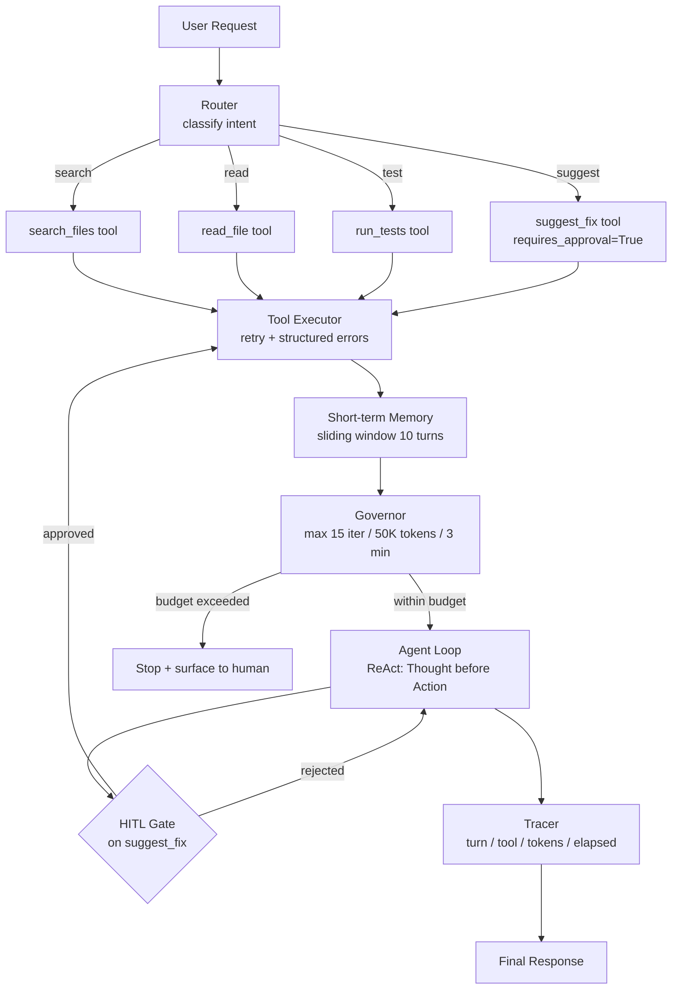

# Capstone: Production Agent with Guardrails and Tracing

> "Build me an agent" and "build me a production agent" are different requests.

**Type:** Build
**Languages:** Python
**Prerequisites:** All lessons in Phase 04
**Time:** ~90 min
**Learning Objectives:**
- Assemble all Phase 04 patterns into a single cohesive production agent
- Implement a governor that enforces iteration, token, and time budgets
- Wire a HITL approval gate on code-change tools
- Add ReAct-style Thought-before-Action reasoning to every turn
- Instrument the agent with manual OTel-style tracing spans
- Write and run a regression eval harness against a golden test set

---

## MOTTO

A production agent is not a demo with more features. It is a system with explicit contracts: what it will do, what it will refuse, how it will fail, and how it will be observed.

---

## THE PROBLEM

A team gets the task: "Build me a codebase assistant agent that can search files, read code, run tests, and suggest fixes."

Version 1 is done in an afternoon. It calls three tools in a loop until Claude says it is done. Works great in the demo.

Version 1 in production:
- Runs for 20 minutes on a large repo query before timing out (no governor)
- A "suggest fix" call edits a production file without review (no HITL gate)
- Fails silently when the test runner returns an error (no structured error handling)
- Impossible to debug why a particular run took 45 seconds (no tracing)
- After a prompt change, unknown whether search quality improved or regressed (no eval harness)

The gap between Version 1 and a production agent is everything in this phase, assembled together.

---

## THE CONCEPT

### The Production Agent Stack

Every pattern from Phase 04 has a slot in the stack. None are optional in production.



### Why Each Layer Exists

```
Layer               Without It                       With It
------------------  -------------------------------  ---------------------------------
Router              Agent guesses what to do         Intent is classified first, cheaper
Governor            Runs until timeout or OOM        Hard budget: fail fast, fail loud
Tool Executor       Silent failures misreported      Errors surface as structured messages
Short-term Memory   Agent forgets prior turns        Last 10 turns in every context
HITL Gate           Code changes without review      suggest_fix needs human sign-off
ReAct Reasoning     Decisions are opaque             Thought: logged before every Action
Tracer              Impossible to debug              Every turn logged with metrics
Eval Harness        Prompt changes are unknowable    Golden set: before/after comparison
```

---

## BUILD IT

### The Complete Codebase Assistant

See `code/main.py` for the full implementation. This section walks through each layer.

**Layer 1: Tool Definitions and Stubs**

Four tools, one with `requires_approval=True`.

```python
TOOLS = [
    {
        "name": "search_files",
        "description": "Search for files or code patterns in the codebase by keyword.",
        "input_schema": {
            "type": "object",
            "properties": {
                "query": {"type": "string", "description": "Search term or pattern"},
                "file_type": {"type": "string", "description": "Optional file extension filter (e.g., .py)"},
            },
            "required": ["query"],
        },
        "requires_approval": False,
    },
    {
        "name": "read_file",
        "description": "Read the full contents of a specific file.",
        "input_schema": {
            "type": "object",
            "properties": {
                "path": {"type": "string", "description": "File path relative to project root"},
            },
            "required": ["path"],
        },
        "requires_approval": False,
    },
    {
        "name": "run_tests",
        "description": "Run the test suite or a specific test file.",
        "input_schema": {
            "type": "object",
            "properties": {
                "target": {"type": "string", "description": "Test file or directory to run"},
            },
            "required": ["target"],
        },
        "requires_approval": False,
    },
    {
        "name": "suggest_fix",
        "description": "Suggest a code change. Requires human approval before application.",
        "input_schema": {
            "type": "object",
            "properties": {
                "file": {"type": "string"},
                "change_description": {"type": "string"},
                "proposed_diff": {"type": "string"},
            },
            "required": ["file", "change_description", "proposed_diff"],
        },
        "requires_approval": True,
    },
]
```

**Layer 2: The Governor**

Hard limits on every axis of resource consumption.

```python
import time
from dataclasses import dataclass, field

@dataclass
class Governor:
    max_iterations: int = 15
    max_tokens: int = 50_000
    max_seconds: float = 180.0

    iterations: int = 0
    tokens_used: int = 0
    start_time: float = field(default_factory=time.time)

    def tick(self, tokens: int) -> None:
        self.iterations += 1
        self.tokens_used += tokens

    def check(self) -> tuple[bool, str]:
        """Returns (ok, reason). ok=False means stop."""
        if self.iterations >= self.max_iterations:
            return False, f"iteration limit reached ({self.max_iterations})"
        if self.tokens_used >= self.max_tokens:
            return False, f"token budget exceeded ({self.tokens_used:,} / {self.max_tokens:,})"
        elapsed = time.time() - self.start_time
        if elapsed >= self.max_seconds:
            return False, f"time limit reached ({elapsed:.0f}s / {self.max_seconds:.0f}s)"
        return True, ""
```

**Layer 3: The Tracer**

Structured logging for every turn, without an SDK.

```python
import contextlib

@dataclass
class Span:
    turn: int
    tool_called: str | None
    tokens_in: int
    tokens_out: int
    elapsed_ms: float
    thought: str | None = None
    approved: bool | None = None

@contextlib.contextmanager
def trace_agent_turn(turn: int, tracer_log: list):
    span = {"turn": turn, "start": time.time(), "tool": None, "tokens_in": 0,
            "tokens_out": 0, "thought": None, "approved": None}
    try:
        yield span
    finally:
        span["elapsed_ms"] = (time.time() - span["start"]) * 1000
        tracer_log.append(span)
        print(
            f"[trace] turn={span['turn']} tool={span['tool'] or 'none'} "
            f"tok_in={span['tokens_in']} tok_out={span['tokens_out']} "
            f"elapsed={span['elapsed_ms']:.0f}ms"
        )
```

**Layer 4: The Router**

Classify intent before the agent loop runs. Cheaper than asking the full agent.

```python
ROUTER_PROMPT = """Classify this user request into exactly one category.
Return only the category word, nothing else.

Categories:
- search (user wants to find files, functions, or patterns)
- read (user wants to see file contents)
- test (user wants to run or check tests)
- suggest (user wants a fix or code change proposed)
- general (anything else)"""

def route_request(user_input: str, client: anthropic.Anthropic) -> str:
    response = client.messages.create(
        model=MODEL,
        max_tokens=10,
        system=ROUTER_PROMPT,
        messages=[{"role": "user", "content": user_input}],
    )
    return response.content[0].text.strip().lower()
```

**Layer 5: ReAct Reasoning**

The system prompt requires a `Thought:` line before every tool call.

```python
AGENT_SYSTEM_PROMPT = """You are a codebase assistant. You help engineers search, read, test, and improve code.

Before every tool call, write a Thought: line explaining your reasoning.
Format: "Thought: [your reasoning here]"
Then make the tool call.

After all tools have run, write a final Answer: with your conclusion.

Constraints:
- Only call tools that are relevant to the user's question
- If a tool returns an error, acknowledge it and adjust your approach
- Never call suggest_fix without first reading the relevant file
- If you cannot complete the task within the available tools, say so clearly"""
```

**Layer 6: Short-term Memory**

A sliding window keeps the last N turns in context.

```python
def trim_history(messages: list[dict], max_turns: int = 10) -> list[dict]:
    """Keep the first message (user's original request) plus the last max_turns messages."""
    if len(messages) <= max_turns + 1:
        return messages
    return [messages[0]] + messages[-(max_turns):]
```

**Layer 7: Approval Gate**

Wired into the tool executor for `suggest_fix`.

```python
APPROVAL_FLAGS = {tool["name"]: tool.get("requires_approval", False) for tool in TOOLS}

def require_approval(tool_name: str, tool_input: dict) -> tuple[bool, dict]:
    print(f"\n[APPROVAL GATE] Tool: {tool_name}")
    print(f"Arguments:\n{json.dumps(tool_input, indent=2)}")
    choice = input("[a]pprove / [r]eject: ").strip().lower()
    if choice in ("a", "approve", ""):
        return True, tool_input
    reason = input("Reason: ")
    return False, {"rejection_reason": reason}
```

> **Real-world check:** Your codebase assistant has been running in production for two weeks. An engineer runs a query, the governor fires after 12 iterations, and the agent returns "budget exceeded: 12/15 iterations reached." The engineer files a bug: "the agent stopped before answering." Is this a bug or expected behavior?

This is expected behavior, and the message should make it clearer. A governor firing is not a failure. It is the governor doing its job: preventing an unbounded run. The fix is not to raise the limit; it is to improve the message ("I was unable to complete your request within the 15-step budget. Here is what I found so far: [partial results]. Consider narrowing your question."). The engineer's frustration is a UX problem, not a governor problem.

---

## USE IT

### Adding OTel-Style Tracing Spans

OTel traces follow a standard structure: a root span for the full request, child spans for each turn, and attributes attached to each span. You do not need the SDK to follow the pattern.

```python
def create_root_span(request_id: str, user_input: str) -> dict:
    return {
        "span_id": request_id,
        "name": "agent.request",
        "start_time": time.time(),
        "attributes": {
            "gen_ai.request.model": MODEL,
            "gen_ai.request.input": user_input[:200],
            "agent.version": "1.0",
        },
        "events": [],
        "children": [],
    }

def add_turn_span(root: dict, turn: int, tool: str | None,
                  tokens_in: int, tokens_out: int, thought: str | None) -> None:
    span = {
        "name": "agent.turn",
        "attributes": {
            "agent.turn_number": turn,
            "gen_ai.usage.input_tokens": tokens_in,
            "gen_ai.usage.output_tokens": tokens_out,
            "agent.tool_called": tool or "none",
            "agent.thought": thought or "",
        },
        "timestamp": time.time(),
    }
    root["events"].append(span)

def finish_root_span(root: dict, outcome: str, total_tokens: int) -> None:
    root["end_time"] = time.time()
    root["duration_ms"] = (root["end_time"] - root["start_time"]) * 1000
    root["attributes"]["agent.outcome"] = outcome
    root["attributes"]["gen_ai.usage.total_tokens"] = total_tokens
    # In production: send to Langfuse or Phoenix here
    print(f"\n[trace summary] outcome={outcome} duration={root['duration_ms']:.0f}ms total_tokens={total_tokens}")
```

The `gen_ai.*` naming follows OpenTelemetry GenAI semantic conventions. This matters because Langfuse, Phoenix, and other observability tools parse these attribute names to build dashboards automatically.

> **Perspective shift:** A colleague says: "We only need tracing when something breaks. Why instrument every turn when things are working fine?" What do you tell them?

Tracing that only exists after a break is not tracing. It is forensics with no evidence. You need per-turn data collected continuously so that when something breaks, you have the baseline to compare against. "Things are working fine" means nothing without numbers: how many tokens per request, which tools are called most often, what the latency distribution looks like. When a slow request comes in, you need to know if it is abnormal (compare against baseline) or normal (the task just takes that long). Tracing gives you that comparison. Forensics after the fact gives you nothing.

---

## SHIP IT

The artifact this lesson produces is an operational runbook for the codebase assistant. See `outputs/runbook-production-agent.md`.

The runbook covers: configuration via environment variables, governor thresholds and when to tune them, common failure symptoms mapped to MAST categories, and the deployment checklist. Use it as the onboarding document for any engineer who runs this agent in production.

---

## EVALUATE IT

### Regression Eval Harness

A production agent needs a golden set: fixed inputs with expected tool call sequences. This is how you detect regressions after any prompt or model change.

```python
"""Eval harness for the codebase assistant agent."""

GOLDEN_SET = [
    {
        "id": "search-01",
        "input": "Find all files that import the logging module",
        "expected_tools": ["search_files"],
        "expected_final_tool": "search_files",
        "should_complete": True,
    },
    {
        "id": "read-01",
        "input": "Show me the contents of main.py",
        "expected_tools": ["read_file"],
        "expected_final_tool": "read_file",
        "should_complete": True,
    },
    {
        "id": "test-01",
        "input": "Run the tests in tests/test_auth.py",
        "expected_tools": ["run_tests"],
        "expected_final_tool": "run_tests",
        "should_complete": True,
    },
    {
        "id": "suggest-01",
        "input": "The login function in auth.py has a bug. Fix it.",
        "expected_tools": ["read_file", "suggest_fix"],
        "expected_final_tool": "suggest_fix",
        "should_complete": True,
    },
    {
        "id": "multi-01",
        "input": "Search for files with TODO comments, then show me the first one",
        "expected_tools": ["search_files", "read_file"],
        "expected_final_tool": "read_file",
        "should_complete": True,
    },
]

def eval_agent_run(agent_result: dict, expected: dict) -> dict:
    """Score one agent run against a golden case."""
    actual_tools = [s.get("tool") for s in agent_result.get("trace", []) if s.get("tool")]

    # Check 1: did the expected tools appear?
    tool_coverage = sum(
        1 for t in expected["expected_tools"] if t in actual_tools
    ) / len(expected["expected_tools"])

    # Check 2: did the final tool match?
    last_tool = actual_tools[-1] if actual_tools else None
    final_tool_match = last_tool == expected["expected_final_tool"]

    # Check 3: did the agent complete within budget?
    completed = agent_result.get("completed", False) == expected["should_complete"]

    score = (tool_coverage * 0.5) + (0.3 if final_tool_match else 0.0) + (0.2 if completed else 0.0)

    return {
        "id": expected["id"],
        "score": score,
        "tool_coverage": tool_coverage,
        "final_tool_match": final_tool_match,
        "completed": completed,
        "pass": score >= 0.8,
    }

def run_regression_eval(agent_fn, golden_set=GOLDEN_SET) -> dict:
    results = []
    for case in golden_set:
        result = agent_fn(case["input"])
        scored = eval_agent_run(result, case)
        results.append(scored)
        status = "PASS" if scored["pass"] else "FAIL"
        print(f"[{status}] {case['id']}: score={scored['score']:.2f}")

    pass_rate = sum(1 for r in results if r["pass"]) / len(results)
    mean_score = sum(r["score"] for r in results) / len(results)
    print(f"\nPass rate: {pass_rate:.0%} | Mean score: {mean_score:.3f}")
    return {"pass_rate": pass_rate, "mean_score": mean_score, "results": results}
```

**What to measure before any prompt change:**
1. Run `run_regression_eval` on the current agent. Record `pass_rate` and `mean_score`.
2. Make the change.
3. Run `run_regression_eval` again.
4. If `pass_rate` dropped by more than 5 percentage points or any case that was PASS became FAIL: investigate before shipping.

A complete golden set for this agent should have 20 cases covering: simple search, multi-step search+read, test execution, suggest_fix approval flow, suggest_fix rejection flow, governor limit scenarios, and error handling (tool returns error). Build the cases before changing the prompt, not after.
