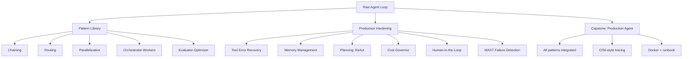

# Phase 04: Agents - Patterns That Survive Production

16 lessons. ~18 hours. Build the agent loop from scratch, master every production pattern, and ship a guarded, observable agent as the capstone.

## The through-line

Most agents fail in production not because the model is weak but because the loop around the model has no guardrails, no memory discipline, no error recovery, and no stopping conditions. This phase fixes that. You build the loop raw first so you understand exactly what every framework is doing, then you learn the patterns that make agents reliable at scale.

## What you build

## Lessons

| # | Lesson | Artifact | Time |
|---|--------|----------|------|
| 01 | The Agent Loop: Raw, No Dependencies | `skill-agent-loop.md` | ~60 min |
| 02 | Workflows vs Agents: When NOT to Use an Agent | `prompt-workflow-vs-agent-decision.md` | ~45 min |
| 03 | Pattern: Prompt Chaining | `skill-prompt-chaining.md` | ~45 min |
| 04 | Pattern: Routing | `skill-router.md` | ~45 min |
| 05 | Pattern: Parallelization | `skill-parallelization.md` | ~45 min |
| 06 | Pattern: Orchestrator-Workers | `skill-orchestrator-workers.md` | ~60 min |
| 07 | Pattern: Evaluator-Optimizer | `skill-evaluator-optimizer.md` | ~60 min |
| 08 | Tool Use + Error Recovery in the Loop | `skill-tool-recovery.md` | ~60 min |
| 09 | Memory: Short-Term, Long-Term, When You Don't Need It | `skill-agent-memory.md` | ~60 min |
| 10 | Planning: ReAct, Plan-and-Execute | `skill-react-planner.md` | ~60 min |
| 11 | Stopping Conditions, Cost Governors, Kill Switches | `skill-agent-governor.md` | ~45 min |
| 12 | Agent SDKs: Claude, OpenAI, LangGraph Tradeoffs | `prompt-sdk-tradeoffs.md` | ~60 min |
| 13 | Multi-Agent: Supervisor, Handoffs, and When It Is Overkill | `skill-multi-agent-supervisor.md` | ~60 min |
| 14 | Agent Failure Modes: MAST Taxonomy | `prompt-mast-failure-checklist.md` | ~45 min |
| 15 | Human-in-the-Loop and Approval Gates | `skill-hitl-approval-gate.md` | ~45 min |
| 16 | Capstone: Production Agent with Guardrails + Tracing | `runbook-production-agent.md` | ~90 min |

## Prerequisites

Phase 01 (Prompt and Context Engineering) and Phase 03 (Tools and MCP) give you the right foundation, but you can start here with just basic Python and familiarity with the Anthropic API.

## Stack

- Python + `anthropic` SDK (primary)
- `asyncio` for parallelization
- `pydantic` for tool schemas in the capstone
- No LangChain required - you build the patterns raw first
