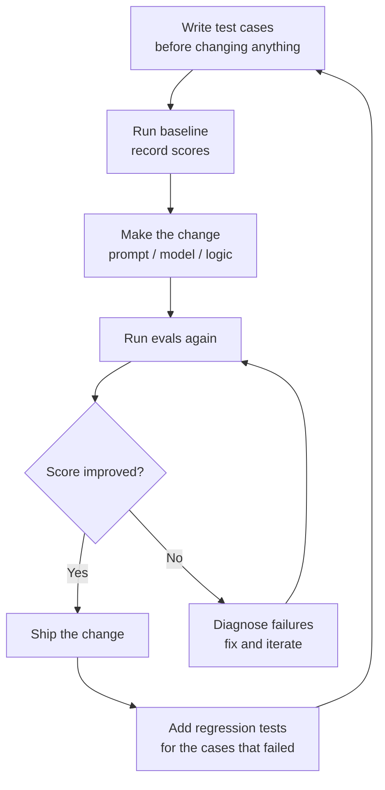

# لماذا التقييمات (Evals) هي صُلب العمل

> إن لم تستطع قياسه، فلن تستطيع تسليمه.

**النوع:** Learn
**اللغات:** Python
**المتطلبات:** أساسيات Python، والإلمام باستدعاء واجهة LLM API
**الوقت:** ~45 دقيقة
**أهداف التعلّم:**
- شرح لماذا ينهار التطوير المبني على الانطباعات (vibes) عند التوسّع، وما الذي يحلّ محله
- التمييز بين مستويات التقييم الثلاثة: الوحدة (unit)، والتكامل (integration)، والشامل (end-to-end)
- بناء حزمة تقييم (eval harness) مبسّطة من الصفر باستخدام مكتبة Python القياسية فقط
- تشغيل تجربة مُقيَّمة في Braintrust وقراءة نتائج كل حالة على حدة
- صياغة حلقة التطوير المدفوعة بالتقييم (eval-driven development loop) كممارسة يومية

---

## MOTTO

التقييمات ليست خطوة ضمان جودة (QA) في النهاية. إنها البنية التحتية لاتخاذ القرار التي تبنيها قبل أن تكتب أول prompt.

---

## THE PROBLEM

ورثتَ بوت دعم عملاء. ترك المهندس السابق رسالة على Slack: "اختبرته بدقة كافية وبدا جيداً." بعد ستة أسابيع ينشر مستخدم لقطة شاشة للبوت وهو ينصحه بالتواصل مع منافس. تُرجِع النظام إلى نسخة الأسبوع الماضي. والآن صار يعطي إجابات خاطئة عن سياسة الاسترجاع. أيّ نسخة أفضل؟ لا تعلم. لا تملك أي بيانات.

هذه هي حلقة التطوير المبني على الانطباعات. تبدو هكذا: غيِّر الـ prompt، جرِّب ثلاثة أمثلة يدوياً، انشر للإنتاج، ثم انتظر الشكاوى. تنجح حين يكون نظامك لعبة بسيطة. لكنها تنهار بأربع طرق محددة عند التوسّع:

أولاً، لا تستطيع المقارنة. حين يسألك مدير المنتج (PM): "هل الـ prompt الجديد أفضل؟" لا تملك إجابة صادقة. حدسك مبني على الأمثلة الثلاثة التي جربتها، والتي اخترتها على الأرجح لأنك توقعت نجاحها.

ثانياً، لا تستطيع رصد الانحدارات (regressions). كل تغيير في الـ prompt هو نشر نحو المجهول. التغيير الذي يصلح وضع فشل واحد قد يكسر وضعين آخرين بصمت.

ثالثاً، لا تستطيع ترتيب الأولويات. من دون معدلات فشل مصنفة حسب الفئة، أنت تخمّن أي المشكلات أهم.

رابعاً، لا تستطيع إثبات أي شيء. حين يسأل نائب الرئيس (VP): "ما دقتنا؟" تملك انطباعاً، لا رقماً.

الحل ليس معقداً. إنه الانضباط نفسه الذي جعل هندسة البرمجيات تنجح: الاختبارات (tests). وفي الأنظمة الاحتمالية، تُسمّى هذه الاختبارات تقييمات (evals).

---

## THE CONCEPT

### التقييمات اختبارات للأنظمة الاحتمالية

اختبار الوحدة (unit test) لكود حتمي يسأل: عند هذا المدخل، هل أحصل على هذا المخرج تماماً؟ أما التقييم فيسأل: عند هذا المدخل، هل يفي المخرج بهذه المعايير بنسبة كافية لتكون مقبولة؟

قد تكون المعايير مطابقة تامة (المخرج هو `"Paris"` بالضبط)، أو مطابقة تقريبية (fuzzy match) (المخرج يحتوي الحقائق الأساسية)، أو مُقيَّمة بـ LLM (نموذج ثانٍ يُقيِّم الجودة وفق rubric)، أو مُعلَّمة بشرياً (إنسان يُقيِّم نجاح/فشل). والحزمة (harness) هي الكود الذي يُشغِّل المعايير على مجموعة بيانات.

```
┌─────────────────────────────────────────────────────┐
│  EVAL HARNESS                                        │
│                                                      │
│  test_cases = [{input, expected}, ...]               │
│       │                                              │
│       ▼                                              │
│  system_under_test(input) → actual                   │
│       │                                              │
│       ▼                                              │
│  scorer(expected, actual) → score (0.0 to 1.0)       │
│       │                                              │
│       ▼                                              │
│  results = [{input, expected, actual, score}, ...]   │
│       │                                              │
│       ▼                                              │
│  aggregate: mean score, pass rate, failure cases     │
└─────────────────────────────────────────────────────┘
```

### مستويات التقييم الثلاثة

```
Level           What it tests                      Example
-----------     ---------------------------------  ---------------------------------
Unit            Single input → single output       "What is the capital of France?"
Integration     Multi-step: retrieval + generate   RAG pipeline on 50 questions
End-to-end      Full user journey                  5-turn conversation to resolution
```

ابدأ بتقييمات الوحدة. فهي سريعة ورخيصة وتكشف معظم المشكلات. أضف تقييمات التكامل حين تنجح تقييمات الوحدة لكن المستخدمين ما زالوا يشتكون. أضف التقييمات الشاملة حين يكون سلوك النظام عبر جلسة كاملة أهم من أي دور (turn) منفرد.

### حلقة التطوير المدفوعة بالتقييم



الانضباط الأساسي: اكتب حالات الاختبار أو حدّثها قبل أن تلمس الـ prompt. فإن كتبتها بعده، ستكتب لا شعورياً اختبارات يجتازها الـ prompt الجديد.

### لماذا "دقة 90٪" غالباً بلا معنى

الرقم من دون سياق لا يخبرك بشيء. أنت تحتاج إلى:

- خط أساس (baseline) (ما الدرجة قبل التغيير؟)
- توزيع (distribution) (أي الحالات تنجح؟ وأيها تفشل؟ وهل الفشل متجمّع؟)
- مقام (denominator) (90٪ من ماذا؟ من 10 أمثلة منتقاة يدوياً أم 500 عيّنة عشوائية؟)
- مقارنة (90٪ على أي معيار؟ المطابقة التامة والتقييم بـ LLM يعطيان أرقاماً مختلفة)

الرقم نفسه أقل أهمية من الفارق (delta) ومن تفصيل أوضاع الفشل.

---

## BUILD IT

### حزمة تقييم مبسّطة بـ Python خالصة

بلا أُطر عمل (frameworks). Python فقط. الهدف أن ترى كل جزء متحرك قبل أن تستخدم أداة تُخفيه.

راجع `code/main.py` للتنفيذ الكامل. تتكوّن الحزمة من ثلاثة مكوّنات:

**1. المُقيِّم (scorer):** استراتيجيتان، مطابقة تامة ومطابقة تقريبية.

```python
import difflib

def exact_match(expected: str, actual: str) -> float:
    return 1.0 if expected.strip().lower() == actual.strip().lower() else 0.0

def fuzzy_match(expected: str, actual: str) -> float:
    return difflib.SequenceMatcher(None, expected.lower(), actual.lower()).ratio()
```

**2. الحزمة (harness):** تُمرِّر كل حالة اختبار عبر النظام ثم عبر المُقيِّم.

```python
def run_eval(test_cases: list[dict], system_fn, scorer_fn) -> list[dict]:
    results = []
    for case in test_cases:
        actual = system_fn(case["input"])
        score = scorer_fn(case["expected"], actual)
        results.append({
            "input": case["input"],
            "expected": case["expected"],
            "actual": actual,
            "score": score,
            "pass": score >= 0.8,
        })
    return results
```

**3. المُبلِّغ (reporter):** يطبع جدولاً قابلاً للقراءة وإحصاءات مجمّعة.

```python
def print_results(results: list[dict]) -> None:
    print(f"\n{'Input':<40} {'Expected':<25} {'Actual':<25} {'Score':<6} {'Pass'}")
    print("-" * 110)
    for r in results:
        status = "PASS" if r["pass"] else "FAIL"
        print(f"{r['input'][:38]:<40} {r['expected'][:23]:<25} {r['actual'][:23]:<25} {r['score']:.2f}   {status}")
    
    scores = [r["score"] for r in results]
    passed = sum(1 for r in results if r["pass"])
    print(f"\nAggregate: {passed}/{len(results)} passed | mean score: {sum(scores)/len(scores):.3f}")
```

تشغيل الحزمة على خمس حالات اختبار من نوع سؤال/جواب:

```
Input                                    Expected                  Actual                    Score  Pass
--------------------------------------------------------------------------------------------------------------
What is the capital of France?           Paris                     Paris                     1.00   PASS
Who wrote Hamlet?                        William Shakespeare       Shakespeare               0.68   FAIL
What year did WWII end?                  1945                      The war ended in 1945     0.53   FAIL
What is the boiling point of water?      100 degrees Celsius       100°C                     0.40   FAIL
What does HTTP stand for?                HyperText Transfer Proto  HyperText Transfer Proto  0.96   PASS

Aggregate: 2/5 passed | mean score: 0.71
```

لاحظ ثلاث إجابات "خاطئة" لكنها في الحقيقة صحيحة: "Shakespeare" صيغة مختصرة صالحة، و"The war ended in 1945" تحتوي الإجابة الصحيحة، و"100°C" مكافئة لـ "100 degrees Celsius". تفشل المطابقة التامة والتقريبية كلتاهما هنا. ولهذا تحتاج إلى LLM-as-judge (الدرس 06). لكن ابدأ من هنا أولاً لتفهم القيد.

> **اختبار من الواقع:** يسألك مدير المنتج: "هل الـ prompt الجديد أفضل من القديم؟" ما الذي كان يجب أن تكون قد بنيته قبل تغيير الـ prompt لتجيب على هذا السؤال بصدق؟

تحتاج إلى مجموعة بيانات ثابتة من حالات الاختبار مع مخرجاتها المتوقعة، وإلى درجة خط أساس من الـ prompt القديم. من دون الاثنين، تصبح المقارنة بلا معنى. فقد يسجّل الـ prompt الجديد درجة أعلى على الأمثلة الثلاثة التي صادفتَ تجربتها، بينما ينحدر على الـ 47 التي لم تجربها.

---

## USE IT

### الحزمة نفسها في Braintrust

يمنحك Braintrust تتبّع التجارب، ومقارنات لكل حالة عبر عمليات التشغيل، وواجهة لفحص حالات الفشل. منطق الحزمة متطابق. الفرق هو الاستمرارية وقابلية المقارنة.

التثبيت: `pip install braintrust autoevals`

```python
import braintrust
from braintrust import Eval
from autoevals import LevenshteinScorer

# Define your dataset
dataset = [
    {"input": "What is the capital of France?", "expected": "Paris"},
    {"input": "Who wrote Hamlet?", "expected": "William Shakespeare"},
    {"input": "What year did WWII end?", "expected": "1945"},
    {"input": "What is the boiling point of water?", "expected": "100 degrees Celsius"},
    {"input": "What does HTTP stand for?", "expected": "HyperText Transfer Protocol"},
]

# Define your task (the system under test)
def task(input: str) -> str:
    # Replace with your actual LLM call
    return simple_qa_system(input)

# Run the eval
Eval(
    "qa-system-baseline",
    data=dataset,
    task=task,
    scores=[LevenshteinScorer],
)
```

شغِّلها مرتين: مرة بالـ prompt القديم، ومرة بالجديد. يتتبّع Braintrust كلتا التجربتين. في الواجهة تستطيع:

- رؤية كل حالة جنباً إلى جنب عبر التجارب
- التصفية على الحالات التي انحدرت (انخفضت درجتها)
- التصفية على الحالات التي تحسّنت
- رؤية توزيع الدرجات، لا المتوسط فحسب

الفرق الجوهري عن الحزمة اليدوية: حين تُشغِّل التجربة الثانية، يحسب Braintrust تلقائياً الفارق عن التجربة الأولى لكل حالة. ترى `+0.12` أو `-0.05` لكل حالة، لا أرقاماً مجمّعة فقط.

```python
# You can also log custom traces for richer debugging
with braintrust.start_span("qa-eval") as span:
    actual = task(case["input"])
    span.log(
        input=case["input"],
        output=actual,
        expected=case["expected"],
        scores={"levenshtein": LevenshteinScorer()(actual, case["expected"])},
    )
```

> **نقلة في المنظور:** يقول مهندس جديد في فريقك: "لا نحتاج إلى تقييمات، نحن نختبر يدوياً قبل التسليم." ما الطرق الثلاث المحددة التي ينهار بها هذا عند التوسّع؟

أولاً: الاختبار اليدوي لا يتوسّع. عند 10 حالات اختبار لكل ميزة، يمكنك المتابعة. أما عند 200 حالة موزّعة على 15 ميزة، فلا تستطيع. ثانياً: الاختبار اليدوي بلا ذاكرة. لا يمكنك مقارنة prompt هذا الأسبوع بـ prompt الأسبوع الماضي. ثالثاً: الاختبار اليدوي منحاز. أنت تختبر لا شعورياً الحالات التي تتوقع نجاحها. أما الحالات التي تفشل فعلاً في الإنتاج فهي تلك التي لم يخطر لك تجربتها.

---

## SHIP IT

الأثر (artifact) الذي يُنتجه هذا الدرس هو قالب prompt قابل لإعادة الاستخدام لتوظيف LLM في تقييم مخرجات LLM آخر. راجع `outputs/prompt-eval-scorecard.md`.

قالب بطاقة التقييم (scorecard) هذا هو الأساس لتقييمات LLM-as-judge (يُغطّى بعمق في الدرس 06). النمط: أعطِ نموذج الحكم (judge) السؤال، والإجابة المتوقعة، والإجابة الفعلية، واطلب منه التقييم مع التعليل. المخرج بصيغة JSON منظّمة ليكون قابلاً للقراءة آلياً.

---

## EVALUATE IT

كيف تعرف أن حزمة التقييم نفسها جديرة بالثقة؟

**المعايرة (Calibration).** شغِّل الحزمة على 10 حالات تعرف درجتها الصحيحة: 5 ينبغي أن تنجح بوضوح و5 ينبغي أن تفشل بوضوح. إن لم تطابق الحزمة حدسك في الحالات الواضحة، فالمُقيِّم معطوب.

**معدل التوافق (Agreement rate).** اطلب من مهندسَين أن يُقيِّما يدوياً المخرجات العشرين نفسها نجاحاً/فشلاً. احسب نسبة اتفاقهما. هذا هو معدل التوافق البشري لديك. ينبغي أن يطابق مُقيِّمك الآلي هذا المعدل عند تطبيقه على المخرجات العشرين نفسها. فإن كان التوافق البشري 85٪ ويتفق مُقيِّمك مع البشر 60٪ فقط من الوقت، فالمُقيِّم لا يلتقط ما يهم.

**احذر اعتلالات المُقيِّم (scorer pathologies):**
- مُقيِّم يعطي كل شيء تقريباً 0.85–0.95 (غير حسّاس للتباين الحقيقي)
- مُقيِّم يعاقب الإجابات الصحيحة لأنها تستخدم علامات ترقيم أو صياغة مختلفة
- مُقيِّم يكافئ الإجابات الخاطئة لأنها تشترك في كلمات مع المخرج المتوقع

الحزمة لا تتجاوز جودة مُقيِّمها. والمُقيِّم لا يتجاوز جودة المعيار الذي يُرمِّزه. خصِّص وقتاً للمعيار أكثر مما تخصصه للكود.
