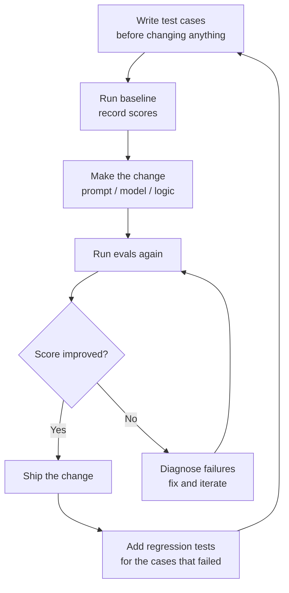

# Why Evals Are the Job

> If you can't measure it, you can't ship it.

**Type:** Learn
**Languages:** Python
**Prerequisites:** Basic Python, familiarity with calling an LLM API
**Time:** ~45 min
**Learning Objectives:**
- Explain why vibes-based development breaks at scale and what replaces it
- Distinguish the three levels of evals: unit, integration, and end-to-end
- Build a minimal eval harness from scratch using only Python stdlib
- Run a scored experiment in Braintrust and read the per-case results
- Articulate the eval-driven development loop as a daily practice

---

## MOTTO

Evals are not a QA step at the end. They are the decision-making infrastructure you build before you write the first prompt.

---

## THE PROBLEM

You inherit a customer support bot. The previous engineer left a Slack message: "I tested it pretty thoroughly and it seemed good." Six weeks later a user posts a screenshot of the bot telling them to contact a competitor. You roll back to last week's version. Now it's giving wrong refund policy answers. Which version is better? You don't know. You have no data.

This is the vibes-based development loop. It looks like this: change prompt, try three examples manually, deploy to prod, wait for complaints. It works when your system is a toy. It breaks in four specific ways at scale:

First, you can't compare. When your PM asks "is the new prompt better?" you have no honest answer. Your intuition is based on the three examples you tried, which you probably chose because you expected them to work.

Second, you can't catch regressions. Every prompt change is a deployment into the unknown. A change that fixes one failure mode silently breaks two others.

Third, you can't prioritize. Without failure rates by category, you're guessing which problems matter most.

Fourth, you can't prove anything. When the VP asks "what's our accuracy?" you have a vibe, not a number.

The fix is not complicated. It's the same discipline that made software engineering work: tests. For probabilistic systems, those tests are called evals.

---

## THE CONCEPT

### Evals Are Tests for Probabilistic Systems

A unit test for deterministic code asks: given this input, do I get exactly this output? An eval asks: given this input, does the output meet these criteria, often enough to be acceptable?

The criteria can be exact match (the output is exactly `"Paris"`), fuzzy match (the output contains the key facts), LLM-judged (a second model scores quality on a rubric), or human-annotated (a human rates pass/fail). The harness is the code that runs the criteria against a dataset.

```
┌─────────────────────────────────────────────────────┐
│  EVAL HARNESS                                        │
│                                                      │
│  test_cases = [{input, expected}, ...]               │
│       │                                              │
│       ▼                                              │
│  system_under_test(input) → actual                   │
│       │                                              │
│       ▼                                              │
│  scorer(expected, actual) → score (0.0 to 1.0)       │
│       │                                              │
│       ▼                                              │
│  results = [{input, expected, actual, score}, ...]   │
│       │                                              │
│       ▼                                              │
│  aggregate: mean score, pass rate, failure cases     │
└─────────────────────────────────────────────────────┘
```

### Three Levels of Evals

```
Level           What it tests                      Example
-----------     ---------------------------------  ---------------------------------
Unit            Single input → single output       "What is the capital of France?"
Integration     Multi-step: retrieval + generate   RAG pipeline on 50 questions
End-to-end      Full user journey                  5-turn conversation to resolution
```

Start with unit evals. They are fast, cheap, and reveal most problems. Add integration evals when unit evals pass but users still complain. Add end-to-end evals when the system's behavior across a full session matters more than any single turn.

### The Eval-Driven Development Loop



The key discipline: write or update your test cases BEFORE you touch the prompt. If you write them after, you will unconsciously write tests the new prompt passes.

### Why "90% accuracy" Is Usually Meaningless

A score without context tells you nothing. You need:

- A baseline (what was the score before the change?)
- A distribution (which cases pass? which fail? is the failure clustered?)
- A denominator (90% of what? 10 hand-picked examples or 500 randomly sampled?)
- A comparison (90% on what criteria? exact match and LLM-judged give different numbers)

The number matters less than the delta and the failure breakdown.

---

## BUILD IT

### A Minimal Eval Harness in Pure Python

No frameworks. Just Python. The goal is to see every moving part before you use a tool that hides them.

See `code/main.py` for the full implementation. The harness has three components:

**1. The scorer:** two strategies, exact match and fuzzy match.

```python
import difflib

def exact_match(expected: str, actual: str) -> float:
    return 1.0 if expected.strip().lower() == actual.strip().lower() else 0.0

def fuzzy_match(expected: str, actual: str) -> float:
    return difflib.SequenceMatcher(None, expected.lower(), actual.lower()).ratio()
```

**2. The harness:** runs each test case through the system and the scorer.

```python
def run_eval(test_cases: list[dict], system_fn, scorer_fn) -> list[dict]:
    results = []
    for case in test_cases:
        actual = system_fn(case["input"])
        score = scorer_fn(case["expected"], actual)
        results.append({
            "input": case["input"],
            "expected": case["expected"],
            "actual": actual,
            "score": score,
            "pass": score >= 0.8,
        })
    return results
```

**3. The reporter:** prints a readable table and aggregate stats.

```python
def print_results(results: list[dict]) -> None:
    print(f"\n{'Input':<40} {'Expected':<25} {'Actual':<25} {'Score':<6} {'Pass'}")
    print("-" * 110)
    for r in results:
        status = "PASS" if r["pass"] else "FAIL"
        print(f"{r['input'][:38]:<40} {r['expected'][:23]:<25} {r['actual'][:23]:<25} {r['score']:.2f}   {status}")
    
    scores = [r["score"] for r in results]
    passed = sum(1 for r in results if r["pass"])
    print(f"\nAggregate: {passed}/{len(results)} passed | mean score: {sum(scores)/len(scores):.3f}")
```

Running the harness on five Q&A test cases:

```
Input                                    Expected                  Actual                    Score  Pass
--------------------------------------------------------------------------------------------------------------
What is the capital of France?           Paris                     Paris                     1.00   PASS
Who wrote Hamlet?                        William Shakespeare       Shakespeare               0.68   FAIL
What year did WWII end?                  1945                      The war ended in 1945     0.53   FAIL
What is the boiling point of water?      100 degrees Celsius       100°C                     0.40   FAIL
What does HTTP stand for?                HyperText Transfer Proto  HyperText Transfer Proto  0.96   PASS

Aggregate: 2/5 passed | mean score: 0.71
```

Notice three "wrong" answers that are actually correct: "Shakespeare" is a valid short form, "The war ended in 1945" contains the right answer, and "100°C" is equivalent to "100 degrees Celsius." Exact and fuzzy matching both fail here. This is why you need LLM-as-judge (Lesson 06). But start here first so you understand the limitation.

> **Real-world check:** Your PM asks: "Is the new prompt better than the old one?" What would you need to have built BEFORE you changed the prompt to answer that question honestly?

You need a fixed dataset of test cases with expected outputs, and a baseline score from the old prompt. Without both, the comparison is meaningless. The new prompt might score higher on the three examples you happen to try, while regressing on the 47 you didn't.

---

## USE IT

### The Same Harness in Braintrust

Braintrust gives you experiment tracking, per-case comparisons across runs, and a UI for inspecting failures. The harness logic is identical. The difference is persistence and comparability.

Install: `pip install braintrust autoevals`

```python
import braintrust
from braintrust import Eval
from autoevals import LevenshteinScorer

# Define your dataset
dataset = [
    {"input": "What is the capital of France?", "expected": "Paris"},
    {"input": "Who wrote Hamlet?", "expected": "William Shakespeare"},
    {"input": "What year did WWII end?", "expected": "1945"},
    {"input": "What is the boiling point of water?", "expected": "100 degrees Celsius"},
    {"input": "What does HTTP stand for?", "expected": "HyperText Transfer Protocol"},
]

# Define your task (the system under test)
def task(input: str) -> str:
    # Replace with your actual LLM call
    return simple_qa_system(input)

# Run the eval
Eval(
    "qa-system-baseline",
    data=dataset,
    task=task,
    scores=[LevenshteinScorer],
)
```

Run it twice: once with your old prompt, once with the new. Braintrust tracks both experiments. In the UI you can:

- See every case side by side across experiments
- Filter to cases that regressed (score dropped)
- Filter to cases that improved
- See the distribution of scores, not just the mean

The key difference from the manual harness: when you run experiment 2, Braintrust automatically computes the delta from experiment 1 for every case. You see `+0.12` or `-0.05` per case, not just aggregate numbers.

```python
# You can also log custom traces for richer debugging
with braintrust.start_span("qa-eval") as span:
    actual = task(case["input"])
    span.log(
        input=case["input"],
        output=actual,
        expected=case["expected"],
        scores={"levenshtein": LevenshteinScorer()(actual, case["expected"])},
    )
```

> **Perspective shift:** A new engineer on your team says "we don't need evals, we just test it manually before shipping." What are the three specific ways that breaks down at scale?

First: manual testing doesn't scale. At 10 test cases per feature, you can keep up. At 200 cases across 15 features, you can't. Second: manual testing has no memory. You can't compare this week's prompt to last week's. Third: manual testing is biased. You subconsciously test the cases you expect to work. The cases that actually fail in production are the ones you didn't think to try.

---

## SHIP IT

The artifact this lesson produces is a reusable prompt template for using an LLM to evaluate another LLM's output. See `outputs/prompt-eval-scorecard.md`.

This scorecard prompt is the foundation for LLM-as-judge evals (covered deeply in Lesson 06). The pattern: give the judge model the question, the expected answer, and the actual answer, and ask it to score with reasoning. The output is structured JSON so it's machine-readable.

---

## EVALUATE IT

How do you know your eval harness itself is trustworthy?

**Calibration.** Run the harness on 10 cases where you know the right score: 5 that should clearly pass and 5 that should clearly fail. If the harness doesn't match your intuition on the clear cases, the scorer is broken.

**Agreement rate.** Ask two engineers to manually score the same 20 outputs as pass/fail. Compute the percentage they agree. This is your human agreement rate. Your automated scorer should match that rate when applied to the same 20 outputs. If human agreement is 85% and your scorer agrees with humans only 60% of the time, the scorer isn't capturing what matters.

**Watch for scorer pathologies:**
- A scorer that gives nearly everything 0.85-0.95 (insensitive to real variation)
- A scorer that penalizes correct answers because they use different punctuation or phrasing
- A scorer that rewards wrong answers because they share words with the expected output

The harness is only as good as the scorer. The scorer is only as good as the criterion it encodes. Spend more time on the criterion than on the code.
