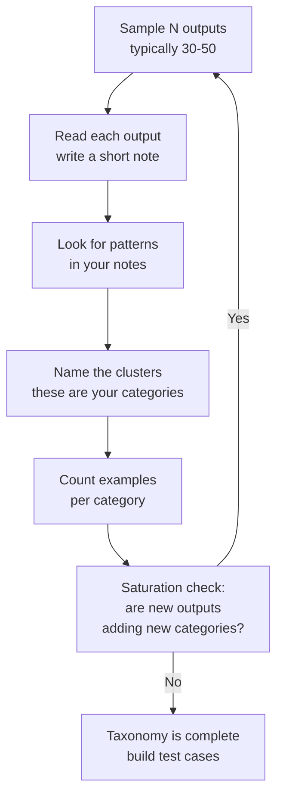

# تحليل الأخطاء أولاً: انظر إلى بياناتك

> اقرأ قبل أن تقيس. لا يمكنك كتابة مُقيِّم جيد لوضع فشل لم تُسمّه بعد.

**النوع:** Build
**اللغات:** Python
**المتطلبات:** الدرس 05-01 (لماذا التقييمات هي صُلب العمل)
**الوقت:** ~60 دقيقة
**أهداف التعلّم:**
- شرح لماذا يؤدي تشغيل المقاييس (metrics) قبل فحص المخرجات إلى نتائج مضلِّلة
- تطبيق الترميز المفتوح (open coding) على دفعة من مخرجات LLM لإيجاد تجمّعات الفشل
- بناء أداة تعليق (annotation) عبر سطر الأوامر (CLI) لالتقاط فئات الفشل المنظّمة من المخرجات الخام
- بناء تصنيف للفشل (failure taxonomy) من بيانات التعليق
- ترجمة فئات الفشل إلى حالات اختبار مستهدفة ومعايير للمُقيِّم

---

## MOTTO

انظر إلى البيانات قبل أن تقيسها. المقاييس من دون فحص تعطيك رقماً. أما الفحص فيخبرك بما هو خاطئ فعلاً.

---

## THE PROBLEM

بنيتَ بوت سؤال/جواب لقاعدة معرفة الموارد البشرية (HR). تُشغِّل حزمة التقييم فتحصل على معدل نجاح 74٪. ماذا تفعل؟

يندفع معظم المهندسين فوراً نحو الإصلاحات: جرِّب prompt جديداً، جرِّب نموذجاً أكبر، أضف سياقاً أكثر. إنهم يُحسِّنون في الظلام. فمعدل الفشل البالغ 26٪ ليس شيئاً واحداً. هو على الأرجح أربعة أو خمسة أشياء مختلفة، كلٌّ منها يحتاج إصلاحاً مختلفاً. تغيير في الـ prompt يصلح "صيغة إجابة خاطئة" قد يزيد "الحقائق غير الصحيحة" سوءاً. ونموذج أكبر قد يصلح "الهلوسة في الحالات الحدّية" دون أن يفعل شيئاً لـ "رفض الإجابة عن أسئلة المزايا".

أنت لا تعرف ما هي الـ 26٪ حتى تقرأها.

هذه هي طريقة Hamel Husain الجوهرية، الموثّقة عبر سنوات من العمل الإنتاجي على LLM: أنفع ما تفعله قبل كتابة أي مُقيِّم هو أن تقرأ 20–50 مخرجاً وتدوّن ملاحظات. ليس لتجد المشكلات "البديهية"، بل لتكتشف أوضاع فشل لم تكن تعرف بوجودها. لكل نظام أوضاع فشل تنشأ من الطريقة المحددة التي يصوغ بها المستخدمون كلامهم، ومن الثغرات المحددة في قاعدة معرفتك، ومن الحالات الحدّية المحددة في مجالك. ولا يكفي أي قدر من حدس المعايير القياسية (benchmark) للتنبؤ بها.

تُسمّى هذه العملية الترميز المفتوح (open coding). أصلها من البحث النوعي. تقرأ المخرجات من دون نظام فئات معرّف مسبقاً، وتكتب ملاحظات قصيرة أثناء قراءتك، ثم تبحث عن أنماط في ملاحظاتك. تصبح الأنماط هي تصنيفك. ويصبح التصنيف هو معايير التقييم لديك.

---

## THE CONCEPT

### لماذا "المقاييس أولاً" مقلوب

```
WRONG ORDER                         RIGHT ORDER
-----------                         -----------
1. Run metrics                      1. Sample outputs (read 30-50)
2. Get a number: 74% pass           2. Open coding: write notes per output
3. Wonder what to fix               3. Find clusters: 5-6 failure categories
4. Guess at root cause              4. Build taxonomy with examples
5. Make a change                    5. THEN define metrics per category
6. Run metrics again                6. Write targeted test cases
7. Number changed (but why?)        7. Make targeted changes
                                    8. Measure the right things
```

مشكلة "المقاييس أولاً": أنك تقيس الأشياء الخاطئة. إن لم تقرأ المخرجات، فلن تعرف أي أوضاع فشل موجودة. ستكتب مُقيِّمات لأوضاع الفشل التي تخيّلتها، لا التي لديك فعلاً.

### الترميز المفتوح: العملية



### مثال على تصنيف للفشل

بعد قراءة 40 مخرجاً من نظام سؤال/جواب للموارد البشرية، قد تجد:

```
Category                  Count   Example
------------------------  -----   -----------------------------------------------
Unnecessary caveat        8       "I'm not a lawyer, but your PTO accrues at..."
Wrong benefit amount      5       "$500 FSA limit" (actual: $2,750)
Refused to answer         4       "I can't help with compensation questions"
Format mismatch           3       Returns bullet list when user asked for a number
Correct but incomplete    6       Answers the question but misses a critical step
Off-topic hallucination   2       Adds policy from a different company
Correct                   12      (not a failure, but count these too)
```

هذا التصنيف صار قابلاً للتنفيذ. أنت تعرف الآن: نصف حالات الفشل قضايا تحفّظات (caveats) ونقص اكتمال (غالباً قابلة للإصلاح عبر الـ prompt). والمبالغ الخاطئة مشكلة استرجاع (retrieval). والرفض يحتاج تعديل الحواجز (guardrails). كل فئة تُحيل إلى إصلاح مختلف وإلى تصميم حالة اختبار مختلفة.

### متى تتوقف: إشارة التشبّع

لقد قرأت ما يكفي من المخرجات حين لا تُدخِل العشرة الأخيرة التي علّقتَ عليها أي فئات جديدة. هذا هو التشبّع (saturation): التصنيف استقرّ. القراءة الإضافية تضيف أمثلة لا أوضاع فشل جديدة. عملياً، يحدث هذا عادة بين 30 و80 مخرجاً لمعظم الأنظمة. أما الأنظمة شديدة التنوع فقد تتطلب أكثر من 100.

---

## BUILD IT

تتكوّن الأداة من ثلاثة مكوّنات: مُعيِّن عيّنات (sampler)، وأداة تعليق عبر سطر الأوامر (annotation CLI)، ومُبلِّغ تكرارات (frequency reporter).

### 1. أخذ عيّنة من المخرجات من ملف سجلّ (log)

السجلّات بصيغة JSON lines (كائن JSON واحد لكل سطر):

```python
import json
import random

def sample_outputs(log_path: str, n: int = 30, seed: int = 42) -> list[dict]:
    """Sample N outputs from a JSON lines log file."""
    with open(log_path) as f:
        lines = [json.loads(line) for line in f if line.strip()]
    random.seed(seed)
    return random.sample(lines, min(n, len(lines)))
```

لكل سجلّ هذا الشكل: `{"input": "...", "output": "...", "metadata": {...}}`.

### 2. أداة التعليق عبر سطر الأوامر

تعرض الأداة كل مخرج وتجمع فئة فشل من المستخدم:

```python
PREDEFINED_CATEGORIES = [
    "correct",
    "wrong_fact",
    "incomplete",
    "unnecessary_caveat",
    "refused",
    "format_mismatch",
    "hallucination",
    "off_topic",
    "other",
]

def annotate_outputs(outputs: list[dict]) -> list[dict]:
    """Interactive CLI for annotating outputs with failure categories."""
    annotations = []
    for i, item in enumerate(outputs):
        print(f"\n--- Case {i+1}/{len(outputs)} ---")
        print(f"INPUT:  {item['input']}")
        print(f"OUTPUT: {item['output']}")
        print(f"\nCategories: {', '.join(PREDEFINED_CATEGORIES)}")
        
        while True:
            category = input("Category (or type a new one): ").strip().lower()
            if category:
                break
        
        note = input("Note (optional, press Enter to skip): ").strip()
        
        annotations.append({
            "input": item["input"],
            "output": item["output"],
            "category": category,
            "note": note,
            "metadata": item.get("metadata", {}),
        })
    
    return annotations
```

### 3. الحفظ والتبليغ

```python
def save_annotations(annotations: list[dict], path: str) -> None:
    with open(path, "w") as f:
        json.dump(annotations, f, indent=2)

def print_taxonomy(annotations: list[dict]) -> None:
    from collections import Counter
    counts = Counter(a["category"] for a in annotations)
    total = len(annotations)
    
    print(f"\nFailure Taxonomy ({total} cases annotated)")
    print(f"{'Category':<25} {'Count':<8} {'%':<8} {'Example (first)'}")
    print("-" * 80)
    for category, count in counts.most_common():
        example = next(a["input"] for a in annotations if a["category"] == category)
        print(f"{category:<25} {count:<8} {count/total*100:<8.1f} {example[:35]}")
```

تشغيل هذا على مجموعة العيّنة المؤلفة من 20 حالة في `code/main.py` يُنتج مخرجاً كهذا:

```
Failure Taxonomy (20 cases annotated)
Category                  Count    %        Example (first)
--------------------------------------------------------------------------------
correct                   9        45.0     What is the PTO accrual rate?
unnecessary_caveat        4        20.0     Can I carry over unused PTO?
wrong_fact                3        15.0     What is the FSA contribution limit?
incomplete                2        10.0     How do I submit an expense report?
refused                   2        10.0     What is the CEO's salary?
```

بيانات العيّنة مكتوبة مباشرة (hardcoded) في `code/main.py` كي تستطيع تشغيلها فوراً من دون نظام حيّ. في الإنتاج، توجِّه `log_path` إلى سجلّات مخرجاتك الحقيقية.

> **اختبار من الواقع:** تُشغِّل أداة التعليق على 50 مخرجاً. 35 منها سليم، و15 فيها أخطاء. تلاحظ أن 8 من الـ 15 خطأً تشترك في النمط نفسه: النموذج يعطي إجابة صحيحة لكنه يضيف تحفّظات لا لزوم لها. ماذا تفعل بهذه الرؤية قبل أن تلمس الـ prompt؟

تكتب ثلاثة أشياء: (1) حالة اختبار يجب أن تفشل فيها الإجابات المُحفَّفة بالتحفّظات، كي تقيس معدل الفشل الحالي بدقة؛ (2) ملاحظة في التصنيف تشرح ماذا يعني "التحفّظ غير الضروري" مع مثالين أو ثلاثة؛ (3) فرضية عن سبب حدوثه (غالباً الـ system prompt يُبالغ في التشديد على الحذر). عندها فقط تُغيِّر الـ prompt. بهذه الطريقة تعرف الحال قبل وبعد، وتستطيع التحقق من أن الإصلاح لم يكسر شيئاً آخر.

---

## USE IT

### سير العمل نفسه في Braintrust

تستبدل واجهة التعليق في Braintrust أداة سطر الأوامر بواجهة دائمة وقابلة للمشاركة. ينطبق سير العمل مباشرة:

**الخطوة 1: سجِّل المخرجات في Braintrust كتجربة.**

```python
import braintrust

# Log each output you want to annotate
project = braintrust.init("hr-qa-system")

with project.start_experiment("error-analysis-run-1") as experiment:
    for item in outputs:
        experiment.log(
            input=item["input"],
            output=item["output"],
            metadata=item.get("metadata", {}),
        )
```

**الخطوة 2: علِّق في واجهة Braintrust.**

في عرض التجربة، انقر أي صف لفتح المدخل/المخرج كاملاً. استخدم عمود "Human Review" لإضافة التسميات (labels). يمكنك تعريف مجموعات تسميات مخصّصة تطابق فئات تصنيفك. ويستطيع عدة مراجعين التعليق على المخرجات نفسها في آن واحد؛ ويتتبّع Braintrust من علّق ماذا.

**الخطوة 3: صدّر التعليقات للتحليل.**

```python
from braintrust import load_dataset

# After annotation in the UI, export as a dataset
annotated = braintrust.list_experiments("hr-qa-system")
# Pull specific experiment results via the SDK or REST API
# Each row will have your human review labels attached
```

**الخطوة 4: قارن المقاربات.**

| Approach | When to use |
|---|---|
| CLI annotation tool | Quick first pass, no infrastructure, local files |
| Braintrust UI | Team review, multiple annotators, persistent history |
| Braintrust + custom scores | When you want to track taxonomy drift over time |

أداة سطر الأوامر هي نقطة البداية الصحيحة: فهي تُجبرك على قراءة كل مخرج وتجعل التصنيف صريحاً. انتقل إلى Braintrust حين تحتاج إلى مشاركة التعليقات عبر فريق أو تتبّع كيف يتغيّر توزيع الفشل مع تكرارك.

> **نقلة في المنظور:** يسألك مديرك لماذا أمضيت 3 ساعات تقرأ مخرجات النموذج بدلاً من "مجرد تشغيل مقاييس التقييم". كيف تشرح أن هذا هو عمل التقييم نفسه؟

مقاييس التقييم لا تتجاوز جودة المعايير التي تقيسها. إن لم تعرف أي أوضاع فشل موجودة، فستقيس الأشياء الخاطئة. قراءة المخرجات هي كيف تكتشف ما الذي يجب قياسه. ثلاث ساعات من قراءة المخرجات تُظهِر عادة 5–6 فئات فشل لم يتوقعها أحد في الفريق. كلٌّ منها يصبح حالة اختبار. ومن دون تلك القراءة، تكون لديك مقاييس تخبرك بأن 74٪ تنجح ولا فكرة لديك لماذا تفشل الـ 26٪.

---

## SHIP IT

الأثر الذي يُنتجه هذا الدرس هو دليل قابل لإعادة الاستخدام لإجراء تحليل أخطاء منظّم على أي نظام LLM. راجع `outputs/skill-error-analysis.md`.

يغطّي الدليل العملية الكاملة: أخذ عيّنة من المخرجات، والترميز المفتوح، وبناء التصنيف، وفحص التشبّع، والتوافق بين المُقيِّمين (inter-rater agreement)، وترجمة التصنيف إلى حالات اختبار. وهو مصمَّم ليُشارَك مع عضو فريق جديد أو يُستخدَم كقائمة تحقق قبل بدء أي مشروع تقييم.

---

## EVALUATE IT

كيف تعرف أن تحليل أخطائك دقيق بما يكفي للبناء عليه؟

**فحص التشبّع.** إن لم تُضِف العشرة الأخيرة من المخرجات التي علّقت عليها أي فئة جديدة إلى تصنيفك، فقد بلغت التشبّع. وإن كنت ما زلت تجد فئات جديدة بعد 80 مخرجاً، فإن مجموعة بياناتك أكثر تنوعاً من المعتاد، أو أن للنظام أوضاع فشل متنوعة بشكل غير عادي.

**التوافق بين المُقيِّمين.** اطلب من شخصين أن يُعلِّقا بشكل مستقل على الحالات العشرين نفسها. احسب نسبة الحالات التي يُسنِدان فيها الفئة نفسها. هدف معقول هو توافق 70–80٪. وأقل من 60٪ يعني أن فئات تصنيفك مبهمة جداً: شدِّد التعريفات وأضِف أمثلة. يمكنك حساب Cohen's kappa إن أردت مقياساً أكثر صرامة.

**فحص التغطية.** ينبغي أن يكون لكل فئة في تصنيفك ما لا يقل عن 3 أمثلة محسوسة من مجموعة بياناتك. الفئة التي لها مثال واحد فقط قد تكون ضوضاء أو شذوذاً، لا وضع فشل منهجياً. أما الفئات التي لها 10 أمثلة أو أكثر فهي أهدافك الأعلى أولوية.

**فحص القابلية للتنفيذ.** هل تستطيع، لكل فئة، أن تكتب حالة اختبار محسوسة تلتقطها آلياً؟ إن لم تستطع، فتعريف الفئة مبهم جداً. "النموذج يبدو مرتبكاً" ليست فئة قابلة للاستخدام. أما "النموذج يعطي إجابة صحيحة لـ X لكنه يضيف إخلاء مسؤولية يقول إنها قد تكون خاطئة" فهي كذلك.
