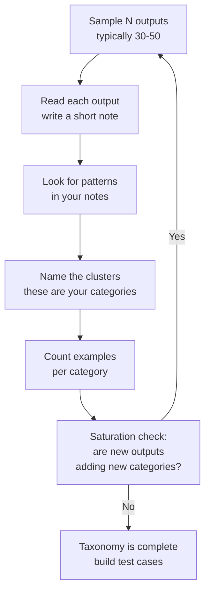

# Error Analysis First: Look at Your Data

> Read before you measure. You cannot write a good scorer for a failure mode you haven't named.

**Type:** Build
**Languages:** Python
**Prerequisites:** Lesson 05-01 (Why Evals Are the Job)
**Time:** ~60 min
**Learning Objectives:**
- Explain why running metrics before inspecting outputs leads to misleading results
- Apply open coding to a batch of LLM outputs to find failure clusters
- Build a CLI annotation tool to capture structured failure categories from raw outputs
- Construct a failure taxonomy from annotation data
- Translate failure categories into targeted test cases and scorer criteria

---

## MOTTO

Look at the data before you measure it. Metrics without inspection tell you a number. Inspection tells you what is actually wrong.

---

## THE PROBLEM

You've built a Q&A bot for an HR knowledge base. You run your eval harness and get a pass rate of 74%. What do you do?

Most engineers immediately reach for fixes: try a new prompt, try a bigger model, add more context. They're optimizing in the dark. The 26% failure rate is not one thing. It's probably four or five different things, each needing a different fix. A prompt change that fixes "wrong answer format" might make "incorrect facts" worse. A bigger model might fix "hallucination on edge cases" while doing nothing for "refuses to answer benefit questions."

You don't know what the 26% is until you read it.

This is Hamel Husain's core method, documented across years of production LLM work: the most valuable thing you can do before writing a single scorer is read 20-50 outputs and take notes. Not to find the "obvious" problems. To discover failure modes you didn't know existed. Every system has failure modes that emerge from the specific way users phrase things, the specific gaps in your knowledge base, the specific edge cases in your domain. No amount of benchmark intuition predicts them.

The process is called open coding. It comes from qualitative research. You read outputs without a predefined category system, write short notes as you go, then look for patterns in your notes. The patterns become your taxonomy. The taxonomy becomes your eval criteria.

---

## THE CONCEPT

### Why Metrics First Is Backwards

```
WRONG ORDER                         RIGHT ORDER
-----------                         -----------
1. Run metrics                      1. Sample outputs (read 30-50)
2. Get a number: 74% pass           2. Open coding: write notes per output
3. Wonder what to fix               3. Find clusters: 5-6 failure categories
4. Guess at root cause              4. Build taxonomy with examples
5. Make a change                    5. THEN define metrics per category
6. Run metrics again                6. Write targeted test cases
7. Number changed (but why?)        7. Make targeted changes
                                    8. Measure the right things
```

The problem with metrics first: you measure the wrong things. If you haven't read the outputs, you don't know what failure modes exist. You'll write scorers for the failure modes you imagined, not the ones you have.

### Open Coding: The Process



### A Failure Taxonomy Example

After reading 40 outputs from an HR Q&A system, you might find:

```
Category                  Count   Example
------------------------  -----   -----------------------------------------------
Unnecessary caveat        8       "I'm not a lawyer, but your PTO accrues at..."
Wrong benefit amount      5       "$500 FSA limit" (actual: $2,750)
Refused to answer         4       "I can't help with compensation questions"
Format mismatch           3       Returns bullet list when user asked for a number
Correct but incomplete    6       Answers the question but misses a critical step
Off-topic hallucination   2       Adds policy from a different company
Correct                   12      (not a failure, but count these too)
```

This taxonomy is now actionable. You know: half the failures are caveat and incompleteness issues (likely prompt-fixable). Wrong amounts are a retrieval problem. Refusals need a guardrails adjustment. Each category maps to a different fix and a different test case design.

### When to Stop: The Saturation Signal

You've read enough outputs when the last 10 you annotated didn't introduce any new categories. This is saturation: the taxonomy has stabilized. More reading adds examples but not new failure modes. In practice, this usually happens between 30 and 80 outputs for most systems. For highly diverse systems, it can take 100+.

---

## BUILD IT

The tool has three components: a sampler, an annotation CLI, and a frequency reporter.

### 1. Sample Outputs from a Log File

Logs are JSON lines (one JSON object per line):

```python
import json
import random

def sample_outputs(log_path: str, n: int = 30, seed: int = 42) -> list[dict]:
    """Sample N outputs from a JSON lines log file."""
    with open(log_path) as f:
        lines = [json.loads(line) for line in f if line.strip()]
    random.seed(seed)
    return random.sample(lines, min(n, len(lines)))
```

Each record has the shape: `{"input": "...", "output": "...", "metadata": {...}}`.

### 2. The Annotation CLI

The annotator shows each output and collects a failure category from the user:

```python
PREDEFINED_CATEGORIES = [
    "correct",
    "wrong_fact",
    "incomplete",
    "unnecessary_caveat",
    "refused",
    "format_mismatch",
    "hallucination",
    "off_topic",
    "other",
]

def annotate_outputs(outputs: list[dict]) -> list[dict]:
    """Interactive CLI for annotating outputs with failure categories."""
    annotations = []
    for i, item in enumerate(outputs):
        print(f"\n--- Case {i+1}/{len(outputs)} ---")
        print(f"INPUT:  {item['input']}")
        print(f"OUTPUT: {item['output']}")
        print(f"\nCategories: {', '.join(PREDEFINED_CATEGORIES)}")
        
        while True:
            category = input("Category (or type a new one): ").strip().lower()
            if category:
                break
        
        note = input("Note (optional, press Enter to skip): ").strip()
        
        annotations.append({
            "input": item["input"],
            "output": item["output"],
            "category": category,
            "note": note,
            "metadata": item.get("metadata", {}),
        })
    
    return annotations
```

### 3. Persist and Report

```python
def save_annotations(annotations: list[dict], path: str) -> None:
    with open(path, "w") as f:
        json.dump(annotations, f, indent=2)

def print_taxonomy(annotations: list[dict]) -> None:
    from collections import Counter
    counts = Counter(a["category"] for a in annotations)
    total = len(annotations)
    
    print(f"\nFailure Taxonomy ({total} cases annotated)")
    print(f"{'Category':<25} {'Count':<8} {'%':<8} {'Example (first)'}")
    print("-" * 80)
    for category, count in counts.most_common():
        example = next(a["input"] for a in annotations if a["category"] == category)
        print(f"{category:<25} {count:<8} {count/total*100:<8.1f} {example[:35]}")
```

Running this on the 20-case sample dataset in `code/main.py` produces output like:

```
Failure Taxonomy (20 cases annotated)
Category                  Count    %        Example (first)
--------------------------------------------------------------------------------
correct                   9        45.0     What is the PTO accrual rate?
unnecessary_caveat        4        20.0     Can I carry over unused PTO?
wrong_fact                3        15.0     What is the FSA contribution limit?
incomplete                2        10.0     How do I submit an expense report?
refused                   2        10.0     What is the CEO's salary?
```

The sample data is hardcoded in `code/main.py` so you can run it immediately without a live system. In production, you'd point `log_path` at your real output logs.

> **Real-world check:** You run the annotation tool on 50 outputs. 35 are fine, 15 have errors. You notice 8 of the 15 errors share the same pattern: the model gives a correct answer but adds unnecessary caveats. What do you do with this insight BEFORE touching the prompt?

You write three things: (1) a test case where caveated answers should fail, so you can measure the current failure rate precisely; (2) a note in the taxonomy explaining what "unnecessary caveat" means with 2-3 examples; (3) a hypothesis about why it happens (probably the system prompt over-emphasizes caution). Only then do you change the prompt. This way you know before and after, and you can verify the fix didn't break anything else.

---

## USE IT

### The Same Workflow in Braintrust

Braintrust's annotation UI replaces the CLI with a persistent, shareable interface. The workflow maps directly:

**Step 1: Log outputs to Braintrust as an experiment.**

```python
import braintrust

# Log each output you want to annotate
project = braintrust.init("hr-qa-system")

with project.start_experiment("error-analysis-run-1") as experiment:
    for item in outputs:
        experiment.log(
            input=item["input"],
            output=item["output"],
            metadata=item.get("metadata", {}),
        )
```

**Step 2: Annotate in the Braintrust UI.**

In the experiment view, click any row to open the full input/output. Use the "Human Review" column to add labels. You can define custom label sets matching your taxonomy categories. Multiple reviewers can annotate the same outputs simultaneously; Braintrust tracks who annotated what.

**Step 3: Export annotations for analysis.**

```python
from braintrust import load_dataset

# After annotation in the UI, export as a dataset
annotated = braintrust.list_experiments("hr-qa-system")
# Pull specific experiment results via the SDK or REST API
# Each row will have your human review labels attached
```

**Step 4: Compare approaches.**

| Approach | When to use |
|---|---|
| CLI annotation tool | Quick first pass, no infrastructure, local files |
| Braintrust UI | Team review, multiple annotators, persistent history |
| Braintrust + custom scores | When you want to track taxonomy drift over time |

The CLI tool is the right starting point: it forces you to read every output and makes the taxonomy explicit. Move to Braintrust when you need to share annotations across a team or track how the failure distribution changes as you iterate.

> **Perspective shift:** Your manager asks why you spent 3 hours reading model outputs instead of "just running the eval metrics." How do you explain that this IS the eval work?

The eval metrics are only as good as the criteria they measure. If you don't know what failure modes exist, you'll measure the wrong things. Reading outputs is how you discover what to measure. Three hours of output reading typically surfaces 5-6 failure categories that no one on the team predicted. Each one becomes a test case. Without that reading, you'd have metrics that tell you 74% pass and no idea why 26% fail.

---

## SHIP IT

The artifact this lesson produces is a reusable guide for running structured error analysis on any LLM system. See `outputs/skill-error-analysis.md`.

The guide covers the full process: sampling outputs, open coding, building a taxonomy, saturation check, inter-rater agreement, and translating the taxonomy into test cases. It's designed to be shared with a new team member or used as a checklist before starting any eval project.

---

## EVALUATE IT

How do you know your error analysis is thorough enough to build on?

**Saturation check.** If the last 10 outputs you annotated added zero new categories to your taxonomy, you've reached saturation. If you're still finding new categories after 80 outputs, your dataset is more diverse than typical, or the system has unusually varied failure modes.

**Inter-rater agreement.** Have two people independently annotate the same 20 cases. Compute the percentage of cases where they assign the same category. A reasonable target is 70-80% agreement. Below 60% means your taxonomy categories are too vague: tighten the definitions and add examples. You can compute Cohen's kappa if you want a more rigorous measure.

**Coverage check.** Every category in your taxonomy should have at least 3 concrete examples from your dataset. A category with only 1 example might be noise or an anomaly, not a systematic failure mode. Categories with 10+ examples are your highest-priority targets.

**Actionability check.** For every category, can you write a concrete test case that would catch it automatically? If you can't, the category definition is too vague. "Model seems confused" is not a usable category. "Model gives correct answer for X but adds a disclaimer saying it might be wrong" is.
