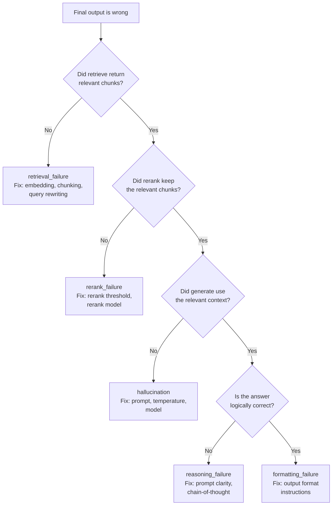

# مراجعة الأثر (Trace Review) وتصنيف الفشل

> تحليل الأخطاء يخبرك أن الإجابة النهائية كانت خاطئة. أما مراجعة الأثر فتخبرك أي خطوة جعلتها خاطئة.

**النوع:** Build
**اللغات:** Python
**المتطلبات:** الدرس 05-01 (لماذا التقييمات هي صُلب العمل)، الدرس 05-02 (تحليل الأخطاء أولاً)
**الوقت:** ~60 دقيقة
**أهداف التعلّم:**
- شرح لماذا يُفوِّت تحليل المخرج النهائي السبب الجذري في الأنظمة متعددة الخطوات
- بناء مُزخرِف (decorator) لتسجيل الأثر يلتقط كل خطوة في خط المعالجة (pipeline)
- استخدام عارض أثر (trace viewer) عبر سطر الأوامر لفرز حالات الفشل إلى خطوة محددة
- بناء تصنيف فشل قياسي للأنظمة متعددة الخطوات
- تجهيز خط معالجة بأدوات الرصد وفق اصطلاحات OpenTelemetry GenAI لقابلية المراقبة (observability) الإنتاجية

---

## MOTTO

الأثر (trace) هو وحدة التنقيح (debugging) للأنظمة الذكية. إن لم تستطع قراءة كل خطوة، فلن تستطيع إصلاح الشيء الصحيح.

---

## THE PROBLEM

يعطي بوت الدعم المبني على RAG إجابة خاطئة. يخبرك تحليل الأخطاء (الدرس 02): المخرج النهائي غير صحيح. لكن لماذا؟ هناك ما لا يقل عن أربعة أسباب جذرية متمايزة:

- خطوة الاسترجاع (retrieval) أعادت مقاطع (chunks) غير ذات صلة (فشل استرجاع)
- المقاطع استُرجِعت لكن المُعيد ترتيب (reranker) أسقط المقطع ذا الصلة (فشل إعادة ترتيب)
- المقاطع كانت جيدة لكن الـ LLM تجاهلها وهلوس (فشل توليد)
- الـ LLM قرأ المقاطع بشكل صحيح لكنه صاغ الإجابة بشكل خاطئ (فشل تنسيق)

كل سبب جذري يحتاج إصلاحاً مختلفاً. فشل الاسترجاع: أصلِح نموذج التضمين (embedding) أو التقطيع (chunking). فشل إعادة الترتيب: أصلِح عتبة (threshold) إعادة الترتيب. فشل التوليد: غيِّر الـ prompt أو النموذج. فشل التنسيق: أضِف تعليمات لصيغة المخرج.

إن نظرت إلى المخرج النهائي وحده، فستخمّن السبب الجذري. قد تُغيِّر الـ prompt بينما المشكلة الفعلية في التقطيع. ستُهدر أسبوعاً وتحتار حين لا يتحسّن المقياس.

الأثر هو سجلّ التدقيق لديك. إنه يُسجِّل ما حدث في كل خطوة: ماذا دخل، وماذا خرج، وكم استغرق، وهل أخطأ. قراءة الآثار هي كيف تنتقل من "الإجابة كانت خاطئة" إلى "خطوة الاسترجاع أعادت مقاطع عن المنتج الخطأ لأن الاستعلام كان مُلتبِساً".

---

## THE CONCEPT

### تشريح الأثر

يلتقط الأثر تنفيذاً واحداً كاملاً لخط معالجة متعدد الخطوات من المدخل إلى المخرج.

```
┌────────────────────────────────────────────────────────────────┐
│  TRACE: trace_id = "abc-123"                                    │
│  Input: "What is the return policy for digital downloads?"      │
│                                                                 │
│  Step 1: retrieve                                               │
│    Input:  {query: "return policy digital downloads"}           │
│    Output: [chunk_1: "return policy for physical goods...",     │
│             chunk_2: "digital content is non-refundable...",    │
│             chunk_3: "contact support for refund requests..."]  │
│    Latency: 120ms  Error: null                                  │
│                                                                 │
│  Step 2: rerank                                                 │
│    Input:  [chunk_1, chunk_2, chunk_3]                          │
│    Output: [chunk_2, chunk_1]  (chunk_3 dropped below threshold)│
│    Latency: 45ms   Error: null                                  │
│                                                                 │
│  Step 3: generate                                               │
│    Input:  {context: [chunk_2, chunk_1], query: "..."}          │
│    Output: "Digital downloads cannot be refunded."              │
│    Latency: 890ms  Error: null                                  │
│                                                                 │
│  Total latency: 1055ms                                          │
│  Failure: false                                                 │
└────────────────────────────────────────────────────────────────┘
```

في هذا الأثر، كل شيء نجح. المقطع الصحيح (chunk_2) استُرجِع، وأبقاه المُعيد ترتيب، وأعطى النموذج الإجابة الصحيحة.

### تصنيف الفشل القياسي للأنظمة متعددة الخطوات

```
Failure type          What went wrong                     Where to look
--------------------  ----------------------------------  ------------------
retrieval_failure     Wrong or no relevant chunks found   retrieve step output
rerank_failure        Good chunk retrieved but dropped    rerank step output
reasoning_failure     Correct context, wrong conclusion   generate step
formatting_failure    Correct answer, wrong format        generate step output
hallucination         Model ignores context, invents      generate step
refusal               Model declines to answer            generate step output
tool_failure          Tool call errored or timed out      tool step error field
```

### الفرز: أي خطوة سبّبت الفشل النهائي؟



اعمل رجوعاً من المخرج النهائي. إن كان المخرج خاطئاً، افحص خطوة التوليد (generate). إن كان مدخل التوليد (السياق) جيداً، فالمشكلة في التوليد. وإن كان السياق سيئاً، افحص إعادة الترتيب (rerank). إن كان مدخل إعادة الترتيب جيداً، فالمشكلة في إعادة الترتيب. وإن كان المدخل إلى إعادة الترتيب سيئاً، فالمشكلة في الاسترجاع (retrieve).

---

## BUILD IT

### 1. مُزخرِف الأثر (Trace Decorator)

مُزخرِف يلفّ أي دالة ويُسجِّل: المدخلات، والمخرجات، والكُمون (latency)، والاستثناءات.

```python
import time
import functools
import traceback

def trace_step(store: "TraceStore", step_name: str):
    """Decorator that logs a function call as a trace step."""
    def decorator(fn):
        @functools.wraps(fn)
        def wrapper(*args, **kwargs):
            start = time.monotonic()
            error = None
            output = None
            try:
                output = fn(*args, **kwargs)
            except Exception as e:
                error = {"type": type(e).__name__, "message": str(e)}
                raise
            finally:
                latency_ms = int((time.monotonic() - start) * 1000)
                store.add_step(
                    name=step_name,
                    input={"args": str(args), "kwargs": str(kwargs)},
                    output=output,
                    latency_ms=latency_ms,
                    error=error,
                )
            return output
        return wrapper
    return decorator
```

### 2. مخزن الأثر (TraceStore)

يجمع الخطوات للأثر الحالي ويكتب إلى ملف JSON lines.

```python
import uuid
import json
from datetime import datetime, timezone

class TraceStore:
    def __init__(self, output_path: str = "traces.jsonl"):
        self.output_path = output_path
        self._current_trace_id: str | None = None
        self._steps: list[dict] = []
        self._start_time: float | None = None

    def start_trace(self, input_data: dict) -> str:
        self._current_trace_id = str(uuid.uuid4())[:8]
        self._steps = []
        self._start_time = time.monotonic()
        self._input = input_data
        return self._current_trace_id

    def add_step(self, name: str, input: dict, output, latency_ms: int, error: dict | None) -> None:
        self._steps.append({
            "name": name,
            "input": input,
            "output": str(output)[:500] if output is not None else None,
            "latency_ms": latency_ms,
            "error": error,
        })

    def end_trace(self, output, failure: bool = False, failure_step: str | None = None) -> dict:
        total_ms = int((time.monotonic() - self._start_time) * 1000)
        trace = {
            "trace_id": self._current_trace_id,
            "timestamp": datetime.now(timezone.utc).isoformat(),
            "input": self._input,
            "steps": self._steps,
            "output": str(output)[:500] if output is not None else None,
            "total_latency_ms": total_ms,
            "failure": failure,
            "failure_step": failure_step,
        }
        with open(self.output_path, "a") as f:
            f.write(json.dumps(trace) + "\n")
        return trace
```

### 3. عارض الأثر عبر سطر الأوامر

```python
def view_traces(traces_path: str, filter_failures: bool = False) -> None:
    with open(traces_path) as f:
        traces = [json.loads(line) for line in f if line.strip()]
    
    if filter_failures:
        traces = [t for t in traces if t["failure"]]
    
    for t in traces:
        flag = "[FAIL]" if t["failure"] else "[PASS]"
        print(f"{flag} {t['trace_id']} | {t['total_latency_ms']}ms | {t['input']}")
        for step in t["steps"]:
            err = f" ERROR: {step['error']}" if step["error"] else ""
            print(f"    {step['name']:<12} {step['latency_ms']}ms{err}")
```

تشغيل هذا على خط معالجة من 3 خطوات (retrieve، rerank، generate) مع 5 استعلامات اختبار:

```
[PASS] a1b2c3d4 | 1055ms | {'query': 'What is the return policy?'}
    retrieve     120ms
    rerank       45ms
    generate     890ms
[FAIL] e5f6a7b8 | 980ms | {'query': 'Can I get a refund on my order?'}
    retrieve     95ms
    rerank       42ms
    generate     843ms   ERROR: None
[PASS] c9d0e1f2 | 1120ms | {'query': 'How long does shipping take?'}
    retrieve     130ms
    rerank       50ms
    generate     940ms
```

الأثر الثاني مُعلَّم كفشل (مخرج خاطئ) رغم أن أي خطوة لم تُخطئ. الخطأ في استدلال خطوة التوليد، لا في الكود.

> **اختبار من الواقع:** يُبلِّغ مستخدم بأن "الإجابة كانت خاطئة". تستدعي أثره. خطوة الاسترجاع أعادت 5 مقاطع، كلها ذات صلة. خطوة إعادة الترتيب أبقت 3. خطوة التوليد أنتجت إجابة واثقة لكنها غير صحيحة. أين الفشل؟ وماذا يخبرك هذا عمّا يجب إصلاحه؟

الفشل في خطوة التوليد: reasoning_failure أو hallucination. السياق (المقاطع المُسترجَعة والمُعاد ترتيبها) كان صحيحاً. لكن النموذج لم يستخدمه بشكل صحيح. هذه مشكلة prompt أو مشكلة اختيار نموذج، لا مشكلة استرجاع. لو غيّرت التقطيع أو نموذج التضمين، لكنت أهدرت أسبوعاً على الطبقة الخطأ.

---

## USE IT

### خط المعالجة نفسه مع اصطلاحات OpenTelemetry GenAI

تمنحك اصطلاحات OpenTelemetry الدلالية لـ GenAI (`gen_ai.*`) مخططاً (schema) قياسياً لآثار الـ LLM يعمل عبر الأدوات: Langfuse، وArize Phoenix، وأي خلفية (backend) متوافقة مع OTel.

التثبيت: `pip install opentelemetry-sdk opentelemetry-exporter-otlp langfuse`

```python
from opentelemetry import trace
from opentelemetry.sdk.trace import TracerProvider
from opentelemetry.sdk.trace.export import BatchSpanProcessor
from opentelemetry.exporter.otlp.proto.http.trace_exporter import OTLPSpanExporter

# Set up the tracer
provider = TracerProvider()
provider.add_span_processor(BatchSpanProcessor(OTLPSpanExporter()))
trace.set_tracer_provider(provider)
tracer = trace.get_tracer("hr-qa-system")

# Instrument the pipeline
def retrieve_with_otel(query: str) -> list[str]:
    with tracer.start_as_current_span("retrieve") as span:
        span.set_attribute("gen_ai.operation.name", "retrieve")
        span.set_attribute("gen_ai.system", "pgvector")
        span.set_attribute("gen_ai.request.model", "text-embedding-3-small")
        chunks = retrieve(query)  # your actual retrieval function
        span.set_attribute("gen_ai.response.chunk_count", len(chunks))
        return chunks

def generate_with_otel(query: str, context: list[str]) -> str:
    with tracer.start_as_current_span("generate") as span:
        span.set_attribute("gen_ai.operation.name", "chat")
        span.set_attribute("gen_ai.system", "anthropic")
        span.set_attribute("gen_ai.request.model", "claude-opus-4-5")
        response = generate(query, context)  # your actual generation function
        # gen_ai conventions for token counts:
        span.set_attribute("gen_ai.usage.input_tokens", response.usage.input_tokens)
        span.set_attribute("gen_ai.usage.output_tokens", response.usage.output_tokens)
        return response.content[0].text
```

في Langfuse، يصبح كل span عقدة (node) في شجرة الأثر. تستطيع رؤية علاقات الأب-الابن (retrieve ابن للأثر الجذر، وgenerate شقيق له)، والكُمون لكل خطوة، وتكاليف الرموز (tokens) لكل استدعاء توليد.

**ما الذي ستراه في واجهة Langfuse:**

- عرض شلّالي (waterfall): الـ span الجذر، ثم retrieve وrerank وgenerate كأبناء
- أشرطة كُمون لكل خطوة تُظهِر أين يُنفَق الوقت
- المدخل/المخرج عند كل خطوة (قابل للتوسيع)
- التكلفة الإجمالية لاستدعاء التوليد (رموز المدخل + المخرج)
- علامة "failure" يمكنك ضبطها يدوياً بعد مراجعة الأثر

```python
# Langfuse also has a native Python SDK for simpler instrumentation
from langfuse.decorators import observe, langfuse_context

@observe(name="retrieve")
def retrieve(query: str) -> list[str]:
    # your retrieval logic
    ...

@observe(name="generate")
def generate(query: str, context: list[str]) -> str:
    langfuse_context.update_current_observation(
        model="claude-opus-4-5",
        input={"query": query, "context_length": len(context)},
    )
    # your generation logic
    ...
```

**المُتتبِّع اليدوي مقابل OTel: متى يصلح كلٌّ منهما؟**

| Approach | When to use |
|---|---|
| Manual TraceStore | Prototyping, small scripts, no external dependencies |
| Langfuse native SDK | Production, when you want a managed UI out of the box |
| OTel + Langfuse exporter | Multi-service systems, when you also trace non-AI infrastructure |

المُتتبِّع اليدوي يُعلِّمك البنية. وOTel يمنحك المنظومة (ecosystem).

> **نقلة في المنظور:** يقول زميل في الفريق: "يمكننا فقط تسجيل الـ prompt والاستجابة النهائيين، لا نحتاج إلى آثار كاملة." أي أوضاع فشل ستفوّتها بهذه المقاربة؟

ستفوّت: حالات فشل الاسترجاع (مقاطع خاطئة جُلِبت قبل تجميع الـ prompt)، وحالات فشل إعادة الترتيب (المقطع الصحيح استُرجِع ثم أُسقِط)، وأخطاء الأدوات (tool call أعاد خطأً عالجه النموذج بصمت)، وعزو الكُمون (لا تستطيع معرفة هل البطء في الاسترجاع أم في التوليد). يبدو الـ prompt والاستجابة النهائيان متطابقَين سواء أكانت المقاطع جيدة أم سيئة؛ أنت ترى العَرَض فقط، لا السبب.

---

## SHIP IT

الأثر (artifact) الذي يُنتجه هذا الدرس هو دليل قابل لإعادة الاستخدام لإجراء مراجعات أثر منهجية على أي نظام ذكي متعدد الخطوات. راجع `outputs/skill-trace-review.md`.

يتضمّن الدليل مخطط الأثر القياسي، ومخطط الفرز (triage flowchart) لعزو حالات الفشل إلى الخطوات، وتصنيف الفشل القياسي، وقالباً فارغاً لتكييف التصنيف مع نظامك المحدد.

---

## EVALUATE IT

كيف تعرف أن عملية مراجعة الأثر لديك تُنتج نتائج قابلة للتنفيذ؟

**ينبغي أن يكون لكل وضع فشل في التصنيف:** اسم، و2–3 معرّفات أثر (trace IDs) أمثلة، وسبب جذري محتمل (جملة واحدة)، وإصلاح مقترح (جملة واحدة). إن لم تستطع كتابة السبب المحتمل والإصلاح المقترح، فوضع الفشل غير مفهوم بعد.

**فحص التغطية:** بعد مراجعة 30–50 أثراً، هل تستطيع تفسير 80٪+ من حالات الفشل باستخدام فئات تصنيفك؟ إن لم تستطع، فلديك أوضاع فشل غير مُسمّاة لا تزال مختبئة. ارجع وعلِّق على الحالات غير المفسَّرة.

**فحص القابلية للتنفيذ:** هل تستطيع، لكل فئة في التصنيف، أن تكتب اختباراً آلياً محسوساً يلتقطها؟ "Retrieval failure" يصبح: تأكَّد من أن المقطع الأعلى المُسترجَع له تشابه جيبي (cosine similarity) > 0.75 مع الاستعلام. "Hallucination" يصبح: تأكَّد من أن إجابة النموذج مُؤسَّسة (grounded) على المقاطع المُسترجَعة (يتطلب حَكَم LLM). إن لم تستطع كتابة الاختبار، فالفئة لا تزال مبهمة جداً.

**إشارة الكُمون:** تكشف الآثار أيضاً مشكلات الأداء. إن كان كُمون p95 لديك 4 ثوانٍ، وتُسهِم خطوة التوليد بـ 3.8 منها، فأنت تعرف أين تُحسِّن (نموذج أصغر، تخزين مؤقت (caching)، بثّ (streaming)). وإن كان الاسترجاع بطيئاً، افحص فهرس المتجهات (vector index).
