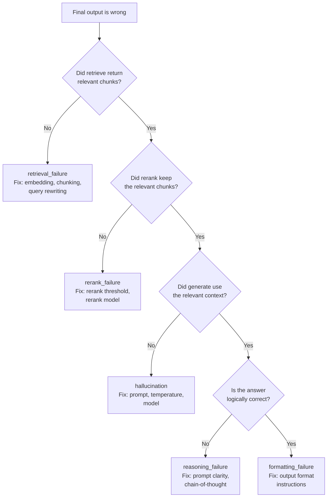

# Trace Review and Failure Taxonomy

> Error analysis tells you the final answer was wrong. Trace review tells you which step made it wrong.

**Type:** Build
**Languages:** Python
**Prerequisites:** Lesson 05-01 (Why Evals Are the Job), Lesson 05-02 (Error Analysis First)
**Time:** ~60 min
**Learning Objectives:**
- Explain why final-output analysis misses the root cause for multi-step AI systems
- Build a trace logging decorator that captures every step of a pipeline
- Use a CLI trace viewer to triage failures to a specific step
- Build a standard failure taxonomy for multi-step AI systems
- Instrument a pipeline with OpenTelemetry GenAI conventions for production observability

---

## MOTTO

The trace is the unit of debugging for AI systems. If you can't read every step, you can't fix the right thing.

---

## THE PROBLEM

Your RAG-based support bot gives a wrong answer. Error analysis (Lesson 02) tells you: the final output is incorrect. But why? There are at least four distinct root causes:

- The retrieval step returned irrelevant chunks (retrieval failure)
- The chunks were retrieved but the reranker dropped the relevant one (rerank failure)
- The chunks were good but the LLM ignored them and hallucinated (generation failure)
- The LLM read the chunks correctly but formatted the answer wrong (formatting failure)

Each root cause needs a different fix. Retrieval failure: fix your embedding model or chunking. Rerank failure: fix your rerank threshold. Generation failure: change the prompt or model. Formatting failure: add output format instructions.

If you only look at the final output, you'll guess the root cause. You might change the prompt when the actual problem is chunking. You'll waste a week and be confused when the metric doesn't improve.

The trace is your audit trail. It records what happened at every step: what went in, what came out, how long it took, whether it errored. Reading traces is how you move from "the answer was wrong" to "the retrieval step returned chunks about the wrong product because the query was ambiguous."

---

## THE CONCEPT

### The Anatomy of a Trace

A trace captures one complete execution of a multi-step pipeline from input to output.

```
┌────────────────────────────────────────────────────────────────┐
│  TRACE: trace_id = "abc-123"                                    │
│  Input: "What is the return policy for digital downloads?"      │
│                                                                 │
│  Step 1: retrieve                                               │
│    Input:  {query: "return policy digital downloads"}           │
│    Output: [chunk_1: "return policy for physical goods...",     │
│             chunk_2: "digital content is non-refundable...",    │
│             chunk_3: "contact support for refund requests..."]  │
│    Latency: 120ms  Error: null                                  │
│                                                                 │
│  Step 2: rerank                                                 │
│    Input:  [chunk_1, chunk_2, chunk_3]                          │
│    Output: [chunk_2, chunk_1]  (chunk_3 dropped below threshold)│
│    Latency: 45ms   Error: null                                  │
│                                                                 │
│  Step 3: generate                                               │
│    Input:  {context: [chunk_2, chunk_1], query: "..."}          │
│    Output: "Digital downloads cannot be refunded."              │
│    Latency: 890ms  Error: null                                  │
│                                                                 │
│  Total latency: 1055ms                                          │
│  Failure: false                                                 │
└────────────────────────────────────────────────────────────────┘
```

In this trace, everything worked. The correct chunk (chunk_2) was retrieved, kept by the reranker, and the model gave the right answer.

### The Standard Failure Taxonomy for Multi-Step Systems

```
Failure type          What went wrong                     Where to look
--------------------  ----------------------------------  ------------------
retrieval_failure     Wrong or no relevant chunks found   retrieve step output
rerank_failure        Good chunk retrieved but dropped    rerank step output
reasoning_failure     Correct context, wrong conclusion   generate step
formatting_failure    Correct answer, wrong format        generate step output
hallucination         Model ignores context, invents      generate step
refusal               Model declines to answer            generate step output
tool_failure          Tool call errored or timed out      tool step error field
```

### Triage: Which Step Caused the Final Failure?



Work backward from the final output. If the output is wrong, check generate. If generate's input (the context) was good, the problem is in generate. If the context was bad, check rerank. If rerank's input was good, the problem is in rerank. If the input to rerank was bad, the problem is in retrieve.

---

## BUILD IT

### 1. The Trace Decorator

A decorator that wraps any function and logs: inputs, outputs, latency, and exceptions.

```python
import time
import functools
import traceback

def trace_step(store: "TraceStore", step_name: str):
    """Decorator that logs a function call as a trace step."""
    def decorator(fn):
        @functools.wraps(fn)
        def wrapper(*args, **kwargs):
            start = time.monotonic()
            error = None
            output = None
            try:
                output = fn(*args, **kwargs)
            except Exception as e:
                error = {"type": type(e).__name__, "message": str(e)}
                raise
            finally:
                latency_ms = int((time.monotonic() - start) * 1000)
                store.add_step(
                    name=step_name,
                    input={"args": str(args), "kwargs": str(kwargs)},
                    output=output,
                    latency_ms=latency_ms,
                    error=error,
                )
            return output
        return wrapper
    return decorator
```

### 2. The TraceStore

Accumulates steps for the current trace and writes to a JSON lines file.

```python
import uuid
import json
from datetime import datetime, timezone

class TraceStore:
    def __init__(self, output_path: str = "traces.jsonl"):
        self.output_path = output_path
        self._current_trace_id: str | None = None
        self._steps: list[dict] = []
        self._start_time: float | None = None

    def start_trace(self, input_data: dict) -> str:
        self._current_trace_id = str(uuid.uuid4())[:8]
        self._steps = []
        self._start_time = time.monotonic()
        self._input = input_data
        return self._current_trace_id

    def add_step(self, name: str, input: dict, output, latency_ms: int, error: dict | None) -> None:
        self._steps.append({
            "name": name,
            "input": input,
            "output": str(output)[:500] if output is not None else None,
            "latency_ms": latency_ms,
            "error": error,
        })

    def end_trace(self, output, failure: bool = False, failure_step: str | None = None) -> dict:
        total_ms = int((time.monotonic() - self._start_time) * 1000)
        trace = {
            "trace_id": self._current_trace_id,
            "timestamp": datetime.now(timezone.utc).isoformat(),
            "input": self._input,
            "steps": self._steps,
            "output": str(output)[:500] if output is not None else None,
            "total_latency_ms": total_ms,
            "failure": failure,
            "failure_step": failure_step,
        }
        with open(self.output_path, "a") as f:
            f.write(json.dumps(trace) + "\n")
        return trace
```

### 3. The CLI Trace Viewer

```python
def view_traces(traces_path: str, filter_failures: bool = False) -> None:
    with open(traces_path) as f:
        traces = [json.loads(line) for line in f if line.strip()]
    
    if filter_failures:
        traces = [t for t in traces if t["failure"]]
    
    for t in traces:
        flag = "[FAIL]" if t["failure"] else "[PASS]"
        print(f"{flag} {t['trace_id']} | {t['total_latency_ms']}ms | {t['input']}")
        for step in t["steps"]:
            err = f" ERROR: {step['error']}" if step["error"] else ""
            print(f"    {step['name']:<12} {step['latency_ms']}ms{err}")
```

Running this on a 3-step pipeline (retrieve, rerank, generate) with 5 test queries:

```
[PASS] a1b2c3d4 | 1055ms | {'query': 'What is the return policy?'}
    retrieve     120ms
    rerank       45ms
    generate     890ms
[FAIL] e5f6a7b8 | 980ms | {'query': 'Can I get a refund on my order?'}
    retrieve     95ms
    rerank       42ms
    generate     843ms   ERROR: None
[PASS] c9d0e1f2 | 1120ms | {'query': 'How long does shipping take?'}
    retrieve     130ms
    rerank       50ms
    generate     940ms
```

The second trace is marked as a failure (wrong output) even though no step errored. The error is in the generate step's reasoning, not in the code.

> **Real-world check:** A user reports "the answer was wrong." You pull up their trace. The retrieval step returned 5 chunks, all relevant. The rerank step kept 3. The generate step produced a confident but incorrect answer. Where is the failure, and what does this tell you about what to fix?

The failure is in the generate step: reasoning_failure or hallucination. The context (retrieved and reranked chunks) was correct. The model didn't use it correctly. This is a prompt problem or a model selection problem, not a retrieval problem. If you had changed the chunking or embedding model, you'd have wasted a week on the wrong layer.

---

## USE IT

### The Same Pipeline with OpenTelemetry GenAI Conventions

OpenTelemetry's GenAI semantic conventions (`gen_ai.*`) give you a standard schema for LLM traces that works across tools: Langfuse, Arize Phoenix, and any OTel-compatible backend.

Install: `pip install opentelemetry-sdk opentelemetry-exporter-otlp langfuse`

```python
from opentelemetry import trace
from opentelemetry.sdk.trace import TracerProvider
from opentelemetry.sdk.trace.export import BatchSpanProcessor
from opentelemetry.exporter.otlp.proto.http.trace_exporter import OTLPSpanExporter

# Set up the tracer
provider = TracerProvider()
provider.add_span_processor(BatchSpanProcessor(OTLPSpanExporter()))
trace.set_tracer_provider(provider)
tracer = trace.get_tracer("hr-qa-system")

# Instrument the pipeline
def retrieve_with_otel(query: str) -> list[str]:
    with tracer.start_as_current_span("retrieve") as span:
        span.set_attribute("gen_ai.operation.name", "retrieve")
        span.set_attribute("gen_ai.system", "pgvector")
        span.set_attribute("gen_ai.request.model", "text-embedding-3-small")
        chunks = retrieve(query)  # your actual retrieval function
        span.set_attribute("gen_ai.response.chunk_count", len(chunks))
        return chunks

def generate_with_otel(query: str, context: list[str]) -> str:
    with tracer.start_as_current_span("generate") as span:
        span.set_attribute("gen_ai.operation.name", "chat")
        span.set_attribute("gen_ai.system", "anthropic")
        span.set_attribute("gen_ai.request.model", "claude-opus-4-5")
        response = generate(query, context)  # your actual generation function
        # gen_ai conventions for token counts:
        span.set_attribute("gen_ai.usage.input_tokens", response.usage.input_tokens)
        span.set_attribute("gen_ai.usage.output_tokens", response.usage.output_tokens)
        return response.content[0].text
```

In Langfuse, each span becomes a node in a trace tree. You can see the parent-child relationships (retrieve is a child of the root trace, generate is a sibling), latencies per step, and token costs per generation call.

**What you'd see in the Langfuse UI:**

- A waterfall view: root span, then retrieve, rerank, generate as children
- Per-step latency bars showing where time is spent
- Input/output at each step (expandable)
- Total cost for the generation call (input + output tokens)
- A "failure" flag you can set manually after trace review

```python
# Langfuse also has a native Python SDK for simpler instrumentation
from langfuse.decorators import observe, langfuse_context

@observe(name="retrieve")
def retrieve(query: str) -> list[str]:
    # your retrieval logic
    ...

@observe(name="generate")
def generate(query: str, context: list[str]) -> str:
    langfuse_context.update_current_observation(
        model="claude-opus-4-5",
        input={"query": query, "context_length": len(context)},
    )
    # your generation logic
    ...
```

**Manual tracer vs OTel: when does each make sense?**

| Approach | When to use |
|---|---|
| Manual TraceStore | Prototyping, small scripts, no external dependencies |
| Langfuse native SDK | Production, when you want a managed UI out of the box |
| OTel + Langfuse exporter | Multi-service systems, when you also trace non-AI infrastructure |

The manual tracer teaches you the structure. OTel gives you the ecosystem.

> **Perspective shift:** A teammate says "we can just log the final prompt and response, we don't need full traces." What failure modes would you miss with that approach?

You'd miss: retrieval failures (wrong chunks fetched before the prompt was assembled), rerank failures (the right chunk was retrieved but then dropped), tool errors (a tool call returned an error that the model handled silently), and latency attribution (you can't tell if slowness is in retrieval or generation). The final prompt and response looks identical whether chunks were good or bad; you only see the symptom, not the cause.

---

## SHIP IT

The artifact this lesson produces is a reusable guide for conducting systematic trace reviews on any multi-step AI system. See `outputs/skill-trace-review.md`.

The guide includes the standard trace schema, the triage flowchart for attributing failures to steps, the standard failure taxonomy, and a blank template for adapting the taxonomy to your specific system.

---

## EVALUATE IT

How do you know your trace review process is producing actionable results?

**Each failure in the taxonomy should have:** a name, 2-3 example trace IDs, a probable root cause (one sentence), and a proposed fix (one sentence). If you can't write the probable cause and proposed fix, the failure mode isn't understood yet.

**Coverage check:** After reviewing 30-50 traces, can you explain 80%+ of the failures using your taxonomy categories? If not, you have unnamed failure modes still hiding. Go back and annotate the unexplained cases.

**Actionability check:** For each taxonomy category, can you write a concrete automated test that would catch it? "Retrieval failure" becomes: assert the top retrieved chunk has cosine similarity > 0.75 with the query. "Hallucination" becomes: assert the model's answer is grounded in the retrieved chunks (requires an LLM judge). If you can't write the test, the category is still too vague.

**Latency signal:** Traces also reveal performance problems. If your p95 latency is 4 seconds and the generate step accounts for 3.8 of them, you know where to optimize (smaller model, caching, streaming). If retrieve is slow, check your vector index.
