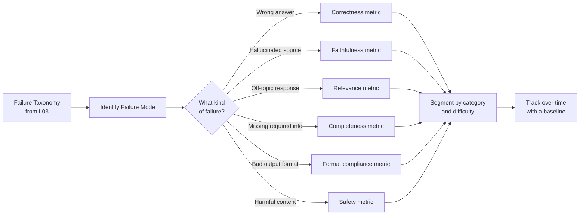

**النوع:** Learn
**اللغات:** Python
**المتطلبات:** 05-04 (بناء golden set)
**الوقت:** ~45 دقيقة
**أهداف التعلّم:**
- التمييز بين مقاييس الغرور (vanity metrics) والمقاييس التي تقود إلى فعل
- بناء مكتبة لحساب المقاييس تغطّي الصحة (correctness)، والمطابقة التقريبية (fuzzy match)، والامتثال للصيغة (format compliance)
- تقسيم المقاييس (segment) والتبليغ عنها بطريقة تجعل الانحدارات مرئية

---

## MOTTO

قِس وضع الفشل، لا المخرج.

---

## THE PROBLEM

يُسلِّم فريقك prompt جديداً ويحتفل: "متوسط الدرجة ارتفع من 4.1 إلى 4.3!" بعد أسبوعين تنتهي مكالمة مبيعات نهايةً سيئة لأن المنتج أعطى إجابة خاطئة عن سؤال فوترة. تنبش في الدرجات فتجد أن أسئلة الفوترة لم تُفرَز قط على حدة. كان التحسّن في أسئلة الأسئلة الشائعة (FAQ) السهلة. أما الصعبة فازدادت سوءاً، وأخفى المتوسط العام ذلك.

هذا هو فخّ مقياس الغرور (vanity metric). إنه سهل القياس: احسب درجة واحدة عبر كل الحالات، وراقب الرقم يصعد. يبدو كأنه تقدّم. لكن المقياس الذي لا تستطيع التصرّف بناءً عليه عند تغيّره ليس مقياس تقييم. إنه لوحة نتائج (scoreboard).

الحل ليس مزيداً من المقاييس. بل المقاييس الصحيحة، مُقسَّمة بشكل صحيح، مربوطة بأوضاع الفشل التي حدّدتها أصلاً في تصنيفك.

---

## THE CONCEPT

المقياس يهمّ إذا — وفقط إذا — استطعت إكمال هذه الجملة: "إن انخفض هذا المقياس دون X، أعرف أن عليّ التحقيق في Y."



**الغرور مقابل القابل للتنفيذ:**

```
VANITY METRIC                   ACTIONABLE METRIC
------------------------------  ----------------------------------------
"Average score: 4.2/5"          "Faithfulness on financial docs: 0.91
                                  (down from 0.95 last week)"
"Accuracy: 82%"                 "Hard-case accuracy: 61%
                                  (below 70% threshold, investigate)"
"Thumbs up rate: 73%"           "Thumbs up on billing category: 48%
                                  (below 60% baseline, billing team alerted)"
```

**تصنيف المقاييس للأنظمة الذكية:**

| Metric | What it measures | Best for |
|---|---|---|
| Exact match | Output exactly equals expected | Classification, extraction |
| Fuzzy match | Semantic/string similarity | Short-form Q&A |
| Format compliance | Required keys/structure present | JSON/structured output |
| Faithfulness | Answer grounded in source | RAG systems |
| Relevance | Answer addresses the question | All systems |
| Completeness | All required parts present | Multi-part answers |
| Safety | No harmful content | Any customer-facing system |

اختَر 3–4 مقاييس على الأكثر لكل نظام. الأكثر ليس أفضل. مقاييس أقل، مُقسَّمة جيداً، تتفوّق على مقاييس كثيرة مُجمَّعة بشكل سيئ.

**كيف تختار:** ابدأ من تصنيف الفشل لديك. لكل فئة فشل في تصنيفك، حدِّد أي مقياس سيلتقطها. إن لم تستطع تسمية المقياس، فلا تملك المقياس الصحيح بعد.

---

## BUILD IT

### الخطوة 1: دوال المقاييس الأساسية

```python
# code/main.py
import difflib
import json
import statistics
from typing import Callable

def exact_match(expected: str, actual: str) -> float:
    """1.0 if strings match exactly (case-insensitive, stripped), 0.0 otherwise."""
    return 1.0 if expected.strip().lower() == actual.strip().lower() else 0.0


def fuzzy_match(expected: str, actual: str) -> float:
    """
    Sequence-based similarity score between 0.0 and 1.0.
    Uses difflib.SequenceMatcher (Ratcliff/Obershelp algorithm).
    Suitable for short-form answers where exact match is too strict.
    """
    return difflib.SequenceMatcher(None, expected.lower(), actual.lower()).ratio()


def format_compliance(actual: str, required_keys: list[str]) -> float:
    """
    1.0 if the actual output is valid JSON containing all required_keys, 0.0 otherwise.
    Partial credit: (keys_present / total_required).
    """
    try:
        parsed = json.loads(actual)
    except json.JSONDecodeError:
        return 0.0
    if not isinstance(parsed, dict):
        return 0.0
    present = sum(1 for k in required_keys if k in parsed)
    return present / len(required_keys) if required_keys else 1.0
```

### الخطوة 2: مُجمِّع تقرير المقاييس

```python
ScorerFn = Callable[[str, str], float]

def metric_report(
    cases: list[dict],
    scorers: dict[str, ScorerFn],
) -> dict:
    """
    Run each scorer over all cases and compute per-metric statistics.

    cases: list of {"input": ..., "expected": ..., "actual": ...,
                     "category": ..., "difficulty": ...}
    scorers: dict of metric_name -> scorer function(expected, actual) -> float
    """
    per_metric: dict[str, list[float]] = {name: [] for name in scorers}

    for case in cases:
        for name, scorer in scorers.items():
            score = scorer(case["expected"], case["actual"])
            per_metric[name].append(score)

    report = {}
    for name, scores in per_metric.items():
        sorted_scores = sorted(scores)
        n = len(sorted_scores)
        report[name] = {
            "mean": round(statistics.mean(scores), 3),
            "min": round(min(scores), 3),
            "max": round(max(scores), 3),
            "p25": round(sorted_scores[n // 4], 3),
            "p75": round(sorted_scores[(3 * n) // 4], 3),
            "pass_rate": round(sum(1 for s in scores if s >= 0.5) / n, 3),
            "n": n,
        }
    return report


def segmented_report(
    cases: list[dict],
    scorers: dict[str, ScorerFn],
    segment_key: str = "difficulty",
) -> dict:
    """
    Run metric_report broken down by a segment key (e.g., difficulty or category).
    Returns: {segment_value: metric_report_dict}
    """
    from collections import defaultdict
    segments: dict[str, list[dict]] = defaultdict(list)
    for case in cases:
        segments[case.get(segment_key, "unknown")].append(case)

    return {
        seg: metric_report(seg_cases, scorers)
        for seg, seg_cases in segments.items()
    }
```

### الخطوة 3: بيانات العيّنة والتفسير

```python
SAMPLE_CASES = [
    {
        "input": "What is the return policy?",
        "expected": "Items can be returned within 30 days of purchase.",
        "actual": "You can return items within 30 days of purchase.",
        "category": "returns", "difficulty": "normal",
    },
    {
        "input": "How do I contact support?",
        "expected": "Email support@example.com or call 1-800-555-0100.",
        "actual": "Contact us at support@example.com.",
        "category": "support", "difficulty": "normal",
    },
    {
        "input": "Is there a warranty on electronics?",
        "expected": "Electronics come with a 1-year manufacturer warranty.",
        "actual": "All products have a warranty.",
        "category": "warranty", "difficulty": "edge",
    },
    {
        "input": "Can I use two promo codes together?",
        "expected": "No, only one promo code can be applied per order.",
        "actual": "You can combine promo codes for maximum savings!",
        "category": "discounts", "difficulty": "adversarial",
    },
    {
        "input": "How long does shipping take?",
        "expected": "Standard shipping takes 5-7 business days.",
        "actual": "Shipping usually takes about a week.",
        "category": "shipping", "difficulty": "normal",
    },
    {
        "input": "What payment methods do you accept?",
        "expected": "We accept Visa, Mastercard, Amex, and PayPal.",
        "actual": "We accept all major credit cards.",
        "category": "payments", "difficulty": "normal",
    },
    {
        "input": "Can I track my order?",
        "expected": "Yes. You'll receive a tracking link by email once your order ships.",
        "actual": "Yes, order tracking is available.",
        "category": "orders", "difficulty": "normal",
    },
    {
        "input": "Do you ship internationally?",
        "expected": "We ship to 45 countries. International shipping takes 10-14 business days.",
        "actual": "International shipping is available to select countries.",
        "category": "shipping", "difficulty": "edge",
    },
    {
        "input": "What happens if my item arrives damaged?",
        "expected": "Contact support within 48 hours with photos. We'll send a replacement or issue a full refund.",
        "actual": "We're sorry about that. Please contact support.",
        "category": "returns", "difficulty": "edge",
    },
    {
        "input": "Can I cancel a subscription?",
        "expected": "Yes, cancel anytime from your account settings. No cancellation fees.",
        "actual": "Cancellations are handled by our billing team. There may be fees.",
        "category": "billing", "difficulty": "adversarial",
    },
]

# Format compliance cases (separate: test JSON output quality)
FORMAT_CASES = [
    {
        "expected": "{}",
        "actual": '{"category": "returns", "intent": "refund_request", "sentiment": "negative"}',
        "required_keys": ["category", "intent", "sentiment"],
        "category": "classification", "difficulty": "normal",
    },
    {
        "expected": "{}",
        "actual": '{"category": "shipping"}',
        "required_keys": ["category", "intent", "sentiment"],
        "category": "classification", "difficulty": "edge",
    },
    {
        "expected": "{}",
        "actual": "I think this is about returns and the customer is angry.",
        "required_keys": ["category", "intent", "sentiment"],
        "category": "classification", "difficulty": "adversarial",
    },
]
```

> **اختبار من الواقع:** فريقك يحتفل: "الدقة العامة ارتفعت من 78٪ إلى 82٪!" لكنك تلاحظ أن التحسّن حدث فقط على الحالات السهلة، وأن الحالات الصعبة ازدادت سوءاً. أي تغيير واحد في طريقة تبليغك عن المقاييس كان سيلتقط هذا قبل الاحتفال؟

قسِّم حسب الصعوبة وبلِّغ عن معدل النجاح على حدة للحالات العادية والحدّية والعدائية. لو كنت تفعل هذا، لكنت رأيت "الحالات العادية: 91٪ (ارتفاعاً من 84٪)، الحالات العدائية: 43٪ (انخفاضاً من 61٪)" ولتوقّف الاحتفال قبل أن يبدأ.

### الخطوة 4: اطبع التقرير

```python
def print_report(report: dict, title: str = "Metric Report") -> None:
    print(f"\n=== {title} ===")
    for metric, stats in report.items():
        print(f"\n  {metric}:")
        print(f"    mean={stats['mean']:.3f}  pass_rate={stats['pass_rate']:.1%}")
        print(f"    min={stats['min']:.3f}  p25={stats['p25']:.3f}  p75={stats['p75']:.3f}  max={stats['max']:.3f}")
        print(f"    n={stats['n']}")
```

---

## USE IT

المقاييس نفسها، باستخدام RAGAS للمقاييس الخاصة بـ RAG، وBraintrust لتتبّع التجارب.

```python
# Install: uv add ragas braintrust anthropic

# RAGAS: faithfulness and answer relevance (for RAG outputs)
from ragas import evaluate
from ragas.metrics import faithfulness, answer_relevancy
from datasets import Dataset

def run_ragas_eval(rag_outputs: list[dict]) -> dict:
    """
    rag_outputs: list of {
        "question": str,
        "answer": str,
        "contexts": list[str],
        "ground_truth": str
    }
    """
    dataset = Dataset.from_list(rag_outputs)
    result = evaluate(
        dataset=dataset,
        metrics=[faithfulness, answer_relevancy],
    )
    return result


# Custom Braintrust scorer wrapping exact_match
import braintrust

def exact_match_scorer(output: str, expected: str) -> braintrust.Score:
    score = exact_match(expected=expected, actual=output)
    return braintrust.Score(
        name="exact_match",
        score=score,
        metadata={"expected_len": len(expected), "actual_len": len(output)},
    )

def fuzzy_match_scorer(output: str, expected: str) -> braintrust.Score:
    score = fuzzy_match(expected=expected, actual=output)
    return braintrust.Score(name="fuzzy_match", score=score)


def run_braintrust_experiment(cases: list[dict], model_fn, experiment_name: str):
    """
    Track metric trends across experiment runs in Braintrust.
    Compare experiment_name="baseline-v1" vs "after-prompt-change-v2" to spot regressions.
    """
    result = braintrust.Eval(
        "support-bot-evals",
        data=lambda: [
            {"input": c["input"], "expected": c["expected"]}
            for c in cases
        ],
        task=lambda input: model_fn(input["input"]),
        scores=[exact_match_scorer, fuzzy_match_scorer],
        experiment_name=experiment_name,
    )
    return result
```

**RAGAS مقابل المُقيِّمات المخصّصة:**

```
RAGAS                           CUSTOM BRAINTRUST SCORERS
------------------------------  --------------------------------
RAG-specific (faithfulness,     General-purpose: any scorer
  answer_relevancy, context      you define
  precision, recall)
Requires contexts + ground      Requires only output + expected
  truth from retrieval
Pre-built, peer-reviewed        Full control over scoring logic
Opaque scoring internals        Transparent, debuggable
Best for: RAG evaluation        Best for: custom criteria
```

**تتبّع اتجاهات المقاييس عبر التجارب:**

في Braintrust، يُنشئ كل استدعاء لـ `braintrust.Eval` عملية تشغيل تجربة. سمِّ تجاربك بثبات: `baseline-v1`، `prompt-change-2025-04-01`، `after-rag-rerank-v2`. يُظهِر لك عرض المقارنة اتجاهات المقاييس عبر كل عمليات التشغيل، كي ترى إن كان تغيير ما قد حسّن المطابقة التقريبية لكنه أضرّ بالامتثال للصيغة.

> **نقلة في المنظور:** يسألك عميلك "ما مدى دقة الذكاء الاصطناعي لديكم؟" ما الخطأ في الإجابة بنسبة مئوية واحدة، وكيف تبدو إجابة أكثر صدقاً ونفعاً؟

النسبة المئوية الواحدة تطوي كل الحالات معاً: السهلة والصعبة، وفئات مختلفة، وأوضاع فشل مختلفة. وهي أيضاً بلا سياق من دون خط أساس. إجابة أكثر صدقاً: "على أسئلة دعم العملاء المعيارية لدينا، يجيب نظامنا بشكل صحيح 94٪ من الوقت. وعلى الحالات الحدّية المتضمّنة سيناريوهات استرجاع معقّدة، تنخفض إلى 71٪. نحن نتتبّع الاثنين على حدة وننبّه عند انخفاض أيٍّ منهما دون عتبة." هذه الإجابة نافعة لأنها تخبر العميل بما يجيده النظام وما لا يجيده، وتشير إلى أن لديك عملية مراقبة قائمة.

---

## SHIP IT

الأثر الذي يُنتجه هذا الدرس: `outputs/prompt-metric-selector.md`

prompt قابل لإعادة الاستخدام لاختيار مقاييس التقييم الصحيحة لأي نظام ذكي، بناءً على نوعه وأوضاع فشله.

---

## EVALUATE IT

كيف تعرف أن مقاييسك ذات معنى فعلاً:

**اختبار الحساسية:** اكسِر شيئاً عمداً وتحقّق من انخفاض المقياس. مثال: استبدِل نموذجك بآخر يُعيد "I don't know" لكل مدخل. ينبغي أن تنخفض درجات المطابقة التامة والتقريبية إلى ما يقارب الصفر. إن لم تنخفض، فمقياسك لا يقيس ما تظنه.

**الارتباط بالحكم البشري:** اختَر 20 حالة لديك فيها تقييمات جودة بشرية. احسب مقياسك على الحالات نفسها. ينبغي أن يكون ارتباط بيرسون (Pearson correlation) بين مقياسك والتقييمات البشرية فوق 0.7. إن كان دون 0.5، فالمقياس يقيس شيئاً لا يهتم به البشر.

**فحص القابلية للتنفيذ:** لكل مقياس تتتبّعه، اكتب: "إن انخفض دون [X]، سأحقّق في [Y]." إن لم تستطع إكمال تلك الجملة، فلا تحتاج إلى ذلك المقياس بعد.

**تغطية التقسيم:** ينبغي أن يكون لكل فئة في تصنيف الفشل لديك مقياس واحد على الأقل يكشف انحداراً في تلك الفئة. إن كانت "حالات فشل الامتثال للصيغة" في تصنيفك لكن ليس لديك مقياس امتثال للصيغة، فلديك ثغرة تغطية.

**تثبيت خط الأساس (Baseline lock-in):** في أول مرة تُشغِّل فيها مقاييسك، سجِّل الدرجات كخط أساس. ينبغي أن تقارن كل عملية تشغيل لاحقة بخط الأساس وتنبّه على الانخفاضات. المقياس بلا خط أساس قياس لمرة واحدة، لا أداة مراقبة.
