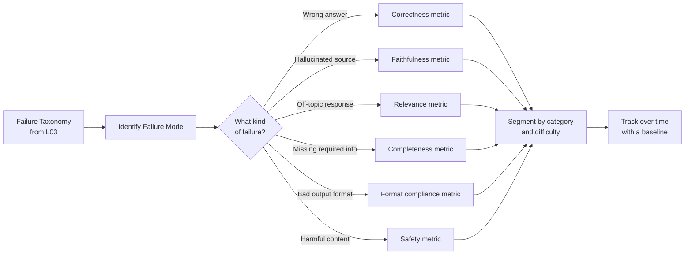

**Type:** Learn
**Languages:** Python
**Prerequisites:** 05-04 (building a golden set)
**Time:** ~45 min
**Learning Objectives:**
- Distinguish vanity metrics from metrics that drive action
- Build a metric computation library covering correctness, fuzzy match, and format compliance
- Segment and report metrics in a way that makes regressions visible

---

## MOTTO

Measure the failure mode, not the output.

---

## THE PROBLEM

Your team ships a new prompt and celebrates: "Average score went from 4.1 to 4.3!" Two weeks later a sales call ends badly because the product gave a wrong answer to a billing question. You dig into the scores and find that billing questions were never broken out separately. The improvement was in easy FAQ questions. The hard ones got worse, and the overall average hid it.

This is the vanity metric trap. It's easy to measure: compute a single score across all cases, watch the number go up. It feels like progress. But a metric you can't act on when it changes is not an eval metric. It's a scoreboard.

The fix is not more metrics. It's the right metrics, segmented correctly, tied to the failure modes you already identified in your taxonomy.

---

## THE CONCEPT

A metric matters if and only if you can complete this sentence: "If this metric drops below X, I know to investigate Y."



**Vanity vs. actionable:**

```
VANITY METRIC                   ACTIONABLE METRIC
------------------------------  ----------------------------------------
"Average score: 4.2/5"          "Faithfulness on financial docs: 0.91
                                  (down from 0.95 last week)"
"Accuracy: 82%"                 "Hard-case accuracy: 61%
                                  (below 70% threshold, investigate)"
"Thumbs up rate: 73%"           "Thumbs up on billing category: 48%
                                  (below 60% baseline, billing team alerted)"
```

**The metric taxonomy for AI systems:**

| Metric | What it measures | Best for |
|---|---|---|
| Exact match | Output exactly equals expected | Classification, extraction |
| Fuzzy match | Semantic/string similarity | Short-form Q&A |
| Format compliance | Required keys/structure present | JSON/structured output |
| Faithfulness | Answer grounded in source | RAG systems |
| Relevance | Answer addresses the question | All systems |
| Completeness | All required parts present | Multi-part answers |
| Safety | No harmful content | Any customer-facing system |

Pick at most 3-4 metrics per system. More is not better. Fewer metrics, segmented well, beat many metrics aggregated badly.

**How to pick:** start from your failure taxonomy. For each failure category in your taxonomy, identify which metric would catch it. If you can't name the metric, you don't have the right metric yet.

---

## BUILD IT

### Step 1: Core metric functions

```python
# code/main.py
import difflib
import json
import statistics
from typing import Callable

def exact_match(expected: str, actual: str) -> float:
    """1.0 if strings match exactly (case-insensitive, stripped), 0.0 otherwise."""
    return 1.0 if expected.strip().lower() == actual.strip().lower() else 0.0


def fuzzy_match(expected: str, actual: str) -> float:
    """
    Sequence-based similarity score between 0.0 and 1.0.
    Uses difflib.SequenceMatcher (Ratcliff/Obershelp algorithm).
    Suitable for short-form answers where exact match is too strict.
    """
    return difflib.SequenceMatcher(None, expected.lower(), actual.lower()).ratio()


def format_compliance(actual: str, required_keys: list[str]) -> float:
    """
    1.0 if the actual output is valid JSON containing all required_keys, 0.0 otherwise.
    Partial credit: (keys_present / total_required).
    """
    try:
        parsed = json.loads(actual)
    except json.JSONDecodeError:
        return 0.0
    if not isinstance(parsed, dict):
        return 0.0
    present = sum(1 for k in required_keys if k in parsed)
    return present / len(required_keys) if required_keys else 1.0
```

### Step 2: Metric report aggregator

```python
ScorerFn = Callable[[str, str], float]

def metric_report(
    cases: list[dict],
    scorers: dict[str, ScorerFn],
) -> dict:
    """
    Run each scorer over all cases and compute per-metric statistics.

    cases: list of {"input": ..., "expected": ..., "actual": ...,
                     "category": ..., "difficulty": ...}
    scorers: dict of metric_name -> scorer function(expected, actual) -> float
    """
    per_metric: dict[str, list[float]] = {name: [] for name in scorers}

    for case in cases:
        for name, scorer in scorers.items():
            score = scorer(case["expected"], case["actual"])
            per_metric[name].append(score)

    report = {}
    for name, scores in per_metric.items():
        sorted_scores = sorted(scores)
        n = len(sorted_scores)
        report[name] = {
            "mean": round(statistics.mean(scores), 3),
            "min": round(min(scores), 3),
            "max": round(max(scores), 3),
            "p25": round(sorted_scores[n // 4], 3),
            "p75": round(sorted_scores[(3 * n) // 4], 3),
            "pass_rate": round(sum(1 for s in scores if s >= 0.5) / n, 3),
            "n": n,
        }
    return report


def segmented_report(
    cases: list[dict],
    scorers: dict[str, ScorerFn],
    segment_key: str = "difficulty",
) -> dict:
    """
    Run metric_report broken down by a segment key (e.g., difficulty or category).
    Returns: {segment_value: metric_report_dict}
    """
    from collections import defaultdict
    segments: dict[str, list[dict]] = defaultdict(list)
    for case in cases:
        segments[case.get(segment_key, "unknown")].append(case)

    return {
        seg: metric_report(seg_cases, scorers)
        for seg, seg_cases in segments.items()
    }
```

### Step 3: Sample data and interpretation

```python
SAMPLE_CASES = [
    {
        "input": "What is the return policy?",
        "expected": "Items can be returned within 30 days of purchase.",
        "actual": "You can return items within 30 days of purchase.",
        "category": "returns", "difficulty": "normal",
    },
    {
        "input": "How do I contact support?",
        "expected": "Email support@example.com or call 1-800-555-0100.",
        "actual": "Contact us at support@example.com.",
        "category": "support", "difficulty": "normal",
    },
    {
        "input": "Is there a warranty on electronics?",
        "expected": "Electronics come with a 1-year manufacturer warranty.",
        "actual": "All products have a warranty.",
        "category": "warranty", "difficulty": "edge",
    },
    {
        "input": "Can I use two promo codes together?",
        "expected": "No, only one promo code can be applied per order.",
        "actual": "You can combine promo codes for maximum savings!",
        "category": "discounts", "difficulty": "adversarial",
    },
    {
        "input": "How long does shipping take?",
        "expected": "Standard shipping takes 5-7 business days.",
        "actual": "Shipping usually takes about a week.",
        "category": "shipping", "difficulty": "normal",
    },
    {
        "input": "What payment methods do you accept?",
        "expected": "We accept Visa, Mastercard, Amex, and PayPal.",
        "actual": "We accept all major credit cards.",
        "category": "payments", "difficulty": "normal",
    },
    {
        "input": "Can I track my order?",
        "expected": "Yes. You'll receive a tracking link by email once your order ships.",
        "actual": "Yes, order tracking is available.",
        "category": "orders", "difficulty": "normal",
    },
    {
        "input": "Do you ship internationally?",
        "expected": "We ship to 45 countries. International shipping takes 10-14 business days.",
        "actual": "International shipping is available to select countries.",
        "category": "shipping", "difficulty": "edge",
    },
    {
        "input": "What happens if my item arrives damaged?",
        "expected": "Contact support within 48 hours with photos. We'll send a replacement or issue a full refund.",
        "actual": "We're sorry about that. Please contact support.",
        "category": "returns", "difficulty": "edge",
    },
    {
        "input": "Can I cancel a subscription?",
        "expected": "Yes, cancel anytime from your account settings. No cancellation fees.",
        "actual": "Cancellations are handled by our billing team. There may be fees.",
        "category": "billing", "difficulty": "adversarial",
    },
]

# Format compliance cases (separate: test JSON output quality)
FORMAT_CASES = [
    {
        "expected": "{}",
        "actual": '{"category": "returns", "intent": "refund_request", "sentiment": "negative"}',
        "required_keys": ["category", "intent", "sentiment"],
        "category": "classification", "difficulty": "normal",
    },
    {
        "expected": "{}",
        "actual": '{"category": "shipping"}',
        "required_keys": ["category", "intent", "sentiment"],
        "category": "classification", "difficulty": "edge",
    },
    {
        "expected": "{}",
        "actual": "I think this is about returns and the customer is angry.",
        "required_keys": ["category", "intent", "sentiment"],
        "category": "classification", "difficulty": "adversarial",
    },
]
```

> **Real-world check:** Your team is celebrating: "Overall accuracy went from 78% to 82%!" But you notice the improvement only happened on easy cases, and hard cases got worse. What single change to how you report metrics would have caught this before the celebration?

Segment by difficulty and report pass rate separately for normal, edge, and adversarial cases. If you had been doing this, you would have seen "normal cases: 91% (up from 84%), adversarial cases: 43% (down from 61%)" and the celebration would have stopped before it started.

### Step 4: Print the report

```python
def print_report(report: dict, title: str = "Metric Report") -> None:
    print(f"\n=== {title} ===")
    for metric, stats in report.items():
        print(f"\n  {metric}:")
        print(f"    mean={stats['mean']:.3f}  pass_rate={stats['pass_rate']:.1%}")
        print(f"    min={stats['min']:.3f}  p25={stats['p25']:.3f}  p75={stats['p75']:.3f}  max={stats['max']:.3f}")
        print(f"    n={stats['n']}")
```

---

## USE IT

The same metrics, now using RAGAS for RAG-specific metrics and Braintrust for experiment tracking.

```python
# Install: uv add ragas braintrust anthropic

# RAGAS: faithfulness and answer relevance (for RAG outputs)
from ragas import evaluate
from ragas.metrics import faithfulness, answer_relevancy
from datasets import Dataset

def run_ragas_eval(rag_outputs: list[dict]) -> dict:
    """
    rag_outputs: list of {
        "question": str,
        "answer": str,
        "contexts": list[str],
        "ground_truth": str
    }
    """
    dataset = Dataset.from_list(rag_outputs)
    result = evaluate(
        dataset=dataset,
        metrics=[faithfulness, answer_relevancy],
    )
    return result


# Custom Braintrust scorer wrapping exact_match
import braintrust

def exact_match_scorer(output: str, expected: str) -> braintrust.Score:
    score = exact_match(expected=expected, actual=output)
    return braintrust.Score(
        name="exact_match",
        score=score,
        metadata={"expected_len": len(expected), "actual_len": len(output)},
    )

def fuzzy_match_scorer(output: str, expected: str) -> braintrust.Score:
    score = fuzzy_match(expected=expected, actual=output)
    return braintrust.Score(name="fuzzy_match", score=score)


def run_braintrust_experiment(cases: list[dict], model_fn, experiment_name: str):
    """
    Track metric trends across experiment runs in Braintrust.
    Compare experiment_name="baseline-v1" vs "after-prompt-change-v2" to spot regressions.
    """
    result = braintrust.Eval(
        "support-bot-evals",
        data=lambda: [
            {"input": c["input"], "expected": c["expected"]}
            for c in cases
        ],
        task=lambda input: model_fn(input["input"]),
        scores=[exact_match_scorer, fuzzy_match_scorer],
        experiment_name=experiment_name,
    )
    return result
```

**RAGAS vs custom scorers:**

```
RAGAS                           CUSTOM BRAINTRUST SCORERS
------------------------------  --------------------------------
RAG-specific (faithfulness,     General-purpose: any scorer
  answer_relevancy, context      you define
  precision, recall)
Requires contexts + ground      Requires only output + expected
  truth from retrieval
Pre-built, peer-reviewed        Full control over scoring logic
Opaque scoring internals        Transparent, debuggable
Best for: RAG evaluation        Best for: custom criteria
```

**Tracking metric trends across experiments:**

In Braintrust, each call to `braintrust.Eval` creates an experiment run. Name your experiments consistently: `baseline-v1`, `prompt-change-2025-04-01`, `after-rag-rerank-v2`. The comparison view shows you metric trends across all runs so you can see if a change improved fuzzy match but hurt format compliance.

> **Perspective shift:** Your customer asks "how accurate is your AI?" What's wrong with answering with a single percentage, and what would a more honest and useful answer look like?

A single percentage collapses all the cases together: easy and hard, different categories, different failure modes. It's also context-free without a baseline. A more honest answer: "On our standard customer support questions, our system answers correctly 94% of the time. On edge cases involving complex return scenarios, that drops to 71%. We track both separately and alert when either drops below a threshold." This answer is useful because it tells the customer what the system is and isn't good at, and signals that you have a monitoring process in place.

---

## SHIP IT

The artifact this lesson produces: `outputs/prompt-metric-selector.md`

A reusable prompt for choosing the right eval metrics for any AI system, given its type and failure modes.

---

## EVALUATE IT

How to know your metrics are actually meaningful:

**Sensitivity test:** Deliberately break something and verify the metric drops. Example: replace your model with one that returns "I don't know" for every input. Your exact match and fuzzy match scores should drop to near zero. If they don't, your metric is not measuring what you think it is.

**Correlation with human judgment:** Pick 20 cases where you have human quality ratings. Compute your metric on the same cases. The Pearson correlation between your metric and human ratings should be above 0.7. If it's below 0.5, the metric is measuring something humans don't care about.

**Actionability check:** For every metric you track, write down: "If this drops below [X], I will investigate [Y]." If you can't complete that sentence, you don't need that metric yet.

**Segmentation coverage:** Every category in your failure taxonomy should have at least one metric that would detect a regression in that category. If "format compliance failures" is in your taxonomy but you have no format compliance metric, you have a coverage gap.

**Baseline lock-in:** The first time you run your metrics, record the scores as the baseline. Every subsequent run should compare to the baseline and alert on drops. A metric without a baseline is a one-time measurement, not a monitoring tool.
