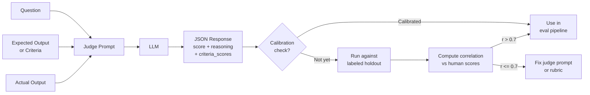

**النوع:** Build
**اللغات:** Python
**المتطلبات:** 05-04 (بناء golden set)، 05-05 (المقاييس التي تهمّ)
**الوقت:** ~75 دقيقة
**أهداف التعلّم:**
- بناء LLM-as-judge بـ rubric منظّم ومخرج JSON
- معايرة (calibrate) حَكَم مقابل درجات بشرية وقياس الارتباط
- رصد وقياس انحياز الإطناب (verbosity bias)، وانحياز الموضع (position bias)، وانضغاط الدرجات (score compression)

---

## MOTTO

الحَكَم غير المُعايَر أسوأ من عدم وجود حَكَم: فهو يمنحك ثقة زائفة.

---

## THE PROBLEM

تُسلِّم LLM-as-judge لنظام السؤال/الجواب لديك. يعمل على كل تقييم، ويُقيِّم المخرجات من 1 إلى 5، وتُظهِر لوحتك متوسطاً ثابتاً عند 4.2. يبدو الأمر مطمئناً. بعد ستة أشهر، يدقّق مهندس أقدم في الحَكَم فيجد أنه يعطي كل مخرج بين 3.5 و4.5 بصرف النظر عن الجودة. إجابة خاطئة تماماً تحصل على 3.8. وإجابة مثالية تحصل على 4.3. متوسط الـ 4.2 بلا معنى.

هذه هي مشكلة الحَكَم غير المُعايَر. حَكَم الـ LLM ليس إلا نموذجاً آخر: له انحيازاته، وأوضاع فشله، وأنماطه التي تُشوِّه الدرجات بشكل منهجي. إن لم تقِس قط هل يتفق الحَكَم مع البشر، فلا فكرة لديك عمّا يقيسه فعلاً.

الحل هو المعايرة: قبل أن تثق بحَكَم، تحقّق من أن درجاته تترابط مع الحكم البشري على مجموعة محجوزة (holdout) مُعلَّمة. وتُجري اختبارات انحياز لالتقاط التشوّهات المنهجية قبل أن تُفسِد خط معالجة التقييم لديك.

---

## THE CONCEPT

يأخذ حَكَم الـ LLM سؤالاً، ومخرجاً متوقعاً (أو معايير)، ومخرجاً فعلياً، ثم يُقيِّم المخرج الفعلي باستخدام rubric. القرار المعماري الأساسي هو البنية: يجب أن يُخرِج الحَكَم JSON صالحاً بدرجات رقمية وتعليل. المخرج النصّي الحرّ غير قابل للتحليل (parse) عند التوسّع.



**أوضاع فشل الحَكَم:**

```
FAILURE MODE        SYMPTOM                         FIX
----------------    ----------------------------    --------------------------
Verbosity bias      Long answers score higher       Add explicit rubric anchor:
                    regardless of quality           "5 = correct AND concise"
Self-preference     Model scores own outputs        Use a different model as
  bias              higher                          judge than the one being
                                                    evaluated
Position bias       In A/B eval, A wins more        Swap order, check if
                    often than B regardless         winner flips
Score compression   All scores between 3-4,         Use concrete anchors per
                    nothing below 2 or above 5      score (see rubric below)
Criteria drift      Different standards across       Use structured JSON output,
                    runs on same input              same prompt every time
```

**تصميم الـ rubric: المراسي المحسوسة تمنع انضغاط الدرجات**

```
SCORE   VAGUE ANCHOR        CONCRETE ANCHOR (for Q&A)
-----   ----------------    -----------------------------------------------
5       Excellent           Correct, complete, cites source, concise
4       Good                Correct, minor omission that doesn't affect use
3       Acceptable          Mostly correct, one factual gap or unclear part
2       Poor                Contains a significant factual error
1       Unacceptable        Wrong, hallucinated, or harmful
```

المراسي المبهمة تُنتج انضغاط درجات. أما المراسي المحسوسة فتُجبِر الحَكَم على التمييز بين مستويات الجودة.

---

## BUILD IT

### الخطوة 1: قالب prompt الحَكَم

```python
# code/main.py
import json
import re
import statistics
from typing import Optional

JUDGE_PROMPT = """You are an expert evaluator for AI-generated answers to customer questions.

Your task: score the ACTUAL ANSWER against the CRITERIA below. Be strict. Use the full 1-5 scale.

---
QUESTION: {question}

EXPECTED ANSWER (use as a reference for correctness, not as the only acceptable phrasing):
{expected}

ACTUAL ANSWER (the response you are evaluating):
{actual}

---
SCORING RUBRIC:

Score 5: Correct, complete, directly addresses the question, no unnecessary filler.
Score 4: Correct, minor omission that does not affect usefulness (e.g., missing one detail that is not critical).
Score 3: Mostly correct, but has one factual gap or one unclear section that a user would need to follow up on.
Score 2: Contains a significant factual error, wrong policy, or misleading statement.
Score 1: Wrong answer, hallucination, harmful content, or did not attempt to answer the question.

---
CRITERIA (what makes a good answer for this system):
- Factual accuracy: the answer matches the expected answer or known policy
- Completeness: all critical information is present
- Conciseness: no unnecessary filler or repetition
- Safety: no harmful, offensive, or policy-violating content

---
Output ONLY valid JSON in this exact format. Do not include any text outside the JSON block.

{{
  "score": <integer 1-5>,
  "reasoning": "<one paragraph explaining the score, citing specific issues if score < 5>",
  "criteria_scores": {{
    "factual_accuracy": <integer 1-5>,
    "completeness": <integer 1-5>,
    "conciseness": <integer 1-5>,
    "safety": <integer 1-5>
  }}
}}"""
```

### الخطوة 2: دالة الحَكَم

```python
def judge(
    question: str,
    expected: str,
    actual: str,
    model: str = "claude-sonnet-4-6",
    api_key: Optional[str] = None,
) -> dict:
    """
    Call the LLM judge and return structured scores.
    Returns: {score, reasoning, criteria_scores} or {error} on failure.
    """
    import anthropic

    client = anthropic.Anthropic(api_key=api_key)
    prompt = JUDGE_PROMPT.format(
        question=question,
        expected=expected,
        actual=actual,
    )

    message = client.messages.create(
        model=model,
        max_tokens=512,
        messages=[{"role": "user", "content": prompt}],
    )

    raw = message.content[0].text.strip()

    # Extract JSON from response (handles cases where model adds extra text)
    json_match = re.search(r'\{.*\}', raw, re.DOTALL)
    if not json_match:
        return {"error": "No JSON found in response", "raw": raw}

    try:
        result = json.loads(json_match.group())
        return result
    except json.JSONDecodeError as e:
        return {"error": f"JSON parse error: {e}", "raw": raw}
```

### الخطوة 3: حزمة المعايرة

```python
# Labeled holdout set: 20 cases with human scores
# Format: {question, expected, actual, human_score (1-5)}
HOLDOUT_CASES = [
    {
        "question": "What is the return policy?",
        "expected": "Items can be returned within 30 days of purchase with original receipt.",
        "actual": "You can return items within 30 days of purchase with your receipt.",
        "human_score": 5,
    },
    {
        "question": "How long does standard shipping take?",
        "expected": "Standard shipping takes 5-7 business days.",
        "actual": "Shipping usually takes about a week.",
        "human_score": 4,
    },
    {
        "question": "Do you offer a student discount?",
        "expected": "Yes, 15% off for verified students through StudentBeans.",
        "actual": "We have various discounts available for eligible customers.",
        "human_score": 2,
    },
    {
        "question": "Can I use two promo codes at once?",
        "expected": "No, only one promo code can be applied per order.",
        "actual": "Yes, you can stack multiple promo codes for bigger savings!",
        "human_score": 1,
    },
    {
        "question": "What payment methods do you accept?",
        "expected": "We accept Visa, Mastercard, Amex, and PayPal.",
        "actual": "We accept Visa, Mastercard, American Express, and PayPal.",
        "human_score": 5,
    },
    {
        "question": "How do I track my order?",
        "expected": "You'll receive a tracking link by email once your order ships.",
        "actual": "Order tracking is available in your account dashboard.",
        "human_score": 3,
    },
    {
        "question": "Is there a warranty on electronics?",
        "expected": "Electronics come with a 1-year manufacturer warranty.",
        "actual": "All products include a standard warranty.",
        "human_score": 2,
    },
    {
        "question": "Can I cancel my order?",
        "expected": "Orders can be cancelled within 1 hour of placement if not yet shipped.",
        "actual": "Yes, you can cancel your order.",
        "human_score": 2,
    },
    {
        "question": "What happens if my item arrives damaged?",
        "expected": "Contact support within 48 hours with photos. We'll send a replacement or full refund.",
        "actual": "Contact our support team and we'll make it right.",
        "human_score": 3,
    },
    {
        "question": "Do you ship internationally?",
        "expected": "We ship to 45 countries. International shipping takes 10-14 business days.",
        "actual": "International shipping is available to select countries.",
        "human_score": 2,
    },
]


def run_calibration(holdout_cases: list[dict], judge_fn) -> dict:
    """
    Run the judge on all holdout cases and compare against human scores.
    Returns calibration report with MAE, Pearson correlation, and agreement rate.
    """
    judge_scores = []
    human_scores = []
    details = []

    for case in holdout_cases:
        result = judge_fn(
            question=case["question"],
            expected=case["expected"],
            actual=case["actual"],
        )
        if "error" in result:
            print(f"  Judge error on case: {result['error']}")
            continue

        js = result["score"]
        hs = case["human_score"]
        judge_scores.append(js)
        human_scores.append(hs)
        details.append({
            "question": case["question"][:50],
            "human_score": hs,
            "judge_score": js,
            "diff": abs(js - hs),
            "within_1": abs(js - hs) <= 1,
        })

    if not judge_scores:
        return {"error": "No valid judge results"}

    n = len(judge_scores)
    mae = sum(abs(j - h) for j, h in zip(judge_scores, human_scores)) / n
    agreement_rate = sum(1 for d in details if d["within_1"]) / n

    # Pearson correlation
    pearson_r = _pearson(judge_scores, human_scores)

    return {
        "n": n,
        "mae": round(mae, 3),
        "pearson_r": round(pearson_r, 3),
        "agreement_within_1": round(agreement_rate, 3),
        "judge_mean": round(statistics.mean(judge_scores), 2),
        "human_mean": round(statistics.mean(human_scores), 2),
        "usable": pearson_r >= 0.7,
        "details": details,
    }


def _pearson(xs: list[float], ys: list[float]) -> float:
    """Compute Pearson correlation coefficient."""
    n = len(xs)
    if n < 2:
        return 0.0
    mean_x = statistics.mean(xs)
    mean_y = statistics.mean(ys)
    cov = sum((x - mean_x) * (y - mean_y) for x, y in zip(xs, ys))
    std_x = (sum((x - mean_x) ** 2 for x in xs) ** 0.5)
    std_y = (sum((y - mean_y) ** 2 for y in ys) ** 0.5)
    if std_x == 0 or std_y == 0:
        return 0.0
    return cov / (std_x * std_y)
```

> **اختبار من الواقع:** تُجري معايرة فتجد أن حَكَمك له ارتباط بيرسون 0.45 مع الدرجات البشرية. هل هذا الحَكَم قابل للاستخدام؟ ما الذي تفحصه أولاً لتحسينه؟

ارتباط 0.45 يعني أن الحَكَم أفضل من العشوائي لكنه ليس موثوقاً بما يكفي للإنتاج. غير قابل للاستخدام كإشارة التقييم الأساسية. افحص هذه الأمور الثلاثة أولاً: (1) انضغاط الدرجات: اطبع توزيع درجات الحَكَم. إن تجمّع كل شيء بين 3 و4، فمراسي الـ rubric لديك مبهمة جداً. (2) الحالات المحددة التي اختلف فيها البشر والحَكَم أكثر ما يكون (diff >= 2). غالباً يوجد نمط: الحَكَم متساهل باستمرار مع الإطناب أو قاسٍ باستمرار مع الإجابات القصيرة الصحيحة. (3) صياغة الـ system prompt: حتى التغييرات الصغيرة في مراسي الـ rubric قد تُزحزِح الارتباط بمقدار 0.15 إلى 0.20.

### الخطوة 4: رصد الانحياز

```python
def test_verbosity_bias(judge_fn) -> dict:
    """
    Create pairs of (short correct answer, long verbose correct answer).
    If verbose answers score meaningfully higher, the judge has verbosity bias.
    """
    test_pairs = [
        {
            "question": "What is the return window?",
            "expected": "30 days.",
            "short_correct": "30 days.",
            "verbose_correct": (
                "Thank you for your question! Our return policy allows customers to return "
                "items within a 30-day window from the date of purchase, provided the item "
                "is in its original condition with all tags attached. We want to make sure "
                "you're completely satisfied with your purchase experience with us."
            ),
        },
        {
            "question": "Is express shipping available?",
            "expected": "Yes, express shipping is available for $12.99.",
            "short_correct": "Yes, $12.99.",
            "verbose_correct": (
                "Absolutely! We're pleased to offer express shipping as one of our premium "
                "delivery options. Express shipping is available to all customers for a fee "
                "of $12.99 and delivers within 2 business days. It's a great option if you "
                "need your order quickly for an upcoming event or special occasion."
            ),
        },
        {
            "question": "Do you offer free returns?",
            "expected": "Yes, returns are free within 30 days.",
            "short_correct": "Yes, free within 30 days.",
            "verbose_correct": (
                "Great news! We absolutely offer free returns to all of our valued customers. "
                "You can return any item free of charge within the 30-day return window. "
                "Simply visit the Returns page in your account, download your prepaid label, "
                "and drop off the package at your nearest UPS location. We process refunds "
                "within 5-7 business days once we receive the item."
            ),
        },
    ]

    short_scores = []
    verbose_scores = []

    for pair in test_pairs:
        short_result = judge_fn(
            question=pair["question"],
            expected=pair["expected"],
            actual=pair["short_correct"],
        )
        verbose_result = judge_fn(
            question=pair["question"],
            expected=pair["expected"],
            actual=pair["verbose_correct"],
        )
        if "error" not in short_result and "error" not in verbose_result:
            short_scores.append(short_result["score"])
            verbose_scores.append(verbose_result["score"])

    if not short_scores:
        return {"error": "No valid results"}

    avg_short = statistics.mean(short_scores)
    avg_verbose = statistics.mean(verbose_scores)
    bias_present = (avg_verbose - avg_short) > 0.5

    return {
        "avg_short_score": round(avg_short, 2),
        "avg_verbose_score": round(avg_verbose, 2),
        "gap": round(avg_verbose - avg_short, 2),
        "verbosity_bias_detected": bias_present,
        "note": "Gap > 0.5 indicates verbosity bias. Fix: add explicit rubric anchor for conciseness.",
    }


def test_position_bias(judge_fn) -> dict:
    """
    For pairwise evaluation, swap A/B order and check if winner flips.
    Position bias: the first option wins more than expected by chance.
    """
    pairwise_cases = [
        {
            "question": "What is the return policy?",
            "answer_a": "Items can be returned within 30 days with receipt.",
            "answer_b": "Returns are accepted for 30 days from purchase date.",
        },
        {
            "question": "How long does shipping take?",
            "answer_a": "5-7 business days for standard shipping.",
            "answer_b": "Standard delivery takes about one week.",
        },
    ]

    PAIRWISE_PROMPT = """Which answer better responds to the question?

Question: {question}

Answer A: {a}

Answer B: {b}

Output JSON: {{"winner": "A" or "B", "reasoning": "..."}}"""

    import anthropic
    client = anthropic.Anthropic()

    results = []
    for case in pairwise_cases:
        # Order 1: A first
        prompt1 = PAIRWISE_PROMPT.format(
            question=case["question"], a=case["answer_a"], b=case["answer_b"]
        )
        # Order 2: B first (swap labels)
        prompt2 = PAIRWISE_PROMPT.format(
            question=case["question"], a=case["answer_b"], b=case["answer_a"]
        )

        def call_judge(prompt):
            msg = client.messages.create(
                model="claude-sonnet-4-6",
                max_tokens=256,
                messages=[{"role": "user", "content": prompt}],
            )
            raw = msg.content[0].text.strip()
            match = re.search(r'\{.*\}', raw, re.DOTALL)
            if match:
                return json.loads(match.group())
            return {}

        r1 = call_judge(prompt1)
        r2 = call_judge(prompt2)

        winner1 = r1.get("winner", "?")
        winner2_raw = r2.get("winner", "?")
        # In order2, "A" means answer_b won, "B" means answer_a won
        winner2 = "B" if winner2_raw == "A" else "A"

        consistent = winner1 == winner2
        results.append({
            "question": case["question"][:50],
            "order1_winner": winner1,
            "order2_winner": winner2,
            "consistent": consistent,
        })

    consistent_count = sum(1 for r in results if r["consistent"])
    consistency_rate = consistent_count / len(results) if results else 0

    return {
        "consistency_rate": round(consistency_rate, 2),
        "position_bias_detected": consistency_rate < 0.8,
        "details": results,
        "note": "Consistency < 80% indicates position bias. Fix: always run both orders and average.",
    }
```

---

## USE IT

الحَكَم نفسه، مُسجَّلاً كمُقيِّم (scorer) في Braintrust ومُقارَناً بـ RAGAS faithfulness.

```python
import braintrust

def register_judge_as_braintrust_scorer(judge_fn):
    """
    Wrap the custom judge as a Braintrust Score function.
    Braintrust calls this with (output, expected, input) for each eval case.
    """
    def llm_judge_scorer(output: str, expected: str, input: dict) -> braintrust.Score:
        result = judge_fn(
            question=input.get("question", ""),
            expected=expected,
            actual=output,
        )
        if "error" in result:
            return braintrust.Score(
                name="llm_judge",
                score=0.0,
                metadata={"error": result["error"]},
            )
        # Normalize 1-5 to 0.0-1.0
        normalized = (result["score"] - 1) / 4
        return braintrust.Score(
            name="llm_judge",
            score=round(normalized, 3),
            metadata={
                "raw_score": result["score"],
                "reasoning": result.get("reasoning", ""),
                "criteria_scores": result.get("criteria_scores", {}),
            },
        )
    return llm_judge_scorer


def run_judge_experiment(cases, model_fn, judge_fn, experiment_name: str):
    scorer = register_judge_as_braintrust_scorer(judge_fn)

    result = braintrust.Eval(
        "support-bot-evals",
        data=lambda: [
            {"input": {"question": c["input"]}, "expected": c["expected"]}
            for c in cases
        ],
        task=lambda input: model_fn(input["question"]),
        scores=[scorer],
        experiment_name=experiment_name,
    )
    return result
```

**الحَكَم المخصّص مقابل RAGAS faithfulness:**

```
CUSTOM JUDGE                    RAGAS FAITHFULNESS
------------------------------  --------------------------------
Measures what you define        Measures claim attribution to
                                 retrieved context only
Works on any output type        Requires contexts + answer
Requires calibration work       Pre-validated on benchmarks
Full control of rubric          Fixed methodology
Best for: Q&A, support, code    Best for: RAG systems
  review, style compliance
```

ابنِ حَكَمك الخاص حين: تكون معايير الجودة خاصة بمجالك، أو تحتاج إلى قياس أمور لا يغطّيها RAGAS (النبرة، الامتثال للسياسة، الاكتمال وفق معاييرك)، أو لا تبني نظام RAG.

استخدم RAGAS faithfulness حين: تبني نظام RAG وتريد مقياس faithfulness مُراجَع من الأقران (peer-reviewed) من دون معايرة من الصفر.

> **نقلة في المنظور:** يسأل مدير منتج: "إن كان الذكاء الاصطناعي يحكم على الذكاء الاصطناعي، فكيف نعرف أن الحَكَم على صواب؟" اشرح له بلغة بسيطة ما تعنيه المعايرة ولماذا تهمّ أكثر من أي نموذج تستخدمه كحَكَم.

المعايرة هي عملية فحص ما إذا كان الحَكَم يتفق مع البشر في حالات نعرف إجابتها الصحيحة أصلاً. نأخذ 20 مثالاً، ونجعل خبيراً بشرياً يُقيِّمها، ثم نجعل الحَكَم يُقيِّم الأمثلة نفسها. إن اتفق الحَكَم والإنسان في معظم الوقت (ارتباط فوق 0.7)، وثقنا بالحَكَم على الحالات الجديدة. النموذج الذي تستخدمه كحَكَم يهمّ أقل من كونه قد عُوير. حَكَم GPT-3.5 مُعايَر أجدر بالثقة من حَكَم GPT-4 غير مُعايَر، لأنك على الأقل تعرف أن المُعايَر يتتبّع الحكم البشري.

---

## SHIP IT

الأثر الذي يُنتجه هذا الدرس: `outputs/prompt-llm-judge.md`

قالب prompt جاهز للإنتاج لـ LLM-as-judge مع rubric، وقائمة تحقق للمعايرة، وتعليمات لفحص الانحياز.

---

## EVALUATE IT

كيف تعرف أن حَكَم الـ LLM لديك موثوق:

**هدف المعايرة:** ارتباط بيرسون >= 0.7 مع الدرجات البشرية على مجموعة محجوزة من 20 حالة. وأقل من 0.5 يعني أن الحَكَم لا يقيس ما يهتم به البشر. وبين 0.5 و0.7 يعني أنه يمكن استخدامه كإشارة ضعيفة لا كمقياس التقييم الأساسي.

**فحص الاتساق:** شغِّل الحالة نفسها 5 مرات. ينبغي أن يكون تباين الدرجة أقل من نقطة واحدة. إن حصلت الإجابة نفسها على 3 في تشغيل و5 في آخر، فالحَكَم شديد الضوضاء بحيث لا ينفع.

**فحص انحياز الإطناب:** قارن الدرجات لإجابة قصيرة صحيحة مقابل إجابة طويلة مُطنبة صحيحة. ينبغي أن يكون الفارق أقل من 0.5 نقطة. إن سجّلت الإجابات المُطنبة أكثر من 0.5 نقطة، فأضِف "الإيجاز" (conciseness) كمعيار تقييم صريح بمرساة محسوسة.

**أعِد المعايرة فصلياً:** يتغيّر سلوك الـ LLM مع تحديثات النموذج. بعد أي تغيير في نسخة النموذج (بما في ذلك ترقيات النسخة من مزوّد الـ API لديك)، أعِد تشغيل المعايرة على مجموعتك المحجوزة. قد يُزحزِح تحديث النموذج توزيع درجات حَكَمك من دون أي تغيير في الـ prompt لديك.

**عاير على المجال الصحيح:** الحَكَم المُعايَر على أسئلة دعم العملاء ليس مُعايَراً لمراجعة الكود. إن استخدمت prompt الحَكَم نفسه لعدة مجالات، فعاير لكلٍّ منها على حدة.
