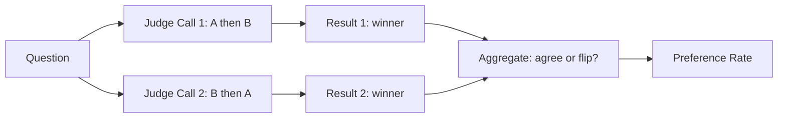

**النوع:** Build
**اللغات:** Python
**المتطلبات:** 05-metrics-that-matter، 06-llm-as-judge
**الوقت:** ~45 دقيقة
**أهداف التعلّم:**
- تنفيذ التقييم الزوجي (pairwise evaluation) من الصفر مع تخفيف انحياز الموضع
- حساب معدلات التفضيل (preference rates) عبر golden set لمقارنة نسخ الـ prompt
- إضافة تقييم مرجعي (reference-based scoring) باستخدام تشابه الـ n-gram
- ربط التقييمات الزوجية بـ Braintrust لمقارنة مرئية للفريق

---

## MOTTO

**الدرجة تخبرك أين أنت. أما المقارنة الزوجية فتخبرك هل تحرّكت.**

---

## THE PROBLEM

ضبطت الـ system prompt لثلاثة أيام. يُظهِر تقييمك النقطي (pointwise) أن النسخة الجديدة تسجّل 3.8/5 على الجودة. وكانت النسخة القديمة تسجّل 3.6/5. هل هذا تحسّن حقيقي؟

ربما. الدرجات تأتي من استدعاءات حَكَم LLM مختلفة، في أيام مختلفة، بتباين طبيعي في الحَكَم نفسه. فارق 0.2 نقطة قد يكون إشارة أو ضوضاء.

هذه هي المشكلة الجوهرية للتقييمات النقطية في المقارنة: أنت تطرح رقمين لم يُصمَّما قط ليُقارَنا. لم يكن الحَكَم مُرسىً إلى نفسه حين قيّم النسخة A مقابل النسخة B.

تصطدم فِرَق الإنتاج بهذا باستمرار:
- "غيّرنا الحرارة (temperature) من 0.3 إلى 0.7. هل تحسّن الأمر؟"
- "استبدلنا gpt-4o بـ claude-3-5-sonnet. أيّهما أفضل لحالة استخدامنا؟"
- "أضفنا خطوة استرجاع. هل صارت الإجابات أدقّ الآن؟"

لا يمكن الإجابة بثقة عن أيٍّ من هذه الأسئلة بمقارنة درجتين نقطيتين. إنها تتطلب أن تسأل الحَكَم: "بالنظر إلى المخرجين كليهما، أيّهما أفضل؟" هذا هو التقييم الزوجي.

---

## THE CONCEPT

### النقطي مقابل الزوجي

التقييم النقطي يسأل: "كم هذا المخرج جيد؟" ويُنتج رقماً: 3.8/5، أو 0.72، أو "يجتاز".

التقييم الزوجي يسأل: "بين هذين المخرجين، أيّهما أفضل؟" ويُنتج تفضيلاً: A يفوز، أو B يفوز، أو تعادل.

```
POINTWISE                          PAIRWISE
-----------                        ---------

Q: "What's the capital of France?" Q: Same question

Output A: "Paris."                 Output A: "Paris."
Score: 4/5                         Output B: "The capital is Paris, France."

Output B: "The capital is          Winner: B (more complete, same accuracy)
Paris, France."
Score: 4.2/5                       Position-bias check: swap order,
                                   confirm winner stays the same
```

الزوجي يفوز لأن:
- الحَكَم لديه المخرجان كلاهما في السياق، ما يُرسي المقارنة
- الفروق الصغيرة تصبح مرئية حين تُوضَع جنباً إلى جنب
- تتخلّص من تباين الحَكَم بين يوم وآخر (المخرجان يُحكَم عليهما في الاستدعاء نفسه)

### مشكلة انحياز الموضع

لحَكَم الـ LLM عيب معروف: يميل إلى تفضيل أيّ مخرج يظهر أولاً في الـ prompt. هذا هو انحياز الموضع (position bias). إن وضعت دائماً مخرج النظام A أولاً، فسيفوز A أكثر مما يستحق.

الحل: شغِّل كل مقارنة مرتين. أولاً بترتيب (A, B)، ثم بترتيب (B, A). إن فاز A في الجولة 1 لكن B فاز في الجولة 2، فهذا انقلاب (flip). معدل انقلاب مرتفع يعني أن انحياز الموضع يهيمن على نتائجك.



### التقييمات المرجعية

أحياناً تملك إجابة مرجعية ذهبية: استجابة مثالية مكتوبة بشرياً. التقييمات المرجعية تقيس مدى تشابه المخرج مع ذلك المرجع.

مقاربتان شائعتان:

```
SEMANTIC SIMILARITY           N-GRAM OVERLAP (BLEU-style)
--------------------          --------------------------
Embed both strings,           Count shared n-grams.
compute cosine distance.      1-gram: "Paris" appears in both.
Good for meaning.             2-gram: "the capital" appears in both.
Needs embedding model.        Fast, no model needed, rewards verbatim match.
```

حدس BLEU: ما نسبة تسلسلات كلمات المخرج (1-grams، 2-grams، 3-grams) التي تظهر في المرجع؟ درجة 1.0 تعني أن كل n-gram في المخرج ظهر في المرجع. ودرجة 0.0 تعني أن لا شيء تطابق.

### معدل التفضيل

بعد تشغيل التقييمات الزوجية على golden set لديك، تحسب معدل التفضيل:

```
preference_rate = wins_for_A / (wins_for_A + wins_for_B)
```

إن فاز A في 60٪ من المقارنات المباشرة، فـ A أفضل. تحتاج إلى 30–50 حالة على الأقل ليكون هذا الرقم ذا معنى. عند 10 حالات، يكون مجال الثقة (confidence interval) واسعاً جداً.

---

## BUILD IT

### الخطوة 1: الحَكَم الزوجي

```python
# code/main.py
import json
import os
from anthropic import Anthropic

client = Anthropic()

def pairwise_judge(question: str, output_a: str, output_b: str, model: str = "claude-3-5-sonnet-20241022") -> dict:
    """
    Compare two outputs head-to-head and return winner + reasoning.
    Returns: {"winner": "A" | "B" | "tie", "reasoning": str, "criteria": list[str]}
    """
    prompt = f"""You are evaluating two AI system responses to the same question.

Question: {question}

Response A:
{output_a}

Response B:
{output_b}

Compare these responses. Consider: accuracy, completeness, clarity, and usefulness.
Which response is better?

Respond with JSON only:
{{
  "winner": "A" or "B" or "tie",
  "reasoning": "one sentence explaining the decision",
  "criteria": ["criterion 1", "criterion 2"]
}}"""

    response = client.messages.create(
        model=model,
        max_tokens=256,
        messages=[{"role": "user", "content": prompt}]
    )
    
    text = response.content[0].text.strip()
    # Strip markdown code fences if present
    if text.startswith("```"):
        text = text.split("```")[1]
        if text.startswith("json"):
            text = text[4:]
    return json.loads(text.strip())
```

### الخطوة 2: تخفيف الانحياز

```python
def pairwise_judge_debiased(question: str, output_a: str, output_b: str) -> dict:
    """
    Run judge twice with swapped order. Return consensus or flag flip.
    """
    result_ab = pairwise_judge(question, output_a, output_b)
    result_ba = pairwise_judge(question, output_b, output_a)
    
    # Normalize result_ba: if judge said "A" when B was first, the real winner is B
    flipped_winner = {"A": "B", "B": "A", "tie": "tie"}[result_ba["winner"]]
    
    agreed = result_ab["winner"] == flipped_winner
    
    if agreed:
        return {
            "winner": result_ab["winner"],
            "reasoning": result_ab["reasoning"],
            "flipped": False,
            "confidence": "high"
        }
    else:
        # Disagreement: call it a tie, flag for review
        return {
            "winner": "tie",
            "reasoning": f"Position bias detected. AB said {result_ab['winner']}, BA said {flipped_winner}.",
            "flipped": True,
            "confidence": "low"
        }
```

### الخطوة 3: تقييم زوجي عبر golden set

```python
def pairwise_eval(golden_set: list[dict], system_a_fn, system_b_fn) -> dict:
    """
    Run pairwise eval across all cases. Returns preference rate and per-case results.
    
    golden_set: list of {"input": str, ...}
    system_a_fn / system_b_fn: callables that take input and return string output
    """
    results = []
    wins_a = wins_b = ties = flips = 0
    
    for case in golden_set:
        question = case["input"]
        output_a = system_a_fn(question)
        output_b = system_b_fn(question)
        
        judgment = pairwise_judge_debiased(question, output_a, output_b)
        
        if judgment["winner"] == "A":
            wins_a += 1
        elif judgment["winner"] == "B":
            wins_b += 1
        else:
            ties += 1
        
        if judgment["flipped"]:
            flips += 1
        
        results.append({
            "question": question,
            "output_a": output_a,
            "output_b": output_b,
            **judgment
        })
    
    total = len(golden_set)
    decisive = wins_a + wins_b  # exclude ties for preference rate
    
    return {
        "preference_rate_a": wins_a / decisive if decisive > 0 else 0.5,
        "wins_a": wins_a,
        "wins_b": wins_b,
        "ties": ties,
        "tie_rate": ties / total,
        "flip_rate": flips / total,
        "n": total,
        "cases": results
    }
```

### الخطوة 4: التقييم المرجعي

```python
import difflib
import math
from collections import Counter

def ngram_overlap(text: str, reference: str, n: int) -> float:
    """Fraction of text's n-grams that appear in reference."""
    def get_ngrams(t, n):
        words = t.lower().split()
        return Counter(tuple(words[i:i+n]) for i in range(len(words) - n + 1))
    
    text_ngrams = get_ngrams(text, n)
    ref_ngrams = get_ngrams(reference, n)
    
    if not text_ngrams:
        return 0.0
    
    overlap = sum(min(count, ref_ngrams[gram]) for gram, count in text_ngrams.items())
    return overlap / sum(text_ngrams.values())

def bleu_approx(output: str, reference: str) -> float:
    """
    Simplified BLEU: geometric mean of 1-gram through 4-gram precision.
    Intuition: what fraction of the output's word sequences appear in the reference?
    """
    precisions = []
    for n in range(1, 5):
        p = ngram_overlap(output, reference, n)
        precisions.append(p if p > 0 else 1e-10)
    
    log_avg = sum(math.log(p) for p in precisions) / 4
    return math.exp(log_avg)

def reference_similarity(output: str, reference: str) -> dict:
    """Combined reference-based score using difflib ratio + BLEU approximation."""
    difflib_ratio = difflib.SequenceMatcher(None, output.lower(), reference.lower()).ratio()
    bleu = bleu_approx(output, reference)
    
    return {
        "difflib_ratio": round(difflib_ratio, 3),
        "bleu_approx": round(bleu, 3),
        "combined": round((difflib_ratio + bleu) / 2, 3)
    }
```

### الخطوة 5: التشغيل على حالات أمثلة

```python
def demo():
    """Compare two prompt variants on 5 example questions."""
    
    # Simulate two different system prompts
    def system_v1(question: str) -> str:
        response = client.messages.create(
            model="claude-3-5-haiku-20241022",
            max_tokens=200,
            system="Answer concisely.",
            messages=[{"role": "user", "content": question}]
        )
        return response.content[0].text
    
    def system_v2(question: str) -> str:
        response = client.messages.create(
            model="claude-3-5-haiku-20241022",
            max_tokens=200,
            system="Answer with one concrete example to illustrate your point.",
            messages=[{"role": "user", "content": question}]
        )
        return response.content[0].text
    
    golden_set = [
        {"input": "What is caching in software systems?"},
        {"input": "Why does database indexing improve query speed?"},
        {"input": "What is the difference between authentication and authorization?"},
        {"input": "How does a load balancer work?"},
        {"input": "What is eventual consistency in distributed systems?"}
    ]
    
    print("Running pairwise eval: v1 (concise) vs v2 (with examples)...")
    results = pairwise_eval(golden_set, system_v1, system_v2)
    
    print(f"\nResults over {results['n']} cases:")
    print(f"  V1 wins: {results['wins_a']}")
    print(f"  V2 wins: {results['wins_b']}")
    print(f"  Ties: {results['ties']}")
    print(f"  Preference rate for V1: {results['preference_rate_a']:.0%}")
    print(f"  Tie rate: {results['tie_rate']:.0%} (healthy: 10-20%)")
    print(f"  Flip rate: {results['flip_rate']:.0%} (healthy: <30%)")
    
    # Show reference similarity on one example
    ref = "Caching stores frequently accessed data in fast memory to avoid recomputing or re-fetching it."
    output = system_v1("What is caching in software systems?")
    sim = reference_similarity(output, ref)
    print(f"\nReference similarity for Q1: {sim}")

if __name__ == "__main__":
    demo()
```

> **اختبار من الواقع:** تُشغِّل تقييمات زوجية بين prompt v1 وprompt v2. يفوز prompt v2 في 65٪ من الحالات إجمالاً. لكن حين تُقسِّم حسب الفئة، يفوز v2 بنسبة 90٪ على الحالات "السهلة" ويخسر بنسبة 55٪ على الحالات "الصعبة". أي نسخة تُسلِّم، وماذا تفعل بعد ذلك؟ الرقم المجمّع يُخفي انحداراً على الحالات الأهمّ. لا تُسلِّم أي نسخة بعد. قسِّم golden set لديك بشكل دائم حسب طبقة الصعوبة وتتبّع معدلات التفضيل على حدة. ثم اضبط v2 تحديداً على الحالات الصعبة قبل التسليم.

---

## USE IT

### التقييمات الزوجية في Braintrust

يُشغِّل Braintrust التجارب جنباً إلى جنب. بدلاً من بناء حلقة المقارنة الخاصة بك، تُشغِّل تجربتين وتقارنهما في الواجهة.

```python
# pip install braintrust anthropic
import braintrust

# Run experiment A (prompt v1)
braintrust.Eval(
    "my-chatbot",
    data=lambda: [
        {"input": {"question": q}, "expected": None}
        for q in [
            "What is caching in software systems?",
            "Why does database indexing improve query speed?",
            "What is the difference between authentication and authorization?",
        ]
    ],
    task=lambda input: system_v1(input["question"]),
    scores=[],
    experiment_name="prompt-v1"
)

# Run experiment B (prompt v2)
braintrust.Eval(
    "my-chatbot",
    data=lambda: [
        {"input": {"question": q}, "expected": None}
        for q in [
            "What is caching in software systems?",
            "Why does database indexing improve query speed?",
            "What is the difference between authentication and authorization?",
        ]
    ],
    task=lambda input: system_v2(input["question"]),
    scores=[],
    experiment_name="prompt-v2"
)
```

يُظهِر عرض المقارنة في Braintrust كلا المخرجين جنباً إلى جنب لكل حالة، مع إبراز الفروق (diff). ويمكنك إضافة مُقيِّم زوجي مخصّص:

```python
from braintrust import Score

def pairwise_scorer(input, output, expected, **kwargs):
    """Custom scorer that judges which output is better vs a reference run."""
    # This runs within a Braintrust experiment, comparing to the baseline
    reference = kwargs.get("baseline_output", expected)
    if not reference:
        return Score(name="pairwise", score=0.5, metadata={"note": "no reference"})
    
    result = pairwise_judge(
        question=input["question"],
        output_a=output,
        output_b=reference
    )
    score = 1.0 if result["winner"] == "A" else 0.0 if result["winner"] == "B" else 0.5
    return Score(name="pairwise", score=score, metadata=result)
```

**الزوجي اليدوي مقابل Braintrust: متى يناسب كلٌّ منهما**

```
MANUAL PAIRWISE                   BRAINTRUST
-----------------------           -----------------------
You control the judge prompt      Judge prompt is configurable
Full audit trail in your code     Audit trail in Braintrust UI
Works offline / no external svc   Requires Braintrust account
Good for one-off comparisons      Better for ongoing experiments
Harder to share with team         Team can view side-by-side
```

> **نقلة في المنظور:** يقول زميل في الفريق: "الزوجي بطيء جداً، فلنستخدم فقط الدرجة من آخر تشغيل تقييم." ما الذي تلتقطه التقييمات الزوجية وتفوّته الدرجات النقطية؟ الدرجات النقطية تنجرف: معايرة الحَكَم، وتباين الحرارة، وصياغة الـ prompt كلها تُزحزِح الدرجات بمقدار 0.1–0.3 نقطة عبر عمليات التشغيل. الزوجي يضع المخرجين كليهما في الاستدعاء نفسه، فيُلغي التباين بعضه بعضاً. تستطيع رصد فرق جودة قدره 5٪ كان النقطي سيدفنه في الضوضاء. ولمقارنة النسخ، الزوجي أكثر موثوقية عند أحجام عيّنات أصغر.

---

## SHIP IT

الأثر لهذا الدرس هو `outputs/prompt-pairwise-judge.md`: قالب prompt حَكَم زوجي تستطيع الفِرَق إسقاطه في أي خط معالجة تقييم.

---

## EVALUATE IT

**كيف تعرف أن إعدادك الزوجي موثوق:**

فحص معدل التعادل: التقييم الزوجي السليم له 10–20٪ تعادلات. إن تجاوز معدل التعادل لديك 40٪، فمعايير تقييمك غير محددة بما يكفي. أضِف معايير أكثر تحديداً إلى prompt الحَكَم (الدقة، الاكتمال، الصيغة، النبرة) كي يستطيع الحَكَم التمييز بين المخرجات شبه المتساوية.

فحص معدل الانقلاب: شغِّل كل حالة بالترتيبين (A ثم B، ثم B ثم A). إن انقلب أكثر من 30٪ من الحالات، فانحياز الموضع يهيمن على نتائجك. يحتاج prompt الحَكَم لديك إلى معايير أقوى كي يفوز الجواب الأفضل بصرف النظر عن الترتيب.

إرشادات حجم العيّنة: 10 حالات غير كافية. عند 10 حالات، انقسام 6-4 ليس ذا دلالة إحصائية. تحتاج إلى 30–50 حالة كحدّ أدنى لتدّعي تفضيلاً بأي قدر من الثقة. عند 100 حالة، يبدأ انقسام 55-45 بأن يكون ذا معنى.

فحوص على مستوى التقسيم: قسِّم معدلات التفضيل دائماً حسب فئة المدخل (سهل مقابل صعب، موضوع A مقابل موضوع B). معدل تفضيل مجمّع قدره 60٪ قد يُخفي نظاماً ينحدر على أصعب حالاتك. ينبغي أن يكون لـ golden set لديك تغطية متناسبة لكل فئة تهمّك.

اختبار اتساق الحَكَم: خذ 5 حالات يكون فيها الفائز الصحيح بديهياً (أحد المخرجين أفضل بوضوح). تحقّق من أن حَكَمك يختار الفائز الصحيح في الخمسة جميعها. إن أخطأ في أكثر من واحدة، فإن prompt الحَكَم لديك يحتاج إلى مراجعة قبل أن تثق بمعدلات التفضيل المجمّعة.
