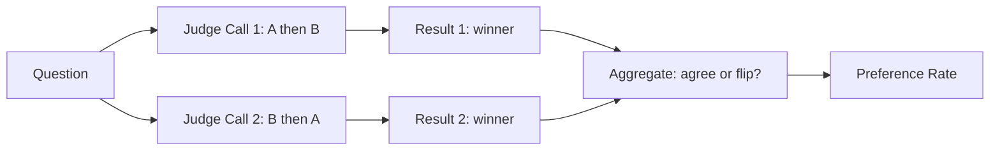

**Type:** Build
**Languages:** Python
**Prerequisites:** 05-metrics-that-matter, 06-llm-as-judge
**Time:** ~45 min
**Learning Objectives:**
- Implement pairwise evaluation from scratch with position-bias mitigation
- Compute preference rates across a golden set to compare prompt versions
- Add reference-based scoring using n-gram similarity
- Wire pairwise evals into Braintrust for team-visible comparison

---

## MOTTO

**A score tells you where you are. A pairwise comparison tells you if you moved.**

---

## THE PROBLEM

You tuned your system prompt for three days. Your pointwise eval shows the new version scores 3.8/5 on quality. The old version scored 3.6/5. Is that a real improvement?

Maybe. The scores come from different LLM judge calls, on different days, with natural variance in the judge itself. A 0.2-point difference could be signal or noise.

This is the core problem with pointwise evals for comparison: you're subtracting two numbers that were never designed to be compared. The judge wasn't anchored to itself when it scored version A versus version B.

Production teams hit this constantly:
- "We changed the temperature from 0.3 to 0.7. Did it improve?"
- "We swapped gpt-4o for claude-3-5-sonnet. Which is better for our use case?"
- "We added a retrieval step. Are answers more accurate now?"

None of these questions can be reliably answered by comparing two pointwise scores. They require asking the judge "given both outputs, which is better?" That's pairwise evaluation.

---

## THE CONCEPT

### Pointwise vs Pairwise

Pointwise scoring asks: "How good is this output?" It produces a number: 3.8/5, 0.72, "passes."

Pairwise scoring asks: "Between these two outputs, which is better?" It produces a preference: A wins, B wins, or tie.

```
POINTWISE                          PAIRWISE
-----------                        ---------

Q: "What's the capital of France?" Q: Same question

Output A: "Paris."                 Output A: "Paris."
Score: 4/5                         Output B: "The capital is Paris, France."

Output B: "The capital is          Winner: B (more complete, same accuracy)
Paris, France."
Score: 4.2/5                       Position-bias check: swap order,
                                   confirm winner stays the same
```

Pairwise wins because:
- The judge has both outputs in context, anchoring the comparison
- Small differences become visible when placed side by side
- You eliminate day-to-day judge variance (both outputs judged in the same call)

### The Position Bias Problem

LLM judges have a known flaw: they prefer whichever output appears first in the prompt. This is position bias. If you always put System A's output first, A will win more often than it deserves.

Fix: run every comparison twice. First with (A, B), then with (B, A). If A wins in round 1 but B wins in round 2, that's a flip. A high flip rate means position bias is dominating your results.



### Reference-Based Evals

Sometimes you have a gold reference answer: a human-written ideal response. Reference-based evals measure how similar the output is to that reference.

Two common approaches:

```
SEMANTIC SIMILARITY           N-GRAM OVERLAP (BLEU-style)
--------------------          --------------------------
Embed both strings,           Count shared n-grams.
compute cosine distance.      1-gram: "Paris" appears in both.
Good for meaning.             2-gram: "the capital" appears in both.
Needs embedding model.        Fast, no model needed, rewards verbatim match.
```

BLEU intuition: what fraction of the output's word sequences (1-grams, 2-grams, 3-grams) appear in the reference? A score of 1.0 means every n-gram in the output appeared in the reference. A score of 0.0 means nothing matched.

### Preference Rate

After running pairwise evals on your golden set, you compute the preference rate:

```
preference_rate = wins_for_A / (wins_for_A + wins_for_B)
```

If A wins 60% of head-to-head comparisons, A is better. You need at least 30-50 cases for this number to be meaningful. At 10 cases, the confidence interval is too wide.

---

## BUILD IT

### Step 1: The Pairwise Judge

```python
# code/main.py
import json
import os
from anthropic import Anthropic

client = Anthropic()

def pairwise_judge(question: str, output_a: str, output_b: str, model: str = "claude-3-5-sonnet-20241022") -> dict:
    """
    Compare two outputs head-to-head and return winner + reasoning.
    Returns: {"winner": "A" | "B" | "tie", "reasoning": str, "criteria": list[str]}
    """
    prompt = f"""You are evaluating two AI system responses to the same question.

Question: {question}

Response A:
{output_a}

Response B:
{output_b}

Compare these responses. Consider: accuracy, completeness, clarity, and usefulness.
Which response is better?

Respond with JSON only:
{{
  "winner": "A" or "B" or "tie",
  "reasoning": "one sentence explaining the decision",
  "criteria": ["criterion 1", "criterion 2"]
}}"""

    response = client.messages.create(
        model=model,
        max_tokens=256,
        messages=[{"role": "user", "content": prompt}]
    )
    
    text = response.content[0].text.strip()
    # Strip markdown code fences if present
    if text.startswith("```"):
        text = text.split("```")[1]
        if text.startswith("json"):
            text = text[4:]
    return json.loads(text.strip())
```

### Step 2: Bias Mitigation

```python
def pairwise_judge_debiased(question: str, output_a: str, output_b: str) -> dict:
    """
    Run judge twice with swapped order. Return consensus or flag flip.
    """
    result_ab = pairwise_judge(question, output_a, output_b)
    result_ba = pairwise_judge(question, output_b, output_a)
    
    # Normalize result_ba: if judge said "A" when B was first, the real winner is B
    flipped_winner = {"A": "B", "B": "A", "tie": "tie"}[result_ba["winner"]]
    
    agreed = result_ab["winner"] == flipped_winner
    
    if agreed:
        return {
            "winner": result_ab["winner"],
            "reasoning": result_ab["reasoning"],
            "flipped": False,
            "confidence": "high"
        }
    else:
        # Disagreement: call it a tie, flag for review
        return {
            "winner": "tie",
            "reasoning": f"Position bias detected. AB said {result_ab['winner']}, BA said {flipped_winner}.",
            "flipped": True,
            "confidence": "low"
        }
```

### Step 3: Pairwise Eval Over a Golden Set

```python
def pairwise_eval(golden_set: list[dict], system_a_fn, system_b_fn) -> dict:
    """
    Run pairwise eval across all cases. Returns preference rate and per-case results.
    
    golden_set: list of {"input": str, ...}
    system_a_fn / system_b_fn: callables that take input and return string output
    """
    results = []
    wins_a = wins_b = ties = flips = 0
    
    for case in golden_set:
        question = case["input"]
        output_a = system_a_fn(question)
        output_b = system_b_fn(question)
        
        judgment = pairwise_judge_debiased(question, output_a, output_b)
        
        if judgment["winner"] == "A":
            wins_a += 1
        elif judgment["winner"] == "B":
            wins_b += 1
        else:
            ties += 1
        
        if judgment["flipped"]:
            flips += 1
        
        results.append({
            "question": question,
            "output_a": output_a,
            "output_b": output_b,
            **judgment
        })
    
    total = len(golden_set)
    decisive = wins_a + wins_b  # exclude ties for preference rate
    
    return {
        "preference_rate_a": wins_a / decisive if decisive > 0 else 0.5,
        "wins_a": wins_a,
        "wins_b": wins_b,
        "ties": ties,
        "tie_rate": ties / total,
        "flip_rate": flips / total,
        "n": total,
        "cases": results
    }
```

### Step 4: Reference-Based Scoring

```python
import difflib
import math
from collections import Counter

def ngram_overlap(text: str, reference: str, n: int) -> float:
    """Fraction of text's n-grams that appear in reference."""
    def get_ngrams(t, n):
        words = t.lower().split()
        return Counter(tuple(words[i:i+n]) for i in range(len(words) - n + 1))
    
    text_ngrams = get_ngrams(text, n)
    ref_ngrams = get_ngrams(reference, n)
    
    if not text_ngrams:
        return 0.0
    
    overlap = sum(min(count, ref_ngrams[gram]) for gram, count in text_ngrams.items())
    return overlap / sum(text_ngrams.values())

def bleu_approx(output: str, reference: str) -> float:
    """
    Simplified BLEU: geometric mean of 1-gram through 4-gram precision.
    Intuition: what fraction of the output's word sequences appear in the reference?
    """
    precisions = []
    for n in range(1, 5):
        p = ngram_overlap(output, reference, n)
        precisions.append(p if p > 0 else 1e-10)
    
    log_avg = sum(math.log(p) for p in precisions) / 4
    return math.exp(log_avg)

def reference_similarity(output: str, reference: str) -> dict:
    """Combined reference-based score using difflib ratio + BLEU approximation."""
    difflib_ratio = difflib.SequenceMatcher(None, output.lower(), reference.lower()).ratio()
    bleu = bleu_approx(output, reference)
    
    return {
        "difflib_ratio": round(difflib_ratio, 3),
        "bleu_approx": round(bleu, 3),
        "combined": round((difflib_ratio + bleu) / 2, 3)
    }
```

### Step 5: Run on Example Cases

```python
def demo():
    """Compare two prompt variants on 5 example questions."""
    
    # Simulate two different system prompts
    def system_v1(question: str) -> str:
        response = client.messages.create(
            model="claude-3-5-haiku-20241022",
            max_tokens=200,
            system="Answer concisely.",
            messages=[{"role": "user", "content": question}]
        )
        return response.content[0].text
    
    def system_v2(question: str) -> str:
        response = client.messages.create(
            model="claude-3-5-haiku-20241022",
            max_tokens=200,
            system="Answer with one concrete example to illustrate your point.",
            messages=[{"role": "user", "content": question}]
        )
        return response.content[0].text
    
    golden_set = [
        {"input": "What is caching in software systems?"},
        {"input": "Why does database indexing improve query speed?"},
        {"input": "What is the difference between authentication and authorization?"},
        {"input": "How does a load balancer work?"},
        {"input": "What is eventual consistency in distributed systems?"}
    ]
    
    print("Running pairwise eval: v1 (concise) vs v2 (with examples)...")
    results = pairwise_eval(golden_set, system_v1, system_v2)
    
    print(f"\nResults over {results['n']} cases:")
    print(f"  V1 wins: {results['wins_a']}")
    print(f"  V2 wins: {results['wins_b']}")
    print(f"  Ties: {results['ties']}")
    print(f"  Preference rate for V1: {results['preference_rate_a']:.0%}")
    print(f"  Tie rate: {results['tie_rate']:.0%} (healthy: 10-20%)")
    print(f"  Flip rate: {results['flip_rate']:.0%} (healthy: <30%)")
    
    # Show reference similarity on one example
    ref = "Caching stores frequently accessed data in fast memory to avoid recomputing or re-fetching it."
    output = system_v1("What is caching in software systems?")
    sim = reference_similarity(output, ref)
    print(f"\nReference similarity for Q1: {sim}")

if __name__ == "__main__":
    demo()
```

> **Real-world check:** You run pairwise evals between prompt v1 and prompt v2. Prompt v2 wins 65% of cases overall. But when you segment by category, v2 wins 90% on "easy" cases and loses 55% on "hard" cases. Which version do you ship, and what do you do next? The aggregate number hides a regression on the cases that matter most. Ship neither version yet. Segment your golden set permanently by difficulty tier and track preference rates separately. Then tune v2 specifically on hard cases before shipping.

---

## USE IT

### Pairwise Evals in Braintrust

Braintrust runs experiments side by side. Instead of building your own comparison loop, you run two experiments and compare them in the UI.

```python
# pip install braintrust anthropic
import braintrust

# Run experiment A (prompt v1)
braintrust.Eval(
    "my-chatbot",
    data=lambda: [
        {"input": {"question": q}, "expected": None}
        for q in [
            "What is caching in software systems?",
            "Why does database indexing improve query speed?",
            "What is the difference between authentication and authorization?",
        ]
    ],
    task=lambda input: system_v1(input["question"]),
    scores=[],
    experiment_name="prompt-v1"
)

# Run experiment B (prompt v2)
braintrust.Eval(
    "my-chatbot",
    data=lambda: [
        {"input": {"question": q}, "expected": None}
        for q in [
            "What is caching in software systems?",
            "Why does database indexing improve query speed?",
            "What is the difference between authentication and authorization?",
        ]
    ],
    task=lambda input: system_v2(input["question"]),
    scores=[],
    experiment_name="prompt-v2"
)
```

Braintrust's comparison view shows both outputs side by side per case, with diff highlighting. You can add a custom pairwise scorer:

```python
from braintrust import Score

def pairwise_scorer(input, output, expected, **kwargs):
    """Custom scorer that judges which output is better vs a reference run."""
    # This runs within a Braintrust experiment, comparing to the baseline
    reference = kwargs.get("baseline_output", expected)
    if not reference:
        return Score(name="pairwise", score=0.5, metadata={"note": "no reference"})
    
    result = pairwise_judge(
        question=input["question"],
        output_a=output,
        output_b=reference
    )
    score = 1.0 if result["winner"] == "A" else 0.0 if result["winner"] == "B" else 0.5
    return Score(name="pairwise", score=score, metadata=result)
```

**Manual pairwise vs Braintrust: when each fits**

```
MANUAL PAIRWISE                   BRAINTRUST
-----------------------           -----------------------
You control the judge prompt      Judge prompt is configurable
Full audit trail in your code     Audit trail in Braintrust UI
Works offline / no external svc   Requires Braintrust account
Good for one-off comparisons      Better for ongoing experiments
Harder to share with team         Team can view side-by-side
```

> **Perspective shift:** A teammate says "pairwise is too slow, let's just use the score from the last eval run." What do pairwise evals catch that pointwise scores miss? Pointwise scores drift: the judge's calibration, temperature variance, and prompt wording all shift scores by 0.1-0.3 points across runs. Pairwise puts both outputs in the same call, so variance cancels out. You can detect a 5% quality difference that pointwise would bury in noise. For comparing versions, pairwise is more reliable at smaller sample sizes.

---

## SHIP IT

The artifact for this lesson is `outputs/prompt-pairwise-judge.md`: a pairwise judge prompt template that teams can drop into any eval pipeline.

---

## EVALUATE IT

**How to know your pairwise setup is reliable:**

Tie rate check: a healthy pairwise eval has 10-20% ties. If your tie rate exceeds 40%, your evaluation criteria are underspecified. Add more specific criteria to the judge prompt (accuracy, completeness, format, tone) so the judge can distinguish between near-equal outputs.

Flip rate check: run each case in both orders (A then B, then B then A). If more than 30% of cases flip, position bias is dominating your results. Your judge prompt needs stronger criteria so the better answer wins regardless of order.

Sample size guidance: 10 cases is not enough. At 10 cases, a 6-4 split is not statistically meaningful. You need 30-50 cases minimum to claim a preference with any confidence. At 100 cases, a 55-45 split starts to be meaningful.

Segment-level checks: always break down preference rates by input category (easy vs hard, topic A vs topic B). An aggregate 60% preference rate can hide a system that regresses on your hardest cases. Your golden set should have proportional coverage of each category you care about.

Judge consistency test: take 5 cases where the correct winner is obvious (one output is clearly better). Verify your judge picks the right winner on all 5. If it misses more than 1, your judge prompt needs revision before you trust aggregate preference rates.
