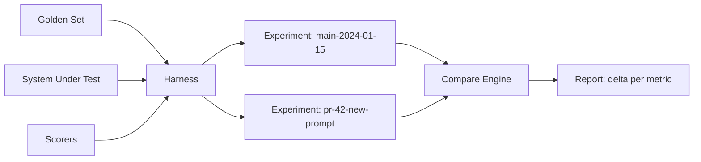

**النوع:** بناء
**اللغات:** Python
**المتطلبات:** 05-metrics-that-matter, 06-llm-as-judge, 07-pairwise-and-reference-evals
**الوقت:** ~75 دقيقة
**أهداف التعلّم:**
- بناء eval harness (منظومة تقييم) كاملة من الصفر: محمّل بيانات، مشغّل نظام، خط أنابيب للمقيّمين (scorers)، مخزن نتائج، ومحرّك مقارنة
- تشغيل تجربة على golden set من 10 حالات مع ثلاثة مقيّمين وتفسير تقرير المقارنة
- استبدال كل طبقة من المنظومة بـ Braintrust وفهم ما الذي يجرّده عنك الإطار (framework)
- الاختيار بين Braintrust وLangSmith وArize Phoenix بناءً على قيود الفريق

---

## MOTTO

**ابنِ المنظومة بنفسك أولاً. عندها ستعرف بالضبط ما الذي يفعله الإطار نيابةً عنك.**

---

## المشكلة

كتبت مقيّماً بأسلوب LLM-as-judge في الدرس الماضي. لديك golden set. تشغّل التقييم يدوياً: تمرّ على الحالات، تستدعي النموذج، تطبع النتائج. ينجح مرة واحدة.

ثم تغيّر الـ prompt. الآن تحتاج إلى مقارنته بالتشغيل السابق. لكنك لم تحفظ النتائج السابقة في أي مكان. تعيد التشغيل، لكن النموذج صار مختلفاً قليلاً والأرقام انزاحت. أي تشغيل كان هو خط الأساس (baseline)؟

هنا تهدر الفرق ساعات. لديها مقيّمون لكن بلا منظومة. المنظومة هي البنية التحتية المحيطة بالمقيّمين:
- طريقة متّسقة لتحميل مجموعة البيانات
- سجل مُؤرّخ بالإصدارات لكل تشغيل تجربة
- محرّك مقارنة يحسب الفرق بين تشغيلين على مستوى المقياس (metric)
- تقرير يعرض معدّل النجاح، ومتوسط الدرجة، والفرق (delta) مقابل خط الأساس

بدون المنظومة، تصبح التقييمات ارتجالية. مهندسان يشغّلان التقييم نفسه في اليوم نفسه فيحصلان على نتائج مختلفة لأنهما شغّلاه بطريقتين مختلفتين. لا أحد يعرف أي نسخة من الـ prompt تقابل أي تشغيل. يتحوّل التقييم إلى مسرحية.

---

## المفهوم

### تشريح المنظومة

تتكوّن eval harness من خمس طبقات. كل طبقة يمكن استبدالها باستقلالية:

```
+------------------+
|  Dataset Loader  |  Loads cases from JSON/CSV/YAML; provides input + expected output
+------------------+
         |
+------------------+
|  System Runner   |  Calls the AI system under test; returns actual output
+------------------+
         |
+------------------+
|  Scorer Pipeline |  Applies N scorers to (case, actual); returns {scorer: score}
+------------------+
         |
+------------------+
|  Results Store   |  Persists {experiment, case, scores} to disk or DB
+------------------+
         |
+------------------+
| Comparison Engine|  Diffs two experiments; flags regressions
+------------------+
```

### تشغيل التجارب

في كل مرة تشغّل المنظومة، تنشئ تجربة (experiment): لقطة مُسمّاة من المدخلات والمخرجات والدرجات. يمكنك مقارنة أي تجربتين.



### واجهة المقيّم

كل مقيّم يتبع التوقيع (signature) نفسه:

```
scorer(case: dict, actual: str) -> float  (0.0 to 1.0)
```

تستدعي المنظومة جميع المقيّمين لكل حالة وتخزّن النتائج. يمكنك إضافة مقيّمين أو إزالتهم دون المساس ببقية المنظومة.

### ثلاثة مقيّمين شائعين

```
EXACT MATCH           FUZZY MATCH           FORMAT COMPLIANCE
-------------         -----------           -----------------
actual.strip() ==     difflib.ratio() >     re.match(pattern,
expected.strip()      threshold             actual) is not None

Score: 0.0 or 1.0     Score: 0.0 or 1.0     Score: 0.0 or 1.0
Use: structured       Use: near-duplicate   Use: JSON, SQL,
output, SQL, code     prose answers         markdown required
```

---

## البناء

### eval harness الكاملة

```python
# code/main.py
import json
import os
import difflib
import re
import statistics
from datetime import datetime
from pathlib import Path
from typing import Callable

from anthropic import Anthropic

client = Anthropic()

class EvalHarness:
    def __init__(
        self,
        dataset: list[dict],
        system_fn: Callable[[dict], str],
        scorers: dict[str, Callable[[dict, str], float]],
        results_dir: str = "eval_results"
    ):
        self.dataset = dataset
        self.system_fn = system_fn
        self.scorers = scorers
        self.results_dir = Path(results_dir)
        self.results_dir.mkdir(exist_ok=True)

    def run(self, experiment_name: str) -> dict:
        """
        Run the system on all cases in the dataset, score each, store results.
        Returns the full experiment record.
        """
        results = []
        for case in self.dataset:
            actual = self.system_fn(case)
            scores = {name: scorer(case, actual) for name, scorer in self.scorers.items()}
            results.append({
                "case_id": case.get("id", ""),
                "input": case.get("input", ""),
                "expected": case.get("expected", ""),
                "actual": actual,
                "scores": scores
            })

        experiment = {
            "name": experiment_name,
            "timestamp": datetime.utcnow().isoformat(),
            "n": len(results),
            "results": results
        }

        path = self.results_dir / f"{experiment_name}.json"
        path.write_text(json.dumps(experiment, indent=2))
        return experiment

    def compare(self, experiment_a: str, experiment_b: str) -> dict:
        """
        Load two experiments and compute per-metric delta.
        Returns comparison report with regression flags.
        """
        path_a = self.results_dir / f"{experiment_a}.json"
        path_b = self.results_dir / f"{experiment_b}.json"
        exp_a = json.loads(path_a.read_text())
        exp_b = json.loads(path_b.read_text())

        def summarize(exp: dict) -> dict:
            all_scores = {}
            for result in exp["results"]:
                for metric, score in result["scores"].items():
                    all_scores.setdefault(metric, []).append(score)
            return {
                metric: {
                    "mean": statistics.mean(scores),
                    "pass_rate": sum(1 for s in scores if s >= 1.0) / len(scores)
                }
                for metric, scores in all_scores.items()
            }

        summary_a = summarize(exp_a)
        summary_b = summarize(exp_b)
        metrics = set(summary_a) | set(summary_b)

        comparison = {}
        for metric in metrics:
            a = summary_a.get(metric, {})
            b = summary_b.get(metric, {})
            delta_mean = b.get("mean", 0) - a.get("mean", 0)
            comparison[metric] = {
                "a_mean": round(a.get("mean", 0), 4),
                "b_mean": round(b.get("mean", 0), 4),
                "delta": round(delta_mean, 4),
                "regression": delta_mean < -0.03  # >3% drop is a regression
            }

        return {
            "experiment_a": experiment_a,
            "experiment_b": experiment_b,
            "metrics": comparison
        }

    def report(self, experiment_name: str) -> None:
        """Print a summary table for one experiment."""
        path = self.results_dir / f"{experiment_name}.json"
        exp = json.loads(path.read_text())

        all_scores: dict[str, list] = {}
        for result in exp["results"]:
            for metric, score in result["scores"].items():
                all_scores.setdefault(metric, []).append(score)

        print(f"\nExperiment: {experiment_name} ({exp['n']} cases)")
        print(f"{'Metric':<25} {'Mean':>8} {'Pass Rate':>10}")
        print("-" * 45)
        for metric, scores in all_scores.items():
            mean = statistics.mean(scores)
            pass_rate = sum(1 for s in scores if s >= 1.0) / len(scores)
            print(f"  {metric:<23} {mean:>8.3f} {pass_rate:>9.0%}")
```

### ثلاثة مقيّمين

```python
def exact_match(case: dict, actual: str) -> float:
    expected = case.get("expected", "").strip()
    return 1.0 if actual.strip() == expected else 0.0

def fuzzy_match(case: dict, actual: str, threshold: float = 0.7) -> float:
    expected = case.get("expected", "").strip()
    ratio = difflib.SequenceMatcher(None, actual.lower(), expected.lower()).ratio()
    return 1.0 if ratio >= threshold else 0.0

def format_compliance(case: dict, actual: str) -> float:
    """Checks that the output contains a JSON-parseable object."""
    try:
        text = actual.strip()
        if text.startswith("```"):
            text = text.split("```")[1]
            if text.startswith("json"):
                text = text[4:]
        json.loads(text.strip())
        return 1.0
    except (json.JSONDecodeError, IndexError):
        return 0.0
```

### شغّلها

```python
def system_under_test(case: dict) -> str:
    response = client.messages.create(
        model="claude-3-5-haiku-20241022",
        max_tokens=200,
        system=case.get("system_prompt", "Answer the question."),
        messages=[{"role": "user", "content": case["input"]}]
    )
    return response.content[0].text

golden_set = [
    {"id": "q1", "input": "What is 2 + 2?", "expected": "4", "system_prompt": "Answer with just the number."},
    {"id": "q2", "input": "Capital of France?", "expected": "Paris", "system_prompt": "Answer with one word."},
    # ... 8 more cases
]

harness = EvalHarness(
    dataset=golden_set,
    system_fn=system_under_test,
    scorers={
        "exact_match": exact_match,
        "fuzzy_match": fuzzy_match,
        "format_compliance": format_compliance
    }
)

harness.run("baseline")
harness.run("new-prompt")
comparison = harness.compare("baseline", "new-prompt")
harness.report("new-prompt")
```

يبدو ناتج المقارنة هكذا:

```
Metric          A Mean    B Mean    Delta   Regression?
-----------     ------    ------    -----   -----------
exact_match      0.800     0.900   +0.100   No
fuzzy_match      0.850     0.900   +0.050   No
format_comp      1.000     0.800   -0.200   YES
```

> **اختبار من الواقع:** تستغرق eval harness لديك 45 دقيقة للتشغيل على golden set من 500 حالة. تريد تشغيلها على كل PR. ما هما الطريقتان لتسريعها دون تقليل التغطية لأهمّ حالاتك؟ أولاً: أنشئ "smoke set" من 20-30 حالة عالية الأولوية (تلك التي التقطت تاريخياً حالات الانحدار regressions) وشغّل الـ smoke set فقط على الـ PRs. شغّل مجموعة الـ 500 حالة الكاملة فقط عند الدمج إلى main. ثانياً: وازِ تشغيل مشغّل النظام باستخدام asyncio أو thread pool، لأن معظم الوقت هو زمن تأخير الشبكة من استدعاءات الـ LLM. الاثنان معاً يقلّصان عادةً الـ 45 دقيقة إلى أقل من 8.

---

## الاستخدام

### استبدال كل طبقة بـ Braintrust

```python
# pip install braintrust
import braintrust

results = braintrust.Eval(
    "my-chatbot",                           # project name
    data=lambda: [                          # replaces: dataset loader
        {
            "input": case["input"],
            "expected": case.get("expected")
        }
        for case in golden_set
    ],
    task=lambda input: system_under_test({"input": input}),  # replaces: system runner
    scores=[                                # replaces: scorer pipeline
        braintrust.Levenshtein,             # built-in fuzzy scorer
        braintrust.ExactMatch,              # built-in exact scorer
        my_format_scorer                    # custom scorer
    ],
    experiment_name="new-prompt"           # replaces: results store naming
)
```

مقيّمون جاهزون تحصل عليهم مجاناً: `Levenshtein`, `ExactMatch`, `NumericDiff`, `ClosedQA` (LLM judge), `Factuality`, `Summary`.

مقيّم مخصّص لـ Braintrust:

```python
from braintrust import Score

def my_format_scorer(input, output, expected, **kwargs) -> Score:
    try:
        json.loads(output.strip())
        return Score(name="format_compliance", score=1.0)
    except json.JSONDecodeError:
        return Score(name="format_compliance", score=0.0, metadata={"output": output[:100]})
```

يستبدل Braintrust: `harness.compare()` (واجهة مقارنة في المتصفح)، و`harness.report()` (لوحة تحكم بسجلّ تاريخي)، و`results_dir` (يخزّن Braintrust جميع التشغيلات مع فروقات كاملة).

**اختيار منصّتك:**

```
BRAINTRUST                    LANGSMITH                    ARIZE PHOENIX
-------------                 -----------                  -------------
Best for: eval-first teams    Best for: LangChain shops    Best for: open-source,
                              or teams already using       self-hosted, OTel-native
                              LangSmith for tracing        teams

Key strength: experiment       Key strength: tracing +      Key strength: open-source,
comparison UI is excellent     eval in one tool, tight      runs in your infra,
                              LangChain integration        OpenTelemetry native

Choose this if: you run         Choose this if: you use      Choose this if: data
evals more than traces;        LangChain or LangGraph;      cannot leave your infra;
team needs shared view         you want traces + evals      you want OTel gen_ai.*
of eval history                in one place                 spans for free
```

> **نقلة في المنظور:** يقول فريق الأمن في شركتك إنه لا يمكنك إرسال مخرجات النموذج إلى منصّة تقييم خارجية (طرف ثالث). كيف يغيّر هذا اختيار أدواتك، وماذا تتنازل عنه؟ Arize Phoenix هو الخيار المستضاف ذاتياً (self-hosted): شغّله داخل الـ VPC الخاص بك، وتبقى كل البيانات على بنيتك التحتية. ما الذي تتنازل عنه: واجهة المقارنة المصقولة في Braintrust، والتخزين المُدار والمشاركة الفريقية في Braintrust/LangSmith، والسجل التاريخي التلقائي للتجارب دون أن تصون البنية التحتية بنفسك. المنظومة محلية الصنع من النصف الأول من هذا الدرس هي خيارك الآخر، ولا تكلّف شيئاً سوى وقت الهندسة.

---

## التسليم

ناتج هذا الدرس هو `outputs/skill-eval-harness.md`: دليل كامل لـ eval harness مع قوالب جاهزة للنسخ واللصق.

---

## التقييم

**كيف تعرف أن منظومتك تعمل بشكل صحيح:**

اختبار دخان (smoke test) لسلامة المنظومة: أنشئ 5 حالات تعرف فيها النتيجة المتوقّعة بالضبط (مدخلات ثابتة ومخرجات متوقّعة حتمية). شغّل المنظومة. تحقّق أن الدرجات تطابق توقّعاتك المحسوبة يدوياً تماماً. إن لم تطابق، فهناك خلل في المقيّم أو في حلقة المنظومة.

فحص الحتمية (determinism): شغّل التجربة نفسها مرتين على نظام حتمي (temperature=0، بلا استدعاءات أدوات). حمّل ملفّي النتائج وقارن كل درجة. يجب أن تتطابق حتى الخانة العشرية الثالثة. إن اختلفت، فلديك لا-حتمية في مكان ما داخل منطق المقيّم.

ثبات خط الأساس (baseline immutability): بمجرد أن توسم تجربة بأنها "baseline"، يجب ألّا تُعاد لتحديث النتائج أبداً. إن أعدت التشغيل على الكود نفسه ومجموعة البيانات نفسها، يجب أن ينتج التشغيل الجديد نتائج مطابقة. إن لم يفعل، فنظامك لا-حتمي وستكون المقارنات غير موثوقة. أصلح اللا-حتمية قبل أن تثق بتقارير المقارنة.

معايرة علامة الانحدار (regression flag): احقن انحداراً معروفاً (prompt مكسور عمداً يُدهور أحد المقاييس بنسبة 10%). تحقّق أن محرّك المقارنة لديك يضع له علامة. ثم احقن تغييراً بنسبة 1% (ضمن الضجيج noise). تحقّق أنه لا يضع له علامة. قد تحتاج عتبة الـ 3% لديك إلى ضبط بناءً على التباين الطبيعي لمقيّمك.

توافق المقيّمين: لكل من fuzzy_match وexact_match، شغّلهما على الحالات نفسها. الحالات التي ينجح فيها الـ fuzzy ويفشل فيها الـ exact هي حالاتك "قريبة الإصابة" (near-miss): مفيدة للمراجعة يدوياً لتقرير ما إذا كان عليك تضييق المعايير.
