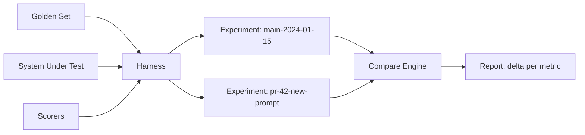

**Type:** Build
**Languages:** Python
**Prerequisites:** 05-metrics-that-matter, 06-llm-as-judge, 07-pairwise-and-reference-evals
**Time:** ~75 min
**Learning Objectives:**
- Build a full eval harness from scratch: dataset loader, system runner, scorer pipeline, results store, comparison engine
- Run an experiment against a 10-case golden set with three scorers and interpret the comparison report
- Replace each harness layer with Braintrust and understand what the framework abstracts
- Choose between Braintrust, LangSmith, and Arize Phoenix based on team constraints

---

## MOTTO

**Build the harness yourself first. Then you'll know exactly what the framework is doing for you.**

---

## THE PROBLEM

You wrote an LLM-as-judge scorer last lesson. You have a golden set. You run the eval by hand: loop through cases, call the model, print results. It works once.

Then you change the prompt. Now you need to compare to the previous run. But you didn't save the previous results anywhere. You re-run it, but now the model is slightly different and the numbers shifted. Which run was the baseline?

This is where teams waste hours. They have scorers but no harness. A harness is the infrastructure around the scorers:
- A consistent way to load the dataset
- A versioned record of every experiment run
- A comparison engine that diffs two runs at the metric level
- A report that shows pass rate, mean score, and delta vs baseline

Without the harness, evals are ad hoc. Two engineers run the same eval on the same day and get different results because they ran it differently. No one knows which version of the prompt corresponds to which run. The eval becomes theater.

---

## THE CONCEPT

### Harness Anatomy

An eval harness has five layers. Each layer can be swapped independently:

```
+------------------+
|  Dataset Loader  |  Loads cases from JSON/CSV/YAML; provides input + expected output
+------------------+
         |
+------------------+
|  System Runner   |  Calls the AI system under test; returns actual output
+------------------+
         |
+------------------+
|  Scorer Pipeline |  Applies N scorers to (case, actual); returns {scorer: score}
+------------------+
         |
+------------------+
|  Results Store   |  Persists {experiment, case, scores} to disk or DB
+------------------+
         |
+------------------+
| Comparison Engine|  Diffs two experiments; flags regressions
+------------------+
```

### Experiment Runs

Every time you run the harness, you create an experiment: a named snapshot of inputs, outputs, and scores. You can compare any two experiments.



### Scorer Interface

Every scorer follows the same signature:

```
scorer(case: dict, actual: str) -> float  (0.0 to 1.0)
```

The harness calls all scorers for each case and stores the results. You can add or remove scorers without touching the rest of the harness.

### Three Common Scorers

```
EXACT MATCH           FUZZY MATCH           FORMAT COMPLIANCE
-------------         -----------           -----------------
actual.strip() ==     difflib.ratio() >     re.match(pattern,
expected.strip()      threshold             actual) is not None

Score: 0.0 or 1.0     Score: 0.0 or 1.0     Score: 0.0 or 1.0
Use: structured       Use: near-duplicate   Use: JSON, SQL,
output, SQL, code     prose answers         markdown required
```

---

## BUILD IT

### The Full Eval Harness

```python
# code/main.py
import json
import os
import difflib
import re
import statistics
from datetime import datetime
from pathlib import Path
from typing import Callable

from anthropic import Anthropic

client = Anthropic()

class EvalHarness:
    def __init__(
        self,
        dataset: list[dict],
        system_fn: Callable[[dict], str],
        scorers: dict[str, Callable[[dict, str], float]],
        results_dir: str = "eval_results"
    ):
        self.dataset = dataset
        self.system_fn = system_fn
        self.scorers = scorers
        self.results_dir = Path(results_dir)
        self.results_dir.mkdir(exist_ok=True)

    def run(self, experiment_name: str) -> dict:
        """
        Run the system on all cases in the dataset, score each, store results.
        Returns the full experiment record.
        """
        results = []
        for case in self.dataset:
            actual = self.system_fn(case)
            scores = {name: scorer(case, actual) for name, scorer in self.scorers.items()}
            results.append({
                "case_id": case.get("id", ""),
                "input": case.get("input", ""),
                "expected": case.get("expected", ""),
                "actual": actual,
                "scores": scores
            })

        experiment = {
            "name": experiment_name,
            "timestamp": datetime.utcnow().isoformat(),
            "n": len(results),
            "results": results
        }

        path = self.results_dir / f"{experiment_name}.json"
        path.write_text(json.dumps(experiment, indent=2))
        return experiment

    def compare(self, experiment_a: str, experiment_b: str) -> dict:
        """
        Load two experiments and compute per-metric delta.
        Returns comparison report with regression flags.
        """
        path_a = self.results_dir / f"{experiment_a}.json"
        path_b = self.results_dir / f"{experiment_b}.json"
        exp_a = json.loads(path_a.read_text())
        exp_b = json.loads(path_b.read_text())

        def summarize(exp: dict) -> dict:
            all_scores = {}
            for result in exp["results"]:
                for metric, score in result["scores"].items():
                    all_scores.setdefault(metric, []).append(score)
            return {
                metric: {
                    "mean": statistics.mean(scores),
                    "pass_rate": sum(1 for s in scores if s >= 1.0) / len(scores)
                }
                for metric, scores in all_scores.items()
            }

        summary_a = summarize(exp_a)
        summary_b = summarize(exp_b)
        metrics = set(summary_a) | set(summary_b)

        comparison = {}
        for metric in metrics:
            a = summary_a.get(metric, {})
            b = summary_b.get(metric, {})
            delta_mean = b.get("mean", 0) - a.get("mean", 0)
            comparison[metric] = {
                "a_mean": round(a.get("mean", 0), 4),
                "b_mean": round(b.get("mean", 0), 4),
                "delta": round(delta_mean, 4),
                "regression": delta_mean < -0.03  # >3% drop is a regression
            }

        return {
            "experiment_a": experiment_a,
            "experiment_b": experiment_b,
            "metrics": comparison
        }

    def report(self, experiment_name: str) -> None:
        """Print a summary table for one experiment."""
        path = self.results_dir / f"{experiment_name}.json"
        exp = json.loads(path.read_text())

        all_scores: dict[str, list] = {}
        for result in exp["results"]:
            for metric, score in result["scores"].items():
                all_scores.setdefault(metric, []).append(score)

        print(f"\nExperiment: {experiment_name} ({exp['n']} cases)")
        print(f"{'Metric':<25} {'Mean':>8} {'Pass Rate':>10}")
        print("-" * 45)
        for metric, scores in all_scores.items():
            mean = statistics.mean(scores)
            pass_rate = sum(1 for s in scores if s >= 1.0) / len(scores)
            print(f"  {metric:<23} {mean:>8.3f} {pass_rate:>9.0%}")
```

### Three Scorers

```python
def exact_match(case: dict, actual: str) -> float:
    expected = case.get("expected", "").strip()
    return 1.0 if actual.strip() == expected else 0.0

def fuzzy_match(case: dict, actual: str, threshold: float = 0.7) -> float:
    expected = case.get("expected", "").strip()
    ratio = difflib.SequenceMatcher(None, actual.lower(), expected.lower()).ratio()
    return 1.0 if ratio >= threshold else 0.0

def format_compliance(case: dict, actual: str) -> float:
    """Checks that the output contains a JSON-parseable object."""
    try:
        text = actual.strip()
        if text.startswith("```"):
            text = text.split("```")[1]
            if text.startswith("json"):
                text = text[4:]
        json.loads(text.strip())
        return 1.0
    except (json.JSONDecodeError, IndexError):
        return 0.0
```

### Run It

```python
def system_under_test(case: dict) -> str:
    response = client.messages.create(
        model="claude-3-5-haiku-20241022",
        max_tokens=200,
        system=case.get("system_prompt", "Answer the question."),
        messages=[{"role": "user", "content": case["input"]}]
    )
    return response.content[0].text

golden_set = [
    {"id": "q1", "input": "What is 2 + 2?", "expected": "4", "system_prompt": "Answer with just the number."},
    {"id": "q2", "input": "Capital of France?", "expected": "Paris", "system_prompt": "Answer with one word."},
    # ... 8 more cases
]

harness = EvalHarness(
    dataset=golden_set,
    system_fn=system_under_test,
    scorers={
        "exact_match": exact_match,
        "fuzzy_match": fuzzy_match,
        "format_compliance": format_compliance
    }
)

harness.run("baseline")
harness.run("new-prompt")
comparison = harness.compare("baseline", "new-prompt")
harness.report("new-prompt")
```

The compare output looks like:

```
Metric          A Mean    B Mean    Delta   Regression?
-----------     ------    ------    -----   -----------
exact_match      0.800     0.900   +0.100   No
fuzzy_match      0.850     0.900   +0.050   No
format_comp      1.000     0.800   -0.200   YES
```

> **Real-world check:** Your eval harness takes 45 minutes to run on your 500-case golden set. You want to run it on every PR. What are two ways to speed it up without reducing coverage of your most important cases? First: create a "smoke set" of 20-30 high-priority cases (the ones that historically catch regressions) and run only the smoke set on PRs. Run the full 500-case set only on merge to main. Second: parallelize the system runner using asyncio or a thread pool, since most of the time is network latency from LLM calls. Both together typically cut 45 minutes to under 8.

---

## USE IT

### Replace Each Layer with Braintrust

```python
# pip install braintrust
import braintrust

results = braintrust.Eval(
    "my-chatbot",                           # project name
    data=lambda: [                          # replaces: dataset loader
        {
            "input": case["input"],
            "expected": case.get("expected")
        }
        for case in golden_set
    ],
    task=lambda input: system_under_test({"input": input}),  # replaces: system runner
    scores=[                                # replaces: scorer pipeline
        braintrust.Levenshtein,             # built-in fuzzy scorer
        braintrust.ExactMatch,              # built-in exact scorer
        my_format_scorer                    # custom scorer
    ],
    experiment_name="new-prompt"           # replaces: results store naming
)
```

Built-in scorers you get for free: `Levenshtein`, `ExactMatch`, `NumericDiff`, `ClosedQA` (LLM judge), `Factuality`, `Summary`.

Custom scorer for Braintrust:

```python
from braintrust import Score

def my_format_scorer(input, output, expected, **kwargs) -> Score:
    try:
        json.loads(output.strip())
        return Score(name="format_compliance", score=1.0)
    except json.JSONDecodeError:
        return Score(name="format_compliance", score=0.0, metadata={"output": output[:100]})
```

Braintrust replaces: `harness.compare()` (comparison UI in browser), `harness.report()` (dashboard with history), and `results_dir` (Braintrust stores all runs with full diffs).

**Choosing your platform:**

```
BRAINTRUST                    LANGSMITH                    ARIZE PHOENIX
-------------                 -----------                  -------------
Best for: eval-first teams    Best for: LangChain shops    Best for: open-source,
                              or teams already using       self-hosted, OTel-native
                              LangSmith for tracing        teams

Key strength: experiment       Key strength: tracing +      Key strength: open-source,
comparison UI is excellent     eval in one tool, tight      runs in your infra,
                              LangChain integration        OpenTelemetry native

Choose this if: you run         Choose this if: you use      Choose this if: data
evals more than traces;        LangChain or LangGraph;      cannot leave your infra;
team needs shared view         you want traces + evals      you want OTel gen_ai.*
of eval history                in one place                 spans for free
```

> **Perspective shift:** Your company's security team says you can't send model outputs to a third-party eval platform. How does this change your tooling choice, and what do you give up? Arize Phoenix is the self-hosted option: run it inside your VPC, all data stays on your infrastructure. What you give up: Braintrust's polished comparison UI, Braintrust/LangSmith's managed storage and team sharing, and automatic experiment history without maintaining the infrastructure yourself. The homegrown harness from the first half of this lesson is your other option and costs nothing except engineering time.

---

## SHIP IT

The artifact for this lesson is `outputs/skill-eval-harness.md`: a complete eval harness guide with copy-paste templates.

---

## EVALUATE IT

**How to know your harness is working correctly:**

Smoke test for harness integrity: create 5 cases where you know the exact expected outcome (fixed inputs and deterministic expected outputs). Run the harness. Verify scores match your hand-calculated expectations exactly. If they do not, there is a bug in the scorer or the harness loop.

Determinism check: run the same experiment twice against a deterministic system (temperature=0, no tool calls). Load both result files and compare every score. They must be identical to the third decimal place. If they differ, you have non-determinism somewhere in your scorer logic.

Baseline immutability: once you tag an experiment as "baseline," it should never be re-run to update results. If you re-run against the same code and same dataset, the new run should produce identical results. If it does not, your system is non-deterministic and comparisons will be unreliable. Fix non-determinism before trusting comparison reports.

Regression flag calibration: inject a known regression (a deliberately broken prompt that degrades one metric by 10%). Verify your comparison engine flags it. Then inject a 1% change (within noise). Verify it does not flag it. Your 3% threshold may need tuning based on your scorer's natural variance.

Scorer agreement: for fuzzy_match and exact_match, run both on the same cases. Cases where fuzzy passes but exact fails are your "near-miss" cases: useful to review manually to decide whether to tighten criteria.
