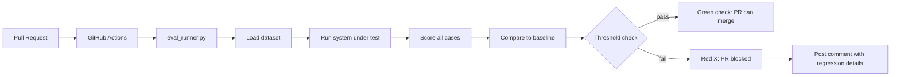

**النوع:** بناء
**اللغات:** Python
**المتطلبات:** 07-pairwise-and-reference-evals, 08-eval-harnesses
**الوقت:** ~60 دقيقة
**أهداف التعلّم:**
- بناء مشغّل تقييم (eval runner) جاهز للـ CI يخرج بالرمز 1 عند حدوث انحدار (regression) في المقاييس
- ربط مشغّل التقييم بسير عمل GitHub Actions يعمل على كل PR
- ضبط العتبات (thresholds) بذكاء لتجنّب الإيجابيات الكاذبة الناتجة عن الضجيج (noise)
- التعامل مع التغييرات السلوكية المقصودة دون حجب خط أنابيب الـ CI

---

## MOTTO

**إذا لم يكن تقييمك يُفشل البناء (build)، فهو ليس CI. إنه تقرير يتجاهله الجميع.**

---

## المشكلة

لدى فريقك eval harness. تشغّلها يدوياً قبل التسليم. أحياناً.

في الأشهر الثلاثة الماضية، وصل انحداران (regressions) إلى الإنتاج:
1. غيّر مهندس مبتدئ الـ system prompt إلى "كن موجزاً" فأزال عن غير قصد التعليمة بإعادة JSON دائماً. هبط الالتزام بالصيغة (format compliance) إلى 0%. لم يشغّل أحد التقييمات قبل دمج الـ PR.
2. ترقية للنموذج من claude-3-haiku إلى claude-3-5-sonnet غيّرت النبرة بما يكفي بحيث صارت 15% من الردود تفشل في فاحص "النبرة المهنية". لم يلتقطها أحد إلى أن اشتكى عميل.

كان كلا الانحدارين قابلاً للاكتشاف. كانت لدى eval harness المقيّمون الصحيحون. المشكلة كانت في العملية (process): كانت التقييمات اختيارية، يدوية، وسهلة التخطّي تحت ضغط المواعيد النهائية.

الـ CI للـ prompts هو الحل. يصبح مشغّل التقييم فحصاً إلزامياً (required check) على كل pull request. إذا هبطت الأمانة (faithfulness) بنسبة 4%، لا يمكن دمج الـ PR. يفشل البناء. على المهندس أن يشرح السبب.

هذا يغيّر سلوك الفريق. تتوقّف الـ prompts عن كونها "مجرّد نص" وتبدأ بكونها كوداً تحت الاختبار.

---

## المفهوم

### ما الذي يعنيه "CI للـ Prompts"

في هندسة البرمجيات، يشغّل الـ CI مجموعة اختباراتك على كل تغيير في الكود ويُفشل البناء إذا فشلت الاختبارات. يطبّق الـ CI للـ prompts الانضباط نفسه على سلوك نظام الـ LLM:



### تصميم العتبات

أصعب جزء في CI للـ prompts هو المعايرة. اضبط العتبات ضيّقة جداً فتحصل على إيجابيات كاذبة في كل PR. اضبطها فضفاضة جداً فتتسرّب الانحدارات.

```
THRESHOLD TYPES
--------------------------------------------------

Hard threshold (binary):          format_compliance: 0.0
  Any drop at all is a failure.   (JSON format must never regress)
  Use for: format, safety rules

Soft threshold (delta):           faithfulness: -0.03
  Allow small drops, fail on      (3% drop allowed, more = fail)
  meaningful regressions.
  Use for: quality metrics with
  natural LLM variance

Floor threshold (absolute):       exact_match >= 0.80
  Fail if score drops below a     (must maintain 80% baseline)
  minimum absolute value.
  Use for: key capability tests
```

### CI سريع مقابل CI كامل

لا يمكن لكل PR أن ينتظر 45 دقيقة حتى يكتمل تقييم من 500 حالة.

```
SMOKE SET (20-30 cases)           FULL SET (100-500 cases)
  PR trigger                        Merge to main trigger
  < 5 minutes                       Unlimited time
  High-priority cases only          Full coverage
  Catches obvious regressions       Catches subtle regressions
  Fast feedback loop                Gate before release
```

### إصدارات الـ Prompt (Versioning)

يجب أن يكون لكل prompt إصدار. ويجب أن يسجّل كل تشغيل تقييم أي إصدار prompt اختبره. هذا ما يتيح لك القول "تشغيل خط الأساس للتجربة جرى على prompt v1.2.0".

---

## البناء

### الخطوة 1: eval_runner.py

```python
# code/eval_runner.py
import argparse
import json
import os
import sys
import difflib
import statistics
from pathlib import Path
from anthropic import Anthropic

client = Anthropic()

def exact_match(case, actual):
    return 1.0 if actual.strip() == case.get("expected", "").strip() else 0.0

def fuzzy_match(case, actual, threshold=0.7):
    ratio = difflib.SequenceMatcher(None, actual.lower(), case.get("expected","").lower()).ratio()
    return 1.0 if ratio >= threshold else 0.0

def format_compliance(case, actual):
    try:
        json.loads(actual.strip())
        return 1.0
    except:
        return 0.0

SCORERS = {
    "exact_match": exact_match,
    "fuzzy_match": fuzzy_match,
    "format_compliance": format_compliance,
}

def run_experiment(dataset_path, experiment_name, results_dir="eval_results"):
    dataset = json.loads(Path(dataset_path).read_text())
    results = []
    for case in dataset:
        response = client.messages.create(
            model="claude-3-5-haiku-20241022",
            max_tokens=256,
            system=case.get("system_prompt", "Answer concisely."),
            messages=[{"role": "user", "content": case["input"]}]
        )
        actual = response.content[0].text
        scores = {name: scorer(case, actual) for name, scorer in SCORERS.items()}
        results.append({"case_id": case["id"], "actual": actual, "scores": scores})
    
    experiment = {"name": experiment_name, "n": len(results), "results": results}
    Path(results_dir).mkdir(exist_ok=True)
    Path(f"{results_dir}/{experiment_name}.json").write_text(json.dumps(experiment, indent=2))
    return experiment

def load_means(experiment_name, results_dir="eval_results"):
    exp = json.loads(Path(f"{results_dir}/{experiment_name}.json").read_text())
    all_scores = {}
    for r in exp["results"]:
        for metric, score in r["scores"].items():
            all_scores.setdefault(metric, []).append(score)
    return {m: statistics.mean(s) for m, s in all_scores.items()}

def check_thresholds(baseline_means, current_means, thresholds):
    """
    Returns list of failures. Empty list = all thresholds pass.
    thresholds: {"metric": max_allowed_drop}  e.g. {"faithfulness": 0.03}
    """
    failures = []
    for metric, max_drop in thresholds.items():
        baseline = baseline_means.get(metric, 0)
        current = current_means.get(metric, 0)
        delta = current - baseline
        if delta < -max_drop:
            failures.append({
                "metric": metric,
                "baseline": round(baseline, 4),
                "current": round(current, 4),
                "delta": round(delta, 4),
                "threshold": max_drop
            })
    return failures
```

### الخطوة 2: eval_config.yaml

```yaml
# code/eval_config.yaml
dataset: golden_set_smoke.json

scorers:
  - exact_match
  - fuzzy_match
  - format_compliance

thresholds:
  exact_match: 0.03      # allow up to 3% drop
  fuzzy_match: 0.03      # allow up to 3% drop
  format_compliance: 0.0 # any drop in format compliance fails

baseline_experiment: main
```

### الخطوة 3: نقطة دخول الـ CLI

```python
def main():
    parser = argparse.ArgumentParser(description="Run eval and check for regressions")
    parser.add_argument("--experiment", required=True, help="Name for this run")
    parser.add_argument("--baseline", required=True, help="Baseline experiment name to compare against")
    parser.add_argument("--dataset", default="golden_set_smoke.json")
    parser.add_argument("--threshold", type=float, default=0.03,
                        help="Global max allowed metric drop (override per-metric config)")
    parser.add_argument("--results-dir", default="eval_results")
    args = parser.parse_args()

    print(f"Running experiment: {args.experiment}")
    run_experiment(args.dataset, args.experiment, args.results_dir)

    baseline_means = load_means(args.baseline, args.results_dir)
    current_means = load_means(args.experiment, args.results_dir)

    thresholds = {
        "exact_match": args.threshold,
        "fuzzy_match": args.threshold,
        "format_compliance": 0.0,  # always hard threshold
    }

    failures = check_thresholds(baseline_means, current_means, thresholds)

    print("\nResults:")
    for metric in sorted(set(list(baseline_means) + list(current_means))):
        b = baseline_means.get(metric, 0)
        c = current_means.get(metric, 0)
        flag = " [REGRESSION]" if any(f["metric"] == metric for f in failures) else ""
        print(f"  {metric:<25} baseline={b:.3f}  current={c:.3f}  delta={c-b:+.3f}{flag}")

    if failures:
        print(f"\nFAILED: {len(failures)} regression(s) detected.")
        for f in failures:
            print(f"  {f['metric']}: dropped {abs(f['delta']):.1%} (threshold: {f['threshold']:.1%})")
        sys.exit(1)
    else:
        print("\nPASSED: No regressions above threshold.")
        sys.exit(0)

if __name__ == "__main__":
    main()
```

### الخطوة 4: سير عمل GitHub Actions

```yaml
# .github/workflows/eval.yml
name: Prompt Eval CI

on:
  pull_request:
    paths:
      - 'prompts/**'
      - 'src/**'
      - '.github/workflows/eval.yml'

jobs:
  eval:
    runs-on: ubuntu-latest
    timeout-minutes: 15

    steps:
      - uses: actions/checkout@v4

      - name: Set up Python
        uses: actions/setup-python@v5
        with:
          python-version: "3.11"

      - name: Install dependencies
        run: pip install anthropic pyyaml

      - name: Download baseline results
        run: |
          # Pull the stored baseline from your artifact store or a branch
          # Example: download from S3, or check in baseline JSON to repo
          echo "Baseline loaded from repo"

      - name: Run eval
        env:
          ANTHROPIC_API_KEY: ${{ secrets.ANTHROPIC_API_KEY }}
        run: |
          python eval_runner.py \
            --experiment pr-${{ github.event.pull_request.number }} \
            --baseline main \
            --dataset golden_set_smoke.json \
            --threshold 0.03

      - name: Post PR comment on failure
        if: failure()
        uses: actions/github-script@v7
        with:
          script: |
            const fs = require('fs');
            // Read results and format comment
            github.rest.issues.createComment({
              issue_number: context.issue.number,
              owner: context.repo.owner,
              repo: context.repo.repo,
              body: `## Eval CI Failed\n\nOne or more metrics regressed beyond threshold.\n\nRun \`python eval_runner.py\` locally to see details.\n\nTo override an intentional change, add \`[eval-skip: reason]\` to your PR description and get approval from a team lead.`
            });
```

منطق رمز الخروج (exit code): إذا هبط أي مقياس تجاوزاً لعتبته، فإن `sys.exit(1)` يُفشل خطوة سير العمل. يضع GitHub Actions علامة فشل على الفحص ويحجب دمج الـ PR.

> **اختبار من الواقع:** يفشل تقييم الـ CI لديك على PR يغيّر عمداً صيغة الإجابة من نقاط (bullet points) إلى نثر (prose). يهبط مقياس format_compliance إلى 0.0 لأن golden set لديك كان يتوقّع نقاطاً. كان التغيير صحيحاً. ما هي عمليتك للتعامل مع التغييرات السلوكية المقصودة في الـ CI؟ الجواب هو تجاوز (override) مرهون بالموافقة: يضيف صاحب الـ PR تعليقاً مثل `[eval-override: changing from bullet to prose format, approved by @lead]` إلى وصف الـ PR. يتحقّق سير عمل الـ CI من هذه العلامة قبل أن يُفشل البناء. بشكل منفصل، يجب تحديث golden set في PR متابِع ليعكس السلوك المتوقّع الجديد. التجاوز بوابة قصيرة الأمد، لا تخطٍّ دائم.

---

## الاستخدام

### تكامل Braintrust مع GitHub Actions

يوفّر Braintrust إجراء GitHub (GitHub Action) يستبدل المشغّل المخصّص:

```yaml
# .github/workflows/eval-braintrust.yml
name: Prompt Eval CI (Braintrust)

on:
  pull_request:

jobs:
  eval:
    runs-on: ubuntu-latest
    steps:
      - uses: actions/checkout@v4

      - name: Run Braintrust eval
        uses: brainlid/braintrust-action@v1  # or current official action
        with:
          api_key: ${{ secrets.BRAINTRUST_API_KEY }}
          project: my-chatbot
          eval_script: python eval_bt.py
          baseline: main

      - name: Check for regressions
        run: |
          # Braintrust action outputs regression status as env var
          if [ "$BRAINTRUST_REGRESSION" = "true" ]; then
            echo "Regression detected"
            exit 1
          fi
```

يعرض تعليق الـ PR من Braintrust جدولاً يقارن التجربة الحالية بخط الأساس، مع أسهم خضراء/حمراء لكل مقياس. ويربط بفرق التجربة الكامل في واجهة Braintrust.

**CI محلي الصنع مقابل CI بـ Braintrust:**

```
HOMEGROWN                          BRAINTRUST
----------                         ----------
Full control over threshold logic  Threshold config in Braintrust UI
Results stored in your repo/S3     Results stored in Braintrust
No per-case diff in PR comment     Per-case diff linked from PR comment
Works offline, no external dep     Requires Braintrust account + API key
You maintain the runner script     Runner is the Braintrust action
No experiment history UI           Full experiment history in Braintrust
```

يمنحك Braintrust: سجلاً تاريخياً تلقائياً للتجارب، وواجهة مقارنة مصقولة، وتعليق PR مع روابط فروقات لكل حالة. وتتنازل عن: التحكّم في مكان وجود النتائج، والتشغيل دون اتصال، والقدرة على تشغيل التقييمات دون خدمة خارجية.

> **نقلة في المنظور:** يسأل الـ CTO لديك "لماذا نحتاج خطوة CI منفصلة للـ prompts؟ أليست اختبارات الوحدة (unit tests) كافية؟" ما الفجوة المحدّدة التي يسدّها CI للـ prompts ولا تسدّها اختبارات الوحدة؟ تتحقّق اختبارات الوحدة من منطق الكود: عند هذا الاستدعاء للدالة، أعِد هذه القيمة. تستطيع اختبار أن الـ prompt يُمرّر إلى الـ API بشكل صحيح. لكنها لا تستطيع اختبار ما إذا كان مخرَج النموذج جيداً أصلاً، لأن النموذج ليس كوداً حتمياً. يختبر CI للـ prompts سلوك النظام على مخرجات نموذج حقيقية مقابل عتبات جودتك. سينجح اختبار الوحدة حتى لو بدأ النموذج بتوليد هراء كامل، لأن الاختبار يفحص فقط أن كودك قد عمل. أما CI للـ prompts فيلتقط ذلك.

---

## التسليم

ناتج هذا الدرس هو `outputs/skill-prompt-ci.md`: دليل إعداد CI كامل مع قوالب جاهزة للنسخ واللصق للمشغّل وسير العمل.

---

## التقييم

**كيف تعرف أن CI للـ prompts لديك موثوق:**

اختبار الإيجابيات الكاذبة: أجرِ تغييراً تافهاً وآمناً على الـ prompt (أضف مسافة واحدة، غيّر كلمة واحدة لا تؤثّر على السلوك). شغّل الـ CI. يجب أن ينجح. إن فشل، فعتباتك ضيّقة جداً أو smoke set لديك حسّاس جداً. خفّف العتبة بنقطة أو نقطتين مئويتين.

اختبار السلبيات الكاذبة: أجرِ تغييراً معروف السوء (أزِل تعليمة حرجة، غيّر صيغة JSON إلى نص عادي). شغّل الـ CI. يجب أن يفشل. إن نجح، فعتباتك فضفاضة جداً أو smoke set لديك لا يغطّي القدرة المتأثّرة. ضيّق العتبة أو أضف حالة تمارس السلوك المكسور.

هدف زمن تشغيل الـ CI: يجب أن يكتمل الـ smoke set في أقل من 10 دقائق، بما في ذلك وقت الإعداد. قِسه. إن تجاوز 10 دقائق، فالمجموعة كبيرة جداً أو تحتاج إلى موازاة استدعاءات الـ API. لن ينتظر المهندسون 15 دقيقة للحصول على تغذية راجعة؛ سيتخطّون الفحص.

معدّل الانحدار المقصود: تابع كم مرة تُستخدم علامة التجاوز (override) شهرياً. أكثر من 2-3 تجاوزات شهرياً يعني أن golden set لديك متخلّف عن السلوك المتوقّع للنظام. جدوِل تحديثاً لـ golden set.

تقادم خط الأساس: يجب تحديث تجربة خط الأساس عندما يدمج main تغييراً سلوكياً كبيراً. إذا كان عمر خط الأساس أكثر من 60 يوماً، فعتباتك تقيس مقابل سلوك لم يعد يعكس النظام الحالي.
