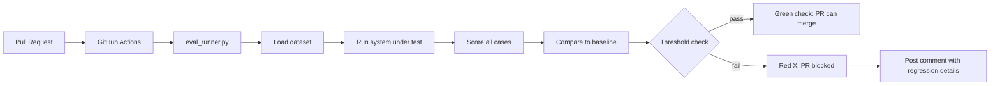

**Type:** Build
**Languages:** Python
**Prerequisites:** 07-pairwise-and-reference-evals, 08-eval-harnesses
**Time:** ~60 min
**Learning Objectives:**
- Build a CI-ready eval runner that exits with code 1 on metric regressions
- Wire the eval runner into a GitHub Actions workflow that runs on every PR
- Set thresholds intelligently to avoid false positives from noise
- Handle intentional behavioral changes without blocking the CI pipeline

---

## MOTTO

**If your eval does not fail the build, it is not CI. It is a report that everyone ignores.**

---

## THE PROBLEM

Your team has an eval harness. You run it manually before shipping. Sometimes.

In the last three months, two regressions reached production:
1. A junior engineer changed the system prompt to "be concise" and accidentally removed the instruction to always return JSON. Format compliance dropped to 0%. No one ran evals before the PR merged.
2. A model upgrade from claude-3-haiku to claude-3-5-sonnet changed the tone enough that 15% of responses now fail the "professional tone" checker. No one caught it until a customer complained.

Both regressions were detectable. The eval harness had the right scorers. The problem was process: evals were optional, manual, and easy to skip under deadline pressure.

CI for prompts is the fix. The eval runner becomes a required check on every pull request. If faithfulness drops 4%, the PR cannot merge. The build fails. The engineer has to explain why.

This changes team behavior. Prompts stop being "just text" and start being code under test.

---

## THE CONCEPT

### What "CI for Prompts" Means

In software engineering, CI runs your test suite on every code change and fails the build if tests fail. CI for prompts applies the same discipline to LLM system behavior:



### Threshold Design

The hardest part of prompt CI is calibration. Set thresholds too tight and you get false positives on every PR. Set them too loose and regressions slip through.

```
THRESHOLD TYPES
--------------------------------------------------

Hard threshold (binary):          format_compliance: 0.0
  Any drop at all is a failure.   (JSON format must never regress)
  Use for: format, safety rules

Soft threshold (delta):           faithfulness: -0.03
  Allow small drops, fail on      (3% drop allowed, more = fail)
  meaningful regressions.
  Use for: quality metrics with
  natural LLM variance

Floor threshold (absolute):       exact_match >= 0.80
  Fail if score drops below a     (must maintain 80% baseline)
  minimum absolute value.
  Use for: key capability tests
```

### Fast CI vs Full CI

Every PR cannot wait 45 minutes for a 500-case eval to complete.

```
SMOKE SET (20-30 cases)           FULL SET (100-500 cases)
  PR trigger                        Merge to main trigger
  < 5 minutes                       Unlimited time
  High-priority cases only          Full coverage
  Catches obvious regressions       Catches subtle regressions
  Fast feedback loop                Gate before release
```

### Prompt Versioning

Every prompt must have a version. Every eval run must record which prompt version it tested. This is what lets you say "experiment baseline was run against prompt v1.2.0."

---

## BUILD IT

### Step 1: eval_runner.py

```python
# code/eval_runner.py
import argparse
import json
import os
import sys
import difflib
import statistics
from pathlib import Path
from anthropic import Anthropic

client = Anthropic()

def exact_match(case, actual):
    return 1.0 if actual.strip() == case.get("expected", "").strip() else 0.0

def fuzzy_match(case, actual, threshold=0.7):
    ratio = difflib.SequenceMatcher(None, actual.lower(), case.get("expected","").lower()).ratio()
    return 1.0 if ratio >= threshold else 0.0

def format_compliance(case, actual):
    try:
        json.loads(actual.strip())
        return 1.0
    except:
        return 0.0

SCORERS = {
    "exact_match": exact_match,
    "fuzzy_match": fuzzy_match,
    "format_compliance": format_compliance,
}

def run_experiment(dataset_path, experiment_name, results_dir="eval_results"):
    dataset = json.loads(Path(dataset_path).read_text())
    results = []
    for case in dataset:
        response = client.messages.create(
            model="claude-3-5-haiku-20241022",
            max_tokens=256,
            system=case.get("system_prompt", "Answer concisely."),
            messages=[{"role": "user", "content": case["input"]}]
        )
        actual = response.content[0].text
        scores = {name: scorer(case, actual) for name, scorer in SCORERS.items()}
        results.append({"case_id": case["id"], "actual": actual, "scores": scores})
    
    experiment = {"name": experiment_name, "n": len(results), "results": results}
    Path(results_dir).mkdir(exist_ok=True)
    Path(f"{results_dir}/{experiment_name}.json").write_text(json.dumps(experiment, indent=2))
    return experiment

def load_means(experiment_name, results_dir="eval_results"):
    exp = json.loads(Path(f"{results_dir}/{experiment_name}.json").read_text())
    all_scores = {}
    for r in exp["results"]:
        for metric, score in r["scores"].items():
            all_scores.setdefault(metric, []).append(score)
    return {m: statistics.mean(s) for m, s in all_scores.items()}

def check_thresholds(baseline_means, current_means, thresholds):
    """
    Returns list of failures. Empty list = all thresholds pass.
    thresholds: {"metric": max_allowed_drop}  e.g. {"faithfulness": 0.03}
    """
    failures = []
    for metric, max_drop in thresholds.items():
        baseline = baseline_means.get(metric, 0)
        current = current_means.get(metric, 0)
        delta = current - baseline
        if delta < -max_drop:
            failures.append({
                "metric": metric,
                "baseline": round(baseline, 4),
                "current": round(current, 4),
                "delta": round(delta, 4),
                "threshold": max_drop
            })
    return failures
```

### Step 2: eval_config.yaml

```yaml
# code/eval_config.yaml
dataset: golden_set_smoke.json

scorers:
  - exact_match
  - fuzzy_match
  - format_compliance

thresholds:
  exact_match: 0.03      # allow up to 3% drop
  fuzzy_match: 0.03      # allow up to 3% drop
  format_compliance: 0.0 # any drop in format compliance fails

baseline_experiment: main
```

### Step 3: CLI entry point

```python
def main():
    parser = argparse.ArgumentParser(description="Run eval and check for regressions")
    parser.add_argument("--experiment", required=True, help="Name for this run")
    parser.add_argument("--baseline", required=True, help="Baseline experiment name to compare against")
    parser.add_argument("--dataset", default="golden_set_smoke.json")
    parser.add_argument("--threshold", type=float, default=0.03,
                        help="Global max allowed metric drop (override per-metric config)")
    parser.add_argument("--results-dir", default="eval_results")
    args = parser.parse_args()

    print(f"Running experiment: {args.experiment}")
    run_experiment(args.dataset, args.experiment, args.results_dir)

    baseline_means = load_means(args.baseline, args.results_dir)
    current_means = load_means(args.experiment, args.results_dir)

    thresholds = {
        "exact_match": args.threshold,
        "fuzzy_match": args.threshold,
        "format_compliance": 0.0,  # always hard threshold
    }

    failures = check_thresholds(baseline_means, current_means, thresholds)

    print("\nResults:")
    for metric in sorted(set(list(baseline_means) + list(current_means))):
        b = baseline_means.get(metric, 0)
        c = current_means.get(metric, 0)
        flag = " [REGRESSION]" if any(f["metric"] == metric for f in failures) else ""
        print(f"  {metric:<25} baseline={b:.3f}  current={c:.3f}  delta={c-b:+.3f}{flag}")

    if failures:
        print(f"\nFAILED: {len(failures)} regression(s) detected.")
        for f in failures:
            print(f"  {f['metric']}: dropped {abs(f['delta']):.1%} (threshold: {f['threshold']:.1%})")
        sys.exit(1)
    else:
        print("\nPASSED: No regressions above threshold.")
        sys.exit(0)

if __name__ == "__main__":
    main()
```

### Step 4: GitHub Actions Workflow

```yaml
# .github/workflows/eval.yml
name: Prompt Eval CI

on:
  pull_request:
    paths:
      - 'prompts/**'
      - 'src/**'
      - '.github/workflows/eval.yml'

jobs:
  eval:
    runs-on: ubuntu-latest
    timeout-minutes: 15

    steps:
      - uses: actions/checkout@v4

      - name: Set up Python
        uses: actions/setup-python@v5
        with:
          python-version: "3.11"

      - name: Install dependencies
        run: pip install anthropic pyyaml

      - name: Download baseline results
        run: |
          # Pull the stored baseline from your artifact store or a branch
          # Example: download from S3, or check in baseline JSON to repo
          echo "Baseline loaded from repo"

      - name: Run eval
        env:
          ANTHROPIC_API_KEY: ${{ secrets.ANTHROPIC_API_KEY }}
        run: |
          python eval_runner.py \
            --experiment pr-${{ github.event.pull_request.number }} \
            --baseline main \
            --dataset golden_set_smoke.json \
            --threshold 0.03

      - name: Post PR comment on failure
        if: failure()
        uses: actions/github-script@v7
        with:
          script: |
            const fs = require('fs');
            // Read results and format comment
            github.rest.issues.createComment({
              issue_number: context.issue.number,
              owner: context.repo.owner,
              repo: context.repo.repo,
              body: `## Eval CI Failed\n\nOne or more metrics regressed beyond threshold.\n\nRun \`python eval_runner.py\` locally to see details.\n\nTo override an intentional change, add \`[eval-skip: reason]\` to your PR description and get approval from a team lead.`
            });
```

The exit code logic: if any metric drops beyond its threshold, `sys.exit(1)` fails the workflow step. GitHub Actions marks the check as failed and blocks the PR from merging.

> **Real-world check:** Your CI eval fails on a PR that intentionally changes the answer format from bullet points to prose. The format_compliance metric drops to 0.0 because your golden set expected bullet points. The change was correct. What is your process for handling intentional behavioral changes in CI? The answer is an approval-gated override: the PR author adds a comment like `[eval-override: changing from bullet to prose format, approved by @lead]` to the PR description. The CI workflow checks for this flag before failing the build. Separately, the golden set must be updated as a follow-up PR to reflect the new expected behavior. The override is a short-term gate, not a permanent bypass.

---

## USE IT

### Braintrust GitHub Actions Integration

Braintrust provides a GitHub Action that replaces the custom runner:

```yaml
# .github/workflows/eval-braintrust.yml
name: Prompt Eval CI (Braintrust)

on:
  pull_request:

jobs:
  eval:
    runs-on: ubuntu-latest
    steps:
      - uses: actions/checkout@v4

      - name: Run Braintrust eval
        uses: brainlid/braintrust-action@v1  # or current official action
        with:
          api_key: ${{ secrets.BRAINTRUST_API_KEY }}
          project: my-chatbot
          eval_script: python eval_bt.py
          baseline: main

      - name: Check for regressions
        run: |
          # Braintrust action outputs regression status as env var
          if [ "$BRAINTRUST_REGRESSION" = "true" ]; then
            echo "Regression detected"
            exit 1
          fi
```

The Braintrust PR comment shows a table comparing the current experiment to the baseline, with green/red arrows per metric. It links to the full experiment diff in the Braintrust UI.

**Homegrown CI vs Braintrust CI:**

```
HOMEGROWN                          BRAINTRUST
----------                         ----------
Full control over threshold logic  Threshold config in Braintrust UI
Results stored in your repo/S3     Results stored in Braintrust
No per-case diff in PR comment     Per-case diff linked from PR comment
Works offline, no external dep     Requires Braintrust account + API key
You maintain the runner script     Runner is the Braintrust action
No experiment history UI           Full experiment history in Braintrust
```

Braintrust gives you: automatic experiment history, a polished comparison UI, and a PR comment with per-case diff links. You give up: control over where results live, offline operation, and the ability to run evals without an external service.

> **Perspective shift:** Your CTO asks "why do we need a separate CI step for prompts? Aren't unit tests enough?" What is the specific gap that prompt CI fills that unit tests do not? Unit tests verify code logic: given this function call, return this value. They can test that your prompt is passed to the API correctly. But they cannot test whether the model's output is any good, because the model is not deterministic code. Prompt CI tests system behavior on real model outputs against your quality thresholds. A unit test would pass even if the model started generating complete nonsense, because the test only checks that your code ran. Prompt CI catches that.

---

## SHIP IT

The artifact for this lesson is `outputs/skill-prompt-ci.md`: a complete CI setup guide with copy-paste templates for the runner and workflow.

---

## EVALUATE IT

**How to know your prompt CI is reliable:**

False positive test: make a trivial, safe prompt change (add a single space, change one word that does not affect behavior). Run CI. It must pass. If it fails, your thresholds are too tight or your smoke set is too sensitive. Back off the threshold by 1-2 percentage points.

False negative test: make a known-bad change (remove a critical instruction, change JSON format to plain text). Run CI. It must fail. If it passes, your thresholds are too loose or your smoke set does not cover the affected capability. Tighten the threshold or add a case that exercises the broken behavior.

CI runtime target: the smoke set should complete in under 10 minutes, including setup time. Measure it. If it exceeds 10 minutes, the set is too large or you need to parallelize API calls. Engineers will not wait 15 minutes for feedback; they will skip the check.

Intentional regression rate: track how often the override flag is used per month. More than 2-3 overrides per month means your golden set is out of date with the system's expected behavior. Schedule a golden set refresh.

Baseline staleness: the baseline experiment should be updated when main merges a significant behavior change. If the baseline is more than 60 days old, your thresholds are measuring against behavior that no longer reflects the current system.
