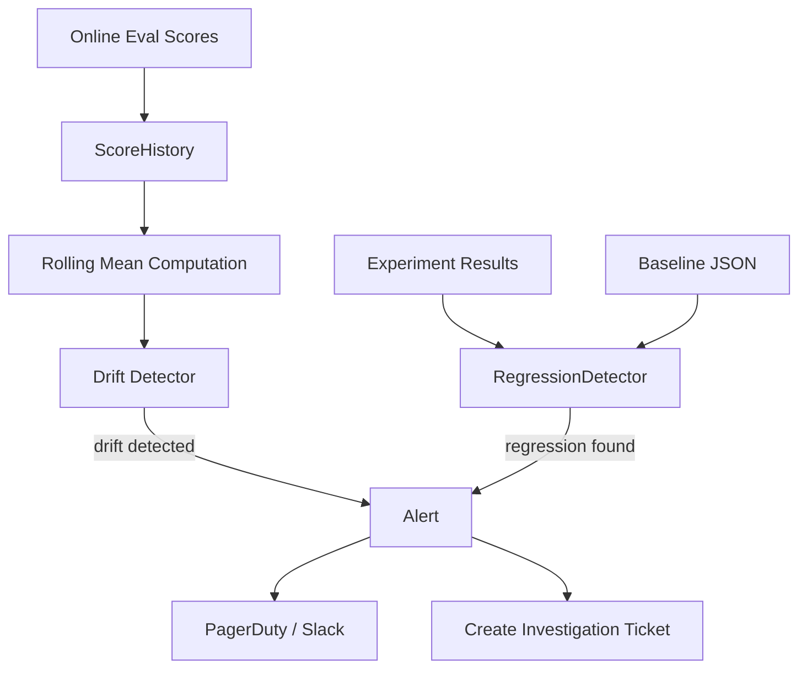

**النوع:** بناء
**اللغات:** Python
**المتطلبات:** 11-online-evals-and-feedback-loops, 08-eval-harnesses
**الوقت:** ~45 دقيقة
**أهداف التعلّم:**
- بناء متتبّع سجلّ درجات (score history) مع متوسط متحرّك (rolling mean) واكتشاف انزياح (drift detection)
- تنفيذ كاشف انحدار (regression detector) يقارن المقاييس الحالية بخط أساس مُؤرّخ بالإصدار
- ضبط عتبات تنبيه تميّز الانزياح الحقيقي عن الضجيج (noise) الطبيعي

---

## MOTTO

**هبوط جودة تكتشفه في يومين يكلّف أقلّ بعشرة أضعاف من واحد تكتشفه من تذاكر الدعم بعد أسبوعين.**

---

## المشكلة

نشرت ميزة AI مُقيَّمة جيداً. التقييمات الآنية (online evals) تعمل. الدرجات تبدو جيدة. ثم، بعد ثلاثة أسابيع، يصعّد مدير نجاح عملاء دفعة من شكاوى المستخدمين. المستخدمون يحصلون على إجابات أسوأ. تتعمّق فتجد: مزوّد نموذجك حدّث نموذجَه بهدوء قبل 10 أيام. هبطت درجاتك من 0.88 إلى 0.79 وبقيت هناك.

كانت لديك البيانات. لكن لم يكن لديك الكاشف.

هذا هو الانزياح (drift): تحوّل تدريجي أو مفاجئ في الجودة لم يُسبّبه شيء فعلته. قد يأتي من تحديثات النموذج، أو تغيّرات في توزيع مدخلات المستخدم، أو تغيّرات في العالم تؤثّر على ما يعنيه "الصحيح" لمجالك.

الانحدار (regression) ذو صلة لكنه مختلف: هبوط جودة سبّبه شيء غيّرته أنت. إصدار prompt جديد، رفع لإصدار النموذج، تحديث لإعداد الاسترجاع. يلتقط اكتشاف الانحدار هذه قبل النشر أو فوراً بعده.

تتطلّب المشكلتان الشيء نفسه: سجلّ درجات مُؤرّخ بالإصدار، وكاشف يعرف متى يكون التغيير ذا معنى مقابل كونه ضجيجاً.

---

## المفهوم

### أنواع الانزياح

```
DRIFT TAXONOMY
--------------
Input drift:    User query distribution shifts
                (e.g., new user segments asking different question types)

Output drift:   Model behavior changes without input changes
                (e.g., provider model update, API behavior change)

Concept drift:  The "right answer" for an input changes
                (e.g., your product policy changed, but the model doesn't know)
```

### العتبات المطلقة مقابل عتبات الاتجاه

```
THRESHOLD TYPES
                    ABSOLUTE                TREND
----------------    --------------------    --------------------
Definition          Score < 0.70            7-day mean drops >5%
When it fires       Single bad day          Sustained decline
False alarms        Low                     Medium (noisy data)
Detects             Catastrophic failure    Gradual degradation
Best for            Hard floor violations   Slow model drift
```

استخدم كليهما: المطلقة للأعطال الكارثية، والاتجاه للتدهور التدريجي.

### معمارية اكتشاف الانزياح



### لماذا التأريخ بالإصدار (Versioning) شرط مسبق

لا تستطيع اكتشاف الانحدار دون معرفة ما الذي تغيّر ومتى. كل نشر يحتاج وسم إصدار. كل تشغيل تقييم يحتاج تسجيل أي إصدار قيّمه. بدون هذا، لديك هبوط درجة لكن بلا فكرة عمّا سبّبه.

```
timeline without versioning:
  day 1: score = 0.88
  day 8: score = 0.81  <-- why??

timeline with versioning:
  day 1: score = 0.88, version = prompt-v3, model = claude-opus-4-5
  day 6: DEPLOY -- prompt-v4, model = claude-opus-4-5
  day 8: score = 0.81, version = prompt-v4  <-- prompt change caused regression
```

---

## البناء

### الإعداد

```bash
uv init drift-detection
cd drift-detection
uv add python-dotenv
```

### الخطوة 1: ScoreHistory

```python
from __future__ import annotations
import json
from datetime import date, timedelta
from pathlib import Path
from statistics import mean


class ScoreHistory:
    """Store and analyze daily eval scores."""

    def __init__(self, path: str = "score_history.json"):
        self.path = Path(path)
        self.history: list[dict] = []
        if self.path.exists():
            self.history = json.loads(self.path.read_text())

    def add(self, score_date: str, score: float, version: str = "unknown") -> None:
        """Append a daily score entry."""
        self.history.append({
            "date": score_date,
            "score": score,
            "version": version,
        })
        self.path.write_text(json.dumps(self.history, indent=2))

    def rolling_mean(self, window: int = 7) -> list[dict]:
        """Compute rolling mean for each date in the history."""
        if len(self.history) < window:
            return []
        
        result = []
        for i in range(window - 1, len(self.history)):
            window_scores = [self.history[j]["score"] for j in range(i - window + 1, i + 1)]
            result.append({
                "date": self.history[i]["date"],
                "rolling_mean": round(mean(window_scores), 4),
                "window": window,
            })
        return result

    def detect_drift(self, threshold: float = 0.05, window: int = 7) -> dict:
        """
        Returns drift signal if the latest 7-day mean is more than
        `threshold` below the previous 7-day mean.
        """
        means = self.rolling_mean(window=window)
        if len(means) < 2:
            return {"drift_detected": False, "reason": "insufficient history"}
        
        current_mean = means[-1]["rolling_mean"]
        previous_mean = means[-2]["rolling_mean"]
        drop = previous_mean - current_mean
        
        if drop > threshold:
            return {
                "drift_detected": True,
                "current_mean": current_mean,
                "previous_mean": previous_mean,
                "drop": round(drop, 4),
                "threshold": threshold,
                "window": window,
            }
        return {
            "drift_detected": False,
            "current_mean": current_mean,
            "previous_mean": previous_mean,
            "drop": round(drop, 4),
            "threshold": threshold,
        }

    def absolute_alert(self, floor: float = 0.70) -> dict:
        """Fire if the most recent score is below the absolute floor."""
        if not self.history:
            return {"alert": False, "reason": "no data"}
        latest = self.history[-1]
        below = latest["score"] < floor
        return {
            "alert": below,
            "date": latest["date"],
            "score": latest["score"],
            "floor": floor,
        }
```

### الخطوة 2: RegressionDetector

```python
class RegressionDetector:
    """Compare current experiment metrics against a stored baseline."""

    def __init__(self, baseline_dir: str = "baselines"):
        self.baseline_dir = Path(baseline_dir)
        self.baseline_dir.mkdir(exist_ok=True)
        self._regressions: list[dict] = []

    def save_baseline(self, experiment_name: str, metrics: dict[str, float]) -> None:
        """Save current metrics as the baseline for future comparisons."""
        path = self.baseline_dir / f"{experiment_name}.json"
        path.write_text(json.dumps({"experiment": experiment_name, "metrics": metrics}, indent=2))
        print(f"Baseline saved: {path}")

    def compare(
        self,
        experiment_name: str,
        current_metrics: dict[str, float],
        threshold: float = 0.03,
    ) -> list[dict]:
        """
        Compare current metrics to baseline.
        Flags any metric where current < baseline - threshold.
        """
        path = self.baseline_dir / f"{experiment_name}.json"
        if not path.exists():
            raise FileNotFoundError(f"No baseline found for '{experiment_name}'. Run save_baseline first.")
        
        baseline = json.loads(path.read_text())["metrics"]
        self._regressions = []
        
        for metric, baseline_value in baseline.items():
            current_value = current_metrics.get(metric)
            if current_value is None:
                continue
            
            delta = current_value - baseline_value
            if delta < -threshold:
                self._regressions.append({
                    "metric": metric,
                    "baseline": baseline_value,
                    "current": current_value,
                    "delta": round(delta, 4),
                    "threshold": threshold,
                    "regressed": True,
                })
            else:
                self._regressions.append({
                    "metric": metric,
                    "baseline": baseline_value,
                    "current": current_value,
                    "delta": round(delta, 4),
                    "threshold": threshold,
                    "regressed": False,
                })
        
        return self._regressions

    def report(self) -> None:
        """Print a formatted regression report."""
        if not self._regressions:
            print("No comparison run yet.")
            return
        
        regressions = [r for r in self._regressions if r["regressed"]]
        clean = [r for r in self._regressions if not r["regressed"]]
        
        print("\n=== REGRESSION REPORT ===")
        if regressions:
            print(f"\nREGRESSIONS FOUND ({len(regressions)}):")
            for r in regressions:
                print(f"  {r['metric']:30s}  baseline={r['baseline']:.3f}  current={r['current']:.3f}  delta={r['delta']:+.3f}")
        else:
            print("\nNo regressions found.")
        
        if clean:
            print(f"\nPASSING ({len(clean)}):")
            for r in clean:
                print(f"  {r['metric']:30s}  baseline={r['baseline']:.3f}  current={r['current']:.3f}  delta={r['delta']:+.3f}")
```

### الخطوة 3: محاكاة 30 يوماً مع حدث انزياح محقون

```python
import random
from datetime import date, timedelta

def simulate_drift_scenario():
    """
    Simulate 30 days of scores with a drift event at day 20.
    Days 1-19: stable scores around 0.88
    Days 20-30: degraded scores around 0.79 (model provider update)
    """
    history = ScoreHistory("simulated_history.json")
    
    start = date(2025, 4, 1)
    random.seed(42)
    
    for i in range(30):
        current_date = (start + timedelta(days=i)).isoformat()
        
        if i < 19:
            # Stable period
            score = round(random.gauss(0.88, 0.02), 3)
            version = "model-v1"
        else:
            # Post-drift period (silent model update at day 20)
            score = round(random.gauss(0.79, 0.025), 3)
            version = "model-v1"  # same version -- provider updated silently
        
        score = max(0.0, min(1.0, score))
        history.add(current_date, score, version)
    
    print("\n=== 30-DAY SIMULATION ===")
    print(f"Total entries: {len(history.history)}")
    
    # Check drift
    drift = history.detect_drift(threshold=0.05)
    print(f"\nDrift detection result:")
    print(json.dumps(drift, indent=2))
    
    # Check absolute floor
    absolute = history.absolute_alert(floor=0.70)
    print(f"\nAbsolute alert (floor=0.70):")
    print(json.dumps(absolute, indent=2))
    
    # Show rolling means
    means = history.rolling_mean(window=7)
    print(f"\nRolling means (last 10 days):")
    for m in means[-10:]:
        print(f"  {m['date']}: {m['rolling_mean']:.3f}")
    
    return history


def simulate_regression_scenario():
    """Show regression detection across a prompt version bump."""
    detector = RegressionDetector("baselines")
    
    # Save baseline (prompt-v3 results)
    baseline_metrics = {
        "faithfulness": 0.91,
        "answer_relevance": 0.87,
        "format_compliance": 1.00,
        "avg_latency_ms": 850,
    }
    detector.save_baseline("faq-assistant", baseline_metrics)
    print("\nBaseline saved for faq-assistant")
    
    # Simulate prompt-v4 results (faithfulness regressed)
    current_metrics = {
        "faithfulness": 0.84,     # regressed: below 0.91 - 0.03
        "answer_relevance": 0.89,  # improved
        "format_compliance": 1.00, # unchanged
        "avg_latency_ms": 820,     # slightly faster
    }
    
    comparisons = detector.compare("faq-assistant", current_metrics, threshold=0.03)
    detector.report()


if __name__ == "__main__":
    simulate_drift_scenario()
    print("\n" + "="*50)
    simulate_regression_scenario()
```

> **اختبار من الواقع:** يهبط متوسطك المتحرّك لـ 7 أيام من 0.88 إلى 0.81 لكنك لم تجرِ أي تغييرات هذا الأسبوع. حدّث مزوّد نموذجك نموذجَه بصمت. ما هي عمليتك لتأكيد أن هذا هو السبب، والتراجع (rollback) عند الحاجة، ومنع هذه المفاجأة مستقبلاً؟

ثلاث خطوات: (1) أكّد بتثبيت إصدار النموذج وإعادة تشغيل تقييم golden set مقابل معرّف النموذج القديم في مواجهة الجديد. تقدّم معظم المزوّدات معرّف نموذج مؤرّخاً (مثلاً `claude-opus-4-5-20251101`) لهذا الغرض بالضبط. إن نجح المعرّف القديم وهبط الجديد، فلديك سببك. (2) ثبّت معرّف النموذج في إعداد الإنتاج وأعد النشر لتثبيت الإصدار القديم بينما تقيّم الجديد. (3) امنع: أضف إصدار النموذج إلى كل مدخلة سجلّ تقييم، واشترك في إعلانات تحديثات النموذج من مزوّدك، وأضف خطوة CI تشغّل golden set كلما تغيّر إصدار النموذج في إعدادك.

---

## الاستخدام

يعمل ScoreHistory وRegressionDetector اليدويان، لكنهما يتطلّبان منك صيانة طبقة التخزين (persistence layer)، وبناء لوحات تحكّمك الخاصة، وربط تنبيهاتك الخاصة. يتعامل Braintrust وArize Phoenix مع هذا على نطاق واسع.

### مقارنة تجارب Braintrust

```python
import braintrust

# Run baseline experiment
baseline_experiment = braintrust.Eval(
    "faq-assistant-baseline",
    data=lambda: golden_cases,
    task=faq_assistant_v3,
    scores=[faithfulness_scorer, relevance_scorer],
)

# Run new experiment (after prompt change)
new_experiment = braintrust.Eval(
    "faq-assistant-prompt-v4",
    data=lambda: golden_cases,
    task=faq_assistant_v4,
    scores=[faithfulness_scorer, relevance_scorer],
)
```

يحسب Braintrust تلقائياً الفرق (delta) بين التجارب ويضع علامة على الانحدارات في الواجهة. تحصل على:
- عرض فرق (diff) يُظهر أي حالات اختبار تحسّنت وأيها انحدرت
- مؤشّرات دلالة إحصائية (هل هذا الفرق ضجيج أم حقيقي؟)
- رابط دائم لمشاركته مع زملائك: "هذا ما تغيّر بين v3 وv4"

```python
# You can also query experiment results programmatically
from braintrust import load_experiment

baseline = load_experiment("faq-assistant-baseline")
new_exp = load_experiment("faq-assistant-prompt-v4")

for metric in ["faithfulness", "answer_relevance"]:
    b_score = baseline.summary().scores[metric].mean
    n_score = new_exp.summary().scores[metric].mean
    delta = n_score - b_score
    print(f"{metric}: {b_score:.3f} -> {n_score:.3f} ({delta:+.3f})")
```

### Arize Phoenix لمراقبة الإنتاج

Phoenix منصّة مراقبة (observability) مفتوحة المصدر للـ LLM. تُجهّز كودك بتتبّع متوافق مع OpenTelemetry، ويتتبّع Phoenix توزيعات الدرجات عبر الزمن.

```python
import phoenix as px
from phoenix.evals import OpenAIModel, llm_classify
from openinference.instrumentation.anthropic import AnthropicInstrumentor

# Start Phoenix (runs locally or self-hosted)
session = px.launch_app()

# Instrument your model calls
AnthropicInstrumentor().instrument()

# Phoenix captures every trace automatically
# The UI shows: score distribution by day, P50/P90 trends,
# cluster analysis of inputs, anomaly detection
```

في لوحة تحكم Phoenix تحصل على:
- مخطّط سلاسل زمنية لدرجات الجودة مع نوافذ متحرّكة قابلة للضبط
- تجميع (clustering) تلقائي: المدخلات المتشابهة مجمّعة لإظهار أي أنواع الاستعلامات تتدهور
- اكتشاف انزياح مدمج: يحسب Phoenix انزياح التوزيع من نافذة مرجعية

### اليدوي مقابل الإطار

```
MANUAL (ScoreHistory + RegressionDetector)
- Full control over what you store
- No external dependencies
- Works in any environment (air-gap, serverless)
- You build and maintain the UI
- You wire up your own alerts

BRAINTRUST + PHOENIX
- Experiment comparison with one function call
- Built-in statistical significance
- Shared team dashboard
- Alerting rules with Slack/PagerDuty integration
- Query your eval data like a database
- Requires network access and vendor accounts
```

متى يفوز النهج اليدوي: النماذج الأولية المبكّرة، البيئات الخاضعة للتنظيم، حالات الاستخدام البسيطة جداً.

متى يستحقّ Braintrust + Phoenix التعقيد: عدّة نماذج، عدّة إصدارات prompt، عدّة مهندسين، مراقبة إنتاج مستمرّة.

> **نقلة في المنظور:** يقول زميل "سنلتقط الانزياح من خلال شكاوى المستخدمين". ما الخطأ في استخدام تذاكر الدعم كنظام اكتشاف انزياح لديك، وماذا يكلّفك ذلك النهج؟

تذاكر الدعم هي أكثر إشارة متأخّرة (lagged) لديك. بحلول الوقت الذي يشتكي فيه المستخدم، ويكتب تذكرة، وتُصنّف، وتُسنَد، وتصل إلى مهندس، تكون قد خسرت أياماً أو أسابيع من تجربة مستخدم متدهورة. ولتذاكر الدعم أيضاً انحياز عيّنات (sampling bias) هائل: تلتقط المستخدمين الذين يشتكون، لا المستخدمين الذين يتسرّبون بصمت. اكتشاف انزياح يلتقط هبوط جودة بنسبة 5% في يومين لا يكلّف تقريباً شيئاً مقارنةً بساعات المهندسين وتكلفة العلاقة مع العميل لاكتشافه عبر التصعيدات بعد أسبوعين.

---

## التسليم

ناتج هذا الدرس هو `outputs/skill-drift-detection.md`. راجع مجلّد المخرجات.

**ما الذي بنيته:**
- `ScoreHistory`: يخزّن درجات التقييم اليومية مع وسوم إصدار، ويحسب المتوسطات المتحرّكة، ويكتشف انزياح الاتجاه
- `RegressionDetector`: يقارن مقاييس التجربة الحالية بخط أساس مُؤرّخ بالإصدار، ويضع علامة على انحدارات المقاييس
- محاكاة لـ 30 يوماً مع حدث انزياح محقون في اليوم 20
- القدرة نفسها باستخدام مقارنة تجارب Braintrust ومراقبة Arize Phoenix

---

## التقييم

### اختبار الحساسية

احقن حدث انزياح اصطناعياً وتحقّق أن الكاشف يطلق خلال 3 أيام.

```python
def test_sensitivity():
    """Inject 10% quality drop at day 8 of a 14-day history."""
    history = ScoreHistory("test_sensitivity.json")
    
    # 7 days stable at 0.88
    for i in range(7):
        history.add(f"2025-01-0{i+1}", round(random.gauss(0.88, 0.01), 3))
    
    # 7 days degraded at 0.79 (10% drop)
    for i in range(7):
        history.add(f"2025-01-{i+8:02d}", round(random.gauss(0.79, 0.01), 3))
    
    result = history.detect_drift(threshold=0.05)
    assert result["drift_detected"], "Detector should fire on 10% quality drop"
    print(f"PASS: drift detected after {result['drop']:.3f} drop")
```

### اختبار النوعية (Specificity)

أضف ضجيجاً طبيعياً وتحقّق أن الكاشف لا يطلق (تجنّب الإنذارات الكاذبة).

```python
def test_specificity():
    """Normal noise (+-2%) should not trigger drift detection."""
    history = ScoreHistory("test_specificity.json")
    
    # 14 days with normal noise
    for i in range(14):
        score = round(random.gauss(0.88, 0.015), 3)
        history.add(f"2025-02-{i+1:02d}", score)
    
    result = history.detect_drift(threshold=0.05)
    assert not result["drift_detected"], "Should not fire on normal noise"
    print(f"PASS: no false alarm. Drop was only {result['drop']:.3f}")
```

### تأخّر التنبيه (Alerting Lag)

قِس كم يوماً يلزم لاكتشاف حدث انزياح حقيقي.

الهدف: أقل من 3 أيام لهبوط جودة بنسبة 5% باستخدام نافذة متحرّكة من 7 أيام.

الحساب: مع نافذة 7 أيام، يستغرق هبوط جديد بنسبة 5% سبعة أيام ليُشبع النافذة بالكامل. للاكتشاف خلال 3 أيام، يجب أن تكون عتبتك حوالي 2.5% (نصف الهبوط النهائي مرئي في نصف النافذة). عاير عتبتك حسب متطلّب تأخّر الاكتشاف لديك.
