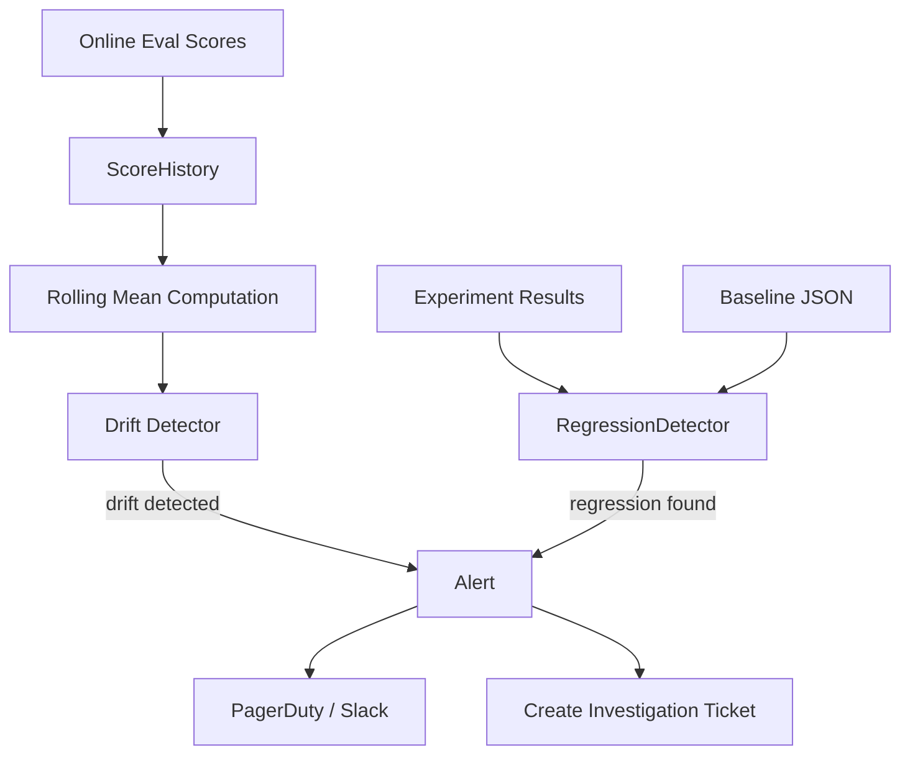

**Type:** Build
**Languages:** Python
**Prerequisites:** 11-online-evals-and-feedback-loops, 08-eval-harnesses
**Time:** ~45 min
**Learning Objectives:**
- Build a score history tracker with rolling mean and drift detection
- Implement a regression detector that compares current metrics against a versioned baseline
- Configure alerting thresholds that distinguish real drift from normal noise

---

## MOTTO

**A quality drop you detect in 2 days costs 10x less than one you discover from support tickets in 2 weeks.**

---

## THE PROBLEM

You deployed a well-evaluated AI feature. Online evals are running. Scores look fine. Then, three weeks later, a customer success manager escalates a batch of user complaints. Users are getting worse answers. You dig in and find: your model provider quietly updated their model 10 days ago. Your scores dropped from 0.88 to 0.79 and stayed there.

You had the data. You just didn't have the detector.

This is drift: a gradual or sudden shift in quality that isn't triggered by anything you did. It can come from model updates, changes in user input distribution, or changes in the world that affect what "correct" means for your domain.

Regression is related but different: a quality drop caused by something you changed. A new prompt version, a model version bump, a retrieval config update. Regression detection catches these before or immediately after deploy.

Both problems require the same thing: versioned score history and a detector that knows when a change is meaningful versus noise.

---

## THE CONCEPT

### Types of Drift

```
DRIFT TAXONOMY
--------------
Input drift:    User query distribution shifts
                (e.g., new user segments asking different question types)

Output drift:   Model behavior changes without input changes
                (e.g., provider model update, API behavior change)

Concept drift:  The "right answer" for an input changes
                (e.g., your product policy changed, but the model doesn't know)
```

### Absolute vs Trend Thresholds

```
THRESHOLD TYPES
                    ABSOLUTE                TREND
----------------    --------------------    --------------------
Definition          Score < 0.70            7-day mean drops >5%
When it fires       Single bad day          Sustained decline
False alarms        Low                     Medium (noisy data)
Detects             Catastrophic failure    Gradual degradation
Best for            Hard floor violations   Slow model drift
```

Use both: absolute for catastrophic failures, trend for gradual decay.

### Drift Detection Architecture



### Why Versioning Is Prerequisite

You can't detect regression without knowing what changed and when. Every deploy needs a version tag. Every eval run needs to record which version it evaluated. Without this, you have a score drop but no idea what caused it.

```
timeline without versioning:
  day 1: score = 0.88
  day 8: score = 0.81  <-- why??

timeline with versioning:
  day 1: score = 0.88, version = prompt-v3, model = claude-opus-4-5
  day 6: DEPLOY -- prompt-v4, model = claude-opus-4-5
  day 8: score = 0.81, version = prompt-v4  <-- prompt change caused regression
```

---

## BUILD IT

### Setup

```bash
uv init drift-detection
cd drift-detection
uv add python-dotenv
```

### Step 1: ScoreHistory

```python
from __future__ import annotations
import json
from datetime import date, timedelta
from pathlib import Path
from statistics import mean


class ScoreHistory:
    """Store and analyze daily eval scores."""

    def __init__(self, path: str = "score_history.json"):
        self.path = Path(path)
        self.history: list[dict] = []
        if self.path.exists():
            self.history = json.loads(self.path.read_text())

    def add(self, score_date: str, score: float, version: str = "unknown") -> None:
        """Append a daily score entry."""
        self.history.append({
            "date": score_date,
            "score": score,
            "version": version,
        })
        self.path.write_text(json.dumps(self.history, indent=2))

    def rolling_mean(self, window: int = 7) -> list[dict]:
        """Compute rolling mean for each date in the history."""
        if len(self.history) < window:
            return []
        
        result = []
        for i in range(window - 1, len(self.history)):
            window_scores = [self.history[j]["score"] for j in range(i - window + 1, i + 1)]
            result.append({
                "date": self.history[i]["date"],
                "rolling_mean": round(mean(window_scores), 4),
                "window": window,
            })
        return result

    def detect_drift(self, threshold: float = 0.05, window: int = 7) -> dict:
        """
        Returns drift signal if the latest 7-day mean is more than
        `threshold` below the previous 7-day mean.
        """
        means = self.rolling_mean(window=window)
        if len(means) < 2:
            return {"drift_detected": False, "reason": "insufficient history"}
        
        current_mean = means[-1]["rolling_mean"]
        previous_mean = means[-2]["rolling_mean"]
        drop = previous_mean - current_mean
        
        if drop > threshold:
            return {
                "drift_detected": True,
                "current_mean": current_mean,
                "previous_mean": previous_mean,
                "drop": round(drop, 4),
                "threshold": threshold,
                "window": window,
            }
        return {
            "drift_detected": False,
            "current_mean": current_mean,
            "previous_mean": previous_mean,
            "drop": round(drop, 4),
            "threshold": threshold,
        }

    def absolute_alert(self, floor: float = 0.70) -> dict:
        """Fire if the most recent score is below the absolute floor."""
        if not self.history:
            return {"alert": False, "reason": "no data"}
        latest = self.history[-1]
        below = latest["score"] < floor
        return {
            "alert": below,
            "date": latest["date"],
            "score": latest["score"],
            "floor": floor,
        }
```

### Step 2: RegressionDetector

```python
class RegressionDetector:
    """Compare current experiment metrics against a stored baseline."""

    def __init__(self, baseline_dir: str = "baselines"):
        self.baseline_dir = Path(baseline_dir)
        self.baseline_dir.mkdir(exist_ok=True)
        self._regressions: list[dict] = []

    def save_baseline(self, experiment_name: str, metrics: dict[str, float]) -> None:
        """Save current metrics as the baseline for future comparisons."""
        path = self.baseline_dir / f"{experiment_name}.json"
        path.write_text(json.dumps({"experiment": experiment_name, "metrics": metrics}, indent=2))
        print(f"Baseline saved: {path}")

    def compare(
        self,
        experiment_name: str,
        current_metrics: dict[str, float],
        threshold: float = 0.03,
    ) -> list[dict]:
        """
        Compare current metrics to baseline.
        Flags any metric where current < baseline - threshold.
        """
        path = self.baseline_dir / f"{experiment_name}.json"
        if not path.exists():
            raise FileNotFoundError(f"No baseline found for '{experiment_name}'. Run save_baseline first.")
        
        baseline = json.loads(path.read_text())["metrics"]
        self._regressions = []
        
        for metric, baseline_value in baseline.items():
            current_value = current_metrics.get(metric)
            if current_value is None:
                continue
            
            delta = current_value - baseline_value
            if delta < -threshold:
                self._regressions.append({
                    "metric": metric,
                    "baseline": baseline_value,
                    "current": current_value,
                    "delta": round(delta, 4),
                    "threshold": threshold,
                    "regressed": True,
                })
            else:
                self._regressions.append({
                    "metric": metric,
                    "baseline": baseline_value,
                    "current": current_value,
                    "delta": round(delta, 4),
                    "threshold": threshold,
                    "regressed": False,
                })
        
        return self._regressions

    def report(self) -> None:
        """Print a formatted regression report."""
        if not self._regressions:
            print("No comparison run yet.")
            return
        
        regressions = [r for r in self._regressions if r["regressed"]]
        clean = [r for r in self._regressions if not r["regressed"]]
        
        print("\n=== REGRESSION REPORT ===")
        if regressions:
            print(f"\nREGRESSIONS FOUND ({len(regressions)}):")
            for r in regressions:
                print(f"  {r['metric']:30s}  baseline={r['baseline']:.3f}  current={r['current']:.3f}  delta={r['delta']:+.3f}")
        else:
            print("\nNo regressions found.")
        
        if clean:
            print(f"\nPASSING ({len(clean)}):")
            for r in clean:
                print(f"  {r['metric']:30s}  baseline={r['baseline']:.3f}  current={r['current']:.3f}  delta={r['delta']:+.3f}")
```

### Step 3: Simulate 30 Days With an Injected Drift Event

```python
import random
from datetime import date, timedelta

def simulate_drift_scenario():
    """
    Simulate 30 days of scores with a drift event at day 20.
    Days 1-19: stable scores around 0.88
    Days 20-30: degraded scores around 0.79 (model provider update)
    """
    history = ScoreHistory("simulated_history.json")
    
    start = date(2025, 4, 1)
    random.seed(42)
    
    for i in range(30):
        current_date = (start + timedelta(days=i)).isoformat()
        
        if i < 19:
            # Stable period
            score = round(random.gauss(0.88, 0.02), 3)
            version = "model-v1"
        else:
            # Post-drift period (silent model update at day 20)
            score = round(random.gauss(0.79, 0.025), 3)
            version = "model-v1"  # same version -- provider updated silently
        
        score = max(0.0, min(1.0, score))
        history.add(current_date, score, version)
    
    print("\n=== 30-DAY SIMULATION ===")
    print(f"Total entries: {len(history.history)}")
    
    # Check drift
    drift = history.detect_drift(threshold=0.05)
    print(f"\nDrift detection result:")
    print(json.dumps(drift, indent=2))
    
    # Check absolute floor
    absolute = history.absolute_alert(floor=0.70)
    print(f"\nAbsolute alert (floor=0.70):")
    print(json.dumps(absolute, indent=2))
    
    # Show rolling means
    means = history.rolling_mean(window=7)
    print(f"\nRolling means (last 10 days):")
    for m in means[-10:]:
        print(f"  {m['date']}: {m['rolling_mean']:.3f}")
    
    return history


def simulate_regression_scenario():
    """Show regression detection across a prompt version bump."""
    detector = RegressionDetector("baselines")
    
    # Save baseline (prompt-v3 results)
    baseline_metrics = {
        "faithfulness": 0.91,
        "answer_relevance": 0.87,
        "format_compliance": 1.00,
        "avg_latency_ms": 850,
    }
    detector.save_baseline("faq-assistant", baseline_metrics)
    print("\nBaseline saved for faq-assistant")
    
    # Simulate prompt-v4 results (faithfulness regressed)
    current_metrics = {
        "faithfulness": 0.84,     # regressed: below 0.91 - 0.03
        "answer_relevance": 0.89,  # improved
        "format_compliance": 1.00, # unchanged
        "avg_latency_ms": 820,     # slightly faster
    }
    
    comparisons = detector.compare("faq-assistant", current_metrics, threshold=0.03)
    detector.report()


if __name__ == "__main__":
    simulate_drift_scenario()
    print("\n" + "="*50)
    simulate_regression_scenario()
```

> **Real-world check:** Your 7-day rolling mean drops from 0.88 to 0.81 but you made no changes this week. Your model provider silently updated their model. What is your process for confirming this is the cause, rolling back if needed, and preventing this surprise in the future?

Three steps: (1) Confirm by pinning the model version and re-running your golden set eval against the old model ID versus the new one. Most providers offer a dated model ID (e.g., `claude-opus-4-5-20251101`) for exactly this purpose. If the old ID still passes and the new one drops, you have your cause. (2) Pin your model ID in production config and redeploy to pin to the old version while you evaluate the new one. (3) Prevent: add model version to every eval log entry, subscribe to your provider's model update announcements, and add a CI step that runs your golden set whenever the model version in your config changes.

---

## USE IT

The manual ScoreHistory and RegressionDetector work, but they require you to maintain the persistence layer, build your own dashboards, and wire up your own alerting. Braintrust and Arize Phoenix handle this at scale.

### Braintrust Experiment Comparison

```python
import braintrust

# Run baseline experiment
baseline_experiment = braintrust.Eval(
    "faq-assistant-baseline",
    data=lambda: golden_cases,
    task=faq_assistant_v3,
    scores=[faithfulness_scorer, relevance_scorer],
)

# Run new experiment (after prompt change)
new_experiment = braintrust.Eval(
    "faq-assistant-prompt-v4",
    data=lambda: golden_cases,
    task=faq_assistant_v4,
    scores=[faithfulness_scorer, relevance_scorer],
)
```

Braintrust automatically computes the delta between experiments and flags regressions in the UI. You get:
- A diff view showing which test cases improved and which regressed
- Statistical significance indicators (is this delta noise or real?)
- A permalink to share with teammates: "here's what changed between v3 and v4"

```python
# You can also query experiment results programmatically
from braintrust import load_experiment

baseline = load_experiment("faq-assistant-baseline")
new_exp = load_experiment("faq-assistant-prompt-v4")

for metric in ["faithfulness", "answer_relevance"]:
    b_score = baseline.summary().scores[metric].mean
    n_score = new_exp.summary().scores[metric].mean
    delta = n_score - b_score
    print(f"{metric}: {b_score:.3f} -> {n_score:.3f} ({delta:+.3f})")
```

### Arize Phoenix for Production Monitoring

Phoenix is an open-source LLM observability platform. You instrument your code with OpenTelemetry-compatible tracing, and Phoenix tracks score distributions over time.

```python
import phoenix as px
from phoenix.evals import OpenAIModel, llm_classify
from openinference.instrumentation.anthropic import AnthropicInstrumentor

# Start Phoenix (runs locally or self-hosted)
session = px.launch_app()

# Instrument your model calls
AnthropicInstrumentor().instrument()

# Phoenix captures every trace automatically
# The UI shows: score distribution by day, P50/P90 trends,
# cluster analysis of inputs, anomaly detection
```

In the Phoenix dashboard you get:
- A time-series chart of quality scores with configurable rolling windows
- Automatic clustering: similar inputs grouped to show which query types are degrading
- Drift detection built in: Phoenix computes distribution shift from a reference window

### Manual vs Framework

```
MANUAL (ScoreHistory + RegressionDetector)
- Full control over what you store
- No external dependencies
- Works in any environment (air-gap, serverless)
- You build and maintain the UI
- You wire up your own alerts

BRAINTRUST + PHOENIX
- Experiment comparison with one function call
- Built-in statistical significance
- Shared team dashboard
- Alerting rules with Slack/PagerDuty integration
- Query your eval data like a database
- Requires network access and vendor accounts
```

When the manual approach wins: early prototypes, regulated environments, very simple use cases.

When Braintrust + Phoenix earns the complexity: multiple models, multiple prompt versions, multiple engineers, ongoing production monitoring.

> **Perspective shift:** A teammate says "we'll catch drift through user complaints." What's wrong with using support tickets as your drift detection system, and what does that approach cost you?

Support tickets are the most lagged signal you have. By the time a user complains, writes a ticket, it gets triaged, assigned, and reaches an engineer, you've lost days or weeks of degraded user experience. Support tickets also have massive sampling bias: they capture the users who complain, not the users who silently churn. Drift detection that catches a 5% quality drop in 2 days costs almost nothing compared to the engineer-hours and customer-relationship cost of finding out about it through escalations 2 weeks later.

---

## SHIP IT

The artifact for this lesson is `outputs/skill-drift-detection.md`. See the outputs folder.

**What you built:**
- `ScoreHistory`: stores daily eval scores with version tags, computes rolling means, detects trend drift
- `RegressionDetector`: compares current experiment metrics against a versioned baseline, flags metric regressions
- A simulation of 30 days with an injected drift event at day 20
- The same capability using Braintrust experiment comparison and Arize Phoenix monitoring

---

## EVALUATE IT

### Sensitivity Test

Inject a synthetic drift event and verify the detector fires within 3 days.

```python
def test_sensitivity():
    """Inject 10% quality drop at day 8 of a 14-day history."""
    history = ScoreHistory("test_sensitivity.json")
    
    # 7 days stable at 0.88
    for i in range(7):
        history.add(f"2025-01-0{i+1}", round(random.gauss(0.88, 0.01), 3))
    
    # 7 days degraded at 0.79 (10% drop)
    for i in range(7):
        history.add(f"2025-01-{i+8:02d}", round(random.gauss(0.79, 0.01), 3))
    
    result = history.detect_drift(threshold=0.05)
    assert result["drift_detected"], "Detector should fire on 10% quality drop"
    print(f"PASS: drift detected after {result['drop']:.3f} drop")
```

### Specificity Test

Add normal noise and verify the detector does NOT fire (avoid false alarms).

```python
def test_specificity():
    """Normal noise (+-2%) should not trigger drift detection."""
    history = ScoreHistory("test_specificity.json")
    
    # 14 days with normal noise
    for i in range(14):
        score = round(random.gauss(0.88, 0.015), 3)
        history.add(f"2025-02-{i+1:02d}", score)
    
    result = history.detect_drift(threshold=0.05)
    assert not result["drift_detected"], "Should not fire on normal noise"
    print(f"PASS: no false alarm. Drop was only {result['drop']:.3f}")
```

### Alerting Lag

Measure how many days it takes to detect a real drift event.

Target: under 3 days for a 5% quality drop using a 7-day rolling window.

The math: with a 7-day window, a new 5% drop takes 7 days to fully saturate the window. To detect in 3 days, your threshold should be around 2.5% (half the eventual drop visible in half the window). Calibrate your threshold to your detection lag requirement.
