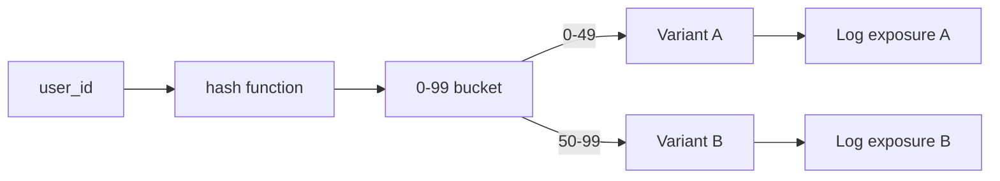

**النوع:** بناء
**اللغات:** Python
**المتطلبات:** 11-online-evals-and-feedback-loops, 12-drift-and-regression-detection
**الوقت:** ~45 دقيقة
**أهداف التعلّم:**
- بناء موجّه A/B حتمي (deterministic) يسنِد المستخدمين إلى المتغيّرات (variants) باتّساق عبر الطلبات
- تنفيذ محلّل يحسب الدلالة الإحصائية (statistical significance) لمقاييس جودة الـ AI
- تحديد وتجنّب أكثر ثلاثة مزالق شائعة في A/B testing لميزات الـ LLM

---

## MOTTO

**A/B testing لميزة AI دون صرامة إحصائية هو مجرّد تسليم شيئين والتخمين أيهما نجح.**

---

## المشكلة

لدى فريقك إصداران من الـ prompt. الـ Prompt B يبدو أفضل في الاختبار اليدوي. الجميع يظنّ أن B تحسين. مدير المنتج يريد تسليم B. رأيت هذا الفيلم من قبل: تسلّم الشيء الذي يبدو أفضل، وبعد ثلاثة أشهر لا تستطيع تفسير لماذا لم يتحسّن الاحتفاظ (retention).

ميزات الـ AI عرضة لهذا الفخّ بشكل خاص. جودة المخرَج تتفاوت من طلب لآخر. مقيّم الـ LLM الذي تستخدمه له تباينه الخاص. يستجيب المستخدمون بشكل مختلف للجِدّة مقابل الألفة. أحجام العيّنات الصغيرة تنتج تأرجحات عشوائية كبيرة.

دون اختبار A/B منضبط، تمارس تطويراً مدفوعاً بـ HiPPO: رأي أعلى الأشخاص أجراً يفوز (highest paid person's opinion). مع اختبار سليم، لديك دليل. الدليل يكسب النقاشات، ويوجّه الاستثمار، ويبني المصداقية الهندسية التي تتيح لك اتخاذ القرار التالي بثقة.

التعقيد: A/B testing لميزات الـ LLM أصعب من A/B testing لألوان الأزرار. أنت تقارن نظامين احتماليين. مقياس التقييم نفسه احتمالي (مقيّم LLM). تحتاج عيّنات كافية للتغلّب على الضجيج في كل من الميزة والمقيّم.

---

## المفهوم

### ما الذي تختبره بـ A/B

```
A/B TEST TARGETS
----------------
Prompt version:       System prompt A vs system prompt B
Model version:        claude-opus-4-5 vs claude-haiku-4-5
RAG configuration:    top-2 retrieval vs top-5 retrieval
System behavior:      Temperature 0.2 vs temperature 0.7
Response format:      JSON output vs markdown output
```

لاحظ ما الذي لا تختبره: فكرة المنتج نفسها. لا يحلّ A/B testing إلا الأسئلة التي تستطيع فيها قياس النتيجة بموضوعية. "هل ميزة الـ AI لدينا أفضل من عدم وجود ميزة AI؟" هي تجربة منتج، لا اختبار A/B للـ prompt.

### حجم العيّنة والقوة الإحصائية

```
SAMPLE SIZE INTUITION
Effect size:    How big a difference are you trying to detect?
Alpha (0.05):   Acceptable false positive rate (5% chance of claiming a winner when there isn't one)
Power (0.80):   Probability of detecting a real effect (80% is the standard)

Rough guide:
  Detect 5% improvement  -> ~400 samples per variant
  Detect 10% improvement -> ~100 samples per variant
  Detect 20% improvement -> ~30 samples per variant

Rule of thumb: 200+ per variant before you trust any result.
```

### تقسيم حركة المرور والإسناد

يجب أن يكون إسناد المستخدم حتمياً (deterministic): المستخدم نفسه يحصل دائماً على المتغيّر نفسه. الإسناد اللا-حتمي يسبّب آثار ترحيل (carryover effects) (المستخدم الذي يرى كلا المتغيّرين تكون تجربته ملتبسة/مشوّشة).



### مزالق A/B testing الشائعة

```
PITFALL                 WHAT HAPPENS                    FIX
--------------------    ----------------------------    --------------------
Novelty effect          Users engage with anything new  Run test for 2+ weeks
                        regardless of quality           past initial novelty

Carryover effect        User exposed to A behaves        Deterministic hash:
                        differently when switched to B   one user, one variant

Seasonal confound       Test runs Mon-Fri, deployed      Hold out by week,
                        Fri-Sun: different user          not by day
                        population

Peeking early           You stop the test when B looks   Pre-register your
                        good, before significance        sample size; don't
                                                         look until you hit it

Multiple metrics        B wins on quality, loses on      Pre-register your
                        latency. Cherry-pick quality.    primary metric
```

---

## البناء

### الإعداد

```bash
uv init ab-testing
cd ab-testing
uv add scipy
```

### الخطوة 1: ABRouter

```python
import hashlib
import json
import time
from dataclasses import dataclass, field
from pathlib import Path
from typing import Literal


Variant = Literal["A", "B"]


class ABRouter:
    """
    Deterministic A/B router: same user_id always gets the same variant.
    Logs exposures and outcomes to JSONL files.
    """

    def __init__(
        self,
        experiment_name: str,
        split: float = 0.50,  # fraction of traffic to send to variant B
        exposure_log: str = "exposures.jsonl",
        outcome_log: str = "outcomes.jsonl",
    ):
        self.experiment_name = experiment_name
        self.split = split
        self.exposure_log = Path(exposure_log)
        self.outcome_log = Path(outcome_log)

    def assign(self, user_id: str) -> Variant:
        """
        Deterministic assignment: hash user_id to a stable bucket.
        The same user_id always returns the same variant.
        """
        # Hash user_id + experiment name to avoid cross-experiment correlation
        key = f"{self.experiment_name}:{user_id}"
        digest = int(hashlib.md5(key.encode()).hexdigest(), 16)
        bucket = digest % 100
        return "B" if bucket < (self.split * 100) else "A"

    def log_exposure(self, user_id: str, variant: Variant, timestamp: float | None = None) -> None:
        """Record that a user was exposed to a variant."""
        entry = {
            "experiment": self.experiment_name,
            "user_id": user_id,
            "variant": variant,
            "timestamp": timestamp or time.time(),
        }
        with open(self.exposure_log, "a") as f:
            f.write(json.dumps(entry) + "\n")

    def log_outcome(
        self,
        user_id: str,
        variant: Variant,
        metric_name: str,
        value: float,
        timestamp: float | None = None,
    ) -> None:
        """Record a metric value for a user in a variant."""
        entry = {
            "experiment": self.experiment_name,
            "user_id": user_id,
            "variant": variant,
            "metric": metric_name,
            "value": value,
            "timestamp": timestamp or time.time(),
        }
        with open(self.outcome_log, "a") as f:
            f.write(json.dumps(entry) + "\n")
```

### الخطوة 2: ABAnalyzer

```python
from scipy import stats
import statistics


@dataclass
class VariantStats:
    variant: str
    n: int
    mean: float
    std: float


class ABAnalyzer:
    """
    Loads exposure and outcome logs, computes per-metric statistics,
    and runs significance tests.
    """

    def __init__(self, exposure_log: str, outcome_log: str):
        self.exposures = self._load_jsonl(exposure_log)
        self.outcomes = self._load_jsonl(outcome_log)
        self._results: dict[str, dict] = {}

    def _load_jsonl(self, path: str) -> list[dict]:
        p = Path(path)
        if not p.exists():
            return []
        lines = p.read_text().strip().splitlines()
        return [json.loads(line) for line in lines if line.strip()]

    def compute_stats(self, metric_name: str) -> dict[str, VariantStats]:
        """Compute mean, std, and n per variant for a given metric."""
        values: dict[str, list[float]] = {"A": [], "B": []}
        
        for entry in self.outcomes:
            if entry.get("metric") == metric_name:
                variant = entry.get("variant")
                if variant in values:
                    values[variant].append(float(entry["value"]))
        
        result = {}
        for variant, vals in values.items():
            if vals:
                result[variant] = VariantStats(
                    variant=variant,
                    n=len(vals),
                    mean=round(statistics.mean(vals), 4),
                    std=round(statistics.stdev(vals) if len(vals) > 1 else 0.0, 4),
                )
        return result

    def is_significant(self, metric_name: str, alpha: float = 0.05) -> dict:
        """
        Run Welch's t-test between variant A and B for a metric.
        Returns p-value, significant flag, and sample sizes.
        """
        stats_by_variant = self.compute_stats(metric_name)
        
        if "A" not in stats_by_variant or "B" not in stats_by_variant:
            return {"error": f"insufficient data for metric '{metric_name}'"}
        
        # Reconstruct raw values from outcomes
        a_vals = [e["value"] for e in self.outcomes if e.get("metric") == metric_name and e.get("variant") == "A"]
        b_vals = [e["value"] for e in self.outcomes if e.get("metric") == metric_name and e.get("variant") == "B"]
        
        t_stat, p_value = stats.ttest_ind(a_vals, b_vals, equal_var=False)
        
        return {
            "metric": metric_name,
            "n_A": len(a_vals),
            "n_B": len(b_vals),
            "mean_A": stats_by_variant["A"].mean,
            "mean_B": stats_by_variant["B"].mean,
            "lift": round(stats_by_variant["B"].mean - stats_by_variant["A"].mean, 4),
            "lift_pct": round((stats_by_variant["B"].mean - stats_by_variant["A"].mean) / stats_by_variant["A"].mean * 100, 2),
            "p_value": round(float(p_value), 4),
            "significant": bool(p_value < alpha),
            "alpha": alpha,
        }

    def report(self, metrics: list[str] | None = None) -> None:
        """Print a formatted results table."""
        all_metrics = metrics or list({e["metric"] for e in self.outcomes})
        
        print(f"\n{'='*80}")
        print(f"{'METRIC':<30} {'A MEAN':>8} {'B MEAN':>8} {'LIFT':>8} {'LIFT%':>7} {'P-VALUE':>9} {'SIG?':>6}")
        print(f"{'-'*80}")
        
        for metric in sorted(all_metrics):
            result = self.is_significant(metric)
            if "error" in result:
                print(f"{metric:<30}  {'(no data)'}")
                continue
            
            sig_marker = "YES *" if result["significant"] else "no"
            print(
                f"{metric:<30} "
                f"{result['mean_A']:>8.3f} "
                f"{result['mean_B']:>8.3f} "
                f"{result['lift']:>+8.3f} "
                f"{result['lift_pct']:>+7.1f}% "
                f"{result['p_value']:>9.4f} "
                f"{sig_marker:>6}"
            )
        print(f"{'='*80}")
        print(f"* p < {0.05} (alpha=0.05)")
```

### الخطوة 3: محاكاة 30 يوماً من بيانات A/B

```python
import random


def simulate_ab_test():
    """
    Simulate 500 users per variant over 30 days.
    Variant B wins on quality_score but not on conversion_rate.
    """
    router = ABRouter(
        experiment_name="faq-prompt-test",
        split=0.50,
        exposure_log="sim_exposures.jsonl",
        outcome_log="sim_outcomes.jsonl",
    )
    
    # Clear old simulation data
    Path("sim_exposures.jsonl").unlink(missing_ok=True)
    Path("sim_outcomes.jsonl").unlink(missing_ok=True)
    
    random.seed(42)
    user_ids = [f"user_{i:04d}" for i in range(1000)]
    
    for user_id in user_ids:
        variant = router.assign(user_id)
        router.log_exposure(user_id, variant)
        
        # Quality score: B is genuinely better (0.89 vs 0.85), moderate effect
        if variant == "A":
            quality = round(random.gauss(0.85, 0.08), 3)
            conversion = round(random.gauss(0.32, 0.05), 3)
        else:
            quality = round(random.gauss(0.89, 0.08), 3)
            conversion = round(random.gauss(0.33, 0.05), 3)  # not a real difference
        
        quality = max(0.0, min(1.0, quality))
        conversion = max(0.0, min(1.0, conversion))
        
        router.log_outcome(user_id, variant, "quality_score", quality)
        router.log_outcome(user_id, variant, "conversion_rate", conversion)
    
    # Analyze
    analyzer = ABAnalyzer("sim_exposures.jsonl", "sim_outcomes.jsonl")
    analyzer.report(["quality_score", "conversion_rate"])
    
    # Show the nuance: quality significant, conversion not
    q_result = analyzer.is_significant("quality_score")
    c_result = analyzer.is_significant("conversion_rate")
    
    print(f"\nQuality: B {'IS' if q_result['significant'] else 'IS NOT'} significantly better (p={q_result['p_value']})")
    print(f"Conversion: B {'IS' if c_result['significant'] else 'IS NOT'} significantly better (p={c_result['p_value']})")
    print("\nConclusion: Ship B for quality, monitor conversion carefully.")


if __name__ == "__main__":
    simulate_ab_test()
```

> **اختبار من الواقع:** يُظهر اختبار A/B لديك أن المتغيّر B يسجّل 0.89 على مقياس جودة الـ LLM لديك (مقابل 0.85 لـ A)، لكن التحسين ليس ذا دلالة إحصائية بعد 3 أيام. يريد مدير المنتج تسليم B الآن. ماذا تقول له، وكم يحتاج الاختبار فعلاً أن يعمل؟

ثلاثة أيام بحوالي 50 مستخدماً لكل متغيّر تعطيك ربما 50 نقطة بيانات لكل ذراع. الزيادة (lift) البالغة 0.04 التي تراها لها خطأ معياري (standard error) كبير بما يكفي بحيث يمكن أن تكون صفراً بسهولة. تقول لمدير المنتج: "قد يكون التحسين حقيقياً، لكن ليس لدينا دليل كافٍ بعد لنكون واثقين. التسليم الآن يعني أننا قد نسلّم شيئاً يضرّ الجودة لنصف مستخدمينا ولن نعرف." لحجم تأثير 5% مع alpha=0.05 وقوة 80%، تحتاج تقريباً 400 مستخدم لكل متغيّر. بمعدّل حركة المرور الحالي لديك، هذا يعني N يوماً إضافياً. اضبط تذكيراً في التقويم، لا تختلس النظر، واحكم على الاختبار عندما تبلغ حجم العيّنة.

---

## الاستخدام

يعمل ABRouter + ABAnalyzer اليدوي جيداً لتجربة واحدة، لكن إدارة تقسيمات حركة المرور عبر عدّة ميزات، وعدّة بيئات، وعدّة مهندسين تصبح معقّدة بسرعة. تتعامل feature flags + Braintrust مع هذا بشكل أفضل.

### Feature Flags لتقسيم حركة المرور

بدلاً من كتابة منطق الـ hash بنفسك، استخدم خدمة feature flag. إليك نهجاً قائماً على ملف إعداد يحاكي واجهة LaunchDarkly أو Statsig:

```python
# feature_flags.json
{
  "faq-prompt-test": {
    "enabled": true,
    "rollout_pct": 50,
    "variants": {
      "A": {"prompt_version": "v3", "weight": 50},
      "B": {"prompt_version": "v4", "weight": 50}
    }
  }
}

# flag_client.py
import json
import hashlib
from pathlib import Path


class FlagClient:
    def __init__(self, config_path: str = "feature_flags.json"):
        self.config = json.loads(Path(config_path).read_text())
    
    def get_variant(self, flag_name: str, user_id: str) -> dict | None:
        flag = self.config.get(flag_name)
        if not flag or not flag.get("enabled"):
            return None
        
        key = f"{flag_name}:{user_id}"
        bucket = int(hashlib.md5(key.encode()).hexdigest(), 16) % 100
        
        cumulative = 0
        for variant_name, variant_config in flag["variants"].items():
            cumulative += variant_config["weight"]
            if bucket < cumulative:
                return {"variant": variant_name, **variant_config}
        return None
```

الفرق عن الموجّه محلي الصنع: إعداد الـ flag يعيش خارج قاعدة الكود، يمكن تحديثه دون نشر، وخدمة feature flag مثل LaunchDarkly تتعامل مع التراجع (rollback) (اقلب الـ flag، تراجع فوري بنسبة 100%) دون لمس الكود.

### مقارنة تجارب Braintrust لاختبارات A/B

```python
import braintrust

# Run variant A as an experiment
braintrust.Eval(
    "faq-prompt-v3",
    data=lambda: golden_cases,
    task=faq_v3,
    scores=[quality_scorer, faithfulness_scorer],
    metadata={"variant": "A", "ab_test": "faq-prompt-test"},
)

# Run variant B as an experiment
braintrust.Eval(
    "faq-prompt-v4",
    data=lambda: golden_cases,
    task=faq_v4,
    scores=[quality_scorer, faithfulness_scorer],
    metadata={"variant": "B", "ab_test": "faq-prompt-test"},
)

# Braintrust compares them automatically in the UI:
# - Score delta per metric
# - Per-case diff: which inputs changed, which stayed the same
# - Statistical confidence indicators
```

### محلي الصنع مقابل Braintrust + Feature Flags

```
HOMEGROWN                       BRAINTRUST + FLAGS
--------------------------      --------------------------
Hash in code                    Hash in flag service
Logs in JSONL                   Results in Braintrust DB
Manual t-test                   Auto significance in UI
No per-case drill-down          Case-level diff view
Code change to update split     Config change to update split
No rollback mechanism           Instant flag rollback
```

متى يفوز محلي الصنع: اختبار بسيط بمتغيّرين على ميزة واحدة، فريق صغير، بلا أدوات قائمة.

متى تستحقّ المنظومة التعقيد: عدّة اختبارات متزامنة، فريق كبير، الحاجة إلى تراجع فوري، الرغبة في التنقيب لمعرفة أي حالات محدّدة تغيّرت.

> **نقلة في المنظور:** تشغّل اختبار A/B على روبوت دعم عملاء. المتغيّر B له درجات جودة AI أفضل لكن المستخدمين يقيّمونه أدنى في استبيانات الرضا. ما الذي قد يفسّر هذا، وأي إشارة تثق بها؟

مقيّم الـ LLM لديك يقيس شيئاً مختلفاً عمّا يقدّره المستخدمون. قد يكون المتغيّر B أدقّ لكنه أيضاً أكثر إسهاباً، أو أكثر رسمية، أو أكثر حذراً ("لست متأكّداً، يرجى مراجعة التوثيق") بطرق تُحبط المستخدمين رغم أن المعلومة أفضل تقنياً. في دعم العملاء، غالباً ما تهمّ النبرة، وسرعة الوصول إلى الحلّ، والإفادة المُدرَكة أكثر من الاكتمال الوقائعي. ثق بإشارة رضا المستخدم لنتيجة الأعمال. تخبرك درجة جودة الـ AI شيئاً عن سلوك النموذج، لكن استبيان الرضا يخبرك عن تجربة المستخدم. كلاهما حقيقي: يقيسان أشياء مختلفة. حقّق في الفجوة بسحب مسارات حالات B منخفضة الرضا وقراءتها.

---

## التسليم

ناتج هذا الدرس هو `outputs/skill-ab-testing-llm.md`. راجع مجلّد المخرجات.

**ما الذي بنيته:**
- `ABRouter`: إسناد مستخدم حتمي، تسجيل التعرّض (exposure)، تسجيل النتائج (outcome)
- `ABAnalyzer`: إحصاءات لكل مقياس، اختبار دلالة Welch's t-test، تقرير منسّق
- محاكاة لـ 1,000 مستخدم عبر متغيّرين تُظهر تحسّن الجودة ونتيجة تحويل (conversion) معدومة
- سير العمل نفسه باستخدام feature flags وتجارب Braintrust

---

## التقييم

### اختبار A/A

قبل تشغيل أي اختبار حقيقي، شغّل المتغيّر نفسه مقابل نفسه وتحقّق أن النتيجة ليست ذات دلالة. هذا يلتقط الأخطاء في موجّهك أو محلّلك.

```python
def test_aa():
    """A/A test: assign all users to 'A' and simulate identical outcomes."""
    router = ABRouter("aa-test", split=0.0)  # 0% to B = everyone gets A
    
    # ... simulate outcomes with same distribution for both "variants"
    analyzer = ABAnalyzer("aa_exp.jsonl", "aa_out.jsonl")
    result = analyzer.is_significant("quality_score")
    
    assert not result["significant"], "A/A test should NOT be significant"
    print(f"PASS: A/A p-value = {result['p_value']} (expected > 0.05)")
```

### فحص التوازن

تحقّق أن أعداد التعرّض ضمن 5% من التقسيم المتوقّع 50/50.

```python
def check_balance(exposure_log: str, expected_split: float = 0.5, tolerance: float = 0.05):
    exposures = [json.loads(l) for l in Path(exposure_log).read_text().splitlines()]
    a_count = sum(1 for e in exposures if e["variant"] == "A")
    b_count = sum(1 for e in exposures if e["variant"] == "B")
    total = a_count + b_count
    
    actual_b_fraction = b_count / total
    assert abs(actual_b_fraction - expected_split) < tolerance, (
        f"Split imbalance: expected {expected_split:.0%}, got {actual_b_fraction:.0%}"
    )
    print(f"PASS: split is {actual_b_fraction:.1%} B (expected ~{expected_split:.0%})")
```

### صحّة الفصل (Holdout)

تحقّق أن لا مستخدم يظهر في كلا المتغيّرين. مع موجّه حتمي، يجب ألّا يحدث هذا أبداً.

```python
def check_no_overlap(exposure_log: str):
    exposures = [json.loads(l) for l in Path(exposure_log).read_text().splitlines()]
    
    user_variants: dict[str, set] = {}
    for e in exposures:
        uid = e["user_id"]
        user_variants.setdefault(uid, set()).add(e["variant"])
    
    overlaps = {uid: variants for uid, variants in user_variants.items() if len(variants) > 1}
    assert len(overlaps) == 0, f"Users in multiple variants: {overlaps}"
    print(f"PASS: no user in multiple variants ({len(user_variants)} unique users)")
```
