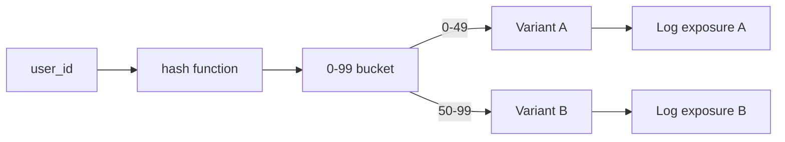

**Type:** Build
**Languages:** Python
**Prerequisites:** 11-online-evals-and-feedback-loops, 12-drift-and-regression-detection
**Time:** ~45 min
**Learning Objectives:**
- Build a deterministic A/B router that assigns users to variants consistently across requests
- Implement an analyzer that computes statistical significance for AI quality metrics
- Identify and avoid the three most common A/B testing pitfalls for LLM features

---

## MOTTO

**A/B testing an AI feature without statistical rigor is just shipping two things and guessing which worked.**

---

## THE PROBLEM

Your team has two prompt versions. Prompt B feels better in manual testing. Everyone thinks B is an improvement. The PM wants to ship B. You've seen this movie before: you ship the thing that feels better, and three months later you can't explain why retention didn't improve.

AI features are especially prone to this trap. The output quality varies by request. The LLM judge you're using has its own variance. Users respond differently to novelty versus familiarity. Small sample sizes produce large random swings.

Without a disciplined A/B test, you're doing HiPPO-driven development: highest paid person's opinion wins. With a proper test, you have evidence. Evidence wins arguments, guides investment, and builds the engineering credibility that lets you make the next call with confidence.

The complication: A/B testing LLM features is harder than A/B testing button colors. You're comparing two probabilistic systems. The evaluation metric is itself probabilistic (an LLM judge). You need enough samples to overcome the noise in both the feature and the evaluator.

---

## THE CONCEPT

### What You're A/B Testing

```
A/B TEST TARGETS
----------------
Prompt version:       System prompt A vs system prompt B
Model version:        claude-opus-4-5 vs claude-haiku-4-5
RAG configuration:    top-2 retrieval vs top-5 retrieval
System behavior:      Temperature 0.2 vs temperature 0.7
Response format:      JSON output vs markdown output
```

Note what you are NOT testing: the product idea itself. A/B testing only resolves questions where you can measure the outcome objectively. "Is our AI feature better than no AI feature?" is a product experiment, not a prompt A/B test.

### Sample Size and Statistical Power

```
SAMPLE SIZE INTUITION
Effect size:    How big a difference are you trying to detect?
Alpha (0.05):   Acceptable false positive rate (5% chance of claiming a winner when there isn't one)
Power (0.80):   Probability of detecting a real effect (80% is the standard)

Rough guide:
  Detect 5% improvement  -> ~400 samples per variant
  Detect 10% improvement -> ~100 samples per variant
  Detect 20% improvement -> ~30 samples per variant

Rule of thumb: 200+ per variant before you trust any result.
```

### Traffic Splitting and Assignment

User assignment must be deterministic: the same user always gets the same variant. Non-deterministic assignment causes carryover effects (a user who sees both variants has a confounded experience).



### Common A/B Testing Pitfalls

```
PITFALL                 WHAT HAPPENS                    FIX
--------------------    ----------------------------    --------------------
Novelty effect          Users engage with anything new  Run test for 2+ weeks
                        regardless of quality           past initial novelty

Carryover effect        User exposed to A behaves        Deterministic hash:
                        differently when switched to B   one user, one variant

Seasonal confound       Test runs Mon-Fri, deployed      Hold out by week,
                        Fri-Sun: different user          not by day
                        population

Peeking early           You stop the test when B looks   Pre-register your
                        good, before significance        sample size; don't
                                                         look until you hit it

Multiple metrics        B wins on quality, loses on      Pre-register your
                        latency. Cherry-pick quality.    primary metric
```

---

## BUILD IT

### Setup

```bash
uv init ab-testing
cd ab-testing
uv add scipy
```

### Step 1: ABRouter

```python
import hashlib
import json
import time
from dataclasses import dataclass, field
from pathlib import Path
from typing import Literal


Variant = Literal["A", "B"]


class ABRouter:
    """
    Deterministic A/B router: same user_id always gets the same variant.
    Logs exposures and outcomes to JSONL files.
    """

    def __init__(
        self,
        experiment_name: str,
        split: float = 0.50,  # fraction of traffic to send to variant B
        exposure_log: str = "exposures.jsonl",
        outcome_log: str = "outcomes.jsonl",
    ):
        self.experiment_name = experiment_name
        self.split = split
        self.exposure_log = Path(exposure_log)
        self.outcome_log = Path(outcome_log)

    def assign(self, user_id: str) -> Variant:
        """
        Deterministic assignment: hash user_id to a stable bucket.
        The same user_id always returns the same variant.
        """
        # Hash user_id + experiment name to avoid cross-experiment correlation
        key = f"{self.experiment_name}:{user_id}"
        digest = int(hashlib.md5(key.encode()).hexdigest(), 16)
        bucket = digest % 100
        return "B" if bucket < (self.split * 100) else "A"

    def log_exposure(self, user_id: str, variant: Variant, timestamp: float | None = None) -> None:
        """Record that a user was exposed to a variant."""
        entry = {
            "experiment": self.experiment_name,
            "user_id": user_id,
            "variant": variant,
            "timestamp": timestamp or time.time(),
        }
        with open(self.exposure_log, "a") as f:
            f.write(json.dumps(entry) + "\n")

    def log_outcome(
        self,
        user_id: str,
        variant: Variant,
        metric_name: str,
        value: float,
        timestamp: float | None = None,
    ) -> None:
        """Record a metric value for a user in a variant."""
        entry = {
            "experiment": self.experiment_name,
            "user_id": user_id,
            "variant": variant,
            "metric": metric_name,
            "value": value,
            "timestamp": timestamp or time.time(),
        }
        with open(self.outcome_log, "a") as f:
            f.write(json.dumps(entry) + "\n")
```

### Step 2: ABAnalyzer

```python
from scipy import stats
import statistics


@dataclass
class VariantStats:
    variant: str
    n: int
    mean: float
    std: float


class ABAnalyzer:
    """
    Loads exposure and outcome logs, computes per-metric statistics,
    and runs significance tests.
    """

    def __init__(self, exposure_log: str, outcome_log: str):
        self.exposures = self._load_jsonl(exposure_log)
        self.outcomes = self._load_jsonl(outcome_log)
        self._results: dict[str, dict] = {}

    def _load_jsonl(self, path: str) -> list[dict]:
        p = Path(path)
        if not p.exists():
            return []
        lines = p.read_text().strip().splitlines()
        return [json.loads(line) for line in lines if line.strip()]

    def compute_stats(self, metric_name: str) -> dict[str, VariantStats]:
        """Compute mean, std, and n per variant for a given metric."""
        values: dict[str, list[float]] = {"A": [], "B": []}
        
        for entry in self.outcomes:
            if entry.get("metric") == metric_name:
                variant = entry.get("variant")
                if variant in values:
                    values[variant].append(float(entry["value"]))
        
        result = {}
        for variant, vals in values.items():
            if vals:
                result[variant] = VariantStats(
                    variant=variant,
                    n=len(vals),
                    mean=round(statistics.mean(vals), 4),
                    std=round(statistics.stdev(vals) if len(vals) > 1 else 0.0, 4),
                )
        return result

    def is_significant(self, metric_name: str, alpha: float = 0.05) -> dict:
        """
        Run Welch's t-test between variant A and B for a metric.
        Returns p-value, significant flag, and sample sizes.
        """
        stats_by_variant = self.compute_stats(metric_name)
        
        if "A" not in stats_by_variant or "B" not in stats_by_variant:
            return {"error": f"insufficient data for metric '{metric_name}'"}
        
        # Reconstruct raw values from outcomes
        a_vals = [e["value"] for e in self.outcomes if e.get("metric") == metric_name and e.get("variant") == "A"]
        b_vals = [e["value"] for e in self.outcomes if e.get("metric") == metric_name and e.get("variant") == "B"]
        
        t_stat, p_value = stats.ttest_ind(a_vals, b_vals, equal_var=False)
        
        return {
            "metric": metric_name,
            "n_A": len(a_vals),
            "n_B": len(b_vals),
            "mean_A": stats_by_variant["A"].mean,
            "mean_B": stats_by_variant["B"].mean,
            "lift": round(stats_by_variant["B"].mean - stats_by_variant["A"].mean, 4),
            "lift_pct": round((stats_by_variant["B"].mean - stats_by_variant["A"].mean) / stats_by_variant["A"].mean * 100, 2),
            "p_value": round(float(p_value), 4),
            "significant": bool(p_value < alpha),
            "alpha": alpha,
        }

    def report(self, metrics: list[str] | None = None) -> None:
        """Print a formatted results table."""
        all_metrics = metrics or list({e["metric"] for e in self.outcomes})
        
        print(f"\n{'='*80}")
        print(f"{'METRIC':<30} {'A MEAN':>8} {'B MEAN':>8} {'LIFT':>8} {'LIFT%':>7} {'P-VALUE':>9} {'SIG?':>6}")
        print(f"{'-'*80}")
        
        for metric in sorted(all_metrics):
            result = self.is_significant(metric)
            if "error" in result:
                print(f"{metric:<30}  {'(no data)'}")
                continue
            
            sig_marker = "YES *" if result["significant"] else "no"
            print(
                f"{metric:<30} "
                f"{result['mean_A']:>8.3f} "
                f"{result['mean_B']:>8.3f} "
                f"{result['lift']:>+8.3f} "
                f"{result['lift_pct']:>+7.1f}% "
                f"{result['p_value']:>9.4f} "
                f"{sig_marker:>6}"
            )
        print(f"{'='*80}")
        print(f"* p < {0.05} (alpha=0.05)")
```

### Step 3: Simulate 30 Days of A/B Data

```python
import random


def simulate_ab_test():
    """
    Simulate 500 users per variant over 30 days.
    Variant B wins on quality_score but not on conversion_rate.
    """
    router = ABRouter(
        experiment_name="faq-prompt-test",
        split=0.50,
        exposure_log="sim_exposures.jsonl",
        outcome_log="sim_outcomes.jsonl",
    )
    
    # Clear old simulation data
    Path("sim_exposures.jsonl").unlink(missing_ok=True)
    Path("sim_outcomes.jsonl").unlink(missing_ok=True)
    
    random.seed(42)
    user_ids = [f"user_{i:04d}" for i in range(1000)]
    
    for user_id in user_ids:
        variant = router.assign(user_id)
        router.log_exposure(user_id, variant)
        
        # Quality score: B is genuinely better (0.89 vs 0.85), moderate effect
        if variant == "A":
            quality = round(random.gauss(0.85, 0.08), 3)
            conversion = round(random.gauss(0.32, 0.05), 3)
        else:
            quality = round(random.gauss(0.89, 0.08), 3)
            conversion = round(random.gauss(0.33, 0.05), 3)  # not a real difference
        
        quality = max(0.0, min(1.0, quality))
        conversion = max(0.0, min(1.0, conversion))
        
        router.log_outcome(user_id, variant, "quality_score", quality)
        router.log_outcome(user_id, variant, "conversion_rate", conversion)
    
    # Analyze
    analyzer = ABAnalyzer("sim_exposures.jsonl", "sim_outcomes.jsonl")
    analyzer.report(["quality_score", "conversion_rate"])
    
    # Show the nuance: quality significant, conversion not
    q_result = analyzer.is_significant("quality_score")
    c_result = analyzer.is_significant("conversion_rate")
    
    print(f"\nQuality: B {'IS' if q_result['significant'] else 'IS NOT'} significantly better (p={q_result['p_value']})")
    print(f"Conversion: B {'IS' if c_result['significant'] else 'IS NOT'} significantly better (p={c_result['p_value']})")
    print("\nConclusion: Ship B for quality, monitor conversion carefully.")


if __name__ == "__main__":
    simulate_ab_test()
```

> **Real-world check:** Your A/B test shows variant B scores 0.89 on your LLM quality metric (vs 0.85 for A), but the improvement isn't statistically significant after 3 days. Your PM wants to ship B now. What do you tell them, and how long does the test actually need to run?

Three days with ~50 users per variant gives you maybe 50 data points per arm. The 0.04 lift you're seeing has a standard error large enough that it could easily be zero. You tell the PM: "The improvement might be real, but we don't have enough evidence yet to be confident. Shipping now means we might be shipping something that hurts quality for half our users and we won't know." For a 5% effect size with alpha=0.05 and 80% power, you need roughly 400 users per variant. At your current traffic rate, that's N more days. Set a calendar reminder, don't peek, and call the test when you hit the sample size.

---

## USE IT

The manual ABRouter + ABAnalyzer works well for a single experiment, but managing traffic splits across multiple features, multiple environments, and multiple engineers gets complicated fast. Feature flags + Braintrust handles this better.

### Feature Flags for Traffic Splitting

Instead of writing the hash logic yourself, use a feature flag service. Here's a config-file approach that mirrors the interface of LaunchDarkly or Statsig:

```python
# feature_flags.json
{
  "faq-prompt-test": {
    "enabled": true,
    "rollout_pct": 50,
    "variants": {
      "A": {"prompt_version": "v3", "weight": 50},
      "B": {"prompt_version": "v4", "weight": 50}
    }
  }
}

# flag_client.py
import json
import hashlib
from pathlib import Path


class FlagClient:
    def __init__(self, config_path: str = "feature_flags.json"):
        self.config = json.loads(Path(config_path).read_text())
    
    def get_variant(self, flag_name: str, user_id: str) -> dict | None:
        flag = self.config.get(flag_name)
        if not flag or not flag.get("enabled"):
            return None
        
        key = f"{flag_name}:{user_id}"
        bucket = int(hashlib.md5(key.encode()).hexdigest(), 16) % 100
        
        cumulative = 0
        for variant_name, variant_config in flag["variants"].items():
            cumulative += variant_config["weight"]
            if bucket < cumulative:
                return {"variant": variant_name, **variant_config}
        return None
```

The difference from a homegrown router: the flag config lives outside the codebase, can be updated without a deploy, and a feature flag service like LaunchDarkly handles rollback (flip the flag, instant 100% rollback) without touching code.

### Braintrust Experiment Comparison for A/B Tests

```python
import braintrust

# Run variant A as an experiment
braintrust.Eval(
    "faq-prompt-v3",
    data=lambda: golden_cases,
    task=faq_v3,
    scores=[quality_scorer, faithfulness_scorer],
    metadata={"variant": "A", "ab_test": "faq-prompt-test"},
)

# Run variant B as an experiment
braintrust.Eval(
    "faq-prompt-v4",
    data=lambda: golden_cases,
    task=faq_v4,
    scores=[quality_scorer, faithfulness_scorer],
    metadata={"variant": "B", "ab_test": "faq-prompt-test"},
)

# Braintrust compares them automatically in the UI:
# - Score delta per metric
# - Per-case diff: which inputs changed, which stayed the same
# - Statistical confidence indicators
```

### Homegrown vs Braintrust + Feature Flags

```
HOMEGROWN                       BRAINTRUST + FLAGS
--------------------------      --------------------------
Hash in code                    Hash in flag service
Logs in JSONL                   Results in Braintrust DB
Manual t-test                   Auto significance in UI
No per-case drill-down          Case-level diff view
Code change to update split     Config change to update split
No rollback mechanism           Instant flag rollback
```

When homegrown wins: simple two-variant test on a single feature, small team, no existing tooling.

When the stack earns complexity: multiple concurrent tests, large team, need instant rollback, want drill-down into which specific cases changed.

> **Perspective shift:** You're running an A/B test on a customer support bot. Variant B has better AI quality scores but users are rating it lower in satisfaction surveys. What might explain this, and which signal do you trust?

Your LLM judge is measuring something different from what users value. Variant B might be more accurate but also more verbose, more formal, or more cautious ("I'm not sure, please consult documentation") in ways that frustrate users even though the information is technically better. In customer support, tone, speed to resolution, and perceived helpfulness often matter more than factual completeness. Trust the user satisfaction signal for the business outcome. The AI quality score tells you something about the model's behavior, but the satisfaction survey tells you about the user experience. Both are real: they're measuring different things. Investigate the gap by pulling the traces for B's low-satisfaction cases and reading them.

---

## SHIP IT

The artifact for this lesson is `outputs/skill-ab-testing-llm.md`. See the outputs folder.

**What you built:**
- `ABRouter`: deterministic user assignment, exposure logging, outcome logging
- `ABAnalyzer`: per-metric statistics, Welch's t-test significance testing, formatted report
- A simulation of 1,000 users across two variants showing quality improvement and conversion null result
- The same workflow using feature flags and Braintrust experiments

---

## EVALUATE IT

### A/A Test

Before running any real test, run the same variant against itself and verify the result is NOT significant. This catches bugs in your router or analyzer.

```python
def test_aa():
    """A/A test: assign all users to 'A' and simulate identical outcomes."""
    router = ABRouter("aa-test", split=0.0)  # 0% to B = everyone gets A
    
    # ... simulate outcomes with same distribution for both "variants"
    analyzer = ABAnalyzer("aa_exp.jsonl", "aa_out.jsonl")
    result = analyzer.is_significant("quality_score")
    
    assert not result["significant"], "A/A test should NOT be significant"
    print(f"PASS: A/A p-value = {result['p_value']} (expected > 0.05)")
```

### Balance Check

Verify that your exposure counts are within 5% of the expected 50/50 split.

```python
def check_balance(exposure_log: str, expected_split: float = 0.5, tolerance: float = 0.05):
    exposures = [json.loads(l) for l in Path(exposure_log).read_text().splitlines()]
    a_count = sum(1 for e in exposures if e["variant"] == "A")
    b_count = sum(1 for e in exposures if e["variant"] == "B")
    total = a_count + b_count
    
    actual_b_fraction = b_count / total
    assert abs(actual_b_fraction - expected_split) < tolerance, (
        f"Split imbalance: expected {expected_split:.0%}, got {actual_b_fraction:.0%}"
    )
    print(f"PASS: split is {actual_b_fraction:.1%} B (expected ~{expected_split:.0%})")
```

### Holdout Correctness

Verify no user appears in both variants. With a deterministic router, this should never happen.

```python
def check_no_overlap(exposure_log: str):
    exposures = [json.loads(l) for l in Path(exposure_log).read_text().splitlines()]
    
    user_variants: dict[str, set] = {}
    for e in exposures:
        uid = e["user_id"]
        user_variants.setdefault(uid, set()).add(e["variant"])
    
    overlaps = {uid: variants for uid, variants in user_variants.items() if len(variants) > 1}
    assert len(overlaps) == 0, f"Users in multiple variants: {overlaps}"
    print(f"PASS: no user in multiple variants ({len(user_variants)} unique users)")
```
