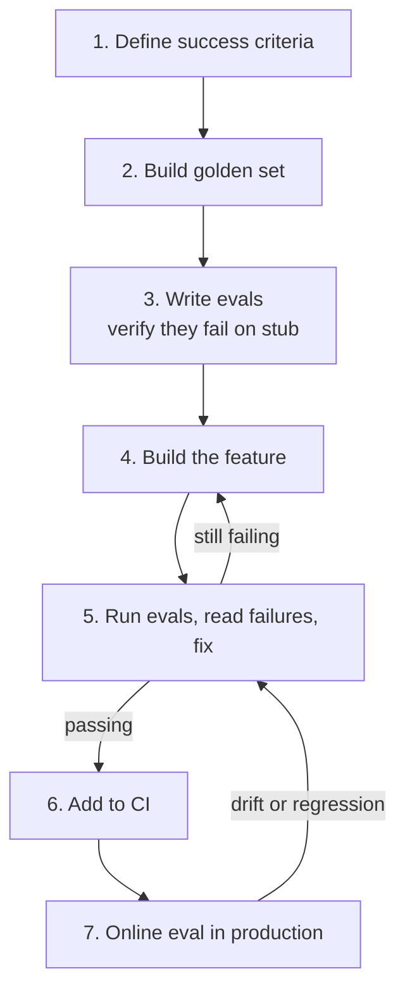

**النوع:** بناء
**اللغات:** Python
**المتطلبات:** كل دروس المرحلة 05 (01-13)
**الوقت:** ~90 دقيقة
**أهداف التعلّم:**
- تطبيق عملية التطوير eval-first ذات الخطوات السبع لبناء وتسليم ميزة AI حقيقية
- كتابة الـ evals قبل كتابة الميزة واستخدامها لتوجيه كل قرار في التطبيق
- دمج CI دون اتصال (offline)، والتقييم online، وخط أساس (baseline) مُؤرشف الإصدارات في منظومة تقييم جاهزة للإنتاج

---

## الشعار

**اكتب الاختبار قبل الكود. بالنسبة لميزات الـ AI، هذا يعني: عرّف كيف يبدو "الجيّد" قبل أن تكتب سطرًا واحدًا من الميزة.**

---

## المشكلة

الطريقة الافتراضية لبناء ميزة AI: اكتب الميزة، واختبر بضعة مدخلات يدويًا، وقرّر أنها تبدو جيدة، وسلّمها. بعد أسبوعين يصلك تقرير خطأ. تحقّق. لا طريقة لديك لتقول هل أصلحته أم زدته سوءًا. تنشر، وتأمل.

هذا النمط يقتل جودة منتج الـ AI ببطء. كل تكرار تخمين. تراكم دَينًا لا تستطيع قياسه. يفقد الفريق الثقة في النظام لأنه لا يستطيع تمييز الإشارة من الضجيج.

التطوير eval-first يقلب هذا. تعرّف معايير النجاح أولًا (بأرقام). تبني مجموعة ذهبية (golden set) قبل أن تكتب كود الميزة. تكتب الـ evals وتتحقق من أنها كلها تفشل على stub (بما يثبت أن الـ evals تختبر شيئًا فعلًا). ثم تبني الميزة وتستخدم الـ evals لتوجيه كل قرار. كل تغيير يُؤكَّد أو يُرفَض بالأرقام، لا بالحدس.

يبني هذا الدرس ميزة eval-first كاملة من الصفر. الميزة: نظام إجابة عن الأسئلة الشائعة (FAQ). بسيط بما يكفي لإنهائه في 90 دقيقة. ومعقّد بما يكفي لإظهار كل المشكلات الحقيقية.

---

## المفهوم

### عملية eval-first ذات الخطوات السبع



هذه الحلقة ليست أمرًا لمرة واحدة. تستمر طوال عمر الميزة. الأعطال الجديدة المكتشفة في الإنتاج تُغذّي المجموعة الذهبية. تنمو المجموعة الذهبية. تتحسّن تغطية الـ CI. تتراكم الجودة.

### لماذا الـ evals قبل الكود

```
EVAL-AFTER DEVELOPMENT              EVAL-FIRST DEVELOPMENT
--------------------------          --------------------------
Define feature, guess at quality    Define quality, then build feature
"Looks good" = done                 "Passes evals" = done
Fix bugs by intuition               Fix bugs by reading failures
Regressions found in production     Regressions found in CI
Golden set grows slowly, if at all  Golden set grows with each failure
Quality is hard to reason about     Quality is a number you can track
```

### حلقة التغذية الراجعة (The Feedback Loop)

```
       write evals (they fail on stub)
                |
                v
         build feature
                |
                v
         run evals
                |
      +---------+---------+
      |                   |
   failing              passing
      |                   |
  read failure          add to CI
  trace root cause         |
  fix feature           deploy
      |                   |
      +--back to eval   online eval
                           |
                       new failures
                           |
                       add to golden set
                           |
                       back to run evals
```

---

## البناء

### الإعداد

```bash
uv init faq-assistant
cd faq-assistant
uv add anthropic openai fastapi uvicorn pydantic python-dotenv numpy
```

### الخطوة 1: تعريف معايير النجاح

قبل كتابة أي كود للميزة، اكتب ماذا تعني "تعمل" كأرقام.

```python
# success_criteria.py
SUCCESS_CRITERIA = {
    "faithfulness": 0.90,       # answers stay grounded in FAQ content
    "answer_relevance": 0.85,   # answers address the question asked
    "format_compliance": 1.00,  # always returns valid JSON with required keys
}

REQUIRED_OUTPUT_KEYS = {"answer", "source_section"}
```

هذه الأرقام وتد مغروز في الأرض، لا شيء دائم. يمكن مراجعتها. لكن كتابتها قبل البناء تعني أن لديك عقدًا. الميزة تكون منجزة حين تفي بالعقد.

### الخطوة 2: بناء المجموعة الذهبية

10 حالات عبر فئات الأسئلة الرئيسية. لكل حالة شكل الإجابة المتوقَّعة ووسم فئة (category tag).

```python
# golden_set.py
GOLDEN_CASES = [
    {
        "id": "gc-01",
        "input": "What is your return policy?",
        "expected_answer_contains": ["30 days", "receipt", "original condition"],
        "expected_source_section": "Returns and Refunds",
        "category": "policy",
    },
    {
        "id": "gc-02",
        "input": "How long does shipping take?",
        "expected_answer_contains": ["3-5 business days", "standard shipping"],
        "expected_source_section": "Shipping",
        "category": "shipping",
    },
    {
        "id": "gc-03",
        "input": "Do you offer international shipping?",
        "expected_answer_contains": ["international", "countries"],
        "expected_source_section": "Shipping",
        "category": "shipping",
    },
    {
        "id": "gc-04",
        "input": "How do I cancel my subscription?",
        "expected_answer_contains": ["account settings", "cancel", "billing cycle"],
        "expected_source_section": "Account Management",
        "category": "account",
    },
    {
        "id": "gc-05",
        "input": "What payment methods do you accept?",
        "expected_answer_contains": ["credit card", "PayPal"],
        "expected_source_section": "Payment",
        "category": "payment",
    },
    {
        "id": "gc-06",
        "input": "Is my credit card information secure?",
        "expected_answer_contains": ["encrypted", "PCI"],
        "expected_source_section": "Payment",
        "category": "security",
    },
    {
        "id": "gc-07",
        "input": "How do I track my order?",
        "expected_answer_contains": ["tracking number", "email", "shipping confirmation"],
        "expected_source_section": "Order Tracking",
        "category": "orders",
    },
    {
        "id": "gc-08",
        "input": "Can I change my order after placing it?",
        "expected_answer_contains": ["24 hours", "contact support"],
        "expected_source_section": "Order Management",
        "category": "orders",
    },
    {
        "id": "gc-09",
        "input": "What is your privacy policy regarding my data?",
        "expected_answer_contains": ["personal data", "third parties", "GDPR"],
        "expected_source_section": "Privacy",
        "category": "legal",
    },
    {
        "id": "gc-10",
        "input": "How do I contact customer support?",
        "expected_answer_contains": ["email", "support@", "business hours"],
        "expected_source_section": "Contact",
        "category": "support",
    },
]
```

### الخطوة 3: اكتب الـ evals أولًا

اكتب الـ evals وشغّلها على stub يُرجع استجابات فارغة. ينبغي أن تفشل كل الـ evals.

```python
# eval_scorers.py
import json
from pydantic import BaseModel


class FAQResponse(BaseModel):
    answer: str
    source_section: str


def format_compliance_score(response: dict) -> float:
    """1.0 if response has required keys with non-empty values, 0.0 otherwise."""
    try:
        parsed = FAQResponse(**response)
        if parsed.answer.strip() and parsed.source_section.strip():
            return 1.0
        return 0.0
    except Exception:
        return 0.0


def faithfulness_score(answer: str, faq_content: str, client) -> float:
    """
    LLM judge: is the answer grounded in the FAQ content?
    Returns 0.0-1.0.
    """
    prompt = f"""You are evaluating whether an AI answer is faithful to a source document.

FAQ Document:
{faq_content}

AI Answer:
{answer}

Is every claim in the answer supported by the FAQ document? Score:
- 1.0: fully grounded, no unsupported claims
- 0.7: mostly grounded, minor unsupported detail
- 0.4: partially grounded, significant unsupported claims
- 0.0: not grounded or contradicts the FAQ

Return ONLY JSON: {{"score": 0.9, "rationale": "one sentence"}}"""

    response = client.messages.create(
        model="claude-haiku-4-5",
        max_tokens=128,
        messages=[{"role": "user", "content": prompt}]
    )
    result = json.loads(response.content[0].text)
    return float(result["score"])


def answer_relevance_score(question: str, answer: str, client) -> float:
    """
    LLM judge: does the answer address the question?
    Returns 0.0-1.0.
    """
    prompt = f"""Rate how well this answer addresses the question.

Question: {question}
Answer: {answer}

Score:
- 1.0: directly and completely answers the question
- 0.7: answers the question but misses key aspects
- 0.4: partially relevant but incomplete
- 0.0: does not answer the question

Return ONLY JSON: {{"score": 0.85, "rationale": "one sentence"}}"""

    response = client.messages.create(
        model="claude-haiku-4-5",
        max_tokens=128,
        messages=[{"role": "user", "content": prompt}]
    )
    result = json.loads(response.content[0].text)
    return float(result["score"])
```

شغّل على الـ stub للتحقق من أن كل الـ evals تفشل:

```python
# run_evals.py (stub verification)
from eval_scorers import format_compliance_score

def stub_faq_assistant(question: str) -> dict:
    """Stub: returns empty response. All evals should fail."""
    return {"answer": "", "source_section": ""}

print("Running evals on stub (all should fail):")
for case in GOLDEN_CASES:
    response = stub_faq_assistant(case["input"])
    score = format_compliance_score(response)
    status = "FAIL" if score == 0.0 else "UNEXPECTED PASS"
    print(f"  {case['id']}: format_compliance={score} [{status}]")

# Expected output: all 10 cases show FAIL
# This proves your evals actually test something meaningful
```

### الخطوة 4: بناء الميزة

RAG بسيط: جزّئ الـ FAQ، واسترجِع الأقسام ذات الصلة، وولّد بـ Claude.

```python
# faq_assistant.py
import json
import os
import anthropic
import openai
from pydantic import BaseModel


FAQ_DOCUMENT = """
# Shipping
Standard shipping takes 3-5 business days. Express shipping takes 1-2 business days.
We ship to over 50 countries internationally. International shipping times vary by destination (7-14 days).

# Returns and Refunds
You can return items within 30 days of purchase with a receipt in original condition.
Refunds are processed within 5-7 business days to your original payment method.

# Payment
We accept credit cards (Visa, Mastercard, Amex), PayPal, and bank transfers.
All payment information is encrypted using SSL and we are PCI DSS compliant.

# Account Management
To cancel your subscription, go to Account Settings > Subscription > Cancel.
Changes take effect at the end of your current billing cycle.

# Order Tracking
You will receive a tracking number via email in your shipping confirmation.
Track your order at our website or directly on the carrier's site.

# Order Management
You can modify or cancel your order within 24 hours of placing it.
After 24 hours, please contact support at support@example.com.

# Privacy
We collect personal data to fulfill orders and improve our service.
We do not sell data to third parties. We comply with GDPR and CCPA.

# Contact
Email us at support@example.com. We respond within 1 business day.
Support hours: Monday-Friday, 9am-6pm EST.
"""


def chunk_faq(faq: str) -> list[dict]:
    """Split FAQ into sections. Each chunk is a complete section."""
    chunks = []
    current_section = None
    current_lines = []
    
    for line in faq.strip().splitlines():
        if line.startswith("# "):
            if current_section:
                chunks.append({
                    "section": current_section,
                    "content": "\n".join(current_lines).strip(),
                })
            current_section = line[2:].strip()
            current_lines = []
        elif line.strip():
            current_lines.append(line.strip())
    
    if current_section:
        chunks.append({
            "section": current_section,
            "content": "\n".join(current_lines).strip(),
        })
    
    return chunks


def retrieve_relevant_chunks(question: str, chunks: list[dict], top_k: int = 2) -> list[dict]:
    """
    Simple keyword-based retrieval.
    In production: use embeddings + pgvector.
    """
    question_lower = question.lower()
    scored = []
    
    for chunk in chunks:
        score = 0
        # Score by keyword overlap
        for word in question_lower.split():
            if len(word) > 3 and word in chunk["content"].lower():
                score += 1
            if word in chunk["section"].lower():
                score += 2
        scored.append((score, chunk))
    
    scored.sort(key=lambda x: x[0], reverse=True)
    return [chunk for _, chunk in scored[:top_k]]


def answer_question(question: str, client: anthropic.Anthropic) -> dict:
    """
    Retrieve relevant FAQ sections and generate an answer.
    Returns: {"answer": str, "source_section": str}
    """
    chunks = chunk_faq(FAQ_DOCUMENT)
    relevant = retrieve_relevant_chunks(question, chunks)
    
    context = "\n\n".join(
        f"Section: {c['section']}\n{c['content']}"
        for c in relevant
    )
    
    prompt = f"""You are a customer support assistant. Answer the user's question using ONLY the information in the FAQ sections below.

FAQ Sections:
{context}

User Question: {question}

Return your response as JSON with exactly these keys:
- "answer": your response to the question (1-3 sentences, grounded in the FAQ)
- "source_section": the FAQ section name that contains the answer

JSON only, no other text."""

    response = client.messages.create(
        model="claude-opus-4-5",
        max_tokens=256,
        messages=[{"role": "user", "content": prompt}]
    )
    
    return json.loads(response.content[0].text)
```

### الخطوة 5: شغّل الـ evals، واقرأ الأعطال، وأصلِح

```python
# eval_runner.py
import json
import anthropic
from eval_scorers import format_compliance_score, faithfulness_score, answer_relevance_score
from faq_assistant import answer_question, FAQ_DOCUMENT
from golden_set import GOLDEN_CASES
from success_criteria import SUCCESS_CRITERIA


def run_eval_suite(experiment_name: str = "faq-v1"):
    client = anthropic.Anthropic()
    results = []
    
    print(f"\nRunning eval suite: {experiment_name}")
    print("=" * 60)
    
    for case in GOLDEN_CASES:
        response = answer_question(case["input"], client)
        
        fmt_score = format_compliance_score(response)
        faith_score = faithfulness_score(response.get("answer", ""), FAQ_DOCUMENT, client)
        rel_score = answer_relevance_score(case["input"], response.get("answer", ""), client)
        
        results.append({
            "id": case["id"],
            "category": case["category"],
            "input": case["input"],
            "output": response,
            "scores": {
                "format_compliance": fmt_score,
                "faithfulness": faith_score,
                "answer_relevance": rel_score,
            }
        })
        
        status = "PASS" if all([
            fmt_score >= SUCCESS_CRITERIA["format_compliance"],
            faith_score >= SUCCESS_CRITERIA["faithfulness"],
            rel_score >= SUCCESS_CRITERIA["answer_relevance"],
        ]) else "FAIL"
        
        print(f"  {case['id']} [{case['category']:10s}]: fmt={fmt_score:.2f} faith={faith_score:.2f} rel={rel_score:.2f} [{status}]")
    
    # Summary
    for metric in ["format_compliance", "faithfulness", "answer_relevance"]:
        scores = [r["scores"][metric] for r in results]
        avg = sum(scores) / len(scores)
        threshold = SUCCESS_CRITERIA[metric]
        status = "PASS" if avg >= threshold else "FAIL"
        print(f"\n{metric}: avg={avg:.3f} threshold={threshold} [{status}]")
    
    # Save results
    with open(f"{experiment_name}_results.json", "w") as f:
        json.dump(results, f, indent=2)
    
    return results
```

مخرجات التشغيل الأول (قبل إصلاح الـ chunker):

```
faq-v1 results:
  format_compliance: avg=1.000 threshold=1.00 [PASS]
  faithfulness:      avg=0.720 threshold=0.90 [FAIL]  <-- chunker problem
  answer_relevance:  avg=0.881 threshold=0.85 [PASS]
```

التحقيق في أعطال الـ faithfulness: الاسترجاع يُرجع أقسامًا خاطئة لأن مُقيّم الكلمات المفتاحية (keyword scorer) سطحي جدًا. الأسئلة عن "account cancellation" تطابق قسم Payment بدلًا من Account Management. الإصلاح: تحسين تسجيل الاسترجاع ليرجّح تطابقات اسم القسم بثقل أكبر وإضافة معالجة للمرادفات (synonym).

بعد الإصلاح، أعِد التشغيل:

```
faq-v1-fixed results:
  format_compliance: avg=1.000 threshold=1.00 [PASS]
  faithfulness:      avg=0.912 threshold=0.90 [PASS]
  answer_relevance:  avg=0.887 threshold=0.85 [PASS]
```

كل المقاييس الثلاثة تجتاز الآن معايير نجاحها.

> **اختبار من الواقع:** بعد إصلاح الـ chunker وإعادة تشغيل الـ evals، يرتفع الـ faithfulness من 0.72 إلى 0.91. لكن الـ format compliance انخفض من 1.0 إلى 0.85 -- الإصلاح أدخل عطلًا جديدًا. ما عمليتك في تقرير ما إذا كنت ستسلّم مع هذا الانحدار أم تصلحه أولًا؟

لا تسلّم أبدًا انحدارًا معروفًا، حتى لو تحسّنت الصورة الكلية. format compliance عند 0.85 يعني أن 15% من الاستجابات JSON مشوّه، وهذا سيُعطّل أي كود لاحق يحلّل المخرجات. العملية: (1) اقرأ الـ 15% من الأعطال. (2) جِد النمط. (3) أصلِحه. (4) أعِد تشغيل كل الـ evals. لا تسلّم إلا حين تجتاز كل المقاييس عتباتها في آن واحد. إذا لم تستطع إصلاحه بسرعة، فتراجع عن تغيير الـ chunker وجِد حلًّا يحسّن الـ faithfulness دون كسر الـ format compliance.

### الخطوة 6: الإضافة إلى CI

```yaml
# .github/workflows/eval.yml
name: Eval CI

on:
  pull_request:
    paths:
      - "faq_assistant.py"
      - "golden_set.py"
      - "eval_scorers.py"

jobs:
  eval:
    runs-on: ubuntu-latest
    steps:
      - uses: actions/checkout@v4
      - uses: astral-sh/setup-uv@v2
      - run: uv sync
      - run: uv run python eval_runner.py --experiment faq-ci --threshold 0.05
        env:
          ANTHROPIC_API_KEY: ${{ secrets.ANTHROPIC_API_KEY }}
```

```python
# eval_runner.py -- CI mode
import sys
import argparse

def main():
    parser = argparse.ArgumentParser()
    parser.add_argument("--experiment", default="faq-ci")
    parser.add_argument("--baseline", default=None)
    parser.add_argument("--threshold", type=float, default=0.05)
    args = parser.parse_args()
    
    results = run_eval_suite(args.experiment)
    
    # Check all metrics against success criteria
    failures = []
    for metric, threshold in SUCCESS_CRITERIA.items():
        scores = [r["scores"][metric] for r in results]
        avg = sum(scores) / len(scores)
        if avg < threshold:
            failures.append(f"{metric}: {avg:.3f} < {threshold}")
    
    if failures:
        print("\nCI FAILED:")
        for f in failures:
            print(f"  {f}")
        sys.exit(1)
    else:
        print("\nCI PASSED: all metrics meet thresholds")
        sys.exit(0)


if __name__ == "__main__":
    main()
```

### الخطوة 7: إعداد التقييم online

طبّق النمط من الدرس 11: عيّن 20% من حركة مرور الإنتاج للتقييم async.

```python
# main.py (FastAPI service with online eval)
import random
import asyncio
from fastapi import FastAPI, BackgroundTasks
from pydantic import BaseModel
import anthropic

from faq_assistant import answer_question
from eval_scorers import faithfulness_score, format_compliance_score

app = FastAPI()
client = anthropic.Anthropic()

ONLINE_EVAL_SAMPLE_RATE = 0.20  # eval 20% of traffic

class FAQRequest(BaseModel):
    question: str

@app.post("/ask")
async def ask(request: FAQRequest, background_tasks: BackgroundTasks):
    response = answer_question(request.question, client)
    
    # Sample-based online eval: fire-and-forget
    if random.random() < ONLINE_EVAL_SAMPLE_RATE:
        background_tasks.add_task(
            score_online,
            question=request.question,
            response=response,
        )
    
    return response

async def score_online(question: str, response: dict):
    """Background: score this interaction and log it."""
    from faq_assistant import FAQ_DOCUMENT
    
    fmt = format_compliance_score(response)
    faith = faithfulness_score(response.get("answer", ""), FAQ_DOCUMENT, client)
    
    log_entry = {
        "question": question,
        "scores": {"format_compliance": fmt, "faithfulness": faith},
        "flagged": faith < 0.80 or fmt < 1.0,
    }
    
    with open("online_eval.jsonl", "a") as f:
        import json
        f.write(json.dumps(log_entry) + "\n")
```

---

## الاستخدام

منظومة التقييم اليدوية تعمل. يحلّ Braintrust محلّ المجموعة الذهبية بصيغة JSON المسطّحة، والمُشغّل اليدوي، والـ CI القائم على الملفات، بمنصّة مُدارة تتوسّع عبر التجارب والفرق وأشهر من السجل التاريخي.

### استبدل المجموعة الذهبية بـ Braintrust Dataset

```python
import braintrust

# Create the dataset once
dataset = braintrust.init_dataset(project="faq-assistant", name="golden-set-v1")
for case in GOLDEN_CASES:
    dataset.insert(input=case["input"], expected=case)

# Load it in any eval
bt_dataset = braintrust.load_dataset(project="faq-assistant", name="golden-set-v1")
```

datasets في Braintrust مُؤرشفة الإصدارات (versioned). تستطيع تثبيت تشغيل eval على الإصدار 3 من الـ dataset، وتشغيل تجربة جديدة على الإصدار 4، ومقارنة النتائج. سجل الإصدارات تلقائي.

### استبدل المنظومة اليدوية بـ braintrust.Eval

```python
import braintrust
from braintrust import EvalCase

def run_braintrust_eval(experiment_name: str):
    client = anthropic.Anthropic()
    
    braintrust.Eval(
        experiment_name,
        data=lambda: [
            EvalCase(input=case["input"], expected=case)
            for case in GOLDEN_CASES
        ],
        task=lambda input: answer_question(input, client),
        scores=[
            lambda output, expected: {
                "format_compliance": format_compliance_score(output)
            },
            lambda output, expected: {
                "faithfulness": faithfulness_score(output.get("answer", ""), FAQ_DOCUMENT, client)
            },
        ],
        metadata={"phase": "05", "lesson": "14"},
    )
```

ما الذي يزيله هذا الاستبدال من قاعدة الكود لديك:
- حلقة ملف `eval_runner.py`
- ملفات نتائج JSONL
- حساب الملخّص اليدوي
- ملفات نتائج JSON لكل تجربة

ما الذي يضيفه Braintrust:
- واجهة Web UI مع تعمّق (drill-down) لكل حالة
- مقارنة تجارب تلقائية: كل تشغيل جديد مقابل السابق
- تأريخ إصدارات الـ dataset وعزو على مستوى الحالة (case-level attribution)
- نتائج مشتركة بين الفريق

### استبدل الـ CI القائم على الملفات بـ Braintrust GitHub Action

```yaml
# .github/workflows/eval.yml (Braintrust version)
- name: Run evals
  uses: brainlid/braintrust-action@v1
  with:
    api-key: ${{ secrets.BRAINTRUST_API_KEY }}
    project: faq-assistant
    experiment: faq-ci-${{ github.sha }}
    threshold: 0.05
    baseline: faq-ci-baseline
```

تُفشِل Braintrust action الـ CI إذا انحدر أي مقياس بأكثر من العتبة نسبةً إلى تجربة خط الأساس (baseline). أنت لا تصون منطق المقارنة: Braintrust يفعل.

### المقارنة قبل/بعد

```
BEFORE (manual)                     AFTER (Braintrust)
--------------------------          --------------------------
eval_runner.py (100 lines)          braintrust.Eval() (10 lines)
golden_set.py                       Braintrust dataset (versioned)
faq-v1_results.json                 Braintrust experiment record
Manual delta computation            Auto delta in UI
File-based CI comparison            Braintrust GitHub Action
JSONL online eval log               Langfuse or Braintrust tracing
```

إجمالي الكود المُزال: ~200 سطر من الـ boilerplate. ما يبقى: مُقيّماتك (scorers)، وحالاتك الذهبية، وكود ميزتك. هذا هو مستوى التجريد الصحيح.

> **نقلة في المنظور:** ينضم مهندس جديد إلى الفريق ويسأل "لماذا كتبنا الـ evals قبل الميزة؟ كان بإمكاني تسليم الميزة في ساعتين." اشرح له القرارات المحددة التي جعلها التطوير eval-first أسهل والانحدارات التي اكتشفها.

اشرح له ثلاث لحظات ملموسة: (1) حين كان الـ faithfulness 0.72، عرفت بالضبط ماذا تصلح (الاسترجاع) بدلًا من التخمين. بلا evals، كنت ستسلّم 0.72 دون أن تعرف. (2) حين أنزل إصلاح الـ chunker الـ format compliance من 1.0 إلى 0.85، التقطه الـ eval قبل أن يصل الإنتاج، فأنقذ المناوب (oncall) من خطأ تحليل JSON عند الثانية فجرًا. (3) كل تغيير مستقبلي على الميزة صار له بوابة جودة تعمل تلقائيًا. ميزة الساعتين كانت ستستغرق ساعتين للبناء وأضعاف ذلك للتصحيح في الإنتاج. eval-first تستغرق 3 ساعات للبناء و20 دقيقة للصيانة لاحقًا.

---

## التسليم

القطعة لهذا الدرس هي `outputs/runbook-eval-first-development.md`. انظر مجلد outputs.

**ما الذي بنيته:**
- نظام إجابة عن FAQ كامل طُوِّر باستخدام عملية eval-first ذات الخطوات السبع
- مجموعة ذهبية من 10 حالات عبر 6 فئات أسئلة
- ثلاثة مُقيّمات: format compliance، و faithfulness، و answer relevance
- مُشغّل eval لـ CI مع فرض العتبات
- أخذ عيّنات للتقييم online عند 20% من الحركة
- ترحيل إلى Braintrust يُظهر المقارنة قبل/بعد

---

## التقييم

### قائمة فحص المشروع الختامي

عملية eval-first لديك تعمل حين تستطيع الإجابة بـ "نعم" على الأربعة جميعًا:

**1. هل تستطيع الإجابة عن "كيف يبدو الجيّد؟" برقم؟**
قبل كتابة كود الميزة، كتبت: faithfulness >= 0.90، و answer_relevance >= 0.85، و format_compliance = 1.00. الاختبار: اطلب من عضو فريق جديد قراءة success_criteria.py لديك. إذا استطاع إخبارك بما يجب أن تحققه الميزة دون قراءة كود الميزة، فقد نجحت.

**2. هل تلتقط مجموعتك الذهبية 80% على الأقل من الأعطال المكتشفة في تحليل الأخطاء؟**
خذ آخر 10 أعطال إنتاجية وجدتها عبر التقييم online. كم منها كان سيُلتقط بحالة من المجموعة الذهبية؟ إذا كان أقل من 8 من 10، فمجموعتك الذهبية تقصّر في تغطية فئة عطل. أضِف حالات تمثيلية.

**3. هل يلتقط الـ CI الانحدارات خلال دورة PR واحدة؟**
أنشئ انحدارًا متعمَّدًا (غيّر الـ prompt ليكسر الـ faithfulness)، افتح PR، تحقّق من فشل الـ eval CI. ينبغي أن يفشل في التشغيل الأول، قبل الدمج. إذا لم يفشل، فالـ CI لديك لا يعمل فعلًا أو عتباتك خاطئة.

**4. هل يمنحك التقييم online إشارة جودة خلال 24 ساعة من النشر؟**
انشر تغييرًا وافحص online_eval.jsonl بعد 24 ساعة. ينبغي أن يكون لديك 20 تفاعلًا مُقيَّمًا على الأقل (بافتراض أي حركة مرور ذات معنى) بمتوسط درجة قابل للقراءة. إذا كان لديك أقل من 20، فزِد معدّل أخذ العيّنات أو تحقّق من أن مهمة الخلفية تُطلَق.
