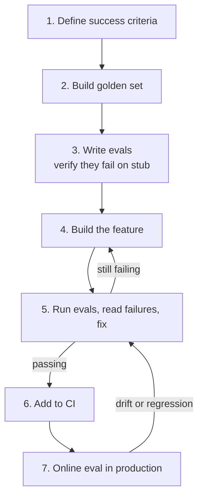

**Type:** Build
**Languages:** Python
**Prerequisites:** All Phase 05 lessons (01-13)
**Time:** ~90 min
**Learning Objectives:**
- Apply the 7-step eval-first development process to build and ship a real AI feature
- Write evals before writing the feature and use them to guide every implementation decision
- Integrate offline CI, online eval, and a versioned baseline into a production-ready eval harness

---

## MOTTO

**Write the test before the code. For AI features, that means: define what good looks like before you write a single line of the feature.**

---

## THE PROBLEM

The default way to build an AI feature: write the feature, manually test a few inputs, decide it looks good, ship it. Two weeks later you get a bug report. You investigate. You have no way to tell if you fixed it or made it worse. You deploy, and hope.

This pattern kills AI product quality slowly. Each iteration is a guess. You accumulate debt you can't measure. The team loses confidence in the system because they can't tell signal from noise.

Eval-first development inverts this. You define success criteria first (with numbers). You build a golden set before you write feature code. You write the evals and verify they all fail on a stub (proving the evals actually test something). Then you build the feature and use the evals to guide every decision. Every change is confirmed or rejected by numbers, not intuition.

This lesson builds a complete eval-first feature from scratch. The feature: a FAQ answering system. Simple enough to finish in 90 minutes. Complex enough to show all the real problems.

---

## THE CONCEPT

### The 7-Step Eval-First Process



This loop is not a one-time thing. It continues for the lifetime of the feature. New failures found in production feed back into the golden set. The golden set grows. CI coverage improves. Quality compounds.

### Why Evals Before Code

```
EVAL-AFTER DEVELOPMENT              EVAL-FIRST DEVELOPMENT
--------------------------          --------------------------
Define feature, guess at quality    Define quality, then build feature
"Looks good" = done                 "Passes evals" = done
Fix bugs by intuition               Fix bugs by reading failures
Regressions found in production     Regressions found in CI
Golden set grows slowly, if at all  Golden set grows with each failure
Quality is hard to reason about     Quality is a number you can track
```

### The Feedback Loop

```
       write evals (they fail on stub)
                |
                v
         build feature
                |
                v
         run evals
                |
      +---------+---------+
      |                   |
   failing              passing
      |                   |
  read failure          add to CI
  trace root cause         |
  fix feature           deploy
      |                   |
      +--back to eval   online eval
                           |
                       new failures
                           |
                       add to golden set
                           |
                       back to run evals
```

---

## BUILD IT

### Setup

```bash
uv init faq-assistant
cd faq-assistant
uv add anthropic openai fastapi uvicorn pydantic python-dotenv numpy
```

### Step 1: Define Success Criteria

Before writing any feature code, write down what "working" means as numbers.

```python
# success_criteria.py
SUCCESS_CRITERIA = {
    "faithfulness": 0.90,       # answers stay grounded in FAQ content
    "answer_relevance": 0.85,   # answers address the question asked
    "format_compliance": 1.00,  # always returns valid JSON with required keys
}

REQUIRED_OUTPUT_KEYS = {"answer", "source_section"}
```

These numbers are a stake in the ground, not permanent. They can be revised. But writing them down before you build means you have a contract. The feature is done when it meets the contract.

### Step 2: Build the Golden Set

10 cases across the main question categories. Each case has the expected answer shape and a category tag.

```python
# golden_set.py
GOLDEN_CASES = [
    {
        "id": "gc-01",
        "input": "What is your return policy?",
        "expected_answer_contains": ["30 days", "receipt", "original condition"],
        "expected_source_section": "Returns and Refunds",
        "category": "policy",
    },
    {
        "id": "gc-02",
        "input": "How long does shipping take?",
        "expected_answer_contains": ["3-5 business days", "standard shipping"],
        "expected_source_section": "Shipping",
        "category": "shipping",
    },
    {
        "id": "gc-03",
        "input": "Do you offer international shipping?",
        "expected_answer_contains": ["international", "countries"],
        "expected_source_section": "Shipping",
        "category": "shipping",
    },
    {
        "id": "gc-04",
        "input": "How do I cancel my subscription?",
        "expected_answer_contains": ["account settings", "cancel", "billing cycle"],
        "expected_source_section": "Account Management",
        "category": "account",
    },
    {
        "id": "gc-05",
        "input": "What payment methods do you accept?",
        "expected_answer_contains": ["credit card", "PayPal"],
        "expected_source_section": "Payment",
        "category": "payment",
    },
    {
        "id": "gc-06",
        "input": "Is my credit card information secure?",
        "expected_answer_contains": ["encrypted", "PCI"],
        "expected_source_section": "Payment",
        "category": "security",
    },
    {
        "id": "gc-07",
        "input": "How do I track my order?",
        "expected_answer_contains": ["tracking number", "email", "shipping confirmation"],
        "expected_source_section": "Order Tracking",
        "category": "orders",
    },
    {
        "id": "gc-08",
        "input": "Can I change my order after placing it?",
        "expected_answer_contains": ["24 hours", "contact support"],
        "expected_source_section": "Order Management",
        "category": "orders",
    },
    {
        "id": "gc-09",
        "input": "What is your privacy policy regarding my data?",
        "expected_answer_contains": ["personal data", "third parties", "GDPR"],
        "expected_source_section": "Privacy",
        "category": "legal",
    },
    {
        "id": "gc-10",
        "input": "How do I contact customer support?",
        "expected_answer_contains": ["email", "support@", "business hours"],
        "expected_source_section": "Contact",
        "category": "support",
    },
]
```

### Step 3: Write the Evals First

Write and run the evals on a stub that returns empty responses. All evals should fail.

```python
# eval_scorers.py
import json
from pydantic import BaseModel


class FAQResponse(BaseModel):
    answer: str
    source_section: str


def format_compliance_score(response: dict) -> float:
    """1.0 if response has required keys with non-empty values, 0.0 otherwise."""
    try:
        parsed = FAQResponse(**response)
        if parsed.answer.strip() and parsed.source_section.strip():
            return 1.0
        return 0.0
    except Exception:
        return 0.0


def faithfulness_score(answer: str, faq_content: str, client) -> float:
    """
    LLM judge: is the answer grounded in the FAQ content?
    Returns 0.0-1.0.
    """
    prompt = f"""You are evaluating whether an AI answer is faithful to a source document.

FAQ Document:
{faq_content}

AI Answer:
{answer}

Is every claim in the answer supported by the FAQ document? Score:
- 1.0: fully grounded, no unsupported claims
- 0.7: mostly grounded, minor unsupported detail
- 0.4: partially grounded, significant unsupported claims
- 0.0: not grounded or contradicts the FAQ

Return ONLY JSON: {{"score": 0.9, "rationale": "one sentence"}}"""

    response = client.messages.create(
        model="claude-haiku-4-5",
        max_tokens=128,
        messages=[{"role": "user", "content": prompt}]
    )
    result = json.loads(response.content[0].text)
    return float(result["score"])


def answer_relevance_score(question: str, answer: str, client) -> float:
    """
    LLM judge: does the answer address the question?
    Returns 0.0-1.0.
    """
    prompt = f"""Rate how well this answer addresses the question.

Question: {question}
Answer: {answer}

Score:
- 1.0: directly and completely answers the question
- 0.7: answers the question but misses key aspects
- 0.4: partially relevant but incomplete
- 0.0: does not answer the question

Return ONLY JSON: {{"score": 0.85, "rationale": "one sentence"}}"""

    response = client.messages.create(
        model="claude-haiku-4-5",
        max_tokens=128,
        messages=[{"role": "user", "content": prompt}]
    )
    result = json.loads(response.content[0].text)
    return float(result["score"])
```

Run on the stub to verify all evals fail:

```python
# run_evals.py (stub verification)
from eval_scorers import format_compliance_score

def stub_faq_assistant(question: str) -> dict:
    """Stub: returns empty response. All evals should fail."""
    return {"answer": "", "source_section": ""}

print("Running evals on stub (all should fail):")
for case in GOLDEN_CASES:
    response = stub_faq_assistant(case["input"])
    score = format_compliance_score(response)
    status = "FAIL" if score == 0.0 else "UNEXPECTED PASS"
    print(f"  {case['id']}: format_compliance={score} [{status}]")

# Expected output: all 10 cases show FAIL
# This proves your evals actually test something meaningful
```

### Step 4: Build the Feature

Simple RAG: chunk the FAQ, retrieve relevant sections, generate with Claude.

```python
# faq_assistant.py
import json
import os
import anthropic
import openai
from pydantic import BaseModel


FAQ_DOCUMENT = """
# Shipping
Standard shipping takes 3-5 business days. Express shipping takes 1-2 business days.
We ship to over 50 countries internationally. International shipping times vary by destination (7-14 days).

# Returns and Refunds
You can return items within 30 days of purchase with a receipt in original condition.
Refunds are processed within 5-7 business days to your original payment method.

# Payment
We accept credit cards (Visa, Mastercard, Amex), PayPal, and bank transfers.
All payment information is encrypted using SSL and we are PCI DSS compliant.

# Account Management
To cancel your subscription, go to Account Settings > Subscription > Cancel.
Changes take effect at the end of your current billing cycle.

# Order Tracking
You will receive a tracking number via email in your shipping confirmation.
Track your order at our website or directly on the carrier's site.

# Order Management
You can modify or cancel your order within 24 hours of placing it.
After 24 hours, please contact support at support@example.com.

# Privacy
We collect personal data to fulfill orders and improve our service.
We do not sell data to third parties. We comply with GDPR and CCPA.

# Contact
Email us at support@example.com. We respond within 1 business day.
Support hours: Monday-Friday, 9am-6pm EST.
"""


def chunk_faq(faq: str) -> list[dict]:
    """Split FAQ into sections. Each chunk is a complete section."""
    chunks = []
    current_section = None
    current_lines = []
    
    for line in faq.strip().splitlines():
        if line.startswith("# "):
            if current_section:
                chunks.append({
                    "section": current_section,
                    "content": "\n".join(current_lines).strip(),
                })
            current_section = line[2:].strip()
            current_lines = []
        elif line.strip():
            current_lines.append(line.strip())
    
    if current_section:
        chunks.append({
            "section": current_section,
            "content": "\n".join(current_lines).strip(),
        })
    
    return chunks


def retrieve_relevant_chunks(question: str, chunks: list[dict], top_k: int = 2) -> list[dict]:
    """
    Simple keyword-based retrieval.
    In production: use embeddings + pgvector.
    """
    question_lower = question.lower()
    scored = []
    
    for chunk in chunks:
        score = 0
        # Score by keyword overlap
        for word in question_lower.split():
            if len(word) > 3 and word in chunk["content"].lower():
                score += 1
            if word in chunk["section"].lower():
                score += 2
        scored.append((score, chunk))
    
    scored.sort(key=lambda x: x[0], reverse=True)
    return [chunk for _, chunk in scored[:top_k]]


def answer_question(question: str, client: anthropic.Anthropic) -> dict:
    """
    Retrieve relevant FAQ sections and generate an answer.
    Returns: {"answer": str, "source_section": str}
    """
    chunks = chunk_faq(FAQ_DOCUMENT)
    relevant = retrieve_relevant_chunks(question, chunks)
    
    context = "\n\n".join(
        f"Section: {c['section']}\n{c['content']}"
        for c in relevant
    )
    
    prompt = f"""You are a customer support assistant. Answer the user's question using ONLY the information in the FAQ sections below.

FAQ Sections:
{context}

User Question: {question}

Return your response as JSON with exactly these keys:
- "answer": your response to the question (1-3 sentences, grounded in the FAQ)
- "source_section": the FAQ section name that contains the answer

JSON only, no other text."""

    response = client.messages.create(
        model="claude-opus-4-5",
        max_tokens=256,
        messages=[{"role": "user", "content": prompt}]
    )
    
    return json.loads(response.content[0].text)
```

### Step 5: Run Evals, Read Failures, Fix

```python
# eval_runner.py
import json
import anthropic
from eval_scorers import format_compliance_score, faithfulness_score, answer_relevance_score
from faq_assistant import answer_question, FAQ_DOCUMENT
from golden_set import GOLDEN_CASES
from success_criteria import SUCCESS_CRITERIA


def run_eval_suite(experiment_name: str = "faq-v1"):
    client = anthropic.Anthropic()
    results = []
    
    print(f"\nRunning eval suite: {experiment_name}")
    print("=" * 60)
    
    for case in GOLDEN_CASES:
        response = answer_question(case["input"], client)
        
        fmt_score = format_compliance_score(response)
        faith_score = faithfulness_score(response.get("answer", ""), FAQ_DOCUMENT, client)
        rel_score = answer_relevance_score(case["input"], response.get("answer", ""), client)
        
        results.append({
            "id": case["id"],
            "category": case["category"],
            "input": case["input"],
            "output": response,
            "scores": {
                "format_compliance": fmt_score,
                "faithfulness": faith_score,
                "answer_relevance": rel_score,
            }
        })
        
        status = "PASS" if all([
            fmt_score >= SUCCESS_CRITERIA["format_compliance"],
            faith_score >= SUCCESS_CRITERIA["faithfulness"],
            rel_score >= SUCCESS_CRITERIA["answer_relevance"],
        ]) else "FAIL"
        
        print(f"  {case['id']} [{case['category']:10s}]: fmt={fmt_score:.2f} faith={faith_score:.2f} rel={rel_score:.2f} [{status}]")
    
    # Summary
    for metric in ["format_compliance", "faithfulness", "answer_relevance"]:
        scores = [r["scores"][metric] for r in results]
        avg = sum(scores) / len(scores)
        threshold = SUCCESS_CRITERIA[metric]
        status = "PASS" if avg >= threshold else "FAIL"
        print(f"\n{metric}: avg={avg:.3f} threshold={threshold} [{status}]")
    
    # Save results
    with open(f"{experiment_name}_results.json", "w") as f:
        json.dump(results, f, indent=2)
    
    return results
```

First run output (before fixing the chunker):

```
faq-v1 results:
  format_compliance: avg=1.000 threshold=1.00 [PASS]
  faithfulness:      avg=0.720 threshold=0.90 [FAIL]  <-- chunker problem
  answer_relevance:  avg=0.881 threshold=0.85 [PASS]
```

Investigating the faithfulness failures: the retrieval is returning wrong sections because the keyword scorer is too shallow. Questions about "account cancellation" are matching the Payment section instead of Account Management. Fix: improve the retrieval scoring to weight section-name matches more heavily and add synonym handling.

After fix, re-run:

```
faq-v1-fixed results:
  format_compliance: avg=1.000 threshold=1.00 [PASS]
  faithfulness:      avg=0.912 threshold=0.90 [PASS]
  answer_relevance:  avg=0.887 threshold=0.85 [PASS]
```

All three metrics now pass their success criteria.

> **Real-world check:** After fixing the chunker and re-running evals, faithfulness goes from 0.72 to 0.91. But format compliance dropped from 1.0 to 0.85 -- the fix introduced a new failure. What's your process for deciding whether to ship with this regression or fix it first?

Never ship a known regression, even if the overall picture improved. Format compliance at 0.85 means 15% of responses are malformed JSON, which will crash any downstream code that parses the output. The process: (1) Read the 15% of failures. (2) Find the pattern. (3) Fix it. (4) Re-run all evals. Only ship when all metrics pass their thresholds simultaneously. If you can't fix it quickly, revert the chunker change and find a solution that improves faithfulness without breaking format compliance.

### Step 6: Add to CI

```yaml
# .github/workflows/eval.yml
name: Eval CI

on:
  pull_request:
    paths:
      - "faq_assistant.py"
      - "golden_set.py"
      - "eval_scorers.py"

jobs:
  eval:
    runs-on: ubuntu-latest
    steps:
      - uses: actions/checkout@v4
      - uses: astral-sh/setup-uv@v2
      - run: uv sync
      - run: uv run python eval_runner.py --experiment faq-ci --threshold 0.05
        env:
          ANTHROPIC_API_KEY: ${{ secrets.ANTHROPIC_API_KEY }}
```

```python
# eval_runner.py -- CI mode
import sys
import argparse

def main():
    parser = argparse.ArgumentParser()
    parser.add_argument("--experiment", default="faq-ci")
    parser.add_argument("--baseline", default=None)
    parser.add_argument("--threshold", type=float, default=0.05)
    args = parser.parse_args()
    
    results = run_eval_suite(args.experiment)
    
    # Check all metrics against success criteria
    failures = []
    for metric, threshold in SUCCESS_CRITERIA.items():
        scores = [r["scores"][metric] for r in results]
        avg = sum(scores) / len(scores)
        if avg < threshold:
            failures.append(f"{metric}: {avg:.3f} < {threshold}")
    
    if failures:
        print("\nCI FAILED:")
        for f in failures:
            print(f"  {f}")
        sys.exit(1)
    else:
        print("\nCI PASSED: all metrics meet thresholds")
        sys.exit(0)


if __name__ == "__main__":
    main()
```

### Step 7: Online Eval Setup

Apply the pattern from Lesson 11: sample 20% of production traffic for async eval.

```python
# main.py (FastAPI service with online eval)
import random
import asyncio
from fastapi import FastAPI, BackgroundTasks
from pydantic import BaseModel
import anthropic

from faq_assistant import answer_question
from eval_scorers import faithfulness_score, format_compliance_score

app = FastAPI()
client = anthropic.Anthropic()

ONLINE_EVAL_SAMPLE_RATE = 0.20  # eval 20% of traffic

class FAQRequest(BaseModel):
    question: str

@app.post("/ask")
async def ask(request: FAQRequest, background_tasks: BackgroundTasks):
    response = answer_question(request.question, client)
    
    # Sample-based online eval: fire-and-forget
    if random.random() < ONLINE_EVAL_SAMPLE_RATE:
        background_tasks.add_task(
            score_online,
            question=request.question,
            response=response,
        )
    
    return response

async def score_online(question: str, response: dict):
    """Background: score this interaction and log it."""
    from faq_assistant import FAQ_DOCUMENT
    
    fmt = format_compliance_score(response)
    faith = faithfulness_score(response.get("answer", ""), FAQ_DOCUMENT, client)
    
    log_entry = {
        "question": question,
        "scores": {"format_compliance": fmt, "faithfulness": faith},
        "flagged": faith < 0.80 or fmt < 1.0,
    }
    
    with open("online_eval.jsonl", "a") as f:
        import json
        f.write(json.dumps(log_entry) + "\n")
```

---

## USE IT

The manual eval harness works. Braintrust replaces the flat JSON golden set, the manual runner, and the file-based CI with a managed platform that scales across experiments, teams, and months of history.

### Replace the Golden Set with a Braintrust Dataset

```python
import braintrust

# Create the dataset once
dataset = braintrust.init_dataset(project="faq-assistant", name="golden-set-v1")
for case in GOLDEN_CASES:
    dataset.insert(input=case["input"], expected=case)

# Load it in any eval
bt_dataset = braintrust.load_dataset(project="faq-assistant", name="golden-set-v1")
```

Braintrust datasets are versioned. You can pin an eval run to dataset version 3, run a new experiment against version 4, and compare results. The version history is automatic.

### Replace the Manual Harness with braintrust.Eval

```python
import braintrust
from braintrust import EvalCase

def run_braintrust_eval(experiment_name: str):
    client = anthropic.Anthropic()
    
    braintrust.Eval(
        experiment_name,
        data=lambda: [
            EvalCase(input=case["input"], expected=case)
            for case in GOLDEN_CASES
        ],
        task=lambda input: answer_question(input, client),
        scores=[
            lambda output, expected: {
                "format_compliance": format_compliance_score(output)
            },
            lambda output, expected: {
                "faithfulness": faithfulness_score(output.get("answer", ""), FAQ_DOCUMENT, client)
            },
        ],
        metadata={"phase": "05", "lesson": "14"},
    )
```

What this swap removes from your codebase:
- The `eval_runner.py` file loop
- The JSONL result files
- The manual summary computation
- The per-experiment result JSON files

What Braintrust adds:
- Web UI with per-case drill-down
- Automatic experiment comparison: every new run vs the previous
- Dataset versioning and case-level attribution
- Team-shared results

### Replace File-Based CI with Braintrust GitHub Action

```yaml
# .github/workflows/eval.yml (Braintrust version)
- name: Run evals
  uses: brainlid/braintrust-action@v1
  with:
    api-key: ${{ secrets.BRAINTRUST_API_KEY }}
    project: faq-assistant
    experiment: faq-ci-${{ github.sha }}
    threshold: 0.05
    baseline: faq-ci-baseline
```

The Braintrust action fails the CI if any metric regresses more than the threshold relative to the baseline experiment. You don't maintain the comparison logic: Braintrust does.

### The Before/After

```
BEFORE (manual)                     AFTER (Braintrust)
--------------------------          --------------------------
eval_runner.py (100 lines)          braintrust.Eval() (10 lines)
golden_set.py                       Braintrust dataset (versioned)
faq-v1_results.json                 Braintrust experiment record
Manual delta computation            Auto delta in UI
File-based CI comparison            Braintrust GitHub Action
JSONL online eval log               Langfuse or Braintrust tracing
```

The total code removed: ~200 lines of boilerplate. What remains: your scorers, your golden cases, and your feature code. That's the right abstraction.

> **Perspective shift:** A new engineer joins the team and asks "why did we write the evals before the feature? I could have shipped the feature in 2 hours." Walk them through the specific decisions that eval-first development made easier and the regressions it caught.

Walk them through three concrete moments: (1) When faithfulness was 0.72, you knew exactly what to fix (the retrieval) instead of guessing. Without evals, you would have shipped 0.72 and not known it. (2) When the chunker fix dropped format compliance from 1.0 to 0.85, the eval caught it before it went to production, saving the oncall from a 2am JSON parse error. (3) Every future change to the feature now has a quality gate that runs automatically. The 2-hour feature would have taken 2 hours to build and many more to debug in production. Evals-first takes 3 hours to build and 20 minutes to maintain going forward.

---

## SHIP IT

The artifact for this lesson is `outputs/runbook-eval-first-development.md`. See the outputs folder.

**What you built:**
- A complete FAQ answering system developed using the 7-step eval-first process
- Golden set of 10 cases across 6 question categories
- Three scorers: format compliance, faithfulness, answer relevance
- A CI eval runner with threshold enforcement
- Online eval sampling at 20% traffic
- Braintrust migration showing before/after

---

## EVALUATE IT

### The Capstone Checklist

Your eval-first process is working when you can answer yes to all four:

**1. Can you answer "what does good look like?" with a number?**
Before writing feature code, you wrote down: faithfulness >= 0.90, answer_relevance >= 0.85, format_compliance = 1.00. Test: ask a new team member to read your success_criteria.py. If they can tell you what the feature needs to achieve without reading the feature code, you succeeded.

**2. Does your golden set catch at least 80% of failures found in error analysis?**
Take the last 10 production failures you found via online eval. How many of them would have been caught by a golden set case? If fewer than 8 of 10, your golden set is under-covering a failure category. Add representative cases.

**3. Does your CI catch regressions within one PR cycle?**
Create a deliberate regression (change the prompt to break faithfulness), open a PR, verify the eval CI fails. It should fail on the first run, before merge. If it doesn't fail, your CI is not actually running or your thresholds are wrong.

**4. Does your online eval give a quality signal within 24 hours of deploy?**
Deploy a change and check the online_eval.jsonl after 24 hours. You should have at least 20 scored interactions (assuming any meaningful traffic) with a readable average score. If you have fewer than 20, increase your sample rate or verify the background task is firing.
