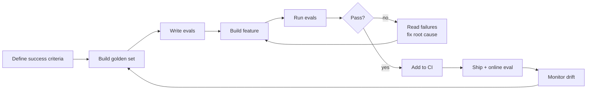

# Phase 05: Evaluation & Eval-Driven Development

> **The differentiator.** Every other applied AI course treats evals as an afterthought. This phase puts them at the center: how do you know your system works? How do you catch regressions before users do? How do you make decisions with data instead of vibes?

**Status:** ✅ Complete  
**Time:** ~15 hours  
**Prerequisites:** P02 (RAG) or P04 (Agents) — you need a system to evaluate

---

## What you build

By the end of this phase you have a complete evaluation stack:

- A golden dataset for your system
- Automated scorers (exact match, fuzzy, LLM-as-judge, pairwise)
- A regression-catching eval harness
- CI that fails your PR if quality drops
- Online evals running in production on sampled traffic
- Drift detection that catches silent degradation

And a mindset shift: you write the evals before you write the feature.

---

## Lessons

| # | Lesson | Artifact | Time |
|---|--------|----------|------|
| 01 | Why Evals Are the Job | `outputs/prompt-eval-scorecard.md` | ~45 min |
| 02 | Error Analysis First: Look at Your Data | `outputs/skill-error-analysis.md` | ~60 min |
| 03 | Trace Review & Failure Taxonomy | `outputs/skill-trace-review.md` | ~60 min |
| 04 | Building a Golden Set | `outputs/skill-golden-set-builder.md` | ~60 min |
| 05 | Metrics That Matter vs Vanity Metrics | `outputs/prompt-metric-selector.md` | ~45 min |
| 06 | LLM-as-Judge: Build, Calibrate, Know Its Failure Modes | `outputs/prompt-llm-judge.md` | ~75 min |
| 07 | Pairwise & Reference-Based Evals | `outputs/prompt-pairwise-judge.md` | ~45 min |
| 08 | Eval Harnesses: Raw to Braintrust / LangSmith / Phoenix | `outputs/skill-eval-harness.md` | ~75 min |
| 09 | CI for Prompts: Regression on Every Change | `outputs/skill-prompt-ci.md` | ~60 min |
| 10 | Evaluating RAG, Agents, Multi-Step Systems | `outputs/skill-multistep-eval.md` | ~60 min |
| 11 | Online Evals & Production Feedback Loops | `outputs/skill-online-eval-pipeline.md` | ~60 min |
| 12 | Drift & Regression Detection | `outputs/skill-drift-detection.md` | ~45 min |
| 13 | A/B Testing LLM Features | `outputs/skill-ab-testing-llm.md` | ~45 min |
| 14 | Capstone: Eval-First Development of a Feature | `outputs/runbook-eval-first-development.md` | ~90 min |

---

## Artifacts produced

| Artifact | Type | What it does |
|----------|------|--------------|
| `prompt-eval-scorecard.md` | prompt | LLM-as-judge template returning structured scores with reasoning |
| `skill-error-analysis.md` | skill | Guide for structured error analysis - annotation schema, open coding, failure taxonomy |
| `skill-trace-review.md` | skill | Trace schema, 7-category failure taxonomy, triage process |
| `skill-golden-set-builder.md` | skill | Golden dataset guide: sourcing, labeling, sizing, maintenance |
| `prompt-metric-selector.md` | prompt | Chooses the right eval metrics for a given system type and failure modes |
| `prompt-llm-judge.md` | prompt | Production-ready LLM-as-judge template with rubric and bias checklist |
| `prompt-pairwise-judge.md` | prompt | Pairwise judge with position-bias mitigation and preference rate guide |
| `skill-eval-harness.md` | skill | EvalHarness template, scorer spec, platform decision matrix |
| `skill-prompt-ci.md` | skill | GitHub Actions workflow, CI threshold guide, intentional regression process |
| `skill-multistep-eval.md` | skill | RAG Triad, agent trajectory evals, component vs end-to-end strategy |
| `skill-online-eval-pipeline.md` | skill | Async eval architecture, sampling strategy, runbook for score drops |
| `skill-drift-detection.md` | skill | ScoreHistory pattern, drift taxonomy, threshold guide |
| `skill-ab-testing-llm.md` | skill | ABRouter + ABAnalyzer templates, pitfall checklist, decision template |
| `runbook-eval-first-development.md` | runbook | 7-step eval-first process applicable to any AI feature |

---

## Setup

```bash
# Install dependencies
uv venv && source .venv/bin/activate
uv pip install anthropic openai braintrust ragas fastapi uvicorn scipy

# Set API keys
export ANTHROPIC_API_KEY=...
export OPENAI_API_KEY=...
export BRAINTRUST_API_KEY=...  # optional, needed for USE IT sections

# Run lesson 01
python phases/05-evaluation-and-eval-driven-development/01-why-evals-are-the-job/code/main.py
```

---

## The eval-driven development loop



The loop never ends. That's the point.
