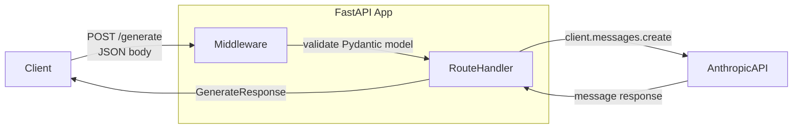

# تغليف نموذج داخل FastAPI

> هيّئ العميل مرة واحدة. عالِج الطلب مرات كثيرة.

**النوع:** بناء
**اللغات:** Python
**المتطلبات:** الدرس 06-01 (الفجوة بين العرض التجريبي والإنتاج)، إلمام بواجهات HTTP API
**الوقت:** ~60 دقيقة
**أهداف التعلّم:**
- بناء خدمة FastAPI بنقطتي نهاية (endpoints) للنموذج وفحص صحة (health check)
- تصميم نماذج الطلب والاستجابة باستخدام Pydantic للتحقّق التلقائي
- استخدام أحداث lifespan في FastAPI لتهيئة عميل Anthropic مرة واحدة عند بدء التشغيل
- إعادة رموز حالة HTTP الصحيحة: 422 للمدخل السيئ، و500 لأخطاء الخادم
- اختبار نقاط النهاية بـ curl وفهم معنى كل حقل في الاستجابة

---

## المشكلة

لديك نداء نموذج عامل. الآن يريد فريق الواجهة الأمامية (frontend) استخدامه. ويريد تطبيق جوّال استخدامه. ويريد تكامل مع شريك استخدامه. جميعهم يتحدّثون HTTP.

النهج الساذج هو تشغيل سكربت وكشفه بشيء مثل `flask run` أو `http.server` بسيط. هذا ينهار تحت أي حمل حقيقي، ولا يمنحك تحقّقًا من الطلب، ولا استجابات أخطاء بنيوية، ولا طريقة لمعرفة إن كانت الخدمة حيّة.

تحلّ FastAPI كلًا من هذه. فهي تمنحك: تحقّقًا تلقائيًا من الطلب (Pydantic)، وتوثيق OpenAPI تلقائيًا، ومعالجة طلبات غير متزامنة (async)، واستجابات أخطاء نظيفة، ونمطًا قياسيًا لتهيئة الموارد. إنها الأداة الصحيحة لهذه المهمة وهي سريعة بحق.

الخطأ الوحيد الذي يرتكبه المهندسون عند تغليف نموذج داخل FastAPI هو إنشاء عميل `anthropic.Anthropic()` جديد لكل طلب. هذا يضيف عبء شبكة، ويهدر الذاكرة، ويتجاهل تجميع الاتصالات (connection pooling) الذي تديره الـ SDK نيابةً عنك. مكان العميل هو بدء التشغيل، لا داخل معالج المسار (route handler).

---

## المفهوم

### مسار الطلب عبر FastAPI



### lifespan: أين يعيش العميل

```
Process starts
    |
    v
lifespan() -- startup phase
    |-- anthropic.Anthropic() created ONCE
    |-- stored in app.state
    |-- connection pool initialized
    v
Service accepts requests
    |-- route handlers read from app.state
    |-- no new client per request
    v
lifespan() -- shutdown phase
    |-- clean up resources
    v
Process ends
```

### رموز حالة HTTP لخدمات AI

```
+--------+---------------------------+---------------------------------------+
| Code   | Name                      | When to use in an AI service          |
+--------+---------------------------+---------------------------------------+
| 200    | OK                        | Model responded, all good             |
| 422    | Unprocessable Entity      | Request body fails Pydantic validation|
| 429    | Too Many Requests         | Rate limit hit (upstream or yours)    |
| 500    | Internal Server Error     | Model call failed, unexpected error   |
| 503    | Service Unavailable       | Anthropic API is down, try later      |
+--------+---------------------------+---------------------------------------+
```

تعيد FastAPI رمز 422 تلقائيًا حين لا يطابق جسم الطلب نموذج Pydantic لديك. كل ما عليك معالجته يدويًا هو 500 و503.

---

## البناء

### الخطوة 1: الاعتماديات (Dependencies)

```bash
uv add fastapi uvicorn anthropic pydantic
# or: pip install fastapi uvicorn anthropic pydantic
```

### الخطوة 2: نماذج الطلب والاستجابة

عرّف عقد الـ API لديك بـ Pydantic قبل كتابة أي منطق للمسار. هذه هي الواجهة التي يعتمد عليها عملاؤك، فغيّرها بحذر.

```python
from pydantic import BaseModel, Field

class GenerateRequest(BaseModel):
    prompt: str = Field(..., min_length=1, max_length=4000,
                        description="The user prompt to send to the model")
    max_tokens: int = Field(default=512, ge=1, le=4096,
                            description="Maximum tokens in the response")
    system: str | None = Field(default=None, max_length=2000,
                               description="Optional system prompt")

class GenerateResponse(BaseModel):
    text: str
    input_tokens: int
    output_tokens: int
    model: str

class ExtractRequest(BaseModel):
    text: str = Field(..., min_length=1, max_length=8000,
                      description="Text to extract structured data from")
    schema_hint: str = Field(..., min_length=1, max_length=500,
                              description="Description of what to extract, e.g. 'name, email, company'")

class ExtractResponse(BaseModel):
    raw_json: str
    parsed: dict | None  # None if model output was not valid JSON
    input_tokens: int
    output_tokens: int
```

قيود `Field` في Pydantic (`min_length`، `ge`، `le`) تتحوّل إلى استجابات 422 تلقائية. تحصل على التحقّق من المدخل مجانًا.

### الخطوة 3: حدث lifespan (تهيئة العميل)

```python
from contextlib import asynccontextmanager
from fastapi import FastAPI
import anthropic
import os

@asynccontextmanager
async def lifespan(app: FastAPI):
    # STARTUP: runs once when the process starts
    api_key = os.environ.get("ANTHROPIC_API_KEY")
    if not api_key:
        raise EnvironmentError("ANTHROPIC_API_KEY not set")

    app.state.client = anthropic.Anthropic(api_key=api_key)
    app.state.model = os.environ.get("MODEL", "claude-3-5-haiku-20241022")
    print(f"Startup complete: model={app.state.model}")

    yield  # service is running; requests are handled here

    # SHUTDOWN: runs once when the process stops
    print("Shutting down")

app = FastAPI(title="AI Service", lifespan=lifespan)
```

يُنشأ العميل مرة واحدة بالضبط. وكل معالج طلب يقرأه من `app.state.client`. هذا هو النمط الصحيح.

### الخطوة 4: نقطة نهاية Generate

```python
from fastapi import Request, HTTPException
import logging

log = logging.getLogger(__name__)

@app.post("/generate", response_model=GenerateResponse)
async def generate(req: Request, body: GenerateRequest):
    """Generate a text response from the model."""
    client: anthropic.Anthropic = req.app.state.client
    model: str = req.app.state.model

    messages = [{"role": "user", "content": body.prompt}]
    kwargs = {
        "model": model,
        "max_tokens": body.max_tokens,
        "messages": messages,
    }
    if body.system:
        kwargs["system"] = body.system

    try:
        response = client.messages.create(**kwargs)
    except anthropic.APIStatusError as e:
        log.error("Anthropic API error status=%d: %s", e.status_code, e)
        if e.status_code == 429:
            raise HTTPException(status_code=429, detail="Rate limit reached. Retry after a moment.")
        raise HTTPException(status_code=502, detail="Upstream model error.")
    except Exception as e:
        log.error("Unexpected error calling model: %s", e, exc_info=True)
        raise HTTPException(status_code=500, detail="Internal server error.")

    return GenerateResponse(
        text=response.content[0].text,
        input_tokens=response.usage.input_tokens,
        output_tokens=response.usage.output_tokens,
        model=response.model,
    )
```

### الخطوة 5: نقطة نهاية Extract

```python
import json

EXTRACT_SYSTEM = (
    "You are a data extraction assistant. "
    "Extract the requested fields from the provided text and return them as a JSON object. "
    "Return ONLY the JSON object with no preamble, explanation, or markdown code fences."
)

@app.post("/extract", response_model=ExtractResponse)
async def extract(req: Request, body: ExtractRequest):
    """Extract structured data from text using the model."""
    client: anthropic.Anthropic = req.app.state.client
    model: str = req.app.state.model

    user_message = (
        f"Text to extract from:\n{body.text}\n\n"
        f"Extract these fields: {body.schema_hint}\n\n"
        f"Return a JSON object with those fields."
    )

    try:
        response = client.messages.create(
            model=model,
            max_tokens=1024,
            system=EXTRACT_SYSTEM,
            messages=[{"role": "user", "content": user_message}],
        )
    except anthropic.APIStatusError as e:
        log.error("Anthropic API error status=%d: %s", e.status_code, e)
        raise HTTPException(status_code=502, detail="Upstream model error.")
    except Exception as e:
        log.error("Unexpected error in extract: %s", e, exc_info=True)
        raise HTTPException(status_code=500, detail="Internal server error.")

    raw = response.content[0].text.strip()
    # Strip markdown code fences if present (GAP 5 from Lesson 01)
    if raw.startswith("```"):
        lines = raw.split("\n")
        raw = "\n".join(lines[1:-1]) if len(lines) > 2 else raw

    parsed = None
    try:
        parsed = json.loads(raw)
    except json.JSONDecodeError:
        log.warning("Model output was not valid JSON: %r", raw[:200])

    return ExtractResponse(
        raw_json=raw,
        parsed=parsed,
        input_tokens=response.usage.input_tokens,
        output_tokens=response.usage.output_tokens,
    )
```

### الخطوة 6: فحص الصحة (Health Check)

```python
from datetime import datetime, timezone

@app.get("/health")
async def health(req: Request):
    """
    Health check endpoint for load balancers and uptime monitors.
    Returns 200 when the service is running.
    Does NOT call the model (too expensive for a health check).
    """
    return {
        "status": "ok",
        "model": req.app.state.model,
        "timestamp": datetime.now(timezone.utc).isoformat(),
    }
```

يجب أن يكون فحص الصحة سريعًا ورخيصًا. لا تنادِ النموذج أبدًا داخل فحص صحة. فموازنات الأحمال (load balancers) تناديه كل 10-30 ثانية.

> **اختبار من الواقع:** يسألك مهندس الـ DevOps لماذا لا يختبر فحص الصحة النموذج فعليًا بنداءه. فالخدمة قد تكون "حيّة" بينما نقطة نهاية النموذج معطّلة. كيف تشرح المفاضلة بين فحص صحة عميق وآخر سطحي، ومتى تستخدم كلًا منهما؟

---

## الاستخدام

شغّل الخدمة:

```bash
export ANTHROPIC_API_KEY=sk-ant-...
uvicorn main:app --reload --port 8000
```

اختبر بـ curl:

```bash
# Health check
curl http://localhost:8000/health

# Generate
curl -X POST http://localhost:8000/generate \
  -H "Content-Type: application/json" \
  -d '{"prompt": "What is the boiling point of water?", "max_tokens": 100}'

# Extract
curl -X POST http://localhost:8000/extract \
  -H "Content-Type: application/json" \
  -d '{"text": "Contact Jane Smith at jane@example.com, she works at Acme Corp.", "schema_hint": "name, email, company"}'

# Trigger a 422 (bad input)
curl -X POST http://localhost:8000/generate \
  -H "Content-Type: application/json" \
  -d '{"prompt": "", "max_tokens": 100}'
```

تولّد FastAPI تلقائيًا توثيق API تفاعليًا على `http://localhost:8000/docs`. استخدمه لاستكشاف نقاط نهايتك واختبارها دون كتابة أوامر curl.

ملف `code/main.py` هو الخدمة الكاملة، قابل للتشغيل كما هو. الخدمة الكاملة بكل الاستيرادات والنماذج والمسارات أقل من 150 سطرًا.

> **نقلة في المنظور:** يقترح زميل تغليف كل مسار بـ `try/except Exception` لالتقاط كل شيء وإعادة 500. ويقول إن هذا يبقي الكود بسيطًا ويمنع أي أخطاء غير مُعالَجة من الوصول للمستخدمين. ما المشكلة في هذا النهج، وأي فئة من الأخطاء لا ينبغي التقاطها على مستوى المسار؟

---

## التسليم

المخرَج القابل لإعادة الاستخدام لهذا الدرس هو `outputs/skill-fastapi-ai-service.md`. وهو قالب خدمة FastAPI بسيط بتهيئة lifespan صحيحة، ونماذج طلب/استجابة Pydantic، ونقطتي نهاية، وفحص صحة، وأنماط معالجة الأخطاء من هذا الدرس.

انسخه كنقطة بداية لأي خدمة AI مصغّرة (microservice) جديدة.

---

## التقييم

**التحقق 1: التحقّق عند بدء التشغيل.**
شغّل الخدمة دون ضبط `ANTHROPIC_API_KEY`. ينبغي أن تخرج العملية فورًا برسالة خطأ واضحة تسمّي المتغيّر المفقود. ولا ينبغي أن تبدأ في قبول الطلبات.

**التحقق 2: التحقّق من المدخل تلقائي.**
أرسل POST إلى `/generate` بحقل `prompt` فارغ (`"prompt": ""`). تأكّد من أنك تتلقّى استجابة 422 بجسم خطأ تحقّق Pydantic، لا 500، ولا نداء نموذج.

**التحقق 3: عميل واحد لكل عملية.**
أضف `print(id(client))` داخل معالج `/generate`. أرسل 5 طلبات. ينبغي أن تطبع الأسطر الخمسة العدد الصحيح نفسه. إذا اختلفت، فيجري إنشاء عميل جديد لكل طلب.

**التحقق 4: زمن استجابة فحص الصحة.**
نادِ `/health` عشر مرات. ينبغي أن يكون متوسط زمن الاستجابة أقل من 5ms. إذا كان أبطأ، فالمعالج يقوم بعمل لا ينبغي له (مثل نداء النموذج أو القراءة من القرص).

**التحقق 5: شكل استجابة الخطأ.**
أوقف الشبكة أو اضبط مفتاحًا غير صالح بعد بدء التشغيل. أرسل POST إلى `/generate`. تأكّد من أن الاستجابة جسم خطأ JSON بنيوي (`{"detail": "..."}`) برمز حالة 4xx أو 5xx، لا تتبّع مكدّس Python، ولا جسم فارغ.
