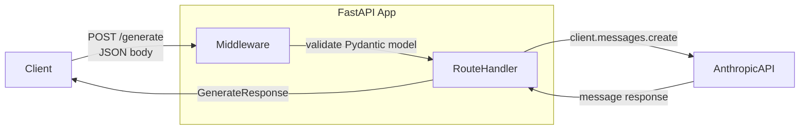

# Wrapping a Model in FastAPI

> Initialize the client once. Handle the request many times.

**Type:** Build
**Languages:** Python
**Prerequisites:** Lesson 06-01 (demo-to-production gap), familiarity with HTTP APIs
**Time:** ~60 min
**Learning Objectives:**
- Build a FastAPI service with two model endpoints and a health check
- Design request and response models with Pydantic for automatic validation
- Use FastAPI lifespan events to initialize the Anthropic client once at startup
- Return correct HTTP status codes: 422 for bad input, 500 for server errors
- Test endpoints with curl and understand what each response field means

---

## The Problem

You have a working model call. Now a frontend team wants to use it. A mobile app wants to use it. A partner integration wants to use it. They all speak HTTP.

The naive approach is to run a script and expose it with something like `flask run` or a simple `http.server`. That breaks under any real load, gives you no request validation, no structured error responses, and no way to tell if the service is alive.

FastAPI solves each of these. It gives you: automatic request validation (Pydantic), automatic OpenAPI docs, async request handling, clean error responses, and a standard pattern for resource initialization. It is the right tool for this job and it is genuinely fast.

The one mistake engineers make when wrapping a model in FastAPI is creating a new `anthropic.Anthropic()` client per request. That adds network overhead, wastes memory, and ignores the connection pooling the SDK manages for you. The client belongs at startup, not inside the route handler.

---

## The Concept

### Request Flow Through FastAPI



### Lifespan: Where the Client Lives

```
Process starts
    |
    v
lifespan() -- startup phase
    |-- anthropic.Anthropic() created ONCE
    |-- stored in app.state
    |-- connection pool initialized
    v
Service accepts requests
    |-- route handlers read from app.state
    |-- no new client per request
    v
lifespan() -- shutdown phase
    |-- clean up resources
    v
Process ends
```

### HTTP Status Codes for AI Services

```
+--------+---------------------------+---------------------------------------+
| Code   | Name                      | When to use in an AI service          |
+--------+---------------------------+---------------------------------------+
| 200    | OK                        | Model responded, all good             |
| 422    | Unprocessable Entity      | Request body fails Pydantic validation|
| 429    | Too Many Requests         | Rate limit hit (upstream or yours)    |
| 500    | Internal Server Error     | Model call failed, unexpected error   |
| 503    | Service Unavailable       | Anthropic API is down, try later      |
+--------+---------------------------+---------------------------------------+
```

FastAPI automatically returns 422 when the request body does not match your Pydantic model. You only need to handle 500 and 503 yourself.

---

## Build It

### Step 1: Dependencies

```bash
uv add fastapi uvicorn anthropic pydantic
# or: pip install fastapi uvicorn anthropic pydantic
```

### Step 2: Request and Response Models

Define your API contract with Pydantic before writing any route logic. This is the interface your clients depend on -- change it carefully.

```python
from pydantic import BaseModel, Field

class GenerateRequest(BaseModel):
    prompt: str = Field(..., min_length=1, max_length=4000,
                        description="The user prompt to send to the model")
    max_tokens: int = Field(default=512, ge=1, le=4096,
                            description="Maximum tokens in the response")
    system: str | None = Field(default=None, max_length=2000,
                               description="Optional system prompt")

class GenerateResponse(BaseModel):
    text: str
    input_tokens: int
    output_tokens: int
    model: str

class ExtractRequest(BaseModel):
    text: str = Field(..., min_length=1, max_length=8000,
                      description="Text to extract structured data from")
    schema_hint: str = Field(..., min_length=1, max_length=500,
                              description="Description of what to extract, e.g. 'name, email, company'")

class ExtractResponse(BaseModel):
    raw_json: str
    parsed: dict | None  # None if model output was not valid JSON
    input_tokens: int
    output_tokens: int
```

Pydantic `Field` constraints (`min_length`, `ge`, `le`) become automatic 422 responses. You get input validation for free.

### Step 3: Lifespan Event (Client Initialization)

```python
from contextlib import asynccontextmanager
from fastapi import FastAPI
import anthropic
import os

@asynccontextmanager
async def lifespan(app: FastAPI):
    # STARTUP: runs once when the process starts
    api_key = os.environ.get("ANTHROPIC_API_KEY")
    if not api_key:
        raise EnvironmentError("ANTHROPIC_API_KEY not set")

    app.state.client = anthropic.Anthropic(api_key=api_key)
    app.state.model = os.environ.get("MODEL", "claude-3-5-haiku-20241022")
    print(f"Startup complete: model={app.state.model}")

    yield  # service is running; requests are handled here

    # SHUTDOWN: runs once when the process stops
    print("Shutting down")

app = FastAPI(title="AI Service", lifespan=lifespan)
```

The client is created exactly once. Every request handler reads it from `app.state.client`. This is the correct pattern.

### Step 4: The Generate Endpoint

```python
from fastapi import Request, HTTPException
import logging

log = logging.getLogger(__name__)

@app.post("/generate", response_model=GenerateResponse)
async def generate(req: Request, body: GenerateRequest):
    """Generate a text response from the model."""
    client: anthropic.Anthropic = req.app.state.client
    model: str = req.app.state.model

    messages = [{"role": "user", "content": body.prompt}]
    kwargs = {
        "model": model,
        "max_tokens": body.max_tokens,
        "messages": messages,
    }
    if body.system:
        kwargs["system"] = body.system

    try:
        response = client.messages.create(**kwargs)
    except anthropic.APIStatusError as e:
        log.error("Anthropic API error status=%d: %s", e.status_code, e)
        if e.status_code == 429:
            raise HTTPException(status_code=429, detail="Rate limit reached. Retry after a moment.")
        raise HTTPException(status_code=502, detail="Upstream model error.")
    except Exception as e:
        log.error("Unexpected error calling model: %s", e, exc_info=True)
        raise HTTPException(status_code=500, detail="Internal server error.")

    return GenerateResponse(
        text=response.content[0].text,
        input_tokens=response.usage.input_tokens,
        output_tokens=response.usage.output_tokens,
        model=response.model,
    )
```

### Step 5: The Extract Endpoint

```python
import json

EXTRACT_SYSTEM = (
    "You are a data extraction assistant. "
    "Extract the requested fields from the provided text and return them as a JSON object. "
    "Return ONLY the JSON object with no preamble, explanation, or markdown code fences."
)

@app.post("/extract", response_model=ExtractResponse)
async def extract(req: Request, body: ExtractRequest):
    """Extract structured data from text using the model."""
    client: anthropic.Anthropic = req.app.state.client
    model: str = req.app.state.model

    user_message = (
        f"Text to extract from:\n{body.text}\n\n"
        f"Extract these fields: {body.schema_hint}\n\n"
        f"Return a JSON object with those fields."
    )

    try:
        response = client.messages.create(
            model=model,
            max_tokens=1024,
            system=EXTRACT_SYSTEM,
            messages=[{"role": "user", "content": user_message}],
        )
    except anthropic.APIStatusError as e:
        log.error("Anthropic API error status=%d: %s", e.status_code, e)
        raise HTTPException(status_code=502, detail="Upstream model error.")
    except Exception as e:
        log.error("Unexpected error in extract: %s", e, exc_info=True)
        raise HTTPException(status_code=500, detail="Internal server error.")

    raw = response.content[0].text.strip()
    # Strip markdown code fences if present (GAP 5 from Lesson 01)
    if raw.startswith("```"):
        lines = raw.split("\n")
        raw = "\n".join(lines[1:-1]) if len(lines) > 2 else raw

    parsed = None
    try:
        parsed = json.loads(raw)
    except json.JSONDecodeError:
        log.warning("Model output was not valid JSON: %r", raw[:200])

    return ExtractResponse(
        raw_json=raw,
        parsed=parsed,
        input_tokens=response.usage.input_tokens,
        output_tokens=response.usage.output_tokens,
    )
```

### Step 6: The Health Check

```python
from datetime import datetime, timezone

@app.get("/health")
async def health(req: Request):
    """
    Health check endpoint for load balancers and uptime monitors.
    Returns 200 when the service is running.
    Does NOT call the model (too expensive for a health check).
    """
    return {
        "status": "ok",
        "model": req.app.state.model,
        "timestamp": datetime.now(timezone.utc).isoformat(),
    }
```

The health check must be fast and cheap. Never call the model inside a health check. Load balancers call it every 10-30 seconds.

> **Real-world check:** Your DevOps engineer asks why the health check does not actually test the model by calling it. After all, the service might be "up" but the model endpoint might be broken. How do you explain the trade-off between a deep health check and a shallow one, and when you would use each?

---

## Use It

Run the service:

```bash
export ANTHROPIC_API_KEY=sk-ant-...
uvicorn main:app --reload --port 8000
```

Test with curl:

```bash
# Health check
curl http://localhost:8000/health

# Generate
curl -X POST http://localhost:8000/generate \
  -H "Content-Type: application/json" \
  -d '{"prompt": "What is the boiling point of water?", "max_tokens": 100}'

# Extract
curl -X POST http://localhost:8000/extract \
  -H "Content-Type: application/json" \
  -d '{"text": "Contact Jane Smith at jane@example.com, she works at Acme Corp.", "schema_hint": "name, email, company"}'

# Trigger a 422 (bad input)
curl -X POST http://localhost:8000/generate \
  -H "Content-Type: application/json" \
  -d '{"prompt": "", "max_tokens": 100}'
```

FastAPI auto-generates interactive API docs at `http://localhost:8000/docs`. Use it to explore and test your endpoints without writing curl commands.

The `code/main.py` file is the complete service, runnable as-is. The full service including all imports, models, and routes is under 150 lines.

> **Perspective shift:** A colleague suggests wrapping every route in `try/except Exception` to catch everything and return 500. They say it keeps the code simple and prevents any unhandled errors from reaching users. What is the problem with this approach, and what category of errors should not be caught at the route level?

---

## Ship It

The reusable artifact for this lesson is `outputs/skill-fastapi-ai-service.md`. It is a minimal FastAPI service template with correct lifespan initialization, Pydantic request/response models, two endpoints, a health check, and the error handling patterns from this lesson.

Copy it as the starting point for any new AI microservice.

---

## Evaluate It

**Check 1: Startup validation.**
Start the service without `ANTHROPIC_API_KEY` set. The process should exit immediately with a clear error message naming the missing variable. It should not start accepting requests.

**Check 2: Input validation is automatic.**
POST to `/generate` with an empty `prompt` field (`"prompt": ""`). Confirm you receive a 422 response with a Pydantic validation error body -- not a 500, and not a model call.

**Check 3: One client per process.**
Add a `print(id(client))` inside the `/generate` handler. Make 5 requests. All 5 lines should print the same integer. If they differ, a new client is being created per request.

**Check 4: Health check latency.**
Call `/health` 10 times. Average latency should be under 5ms. If it is slower, the handler is doing work it should not (like calling the model or reading from disk).

**Check 5: Error response shape.**
Kill the network or set an invalid key after startup. POST to `/generate`. Confirm the response is a structured JSON error body (`{"detail": "..."}`) with a 4xx or 5xx status code -- not a Python traceback, and not an empty body.
