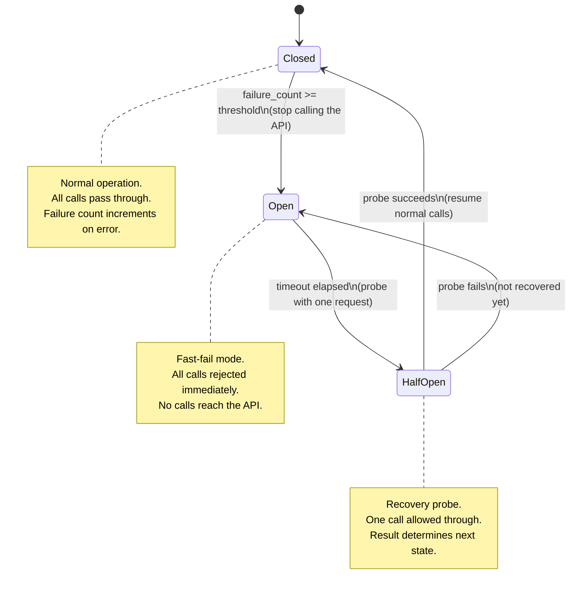

# حدود المعدّل، وإعادة المحاولة، والتراجع، وقواطع الدارة (Circuit Breakers)

> إعادة المحاولة مع التراجع (backoff) تحميك من الأعطال العابرة. أما قاطع الدارة فيحمي اعتمادياتك منك أنت.

**النوع:** بناء
**اللغات:** Python
**المتطلبات:** دروس المرحلة 06 من 05 إلى 06 (Docker، الإعدادات)، فهم أساسي لرموز حالة HTTP
**الوقت:** ~60 دقيقة
**أهداف التعلّم:**
- تصنيف أعطال الـ API إلى أخطاء عابرة، وأخطاء حدّ المعدّل، وأعطال دائمة
- تنفيذ تراجع أسّي مع تشويش (jitter) لتجنّب القطيع الهائج (thundering herd)
- تحليل واحترام ترويسات Retry-After من استجابات 429
- بناء قاطع دارة بسيط بحالات مغلقة (closed)، ومفتوحة (open)، ونصف مفتوحة (half-open)
- استخدام مكتبة tenacity لتعويض حلقات إعادة المحاولة اليدوية

---

## المشكلة

خدمة AI لديك تنادي Anthropic API في كل طلب. ويعمل الـ API بشكل مثالي في الاختبار. في الإنتاج، الساعة الثالثة ظهرًا يوم الثلاثاء، يبدأ بإعادة HTTP 429 (Too Many Requests). تعيد خدمتك بإخلاص محاولة النداء الفاشل. تعيد كل النسخ الـ 200 من خدمتك المحاولة في آنٍ واحد. يستقبل الـ API 200 طلبًا في اللحظة نفسها بالضبط. فيعيد 429 لها جميعًا. تعيد كل النسخ الـ 200 المحاولة مجددًا في اللحظة نفسها. بهذا تكون قد حوّلت حدّ معدّل مؤقّتًا إلى هجوم حرمان من الخدمة (denial-of-service) مستدام ضدّ الـ API الذي تعتمد عليه.

وضع الفشل الثاني: تتلقّى خدمتك أخطاء 500 من الـ API منذ 10 دقائق. كل طلب مستخدم وارد يطلق محاولة جديدة تفشل خلال 5 ثوانٍ، حابسةً خيطًا (thread) لكل واحدة. يرتفع زمن استجابة خدمتك من 200ms إلى 5 ثوانٍ. ويُستنزف تجمّع اتصالات قاعدة بياناتك (connection pool). وتنهار الخدمة كلها، لا لأن الـ API معطّل، بل لأن خدمتك لم تتوقّف عن نداءه.

تُحَلّ كلتا المشكلتين بأنماط ينبغي أن يعرفها كل مهندس إنتاج: التراجع الأسّي مع التشويش للمشكلة الأولى، وقاطع الدارة للثانية. ولا واحد منهما معقّد. وكلاهما غائب من كود معظم الفرق حتى يعلّمهما أول عطل كبير.

---

## المفهوم

### ثلاث فئات لأعطال الـ API

```
┌──────────────────────────────────────────────────────────────────┐
│  FAILURE CLASS        SIGNAL              CORRECT RESPONSE       │
├──────────────────────────────────────────────────────────────────┤
│  Transient error      500, 503, network   Retry with backoff     │
│                       timeout, DNS flap                          │
├──────────────────────────────────────────────────────────────────┤
│  Rate limit           429 + Retry-After   Wait for Retry-After,  │
│                       header              then retry             │
├──────────────────────────────────────────────────────────────────┤
│  Persistent failure   500+ for minutes,   Circuit breaker opens; │
│                       auth errors (401)   stop calling; fast-    │
│                       404 (model missing) fail until API recover │
└──────────────────────────────────────────────────────────────────┘
```

### التراجع الأسّي مع التشويش

التراجع الأسّي يزيد التأخير بين المحاولات: ثانية، ثانيتان، 4، 8. لكن إذا بدأت 200 نسخة من الخدمة كلها إعادة المحاولة في اللحظة نفسها (مثلًا بعد عطل دام ثانية واحدة)، فإنها تتبع الجدول نفسه: ثانية، ثانيتان، 4. كل موجة إعادة محاولة تصيب الـ API في آنٍ واحد. هذه هي مشكلة القطيع الهائج.

التشويش هو الإصلاح: أضف قيمة عشوائية إلى كل تأخير. تنام النسخ المختلفة لمدد مختلفة. تنتشر موجات إعادة المحاولة عبر الزمن ويرى الـ API تدفّقًا سلسًا بدل دفعات متزامنة.

```
Without jitter (200 instances):           With jitter (200 instances):
t=1s: 200 requests hit API simultaneously t=0.7s:  3 requests
t=2s: 200 requests hit API simultaneously t=0.9s:  7 requests
t=4s: 200 requests hit API simultaneously t=1.1s:  11 requests
t=8s: 200 requests hit API simultaneously t=1.3s:  8 requests
                                          t=1.5s:  ...spread out
```

### آلة حالات قاطع الدارة

قاطع الدارة يغلّف نداءً بعيدًا ويتتبّع معدّل فشله. له ثلاث حالات:



البصيرة الأساسية: في الحالة OPEN، يعيد قاطع الدارة خطأً للمنادِين دون نداء الـ API. يفشل المنادي بسرعة (في الميكروثواني، لا في 5 ثوانٍ). تبقى خدمتك مستجيبة حتى وإن كانت اعتماديتك معطّلة.

---

## البناء

### الخطوة 1: عميل مَرِن (Resilient) من الصفر

```python
import time
import random
import threading
from enum import Enum
from dataclasses import dataclass, field
from typing import Callable, Any

import anthropic


# ---------------------------------------------------------------------------
# Exponential backoff with jitter
# ---------------------------------------------------------------------------

def backoff_with_jitter(
    attempt: int,
    base_delay: float = 1.0,
    max_delay: float = 60.0,
    jitter_factor: float = 0.5,
) -> float:
    """
    Compute a backoff delay for the given attempt number (0-indexed).

    Formula: min(base * 2^attempt, max_delay) + uniform(0, jitter_factor * delay)

    The jitter spreads retry waves across time, preventing thundering herd
    when many service instances retry simultaneously.
    """
    delay = min(base_delay * (2 ** attempt), max_delay)
    jitter = random.uniform(0, jitter_factor * delay)
    return delay + jitter


def parse_retry_after(headers: dict) -> float | None:
    """
    Parse the Retry-After header from a 429 response.
    Returns the number of seconds to wait, or None if the header is absent.

    The Retry-After value may be seconds (integer) or an HTTP date string.
    We handle the integer case here; the date case is an extension.
    """
    value = headers.get("retry-after") or headers.get("Retry-After")
    if value is None:
        return None
    try:
        return float(value)
    except (ValueError, TypeError):
        return None
```

### الخطوة 2: قاطع الدارة

```python
class CircuitState(Enum):
    CLOSED = "closed"      # normal: calls pass through
    OPEN = "open"          # failed: calls are rejected immediately
    HALF_OPEN = "half_open"  # recovery probe: one call allowed


@dataclass
class CircuitBreaker:
    """
    A simple thread-safe circuit breaker.

    After `failure_threshold` consecutive failures, the circuit opens.
    After `recovery_timeout` seconds in the OPEN state, it moves to HALF_OPEN.
    A successful call in HALF_OPEN closes the circuit; a failure re-opens it.
    """
    failure_threshold: int = 5
    recovery_timeout: float = 60.0

    _state: CircuitState = field(default=CircuitState.CLOSED, init=False)
    _failure_count: int = field(default=0, init=False)
    _last_failure_time: float = field(default=0.0, init=False)
    _lock: threading.Lock = field(default_factory=threading.Lock, init=False)

    def call(self, fn: Callable[[], Any]) -> Any:
        """
        Execute fn through the circuit breaker.
        Raises CircuitOpenError if the circuit is open.
        """
        with self._lock:
            state = self._get_state()

        if state == CircuitState.OPEN:
            raise CircuitOpenError(
                f"Circuit is OPEN. Last failure: "
                f"{time.time() - self._last_failure_time:.1f}s ago. "
                f"Recovery in: {max(0, self.recovery_timeout - (time.time() - self._last_failure_time)):.1f}s"
            )

        try:
            result = fn()
            self._on_success()
            return result
        except Exception as e:
            self._on_failure()
            raise

    def _get_state(self) -> CircuitState:
        if (
            self._state == CircuitState.OPEN
            and time.time() - self._last_failure_time >= self.recovery_timeout
        ):
            self._state = CircuitState.HALF_OPEN
        return self._state

    def _on_success(self) -> None:
        with self._lock:
            self._failure_count = 0
            self._state = CircuitState.CLOSED

    def _on_failure(self) -> None:
        with self._lock:
            self._failure_count += 1
            self._last_failure_time = time.time()
            if (
                self._state == CircuitState.HALF_OPEN
                or self._failure_count >= self.failure_threshold
            ):
                self._state = CircuitState.OPEN

    @property
    def state(self) -> CircuitState:
        with self._lock:
            return self._get_state()


class CircuitOpenError(Exception):
    """Raised when a call is rejected because the circuit is open."""
    pass
```

### الخطوة 3: ResilientClient

```python
class ResilientClient:
    """
    Wraps the Anthropic client with retry logic and a circuit breaker.

    Behavior:
    - 429 errors: wait for Retry-After header (or backoff), then retry
    - 5xx errors: retry with exponential backoff + jitter
    - After failure_threshold failures: circuit opens, calls fail fast
    - 4xx errors (except 429): do not retry (client error, retrying won't help)
    """

    RETRYABLE_STATUS_CODES = {429, 500, 502, 503, 504}

    def __init__(
        self,
        api_key: str,
        max_attempts: int = 4,
        base_delay: float = 1.0,
        max_delay: float = 60.0,
        failure_threshold: int = 5,
        recovery_timeout: float = 60.0,
    ):
        self.client = anthropic.Anthropic(api_key=api_key)
        self.max_attempts = max_attempts
        self.base_delay = base_delay
        self.max_delay = max_delay
        self.circuit = CircuitBreaker(
            failure_threshold=failure_threshold,
            recovery_timeout=recovery_timeout,
        )

    def create_message(self, **kwargs) -> anthropic.types.Message:
        """
        Call client.messages.create with retry + circuit breaker.

        kwargs are passed directly to the Anthropic messages.create call.
        """
        def _call():
            return self.client.messages.create(**kwargs)

        last_error = None
        for attempt in range(self.max_attempts):
            try:
                return self.circuit.call(_call)

            except CircuitOpenError:
                # Circuit is open: fail fast without sleeping or retrying
                raise

            except anthropic.RateLimitError as e:
                # 429: respect Retry-After header if present
                retry_after = None
                if hasattr(e, "response") and e.response is not None:
                    retry_after = parse_retry_after(dict(e.response.headers))

                wait = retry_after or backoff_with_jitter(attempt, self.base_delay, self.max_delay)
                print(f"Rate limited (attempt {attempt+1}/{self.max_attempts}). "
                      f"Waiting {wait:.1f}s (Retry-After={retry_after})")

                if attempt < self.max_attempts - 1:
                    time.sleep(wait)
                last_error = e

            except anthropic.APIStatusError as e:
                status = e.status_code if hasattr(e, "status_code") else 0
                if status in self.RETRYABLE_STATUS_CODES:
                    wait = backoff_with_jitter(attempt, self.base_delay, self.max_delay)
                    print(f"API error {status} (attempt {attempt+1}/{self.max_attempts}). "
                          f"Retrying in {wait:.1f}s")
                    if attempt < self.max_attempts - 1:
                        time.sleep(wait)
                    last_error = e
                else:
                    # 4xx (not 429): do not retry, raise immediately
                    raise

            except Exception as e:
                # Network errors, timeouts, etc: retry with backoff
                wait = backoff_with_jitter(attempt, self.base_delay, self.max_delay)
                print(f"Unexpected error (attempt {attempt+1}/{self.max_attempts}): {e}. "
                      f"Retrying in {wait:.1f}s")
                if attempt < self.max_attempts - 1:
                    time.sleep(wait)
                last_error = e

        raise last_error or RuntimeError("All retry attempts exhausted")
```

> **اختبار من الواقع:** يسألك مدير المنتج: "لماذا لا نعيد المحاولة إلى الأبد حتى نحصل على استجابة ناجحة؟ إن كان الـ API معطّلًا لـ 5 دقائق، فسنحصل في النهاية على الإجابة التي أرادها المستخدم." ما المشكلة الملموسة لإعادة المحاولة غير المحدودة، وماذا يحدث لمستخدمي خدمتك الآخرين خلال ذلك الوقت؟

---

## الاستخدام

تقدّم مكتبة tenacity مزخرِفات (decorators) لإعادة المحاولة مجرَّبة في الميدان تعوّض حلقة إعادة المحاولة اليدوية:

```bash
uv add tenacity
```

```python
from tenacity import (
    retry,
    stop_after_attempt,
    wait_exponential_jitter,
    retry_if_exception_type,
    before_sleep_log,
)
import logging
import anthropic

logger = logging.getLogger(__name__)
client = anthropic.Anthropic()


@retry(
    stop=stop_after_attempt(4),
    wait=wait_exponential_jitter(initial=1, max=60, jitter=5),
    retry=retry_if_exception_type((
        anthropic.RateLimitError,
        anthropic.APIStatusError,
        anthropic.APIConnectionError,
    )),
    before_sleep=before_sleep_log(logger, logging.WARNING),
)
def call_with_retry(prompt: str) -> str:
    msg = client.messages.create(
        model="claude-3-5-haiku-20241022",
        max_tokens=1024,
        messages=[{"role": "user", "content": prompt}],
    )
    return msg.content[0].text
```

`wait_exponential_jitter` هو الخوارزمية نفسها كـ `backoff_with_jitter`: نمو أسّي مع تشويش عشوائي. و`retry_if_exception_type` يتحكّم في الأخطاء التي تطلق إعادة المحاولة. و`before_sleep_log` يسجّل كل محاولة إعادة تلقائيًا.

لا تشمل tenacity قاطع دارة. لخدمات الإنتاج، اجمع tenacity (لمنطق إعادة المحاولة) مع مكتبة قاطع دارة مثل `circuitbreaker` أو `pybreaker`، أو مع صنف `CircuitBreaker` المصنوع يدويًا من قسم البناء.

> **نقلة في المنظور:** يشير زميل إلى أن مزخرِف `@retry` في tenacity يعالج حلقة إعادة المحاولة بنظافة أكبر من حلقة while يدوية، لكنه يقول إن قاطع الدارة يضيف تعقيدًا و"يمكننا دائمًا إضافته لاحقًا إن احتجناه." تحت أي ظروف إنتاج محدّدة يسبّب غياب قاطع الدارة وضع فشل لا يستطيع مزخرِف إعادة المحاولة وحده منعه؟

---

## التسليم

المخرَج القابل لإعادة الاستخدام لهذا الدرس هو `outputs/skill-resilience-patterns.md`: بطاقة مرجعية تغطّي فئات الفشل الثلاث، وصيغة التراجع، وتحليل Retry-After، وتنفيذ قاطع الدارة. استخدمها عند مراجعة أي خدمة تنادي API خارجيًا.

لاستخدام `ResilientClient` في خدمتك:
1. استبدل `anthropic.Anthropic()` بـ `ResilientClient(api_key=settings.anthropic_api_key)`.
2. استبدل `client.messages.create(...)` بـ `resilient_client.create_message(...)`.
3. التقط `CircuitOpenError` في طبقة الـ API لديك وأعِد 503 للمنادِين.

---

## التقييم

**التحقق 1: التشويش يوزّع المحاولات.**
شغّل صيغة التراجع 10 مرات للمحاولة 0 وتحقّق من أن التأخيرات مختلفة. إذا كانت العشرة كلها متطابقة، فالتشويش لا يعمل.

```python
from main import backoff_with_jitter
delays = [backoff_with_jitter(attempt=0) for _ in range(10)]
assert len(set(round(d, 3) for d in delays)) > 5, "Jitter should produce varied delays"
print(delays)
```

**التحقق 2: الدارة تُفتَح بعد عتبة الأعطال.**
حاكِ 5 أعطال متتالية وتحقّق من أن الدارة تدخل الحالة OPEN.

```python
from main import CircuitBreaker, CircuitOpenError, CircuitState
import pytest

cb = CircuitBreaker(failure_threshold=3, recovery_timeout=60.0)
for _ in range(3):
    try:
        cb.call(lambda: (_ for _ in ()).throw(RuntimeError("simulated failure")))
    except RuntimeError:
        pass

assert cb.state == CircuitState.OPEN

try:
    cb.call(lambda: "should not run")
    assert False, "Expected CircuitOpenError"
except CircuitOpenError:
    pass  # Correct: circuit is open, call was rejected fast
```

**التحقق 3: الأخطاء غير القابلة لإعادة المحاولة لا يُعاد محاولتها.**
حاكِ خطأ 400 Bad Request وتحقّق من أنه يُثار فورًا دون نوم. ينبغي أن يكتمل الاختبار في أقل من 100ms.

**التحقق 4: احترام Retry-After.**
حاكِ (mock) استجابة 429 بـ `Retry-After: 5` وتحقّق من أن العميل ينتظر نحو 5 ثوانٍ (لا التراجع الافتراضي) قبل إعادة المحاولة.
