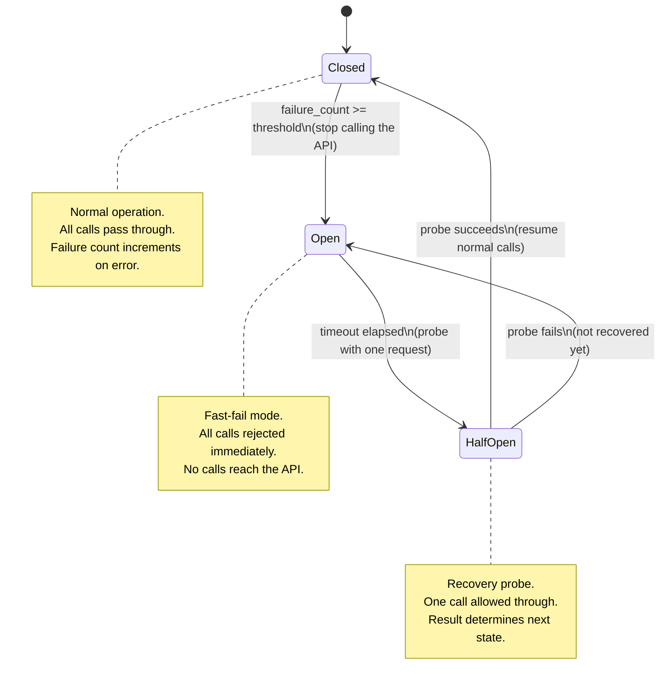

# Rate Limits, Retries, Backoff, and Circuit Breakers

> Retry with backoff protects you from transient failures. A circuit breaker protects your dependencies from you.

**Type:** Build
**Languages:** Python
**Prerequisites:** Phase 06 lessons 05-06 (Docker, config), basic understanding of HTTP status codes
**Time:** ~60 min
**Learning Objectives:**
- Classify API failures into transient errors, rate limit errors, and persistent failures
- Implement exponential backoff with jitter to avoid thundering herd
- Parse and respect Retry-After headers from 429 responses
- Build a simple circuit breaker with closed, open, and half-open states
- Use the tenacity library to replace manual retry loops

---

## The Problem

Your AI service calls the Anthropic API on every request. The API works perfectly in testing. In production, at 3 p.m. on a Tuesday, it starts returning HTTP 429 (Too Many Requests). Your service dutifully retries the failed call. All 200 instances of your service retry simultaneously. The API receives 200 requests at the exact same moment. It returns 429 to all of them. All 200 instances retry again at the same moment. You have just turned a temporary rate limit into a sustained denial-of-service attack against the API you depend on.

The second failure mode: your service has been getting 500 errors from the API for 10 minutes. Every incoming user request triggers a new attempt that fails in 5 seconds, locking up a thread for each one. Your service's response time climbs from 200ms to 5 seconds. Your database connection pool is exhausted. The entire service falls over, not because the API is broken, but because your service did not stop calling it.

Both problems are solved by patterns every production engineer should know: exponential backoff with jitter for the first problem, and a circuit breaker for the second. Neither is complicated. Both are absent from the code of most teams until the first major outage teaches them.

---

## The Concept

### Three Classes of API Failures

```
┌──────────────────────────────────────────────────────────────────┐
│  FAILURE CLASS        SIGNAL              CORRECT RESPONSE       │
├──────────────────────────────────────────────────────────────────┤
│  Transient error      500, 503, network   Retry with backoff     │
│                       timeout, DNS flap                          │
├──────────────────────────────────────────────────────────────────┤
│  Rate limit           429 + Retry-After   Wait for Retry-After,  │
│                       header              then retry             │
├──────────────────────────────────────────────────────────────────┤
│  Persistent failure   500+ for minutes,   Circuit breaker opens; │
│                       auth errors (401)   stop calling; fast-    │
│                       404 (model missing) fail until API recover │
└──────────────────────────────────────────────────────────────────┘
```

### Exponential Backoff with Jitter

Exponential backoff increases the delay between retries: 1s, 2s, 4s, 8s. But if 200 service instances all start retrying at the same moment (say, after a 1-second outage), they all follow the same schedule: 1s, 2s, 4s. Every retry wave hits the API simultaneously. This is the thundering herd problem.

Jitter is the fix: add a random value to each delay. Different instances sleep for different durations. The retry waves spread out over time and the API sees a smooth trickle instead of synchronized bursts.

```
Without jitter (200 instances):           With jitter (200 instances):
t=1s: 200 requests hit API simultaneously t=0.7s:  3 requests
t=2s: 200 requests hit API simultaneously t=0.9s:  7 requests
t=4s: 200 requests hit API simultaneously t=1.1s:  11 requests
t=8s: 200 requests hit API simultaneously t=1.3s:  8 requests
                                          t=1.5s:  ...spread out
```

### Circuit Breaker State Machine

A circuit breaker wraps a remote call and tracks its failure rate. It has three states:



The key insight: in the OPEN state, the circuit breaker returns an error to callers without calling the API. The caller fails fast (in microseconds, not 5 seconds). Your service remains responsive even while your dependency is broken.

---

## Build It

### Step 1: Resilient Client from Scratch

```python
import time
import random
import threading
from enum import Enum
from dataclasses import dataclass, field
from typing import Callable, Any

import anthropic


# ---------------------------------------------------------------------------
# Exponential backoff with jitter
# ---------------------------------------------------------------------------

def backoff_with_jitter(
    attempt: int,
    base_delay: float = 1.0,
    max_delay: float = 60.0,
    jitter_factor: float = 0.5,
) -> float:
    """
    Compute a backoff delay for the given attempt number (0-indexed).

    Formula: min(base * 2^attempt, max_delay) + uniform(0, jitter_factor * delay)

    The jitter spreads retry waves across time, preventing thundering herd
    when many service instances retry simultaneously.
    """
    delay = min(base_delay * (2 ** attempt), max_delay)
    jitter = random.uniform(0, jitter_factor * delay)
    return delay + jitter


def parse_retry_after(headers: dict) -> float | None:
    """
    Parse the Retry-After header from a 429 response.
    Returns the number of seconds to wait, or None if the header is absent.

    The Retry-After value may be seconds (integer) or an HTTP date string.
    We handle the integer case here; the date case is an extension.
    """
    value = headers.get("retry-after") or headers.get("Retry-After")
    if value is None:
        return None
    try:
        return float(value)
    except (ValueError, TypeError):
        return None
```

### Step 2: Circuit Breaker

```python
class CircuitState(Enum):
    CLOSED = "closed"      # normal: calls pass through
    OPEN = "open"          # failed: calls are rejected immediately
    HALF_OPEN = "half_open"  # recovery probe: one call allowed


@dataclass
class CircuitBreaker:
    """
    A simple thread-safe circuit breaker.

    After `failure_threshold` consecutive failures, the circuit opens.
    After `recovery_timeout` seconds in the OPEN state, it moves to HALF_OPEN.
    A successful call in HALF_OPEN closes the circuit; a failure re-opens it.
    """
    failure_threshold: int = 5
    recovery_timeout: float = 60.0

    _state: CircuitState = field(default=CircuitState.CLOSED, init=False)
    _failure_count: int = field(default=0, init=False)
    _last_failure_time: float = field(default=0.0, init=False)
    _lock: threading.Lock = field(default_factory=threading.Lock, init=False)

    def call(self, fn: Callable[[], Any]) -> Any:
        """
        Execute fn through the circuit breaker.
        Raises CircuitOpenError if the circuit is open.
        """
        with self._lock:
            state = self._get_state()

        if state == CircuitState.OPEN:
            raise CircuitOpenError(
                f"Circuit is OPEN. Last failure: "
                f"{time.time() - self._last_failure_time:.1f}s ago. "
                f"Recovery in: {max(0, self.recovery_timeout - (time.time() - self._last_failure_time)):.1f}s"
            )

        try:
            result = fn()
            self._on_success()
            return result
        except Exception as e:
            self._on_failure()
            raise

    def _get_state(self) -> CircuitState:
        if (
            self._state == CircuitState.OPEN
            and time.time() - self._last_failure_time >= self.recovery_timeout
        ):
            self._state = CircuitState.HALF_OPEN
        return self._state

    def _on_success(self) -> None:
        with self._lock:
            self._failure_count = 0
            self._state = CircuitState.CLOSED

    def _on_failure(self) -> None:
        with self._lock:
            self._failure_count += 1
            self._last_failure_time = time.time()
            if (
                self._state == CircuitState.HALF_OPEN
                or self._failure_count >= self.failure_threshold
            ):
                self._state = CircuitState.OPEN

    @property
    def state(self) -> CircuitState:
        with self._lock:
            return self._get_state()


class CircuitOpenError(Exception):
    """Raised when a call is rejected because the circuit is open."""
    pass
```

### Step 3: ResilientClient

```python
class ResilientClient:
    """
    Wraps the Anthropic client with retry logic and a circuit breaker.

    Behavior:
    - 429 errors: wait for Retry-After header (or backoff), then retry
    - 5xx errors: retry with exponential backoff + jitter
    - After failure_threshold failures: circuit opens, calls fail fast
    - 4xx errors (except 429): do not retry (client error, retrying won't help)
    """

    RETRYABLE_STATUS_CODES = {429, 500, 502, 503, 504}

    def __init__(
        self,
        api_key: str,
        max_attempts: int = 4,
        base_delay: float = 1.0,
        max_delay: float = 60.0,
        failure_threshold: int = 5,
        recovery_timeout: float = 60.0,
    ):
        self.client = anthropic.Anthropic(api_key=api_key)
        self.max_attempts = max_attempts
        self.base_delay = base_delay
        self.max_delay = max_delay
        self.circuit = CircuitBreaker(
            failure_threshold=failure_threshold,
            recovery_timeout=recovery_timeout,
        )

    def create_message(self, **kwargs) -> anthropic.types.Message:
        """
        Call client.messages.create with retry + circuit breaker.

        kwargs are passed directly to the Anthropic messages.create call.
        """
        def _call():
            return self.client.messages.create(**kwargs)

        last_error = None
        for attempt in range(self.max_attempts):
            try:
                return self.circuit.call(_call)

            except CircuitOpenError:
                # Circuit is open: fail fast without sleeping or retrying
                raise

            except anthropic.RateLimitError as e:
                # 429: respect Retry-After header if present
                retry_after = None
                if hasattr(e, "response") and e.response is not None:
                    retry_after = parse_retry_after(dict(e.response.headers))

                wait = retry_after or backoff_with_jitter(attempt, self.base_delay, self.max_delay)
                print(f"Rate limited (attempt {attempt+1}/{self.max_attempts}). "
                      f"Waiting {wait:.1f}s (Retry-After={retry_after})")

                if attempt < self.max_attempts - 1:
                    time.sleep(wait)
                last_error = e

            except anthropic.APIStatusError as e:
                status = e.status_code if hasattr(e, "status_code") else 0
                if status in self.RETRYABLE_STATUS_CODES:
                    wait = backoff_with_jitter(attempt, self.base_delay, self.max_delay)
                    print(f"API error {status} (attempt {attempt+1}/{self.max_attempts}). "
                          f"Retrying in {wait:.1f}s")
                    if attempt < self.max_attempts - 1:
                        time.sleep(wait)
                    last_error = e
                else:
                    # 4xx (not 429): do not retry, raise immediately
                    raise

            except Exception as e:
                # Network errors, timeouts, etc: retry with backoff
                wait = backoff_with_jitter(attempt, self.base_delay, self.max_delay)
                print(f"Unexpected error (attempt {attempt+1}/{self.max_attempts}): {e}. "
                      f"Retrying in {wait:.1f}s")
                if attempt < self.max_attempts - 1:
                    time.sleep(wait)
                last_error = e

        raise last_error or RuntimeError("All retry attempts exhausted")
```

> **Real-world check:** Your product manager asks: "Why can't we just retry forever until we get a successful response? If the API is down for 5 minutes, we will eventually get the answer the user wanted." What is the concrete problem with unbounded retries, and what happens to your service's other users during that time?

---

## Use It

The tenacity library provides battle-tested retry decorators that replace the manual retry loop:

```bash
uv add tenacity
```

```python
from tenacity import (
    retry,
    stop_after_attempt,
    wait_exponential_jitter,
    retry_if_exception_type,
    before_sleep_log,
)
import logging
import anthropic

logger = logging.getLogger(__name__)
client = anthropic.Anthropic()


@retry(
    stop=stop_after_attempt(4),
    wait=wait_exponential_jitter(initial=1, max=60, jitter=5),
    retry=retry_if_exception_type((
        anthropic.RateLimitError,
        anthropic.APIStatusError,
        anthropic.APIConnectionError,
    )),
    before_sleep=before_sleep_log(logger, logging.WARNING),
)
def call_with_retry(prompt: str) -> str:
    msg = client.messages.create(
        model="claude-3-5-haiku-20241022",
        max_tokens=1024,
        messages=[{"role": "user", "content": prompt}],
    )
    return msg.content[0].text
```

`wait_exponential_jitter` is the same algorithm as `backoff_with_jitter`: exponential growth with random jitter. `retry_if_exception_type` controls which errors trigger a retry. `before_sleep_log` logs each retry attempt automatically.

tenacity does not include a circuit breaker. For production services, combine tenacity (for retry logic) with a circuit breaker library like `circuitbreaker` or `pybreaker`, or with the hand-rolled `CircuitBreaker` class from the BUILD IT section.

> **Perspective shift:** A colleague points out that tenacity's `@retry` decorator handles the retry loop more cleanly than a manual while loop, but says the circuit breaker adds complexity and "we can always add it later if we need it." Under what specific production conditions does the absence of a circuit breaker cause a failure mode that the retry decorator alone cannot prevent?

---

## Ship It

The reusable artifact for this lesson is `outputs/skill-resilience-patterns.md`: a reference card covering the three failure classes, backoff formula, Retry-After parsing, and circuit breaker implementation. Use it when reviewing any service that calls an external API.

To use the `ResilientClient` in your service:
1. Replace `anthropic.Anthropic()` with `ResilientClient(api_key=settings.anthropic_api_key)`.
2. Replace `client.messages.create(...)` with `resilient_client.create_message(...)`.
3. Catch `CircuitOpenError` at your API layer and return a 503 to callers.

---

## Evaluate It

**Check 1: Jitter spreads retries.**
Run the backoff formula 10 times for attempt 0 and verify the delays are different. If all 10 are the same, jitter is not working.

```python
from main import backoff_with_jitter
delays = [backoff_with_jitter(attempt=0) for _ in range(10)]
assert len(set(round(d, 3) for d in delays)) > 5, "Jitter should produce varied delays"
print(delays)
```

**Check 2: Circuit opens after threshold failures.**
Simulate 5 consecutive failures and verify the circuit enters the OPEN state.

```python
from main import CircuitBreaker, CircuitOpenError, CircuitState
import pytest

cb = CircuitBreaker(failure_threshold=3, recovery_timeout=60.0)
for _ in range(3):
    try:
        cb.call(lambda: (_ for _ in ()).throw(RuntimeError("simulated failure")))
    except RuntimeError:
        pass

assert cb.state == CircuitState.OPEN

try:
    cb.call(lambda: "should not run")
    assert False, "Expected CircuitOpenError"
except CircuitOpenError:
    pass  # Correct: circuit is open, call was rejected fast
```

**Check 3: Non-retryable errors are not retried.**
Simulate a 400 Bad Request error and verify it is raised immediately without sleeping. The test should complete in under 100ms.

**Check 4: Retry-After is respected.**
Mock a 429 response with `Retry-After: 5` and verify the client waits approximately 5 seconds (not the default backoff) before retrying.
