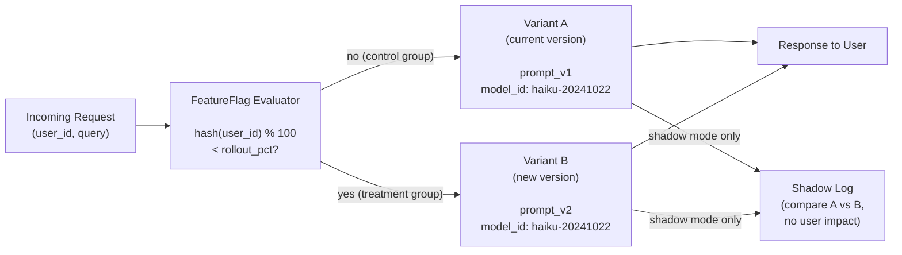

# أعلام الميزات (Feature Flags) والطرح التدريجي (Progressive Rollout)

> لا تُطلق تغيير موجّه إلى 100% من المستخدمين في أول دفعة أبدًا.

**النوع:** بناء
**اللغات:** Python
**المتطلبات:** الدرس 12 (إدارة إصدارات الموجّهات والنماذج والإعدادات)، الدرس 02 (تغليف النموذج في FastAPI)
**الوقت:** ~45 دقيقة
**أهداف التعلّم:**
- شرح الفرق بين وضع الظلّ (shadow mode) والكناري (canary) وطرح A/B ومتى تستخدم كلًّا منها
- بناء صنف `FeatureFlag` بتوجيه قطعي مبني على النسبة المئوية باستخدام بصمة معرّف المستخدم (user ID hash)
- تنفيذ وضع الظلّ (shadow mode): تشغيل إصدارَي الموجّه الجديد والقديم بالتوازي دون التأثير في استجابات المستخدم
- ربط اختيار علم الميزة بنقطة FastAPI لتوجيه الترافيك لكل طلب
- وصف لماذا يكون وضع الظلّ أأمن خطوة أولى قبل أي اختبار كناري أو A/B

---

## المشكلة

حسّنت موجّهك. في الاختبار يبدو أفضل. وتريد إطلاقه. المسار المغري هو تحديث الموجّه والنشر. لكن ماذا يعني "أفضل" على ترافيك الإنتاج الحقيقي؟

مجموعة اختبارك ليست الإنتاج. ومستخدمو اختبارك ليسوا ممثّلين للواقع. ويغطّي تقييمك أنماط الاستعلامات التي خطر لك تضمينها، لا الذيل الطويل (long tail) من الاستعلامات الحقيقية التي يرسلها مستخدموك فعلًا.

كلفة الخطأ عالية. يبدأ المستخدمون بالحصول على استجابات أسوأ. يشتكون أو ينصرفون (churn). تتراجع. والآن لديك حادثة تراجع (rollback incident) تهزّ الثقة في ميزة الذكاء الاصطناعي بأكملها.

تتيح لك أعلام الميزات (feature flags) الإطلاق تدريجيًا. بدلًا من تحويل كل الترافيك إلى الإصدار الجديد دفعة واحدة، تكشف جزءًا من الترافيك وتقيس ما يحدث قبل التوسّع. ثلاث استراتيجيات بترتيب تصاعدي لمخاطرة المستخدم:

1. **وضع الظلّ (Shadow mode)**: شغّل الإصدار الجديد بالتوازي على كل طلب حقيقي، قارن المخرجات، ولا تُظهر النتائج للمستخدمين أبدًا. مخاطرة مستخدم صفرية، بكلفة مضاعفة في استدعاءات الـAPI.
2. **الكناري (Canary)**: وجّه X% من الترافيك الحقيقي إلى الإصدار الجديد. يرى المستخدمون مخرجات جديدة. نطاق انفجار (blast radius) صغير إن كان هناك خلل.
3. **اختبار A/B**: قسّم الترافيك حسب معرّف المستخدم للحصول على مقاييس نظيفة لكل مستخدم. قِس النتيجة (نقرة، تحويل conversion، رضا) لا جودة المخرجات وحدها.

الخطأ الشائع هو تخطّي وضع الظلّ والذهاب مباشرةً إلى الكناري. يخبرك وضع الظلّ إن كان الإصدار الجديد ينتج مخرجات متماسكة على الاستعلامات الحقيقية قبل أن يراه أي مستخدم.

---

## المفهوم

### توجيه الترافيك في طبقة العلم (Flag Layer)



### لماذا تهمّ البصمة القطعية (Deterministic Hashing)

يستخدم النهج الساذج `random.random() < 0.1` لتوجيه 10% من الترافيك. ويعني هذا أن المستخدم نفسه قد يحصل على المتغيّر A في طلب وعلى المتغيّر B في الطلب التالي. هذه ليست تجربة محكومة: لا يمكنك عزو تغيّرات السلوك إلى المتغيّر لأن المستخدم نفسه يجرّب كليهما.

تصلح البصمة القطعية هذا:

```
hash(user_id) % 100 < rollout_pct
```

ينتج `user_id` نفسه دائمًا البصمة (hash) نفسها، فيحصل المستخدم نفسه دائمًا على المتغيّر نفسه لإعداد علم معيّن. يمكنك التحليل حسب فئة المستخدمين (cohort). يمكنك إعادة إنتاج تجربة المستخدم بالضبط. ويمكنك القول بيقين "كان المستخدم X في مجموعة المعالجة (treatment group)".

### أوضاع الطرح الثلاثة

```
SHADOW MODE
-----------
All traffic serves Variant A (old prompt).
Variant B also runs on every request in the background.
Users see only A. Engineers compare B vs A outputs.
Cost: 2x API calls. Risk: zero.

CANARY MODE
-----------
X% of users (by hash) serve Variant B (new prompt).
100-X% of users serve Variant A.
Users in treatment group see B outputs.
Cost: normal. Risk: proportional to X%.

A/B MODE
--------
Same as canary, but you measure an outcome metric (thumbs up, task
completion, session length) per variant in addition to output quality.
Cost: normal + instrumentation. Risk: proportional to split %.
```

---

## البناء

### الخطوة 1: صنف FeatureFlag

```python
import hashlib
from dataclasses import dataclass
from enum import Enum
from typing import Callable


class RolloutMode(str, Enum):
    SHADOW = "shadow"    # run new version in parallel, serve old to users
    CANARY = "canary"    # route X% of real traffic to new version
    AB = "ab"            # split by user ID, measure outcome metric


@dataclass
class FeatureFlag:
    """
    Routes requests to prompt variants based on rollout_pct and mode.

    rollout_pct: 0-100. Percentage of user IDs that get Variant B.
    mode: shadow, canary, or ab.
    """
    name: str
    rollout_pct: float      # 0.0 to 100.0
    mode: RolloutMode
    variant_a: str          # e.g. prompt version "v1.0"
    variant_b: str          # e.g. prompt version "v1.1"

    def _bucket(self, user_id: str) -> int:
        """
        Deterministic hash of user_id to a bucket 0-99.
        The flag name is included so different flags assign users
        to independent buckets.
        """
        key = f"{self.name}:{user_id}"
        digest = hashlib.md5(key.encode(), usedforsecurity=False).hexdigest()
        return int(digest[:8], 16) % 100

    def variant_for(self, user_id: str) -> str:
        """
        Return which variant ('a' or 'b') this user_id maps to.
        Same user_id always returns the same variant for a given flag config.
        """
        bucket = self._bucket(user_id)
        if bucket < self.rollout_pct:
            return "b"
        return "a"

    def prompt_for(self, user_id: str) -> str:
        """Return the prompt version string for this user."""
        v = self.variant_for(user_id)
        return self.variant_b if v == "b" else self.variant_a
```

### الخطوة 2: تنفيذ وضع الظلّ (Shadow Mode)

يشغّل وضع الظلّ كلا المتغيّرين لكنه يُرجِع للمستخدم استجابة المتغيّر القديم فقط. يعمل المتغيّر الجديد في الخلفية وتُسجَّل مخرجاته للمقارنة.

```python
import asyncio
import logging
import time
from typing import Any

import anthropic

logger = logging.getLogger(__name__)
_client = anthropic.Anthropic()


def call_model(prompt_version: str, user_message: str, model_id: str) -> dict:
    """
    Call the model with a prompt selected by version.
    In a real system, prompt_version maps to a loaded template.
    Here we simulate it with a simple system prompt prefix.
    """
    system_prompts = {
        "v1.0": "You are a helpful assistant. Be concise.",
        "v1.1": "You are a helpful assistant. Be concise and always end with a one-line summary starting with 'In short:'",
    }
    system = system_prompts.get(prompt_version, system_prompts["v1.0"])

    start = time.monotonic()
    response = _client.messages.create(
        model=model_id,
        max_tokens=512,
        system=system,
        messages=[{"role": "user", "content": user_message}],
    )
    latency_ms = int((time.monotonic() - start) * 1000)

    return {
        "text": response.content[0].text,
        "prompt_version": prompt_version,
        "latency_ms": latency_ms,
        "input_tokens": response.usage.input_tokens,
        "output_tokens": response.usage.output_tokens,
    }


def run_shadow(
    flag: FeatureFlag,
    user_id: str,
    user_message: str,
    model_id: str,
) -> dict:
    """
    Shadow mode: call both variants. Return variant_a response to caller.
    Log both outputs for comparison. Variant B result is never shown to user.
    """
    result_a = call_model(flag.variant_a, user_message, model_id)

    # Run variant B and log for comparison - this is where your eval harness hooks in
    result_b = call_model(flag.variant_b, user_message, model_id)

    logger.info(
        "shadow_compare flag=%s user=%s "
        "a_tokens=%d b_tokens=%d a_latency=%dms b_latency=%dms",
        flag.name,
        user_id,
        result_a["output_tokens"],
        result_b["output_tokens"],
        result_a["latency_ms"],
        result_b["latency_ms"],
    )
    logger.debug("shadow variant_a: %s", result_a["text"][:200])
    logger.debug("shadow variant_b: %s", result_b["text"][:200])

    # Return A to the user - B is never shown
    return {**result_a, "shadow_b_text": result_b["text"]}
```

> **اختبار من الواقع:** يسألك مديرك: "وضع الظلّ يكلّفنا ضِعف عدد استدعاءات الـAPI. لخدمة تتلقى 10,000 طلب يوميًا، هذا يضاعف فاتورة الاستدلال (inference) لدينا. هل يستحق ذلك؟" كيف تبني الحجة لتشغيل وضع الظلّ قبل الكناري، وتحت أي ظروف تتخطّاه؟

### الخطوة 3: توجيه الكناري وA/B

```python
def route_request(
    flag: FeatureFlag,
    user_id: str,
    user_message: str,
    model_id: str,
) -> dict:
    """
    Route a request based on flag mode and user_id.

    shadow: run both, return A to user, log B for comparison
    canary: route by bucket, user sees the variant they are assigned
    ab:     route by bucket, log variant assignment for outcome tracking
    """
    if flag.mode == RolloutMode.SHADOW:
        return run_shadow(flag, user_id, user_message, model_id)

    # For canary and ab: deterministic routing, user sees assigned variant
    variant = flag.variant_for(user_id)
    prompt_version = flag.variant_b if variant == "b" else flag.variant_a
    result = call_model(prompt_version, user_message, model_id)
    result["variant"] = variant
    result["flag_name"] = flag.name

    if flag.mode == RolloutMode.AB:
        # In A/B mode, log the variant assignment so you can join with outcome metrics
        logger.info(
            "ab_assignment flag=%s user=%s variant=%s prompt=%s",
            flag.name, user_id, variant, prompt_version,
        )

    return result
```

---

## الاستخدام

اربط علم الميزة بنقطة FastAPI. يُنشأ العلم عند بدء التشغيل ويُخزَّن على `app.state`. ويستدعي كل طلب `route_request()` مع معرّف المستخدم المستخرَج من الطلب.

```python
from contextlib import asynccontextmanager
from fastapi import FastAPI
from pydantic import BaseModel


ACTIVE_FLAG = FeatureFlag(
    name="prompt-v1.1-rollout",
    rollout_pct=10.0,           # 10% canary to start
    mode=RolloutMode.SHADOW,    # shadow first, then promote to canary
    variant_a="v1.0",
    variant_b="v1.1",
)

MODEL_ID = "claude-3-5-haiku-20241022"


@asynccontextmanager
async def lifespan(app: FastAPI):
    logger.info(
        "Flag active: %s  mode=%s  rollout=%.0f%%  a=%s  b=%s",
        ACTIVE_FLAG.name,
        ACTIVE_FLAG.mode,
        ACTIVE_FLAG.rollout_pct,
        ACTIVE_FLAG.variant_a,
        ACTIVE_FLAG.variant_b,
    )
    app.state.flag = ACTIVE_FLAG
    yield


app = FastAPI(title="AI Service with Feature Flags", lifespan=lifespan)


class ChatRequest(BaseModel):
    user_id: str
    message: str


@app.post("/chat")
async def chat(request: ChatRequest):
    """
    Chat endpoint with flag-based routing.
    In shadow mode, all users see variant A but B runs in the background.
    In canary or ab mode, users see their assigned variant.
    """
    flag = app.state.flag
    result = route_request(
        flag=flag,
        user_id=request.user_id,
        user_message=request.message,
        model_id=MODEL_ID,
    )
    return {
        "response": result["text"],
        "variant": result.get("variant", "a"),
        "prompt_version": result["prompt_version"],
        "latency_ms": result["latency_ms"],
    }


@app.get("/flag-status")
async def flag_status():
    """Returns the active flag configuration. Useful for debugging routing."""
    flag = app.state.flag
    return {
        "name": flag.name,
        "mode": flag.mode,
        "rollout_pct": flag.rollout_pct,
        "variant_a": flag.variant_a,
        "variant_b": flag.variant_b,
    }
```

للترقية من الظلّ إلى الكناري بعد أن تبدو سجلات الظلّ جيدة، غيّر إعداد العلم وأعد النشر:

```python
# Week 1: shadow
ACTIVE_FLAG = FeatureFlag(name="prompt-v1.1-rollout", rollout_pct=0, mode=RolloutMode.SHADOW, ...)

# Week 2: 10% canary
ACTIVE_FLAG = FeatureFlag(name="prompt-v1.1-rollout", rollout_pct=10.0, mode=RolloutMode.CANARY, ...)

# Week 3: 50% canary
ACTIVE_FLAG = FeatureFlag(name="prompt-v1.1-rollout", rollout_pct=50.0, mode=RolloutMode.CANARY, ...)

# Week 4: full rollout (remove flag)
```

> **نقلة في المنظور:** يحاجج زميل بأن أعلام الميزات تضيف تعقيدًا تشغيليًا -- إعداد إضافي، تسجيل إضافي، استدعاءات API مضاعفة في وضع الظلّ -- وأن مجموعة تقييم (eval suite) مُدارة جيدًا قبل النشر تجعل الأعلام غير ضرورية. ما سيناريوهات الإنتاج التي لا تأخذها هذه الحجة في الحسبان؟

---

## التسليم

المنتَج لهذا الدرس هو `outputs/skill-feature-flag-pattern.md`: نمط علم ميزة قابل لإعادة الاستخدام مع منطق التوجيه وسلّم طرح (rollout ladder) يمكنك تكييفه لأي نقطة خدمة ذكاء اصطناعي.

لتشغيل الشيفرة:

```bash
pip install fastapi anthropic uvicorn pydantic

# Start the service
uvicorn main:app --reload

# Test with two different user IDs to see consistent assignment
curl -X POST http://localhost:8000/chat \
  -H "Content-Type: application/json" \
  -d '{"user_id": "user-001", "message": "What is the capital of France?"}'

# Check flag status
curl http://localhost:8000/flag-status

# Verify bucket assignment
python -c "
from main import FeatureFlag, RolloutMode
flag = FeatureFlag('test', 10.0, RolloutMode.CANARY, 'v1.0', 'v1.1')
for uid in ['user-001', 'user-002', 'user-003', 'user-004', 'user-005']:
    print(uid, '->', flag.variant_for(uid))
"
```

---

## التقييم

**الفحص 1: القطعية ثابتة.**
استدعِ `variant_for(user_id)` 100 مرة لمعرّف المستخدم نفسه. يجب أن تكون كل نتيجة متطابقة. إن تباينت، فدالة البصمة (hash) ليست قطعية. هذا ثابت حرج: يجب أن يحصل المستخدمون دائمًا على المتغيّر نفسه وإلا فبيانات A/B لديك مفسَدة.

**الفحص 2: توزيع السلال (Buckets) موحّد تقريبًا.**
ولّد 10,000 معرّف مستخدم وهمي وعُدّ كم منها يقع في المتغيّر B لعلم بنسبة 10%. ينبغي أن تكون النتيجة ضمن 0.5% من 10% (أي بين 950 و1050 من 10,000). الانحراف الكبير يشير إلى دالة بصمة متحيّزة.

**الفحص 3: وضع الظلّ لا يكشف المتغيّر B للمستخدمين أبدًا.**
اقرأ استجابة FastAPI في وضع الظلّ: يجب أن يكون `prompt_version` في الاستجابة دائمًا `variant_a`. وينبغي أن يُظهر سجلّ الظلّ كلًّا من `a_tokens` و`b_tokens`. إن أرجع `prompt_version` القيمة `v1.1` (المتغيّر B) في استجابة HTTP أثناء وضع الظلّ، فوضع الظلّ معطّل.

**الفحص 4: سلّم الترقية صريح.**
وثّق العتبة (threshold) لكل قرار ترقية: ما نتيجة مقارنة الظلّ التي تبرّر الانتقال إلى كناري 10%؟ ما مقياس الكناري 10% الذي يبرّر 50%؟ "يبدو جيدًا" ليس عتبة. مثال: "طول مخرجات B ضمن 20% من A، زمن الاستجابة ضمن 50ms، لا زيادة في تصعيدات المستخدمين خلال 48 ساعة".

**الفحص 5: تنظيف العلم.**
بعد الطرح الكامل، ينبغي إزالة العلم واستبدال منطق المتغيّر A/B بالمتغيّر الفائز مباشرةً. تراكم الأعلام الميتة يولّد دَيْن صيانة وإرباكًا حول ما الذي يوجّه الترافيك فعلًا. تعقّب إزالة العلم كمهمة متابعة مطلوبة في قائمة تحقّق الطرح لديك.
