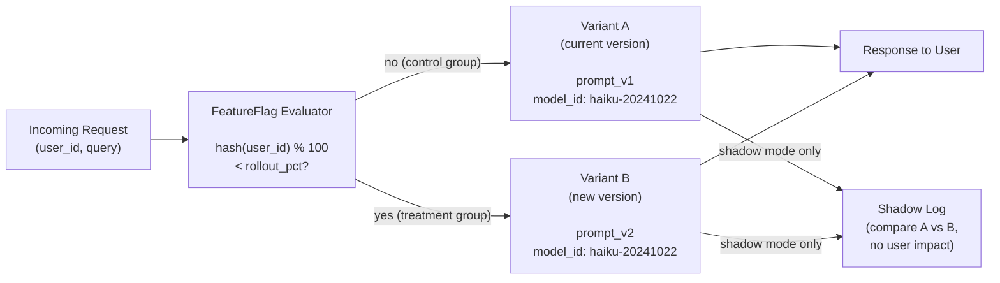

# Feature Flags and Progressive Rollout

> Never release a prompt change to 100% of users on the first push.

**Type:** Build
**Languages:** Python
**Prerequisites:** Lesson 12 (versioning prompts, models, configs), Lesson 02 (wrapping model in FastAPI)
**Time:** ~45 min
**Learning Objectives:**
- Explain the difference between shadow mode, canary, and A/B rollout and when to use each
- Build a `FeatureFlag` class with deterministic percentage-based routing using a user ID hash
- Implement shadow mode: run new and old prompt versions in parallel without affecting user responses
- Wire feature flag selection into a FastAPI endpoint to route per-request traffic
- Describe why shadow mode is the safest first step before any canary or A/B test

---

## The Problem

You have improved your prompt. In testing it looks better. You want to release it. The tempting path is to update the prompt and deploy. But what does "better" mean on real production traffic?

Your test set is not production. Your test users are not representative. Your evaluation covers the query patterns you thought to include, not the long tail of real queries your users actually send.

The cost of getting it wrong is high. Users start getting worse responses. They complain or churn. You roll back. Now you have a rollback incident that shakes confidence in the whole AI feature.

Feature flags let you release gradually. Instead of flipping all traffic to the new version at once, you expose a fraction of traffic and measure what happens before expanding. Three strategies, in increasing order of user risk:

1. **Shadow mode**: run new version in parallel on every real request, compare outputs, never show results to users. Zero user risk, costs double the API calls.
2. **Canary**: route X% of real traffic to the new version. Users see new outputs. Small blast radius if something is wrong.
3. **A/B test**: split traffic by user ID to get clean per-user metrics. Measure outcome (click, conversion, satisfaction) not just output quality.

The common mistake is skipping shadow mode and going straight to canary. Shadow mode tells you if the new version is producing coherent outputs on real queries before any user sees them.

---

## The Concept

### Traffic Routing at the Flag Layer



### Why Deterministic Hashing Matters

A naive approach uses `random.random() < 0.1` to route 10% of traffic. This means the same user might get variant A on one request and variant B on the next. That is not a controlled experiment: you cannot attribute behavior changes to the variant because the same user experiences both.

Deterministic hashing fixes this:

```
hash(user_id) % 100 < rollout_pct
```

The same `user_id` always produces the same hash, so the same user always gets the same variant for a given flag configuration. You can analyze by user cohort. You can reproduce a user's exact experience. You can say "user X was in the treatment group" with certainty.

### The Three Rollout Modes

```
SHADOW MODE
-----------
All traffic serves Variant A (old prompt).
Variant B also runs on every request in the background.
Users see only A. Engineers compare B vs A outputs.
Cost: 2x API calls. Risk: zero.

CANARY MODE
-----------
X% of users (by hash) serve Variant B (new prompt).
100-X% of users serve Variant A.
Users in treatment group see B outputs.
Cost: normal. Risk: proportional to X%.

A/B MODE
--------
Same as canary, but you measure an outcome metric (thumbs up, task
completion, session length) per variant in addition to output quality.
Cost: normal + instrumentation. Risk: proportional to split %.
```

---

## Build It

### Step 1: The FeatureFlag Class

```python
import hashlib
from dataclasses import dataclass
from enum import Enum
from typing import Callable


class RolloutMode(str, Enum):
    SHADOW = "shadow"    # run new version in parallel, serve old to users
    CANARY = "canary"    # route X% of real traffic to new version
    AB = "ab"            # split by user ID, measure outcome metric


@dataclass
class FeatureFlag:
    """
    Routes requests to prompt variants based on rollout_pct and mode.

    rollout_pct: 0-100. Percentage of user IDs that get Variant B.
    mode: shadow, canary, or ab.
    """
    name: str
    rollout_pct: float      # 0.0 to 100.0
    mode: RolloutMode
    variant_a: str          # e.g. prompt version "v1.0"
    variant_b: str          # e.g. prompt version "v1.1"

    def _bucket(self, user_id: str) -> int:
        """
        Deterministic hash of user_id to a bucket 0-99.
        The flag name is included so different flags assign users
        to independent buckets.
        """
        key = f"{self.name}:{user_id}"
        digest = hashlib.md5(key.encode(), usedforsecurity=False).hexdigest()
        return int(digest[:8], 16) % 100

    def variant_for(self, user_id: str) -> str:
        """
        Return which variant ('a' or 'b') this user_id maps to.
        Same user_id always returns the same variant for a given flag config.
        """
        bucket = self._bucket(user_id)
        if bucket < self.rollout_pct:
            return "b"
        return "a"

    def prompt_for(self, user_id: str) -> str:
        """Return the prompt version string for this user."""
        v = self.variant_for(user_id)
        return self.variant_b if v == "b" else self.variant_a
```

### Step 2: Shadow Mode Execution

Shadow mode runs both variants but only returns the old variant's response to the user. The new variant runs in the background and its output is logged for comparison.

```python
import asyncio
import logging
import time
from typing import Any

import anthropic

logger = logging.getLogger(__name__)
_client = anthropic.Anthropic()


def call_model(prompt_version: str, user_message: str, model_id: str) -> dict:
    """
    Call the model with a prompt selected by version.
    In a real system, prompt_version maps to a loaded template.
    Here we simulate it with a simple system prompt prefix.
    """
    system_prompts = {
        "v1.0": "You are a helpful assistant. Be concise.",
        "v1.1": "You are a helpful assistant. Be concise and always end with a one-line summary starting with 'In short:'",
    }
    system = system_prompts.get(prompt_version, system_prompts["v1.0"])

    start = time.monotonic()
    response = _client.messages.create(
        model=model_id,
        max_tokens=512,
        system=system,
        messages=[{"role": "user", "content": user_message}],
    )
    latency_ms = int((time.monotonic() - start) * 1000)

    return {
        "text": response.content[0].text,
        "prompt_version": prompt_version,
        "latency_ms": latency_ms,
        "input_tokens": response.usage.input_tokens,
        "output_tokens": response.usage.output_tokens,
    }


def run_shadow(
    flag: FeatureFlag,
    user_id: str,
    user_message: str,
    model_id: str,
) -> dict:
    """
    Shadow mode: call both variants. Return variant_a response to caller.
    Log both outputs for comparison. Variant B result is never shown to user.
    """
    result_a = call_model(flag.variant_a, user_message, model_id)

    # Run variant B and log for comparison - this is where your eval harness hooks in
    result_b = call_model(flag.variant_b, user_message, model_id)

    logger.info(
        "shadow_compare flag=%s user=%s "
        "a_tokens=%d b_tokens=%d a_latency=%dms b_latency=%dms",
        flag.name,
        user_id,
        result_a["output_tokens"],
        result_b["output_tokens"],
        result_a["latency_ms"],
        result_b["latency_ms"],
    )
    logger.debug("shadow variant_a: %s", result_a["text"][:200])
    logger.debug("shadow variant_b: %s", result_b["text"][:200])

    # Return A to the user - B is never shown
    return {**result_a, "shadow_b_text": result_b["text"]}
```

> **Real-world check:** Your manager asks: "shadow mode costs us twice as many API calls. For a service getting 10,000 requests per day, that doubles our inference bill. Is it worth it?" How do you make the case for running shadow mode before canary, and under what conditions would you skip it?

### Step 3: Canary and A/B Routing

```python
def route_request(
    flag: FeatureFlag,
    user_id: str,
    user_message: str,
    model_id: str,
) -> dict:
    """
    Route a request based on flag mode and user_id.

    shadow: run both, return A to user, log B for comparison
    canary: route by bucket, user sees the variant they are assigned
    ab:     route by bucket, log variant assignment for outcome tracking
    """
    if flag.mode == RolloutMode.SHADOW:
        return run_shadow(flag, user_id, user_message, model_id)

    # For canary and ab: deterministic routing, user sees assigned variant
    variant = flag.variant_for(user_id)
    prompt_version = flag.variant_b if variant == "b" else flag.variant_a
    result = call_model(prompt_version, user_message, model_id)
    result["variant"] = variant
    result["flag_name"] = flag.name

    if flag.mode == RolloutMode.AB:
        # In A/B mode, log the variant assignment so you can join with outcome metrics
        logger.info(
            "ab_assignment flag=%s user=%s variant=%s prompt=%s",
            flag.name, user_id, variant, prompt_version,
        )

    return result
```

---

## Use It

Wire the feature flag into a FastAPI endpoint. The flag is constructed at startup and stored on `app.state`. Each request calls `route_request()` with the user ID extracted from the request.

```python
from contextlib import asynccontextmanager
from fastapi import FastAPI
from pydantic import BaseModel


ACTIVE_FLAG = FeatureFlag(
    name="prompt-v1.1-rollout",
    rollout_pct=10.0,           # 10% canary to start
    mode=RolloutMode.SHADOW,    # shadow first, then promote to canary
    variant_a="v1.0",
    variant_b="v1.1",
)

MODEL_ID = "claude-3-5-haiku-20241022"


@asynccontextmanager
async def lifespan(app: FastAPI):
    logger.info(
        "Flag active: %s  mode=%s  rollout=%.0f%%  a=%s  b=%s",
        ACTIVE_FLAG.name,
        ACTIVE_FLAG.mode,
        ACTIVE_FLAG.rollout_pct,
        ACTIVE_FLAG.variant_a,
        ACTIVE_FLAG.variant_b,
    )
    app.state.flag = ACTIVE_FLAG
    yield


app = FastAPI(title="AI Service with Feature Flags", lifespan=lifespan)


class ChatRequest(BaseModel):
    user_id: str
    message: str


@app.post("/chat")
async def chat(request: ChatRequest):
    """
    Chat endpoint with flag-based routing.
    In shadow mode, all users see variant A but B runs in the background.
    In canary or ab mode, users see their assigned variant.
    """
    flag = app.state.flag
    result = route_request(
        flag=flag,
        user_id=request.user_id,
        user_message=request.message,
        model_id=MODEL_ID,
    )
    return {
        "response": result["text"],
        "variant": result.get("variant", "a"),
        "prompt_version": result["prompt_version"],
        "latency_ms": result["latency_ms"],
    }


@app.get("/flag-status")
async def flag_status():
    """Returns the active flag configuration. Useful for debugging routing."""
    flag = app.state.flag
    return {
        "name": flag.name,
        "mode": flag.mode,
        "rollout_pct": flag.rollout_pct,
        "variant_a": flag.variant_a,
        "variant_b": flag.variant_b,
    }
```

To promote from shadow to canary once shadow logs look good, change the flag config and redeploy:

```python
# Week 1: shadow
ACTIVE_FLAG = FeatureFlag(name="prompt-v1.1-rollout", rollout_pct=0, mode=RolloutMode.SHADOW, ...)

# Week 2: 10% canary
ACTIVE_FLAG = FeatureFlag(name="prompt-v1.1-rollout", rollout_pct=10.0, mode=RolloutMode.CANARY, ...)

# Week 3: 50% canary
ACTIVE_FLAG = FeatureFlag(name="prompt-v1.1-rollout", rollout_pct=50.0, mode=RolloutMode.CANARY, ...)

# Week 4: full rollout (remove flag)
```

> **Perspective shift:** A colleague argues that feature flags add operational complexity - extra config, extra logging, double API calls in shadow mode - and that a well-run eval suite before deploy makes flags unnecessary. What production scenarios does this argument fail to account for?

---

## Ship It

The artifact for this lesson is `outputs/skill-feature-flag-pattern.md`: a reusable feature flag pattern with routing logic and a rollout ladder you can adapt to any AI service endpoint.

To run the code:

```bash
pip install fastapi anthropic uvicorn pydantic

# Start the service
uvicorn main:app --reload

# Test with two different user IDs to see consistent assignment
curl -X POST http://localhost:8000/chat \
  -H "Content-Type: application/json" \
  -d '{"user_id": "user-001", "message": "What is the capital of France?"}'

# Check flag status
curl http://localhost:8000/flag-status

# Verify bucket assignment
python -c "
from main import FeatureFlag, RolloutMode
flag = FeatureFlag('test', 10.0, RolloutMode.CANARY, 'v1.0', 'v1.1')
for uid in ['user-001', 'user-002', 'user-003', 'user-004', 'user-005']:
    print(uid, '->', flag.variant_for(uid))
"
```

---

## Evaluate It

**Check 1: Determinism holds.**
Call `variant_for(user_id)` 100 times for the same user ID. Every result must be identical. If it varies, the hash function is not deterministic. This is a critical invariant: users must always get the same variant or your A/B data is corrupted.

**Check 2: Bucket distribution is approximately uniform.**
Generate 10,000 fake user IDs and count how many fall in variant B for a 10% flag. The result should be within 0.5% of 10% (i.e., between 950 and 1050 out of 10,000). Significant deviation indicates a biased hash function.

**Check 3: Shadow mode never exposes variant B to users.**
Read the FastAPI response for shadow mode: the `prompt_version` in the response should always be `variant_a`. The shadow log should show both `a_tokens` and `b_tokens`. If `prompt_version` returns `v1.1` (variant B) in the HTTP response during shadow mode, shadow mode is broken.

**Check 4: Promotion ladder is explicit.**
Document the threshold for each promotion decision: what shadow comparison result justifies moving to 10% canary? What 10% canary metric justifies 50%? "It looks good" is not a threshold. Example: "B output length within 20% of A, latency within 50ms, no increase in user escalations over 48 hours."

**Check 5: Flag cleanup.**
After full rollout, the flag should be removed and variant A/B logic replaced with the winning variant directly. Accumulating dead flags creates maintenance debt and confusion about what is actually routing traffic. Track flag removal as a required follow-up task in your rollout checklist.
