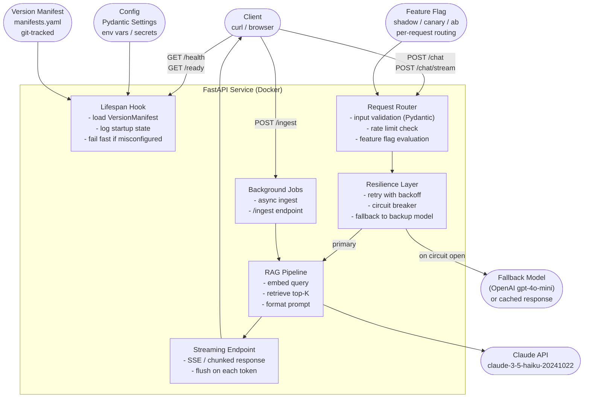

# مشروع التتويج: نشر خدمة RAG علنًا

> اشحن مرة واحدة بكل شيء موصول معًا. هكذا تتعلّم ما يعنيه فعلًا "جاهز للإنتاج".

**النوع:** بناء
**اللغات:** Python
**المتطلبات:** كل دروس المرحلة 06 (من 01 إلى 13)، دروس RAG في المرحلة 02
**الوقت:** ~90 دقيقة
**أهداف التعلّم:**
- تجميع خدمة RAG إنتاجية تدمج كل أنماط المرحلة 06 في وحدة واحدة قابلة للنشر
- تحويل الخدمة إلى حاوية (containerize) بملف Dockerfile بسيط وآمن
- النشر إلى رابط علني باستخدام Railway أو Render
- التحقّق من النشر العامل بفحوصات الصحة (health checks) واختبارات curl السريعة (smoke tests) وفحص السجلات
- تنفيذ إجراءات بدء التشغيل والإعداد والتراجع (rollback) من كتيّب التشغيل الإنتاجي (runbook)

---

## المشكلة

بنيت كل مكوّن في المرحلة 06 بمعزل. لديك غلاف FastAPI، ونقطة بثّ (streaming)، والتحقّق من المدخلات، وتغليف Docker، وإدارة الإعدادات، وأنماط المرونة، وخطط الاحتياط (fallbacks)، وبيان إصدار (version manifest)، وموجّه أعلام ميزات (feature flag router). كلها تعمل في مجلدات دروس منفصلة.

لكن التكامل (integration) هو حيث يتعطّل برنامج الإنتاج فعلًا. يتفاعل قاطع الدائرة (circuit breaker) مع منطق إعادة المحاولة (retry) بطرق غير متوقّعة. يجري علم الميزة استدعاءات API ظلّية تصطدم بمحدّد المعدّل (rate limiter). يجب أن يكون بيان الإصدار موجودًا قبل تشغيل خطّاف lifespan وإلا تعطّلت الخدمة عند بدء التشغيل. تعمل نقطة البثّ محليًا لكن الوكيل العكسي (reverse proxy) للمنصّة يخزّن البثّ مؤقتًا (buffers).

يجبر مشروع التتويج هذا كل تلك التفاعلات على الظهور بوصل كل شيء معًا ونشره إلى رابط علني حقيقي. التمرين ليس "هل أستطيع بناء كل قطعة؟" -- فقد أجبت عن ذلك. التمرين هو "هل أستطيع دمجها في خدمة تبدأ، وتخدم الترافيك، وتنجو من أول حادثة؟"

كتيّب التشغيل في `outputs/runbook-production-deploy.md` هو المنتَج. هو المستند الذي ينبغي أن يستطيع مهندس جديد في فريقك اتّباعه الساعة الثانية صباحًا كي: يفحص ما الذي يعمل، ويقرأ السجلات، ويغيّر الإعدادات، ويتراجع إلى إصدار سابق.

---

## المفهوم

### المعمارية الكاملة: كل أنماط المرحلة 06 موصولة معًا



### ما تفعله كل طبقة

يعمل خطّاف lifespan مرة واحدة عند بدء التشغيل: يحمّل بيان الإصدار، ويتحقّق من الإعدادات، ويسجّل كل شيء. وإن نقص شيء، ترفض الخدمة البدء. هذا مبدأ "الفشل المبكر" (fail fast): خدمة معطوبة الإعداد تتعطّل فورًا أفضل بكثير من خدمة تتدهور بصمت.

يتحقّق موجّه الطلبات (request router) من كل طلب وارد بـPydantic قبل أن يلمس طبقة الذكاء الاصطناعي. تُرفض المدخلات الخاطئة عند الباب بـ422، لا بعد دفع تكلفة استدعاء API.

تغلّف طبقة المرونة (resilience layer) استدعاءات الذكاء الاصطناعي بإعادة محاولة بتراجع أسّي (exponential backoff) وقاطع دائرة (circuit breaker). وحين يكون النموذج الأساسي غير متاح، تلجأ إلى النموذج الاحتياطي (أو استجابة مخزّنة في السيناريوهات غير المتاحة تمامًا).

يضمّن خطّ أنابيب RAG الاستعلام (embed)، ويسترجع السياق من مخزن المتجهات (vector store) في الذاكرة، وينسّق الموجّه المُعزَّز (augmented prompt).

تستخدم نقطة البثّ أحداث الخادم المرسَلة (Server-Sent Events) كي يرى المستخدمون الـtokens فور وصولها بدل انتظار الاستجابة كاملة.

يقيّم علم الميزة لكل طلب أي إصدار موجّه يُستخدم، مما يتيح وضع الظلّ (shadow mode) وطرح الكناري (canary) دون إعادة نشر.

---

## البناء

### الخطوة 1: بنية الخدمة

```
14-capstone-deploy-rag-agent/
├── code/
│   ├── main.py          # full service assembly
│   ├── Dockerfile
│   ├── requirements.txt
│   └── .dockerignore
├── docs/
│   └── en.md
└── outputs/
    └── runbook-production-deploy.md
```

### الخطوة 2: طبقة الإعدادات (Pydantic Settings)

```python
from pydantic_settings import BaseSettings


class Settings(BaseSettings):
    """All configuration from environment variables. Fail fast on missing values."""

    # Required
    anthropic_api_key: str

    # Optional with safe defaults
    openai_api_key: str = ""
    model_id: str = "claude-3-5-haiku-20241022"
    fallback_model_id: str = "gpt-4o-mini"
    max_tokens: int = 512
    temperature: float = 0.3
    top_k: int = 5
    max_retries: int = 3
    circuit_breaker_threshold: int = 5
    circuit_breaker_timeout: int = 60
    log_level: str = "INFO"

    class Config:
        env_file = ".env"
```

### الخطوة 3: تجميع الخدمة الأساسي

يجمّع ملف `main.py` الكامل كل المكوّنات. نقاط تكامل أساسية يجب ضبطها بدقة:

**ترتيب lifespan يهمّ:**

```python
@asynccontextmanager
async def lifespan(app: FastAPI):
    # 1. Load settings (fail fast on missing ANTHROPIC_API_KEY)
    settings = Settings()

    # 2. Load version manifest (fail fast if not found)
    registry = ManifestRegistry(Path("manifests.yaml"))
    manifest = registry.current()
    if manifest is None:
        raise RuntimeError("No active manifest. Run: python register_manifest.py")

    # 3. Initialize RAG vector store (can be empty on first start)
    store = {}

    # 4. Initialize circuit breaker state
    cb_state = CircuitBreakerState()

    # 5. Log startup (last action before yielding)
    logger.info("manifest=%s model=%s", manifest.manifest_id, manifest.model_id)
    app.state.settings = settings
    app.state.manifest = manifest
    app.state.store = store
    app.state.cb = cb_state
    app.state.flag = ROLLOUT_FLAG

    yield

    logger.info("shutdown complete")
```

**المرونة تغلّف استدعاء الذكاء الاصطناعي:**

```python
async def call_with_resilience(
    settings: Settings,
    cb: CircuitBreakerState,
    prompt: str,
    system: str,
    model_id: str,
) -> str:
    """
    Call the primary model with retries. Fall back to secondary model on
    circuit open or exhausted retries. Return cached fallback if both fail.
    """
    if cb.is_open():
        logger.warning("Circuit open - routing to fallback model")
        return await call_fallback(settings, prompt, system)

    for attempt in range(settings.max_retries):
        try:
            result = await call_primary(settings, prompt, system, model_id)
            cb.record_success()
            return result
        except anthropic.RateLimitError:
            wait = 2 ** attempt
            logger.warning("Rate limit hit, retry in %ds (attempt %d)", wait, attempt + 1)
            await asyncio.sleep(wait)
        except anthropic.APIError as exc:
            cb.record_failure()
            logger.error("API error: %s", exc)
            if cb.is_open():
                return await call_fallback(settings, prompt, system)
            raise

    # Exhausted retries
    return await call_fallback(settings, prompt, system)
```

**علم الميزة في النقطة:**

```python
@app.post("/chat")
async def chat(request: ChatRequest, app_state = Depends(get_app_state)):
    flag = app_state.flag
    manifest = app_state.manifest

    # Feature flag selects the prompt version
    prompt_version = flag.prompt_for(request.user_id)

    # RAG retrieval
    chunks = retrieve(request.message, app_state.store, top_k=app_state.settings.top_k)
    prompt = build_rag_prompt(request.message, chunks, prompt_version)

    response_text = await call_with_resilience(
        settings=app_state.settings,
        cb=app_state.cb,
        prompt=prompt,
        system=SYSTEM_PROMPTS[prompt_version],
        model_id=manifest.model_id,
    )

    return {
        "response": response_text,
        "manifest_id": manifest.manifest_id,
        "prompt_version": prompt_version,
        "variant": flag.variant_for(request.user_id),
        "sources": [c["metadata"].get("source") for c in chunks],
    }
```

> **اختبار من الواقع:** اختبارات التكامل تنجح محليًا. تبني صورة Docker وتشغّلها. تُرجِع نقطة `/health` رمز 200 لكن `/chat` تُرجِع 500 مع "RuntimeError: No active manifest." كانت بيئتك المحلية تحتوي على `manifests.yaml` في دليل العمل لكن صورة Docker لا تحتويه. ماذا يكشف هذا عن الفجوة بين التطوير المحلي والإنتاج الحاوي (containerized)، وكيف تردمها؟

### الخطوة 4: بناء Docker

يُبقي Dockerfile الصورة بسيطة وآمنة:

```dockerfile
FROM python:3.12-slim

# Create non-root user
RUN useradd -m -u 1000 appuser

WORKDIR /app

# Install dependencies first (layer caching)
COPY requirements.txt .
RUN pip install --no-cache-dir -r requirements.txt

# Copy application code
COPY main.py .
COPY manifests.yaml .

USER appuser

EXPOSE 8000
CMD ["uvicorn", "main:app", "--host", "0.0.0.0", "--port", "8000"]
```

ابنِ واختبر محليًا قبل النشر:

```bash
docker build -t rag-service .
docker run -p 8000:8000 \
  -e ANTHROPIC_API_KEY=$ANTHROPIC_API_KEY \
  rag-service

curl http://localhost:8000/health
```

### الخطوة 5: النشر على Railway

Railway هو هدف النشر الموصى به: يقرأ ملف `Dockerfile`، ويضبط متغيّرات البيئة عبر لوحة تحكّمه، ويوفّر رابط HTTPS علنيًا في أقل من دقيقتين.

```bash
# Install Railway CLI
npm install -g @railway/cli

# Login and deploy
railway login
railway init        # creates a new project
railway up          # deploys from the current directory

# Set secrets
railway variables set ANTHROPIC_API_KEY=sk-ant-...
railway variables set MODEL_ID=claude-3-5-haiku-20241022

# Get the public URL
railway domain
```

في حالة Render، استخدم `render.yaml` المكافئ أو اربط مستودع GitHub مباشرةً.

---

## الاستخدام

بعد النشر، تحقّق من الخدمة من البداية إلى النهاية:

```bash
# Set your deployed URL
BASE_URL="https://your-service.up.railway.app"

# 1. Health check - must include manifest_id
curl $BASE_URL/health
# Expected: {"status":"ok","manifest_id":"v1.0.0","model_id":"claude-3-5-haiku-20241022",...}

# 2. Ingest a document
curl -X POST $BASE_URL/ingest \
  -H "Content-Type: application/json" \
  -d '{"text": "The mitochondria is the powerhouse of the cell.", "source": "biology-101"}'

# 3. Chat with RAG
curl -X POST $BASE_URL/chat \
  -H "Content-Type: application/json" \
  -d '{"user_id": "user-001", "message": "What do mitochondria do?"}'

# 4. Streaming response
curl -N $BASE_URL/chat/stream \
  -H "Content-Type: application/json" \
  -d '{"user_id": "user-001", "message": "Explain the role of mitochondria"}'

# 5. Circuit breaker status
curl $BASE_URL/circuit-breaker
# Expected: {"state":"closed","failure_count":0}
```

> **نقلة في المنظور:** نشرت للتوّ إلى Railway برابط علني. يسألك زميل: "هل هذا جاهز للإنتاج فعلًا أم ما زلنا في منطقة العرض التوضيحي (demo)؟" ما الجواب الصادق، وما الذي ستحتاج إلى إضافته إلى الخدمة لنقلها من 'عرض توضيحي عامل منشور علنًا' إلى 'جاهز للإنتاج لمستخدمين حقيقيين'؟

---

## التسليم

المنتَج لهذا الدرس هو `outputs/runbook-production-deploy.md`: كتيّب التشغيل (runbook) الذي يغطّي بدء التشغيل والإعداد وفحص الصحة وقراءة السجلات والتراجع (rollback).

المنتَجات القابلة للتشغيل هي `code/main.py` و`code/Dockerfile` و`code/requirements.txt`. معًا تشكّل خدمة قابلة للنشر مكتفية ذاتيًا.

```bash
# Full local test
pip install -r code/requirements.txt
python code/main.py register    # register initial manifest
uvicorn code.main:app --reload  # start service

# Container test
cd code
docker build -t rag-capstone .
docker run -p 8000:8000 -e ANTHROPIC_API_KEY=$ANTHROPIC_API_KEY rag-capstone
```

---

## التقييم

**الفحص 1: الخدمة تصف نفسها عند بدء التشغيل.**
افحص السجلات من أول بدء تشغيل بعد النشر. يجب أن تستطيع قراءة معرّف البيان، ومعرّف النموذج، وإصدار الموجّه، وبصمة الإعدادات من أسطر سجلّ تبدأ بـ`===SERVICE STARTUP===`. إن لم تستطع، فخطّاف lifespan لا يسجّل أو لا يحمّل البيان بشكل صحيح.

**الفحص 2: نقطة الصحة تُرجِع بيانات البيان.**
يجب أن تُرجِع `GET /health` كلًّا من `manifest_id` و`model_id` ورمز حالة 200. إن نقص أي حقل، فستكون أول خطوة تشخيصية في كتيّب التشغيل (فحص `/health`) عديمة الفائدة لمهندس المناوبة.

**الفحص 3: التراجع يكتمل في أقل من دقيقتين.**
قِس زمن التراجع من "قرار التراجع" إلى "تأكيد نقطة الصحة أن البيان القديم فعّال". إن استغرق أطول، فإجراء كتيّب التشغيل معقّد أكثر من اللازم أو البحث في السجلّ بطيء أكثر من اللازم.

**الفحص 4: قاطع الدائرة يقفز ويتعافى.**
عيّن `ANTHROPIC_API_KEY` مؤقتًا إلى قيمة غير صالحة وأرسل 10 طلبات. ينبغي أن يفتح قاطع الدائرة (circuit breaker) بعد `circuit_breaker_threshold` إخفاقات ويُرجِع استجابات احتياطية. استعد المفتاح وأرسل 10 طلبات أخرى. بعد `circuit_breaker_timeout` ثانية، ينبغي أن تُغلَق الدائرة وتُستأنف استدعاءات النموذج الأساسي.

**الفحص 5: البثّ يصل إلى العميل.**
يجب أن تعرض `curl -N /chat/stream` الـtokens فور وصولها، لا بعد اكتمال الاستجابة كاملة. إن وصلت كل الـtokens دفعة واحدة، فالمنصّة تخزّن البثّ مؤقتًا (buffering). تحقّق من أن الوكيل العكسي (reverse proxy) للمنصّة لا يضغط بثّ SSE بـgzip (الضغط يخزّنه مؤقتًا).
