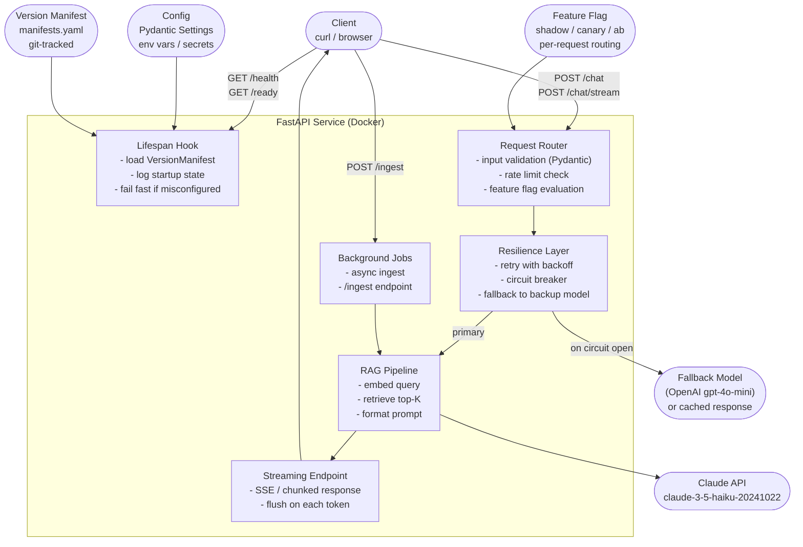

# Capstone: Deploy a RAG Service Publicly

> Ship once with everything wired together. That is how you learn what "production ready" actually means.

**Type:** Build
**Languages:** Python
**Prerequisites:** All Phase 06 lessons (01-13), Phase 02 RAG lessons
**Time:** ~90 min
**Learning Objectives:**
- Assemble a production RAG service combining all Phase 06 patterns into one deployable unit
- Containerize the service with a minimal, secure Dockerfile
- Deploy to a public URL using Railway or Render
- Verify the running deployment with health checks, curl smoke tests, and log inspection
- Execute the startup, config, and rollback procedures from the production runbook

---

## The Problem

You have built every Phase 06 component in isolation. You have a FastAPI wrapper, a streaming endpoint, input validation, Docker packaging, config management, resilience patterns, fallbacks, a version manifest, and a feature flag router. They all work in separate lesson directories.

But integration is where production software actually breaks. The circuit breaker interacts with the retry logic in unexpected ways. The feature flag makes shadow API calls that hit the rate limiter. The version manifest must be present before the lifespan hook runs or the service crashes on startup. The streaming endpoint works locally but the platform's reverse proxy buffers the stream.

This capstone forces all those interactions into the open by wiring everything together and deploying it to a real public URL. The exercise is not "can I build each piece?" - you already answered that. The exercise is "can I integrate them into a service that starts, serves traffic, and survives the first incident?"

The runbook in `outputs/runbook-production-deploy.md` is the artifact. It is the document a new engineer on your team should be able to follow at 2 a.m. to: check what is running, read the logs, change the config, and roll back to a previous version.

---

## The Concept

### Full Architecture: All Phase 06 Patterns Wired Together



### What Each Layer Does

The lifespan hook runs once at startup: loads the version manifest, validates config, logs everything. If anything is missing, the service refuses to start. This is the "fail fast" principle: a misconfigured service that crashes immediately is far better than one that silently degrades.

The request router validates every incoming request with Pydantic before touching the AI layer. Bad input is rejected at the door with a 422, not after paying for an API call.

The resilience layer wraps the AI calls with exponential backoff retries and a circuit breaker. When the primary model is unavailable, it falls back to the backup model (or a cached response for truly unavailable scenarios).

The RAG pipeline embeds the query, retrieves context from the in-memory vector store, and formats the augmented prompt.

The streaming endpoint uses Server-Sent Events so users see tokens as they arrive instead of waiting for the full response.

The feature flag evaluates per-request which prompt version to use, enabling shadow mode and canary rollouts without redeployment.

---

## Build It

### Step 1: Service Structure

```
14-capstone-deploy-rag-agent/
├── code/
│   ├── main.py          # full service assembly
│   ├── Dockerfile
│   ├── requirements.txt
│   └── .dockerignore
├── docs/
│   └── en.md
└── outputs/
    └── runbook-production-deploy.md
```

### Step 2: Config Layer (Pydantic Settings)

```python
from pydantic_settings import BaseSettings


class Settings(BaseSettings):
    """All configuration from environment variables. Fail fast on missing values."""

    # Required
    anthropic_api_key: str

    # Optional with safe defaults
    openai_api_key: str = ""
    model_id: str = "claude-3-5-haiku-20241022"
    fallback_model_id: str = "gpt-4o-mini"
    max_tokens: int = 512
    temperature: float = 0.3
    top_k: int = 5
    max_retries: int = 3
    circuit_breaker_threshold: int = 5
    circuit_breaker_timeout: int = 60
    log_level: str = "INFO"

    class Config:
        env_file = ".env"
```

### Step 3: Core Service Assembly

The full `main.py` assembles all components. Key integration points to get right:

**Lifespan order matters:**

```python
@asynccontextmanager
async def lifespan(app: FastAPI):
    # 1. Load settings (fail fast on missing ANTHROPIC_API_KEY)
    settings = Settings()

    # 2. Load version manifest (fail fast if not found)
    registry = ManifestRegistry(Path("manifests.yaml"))
    manifest = registry.current()
    if manifest is None:
        raise RuntimeError("No active manifest. Run: python register_manifest.py")

    # 3. Initialize RAG vector store (can be empty on first start)
    store = {}

    # 4. Initialize circuit breaker state
    cb_state = CircuitBreakerState()

    # 5. Log startup (last action before yielding)
    logger.info("manifest=%s model=%s", manifest.manifest_id, manifest.model_id)
    app.state.settings = settings
    app.state.manifest = manifest
    app.state.store = store
    app.state.cb = cb_state
    app.state.flag = ROLLOUT_FLAG

    yield

    logger.info("shutdown complete")
```

**Resilience wrapping the AI call:**

```python
async def call_with_resilience(
    settings: Settings,
    cb: CircuitBreakerState,
    prompt: str,
    system: str,
    model_id: str,
) -> str:
    """
    Call the primary model with retries. Fall back to secondary model on
    circuit open or exhausted retries. Return cached fallback if both fail.
    """
    if cb.is_open():
        logger.warning("Circuit open - routing to fallback model")
        return await call_fallback(settings, prompt, system)

    for attempt in range(settings.max_retries):
        try:
            result = await call_primary(settings, prompt, system, model_id)
            cb.record_success()
            return result
        except anthropic.RateLimitError:
            wait = 2 ** attempt
            logger.warning("Rate limit hit, retry in %ds (attempt %d)", wait, attempt + 1)
            await asyncio.sleep(wait)
        except anthropic.APIError as exc:
            cb.record_failure()
            logger.error("API error: %s", exc)
            if cb.is_open():
                return await call_fallback(settings, prompt, system)
            raise

    # Exhausted retries
    return await call_fallback(settings, prompt, system)
```

**Feature flag in the endpoint:**

```python
@app.post("/chat")
async def chat(request: ChatRequest, app_state = Depends(get_app_state)):
    flag = app_state.flag
    manifest = app_state.manifest

    # Feature flag selects the prompt version
    prompt_version = flag.prompt_for(request.user_id)

    # RAG retrieval
    chunks = retrieve(request.message, app_state.store, top_k=app_state.settings.top_k)
    prompt = build_rag_prompt(request.message, chunks, prompt_version)

    response_text = await call_with_resilience(
        settings=app_state.settings,
        cb=app_state.cb,
        prompt=prompt,
        system=SYSTEM_PROMPTS[prompt_version],
        model_id=manifest.model_id,
    )

    return {
        "response": response_text,
        "manifest_id": manifest.manifest_id,
        "prompt_version": prompt_version,
        "variant": flag.variant_for(request.user_id),
        "sources": [c["metadata"].get("source") for c in chunks],
    }
```

> **Real-world check:** The integration tests pass locally. You docker build the image and run it. The `/health` endpoint returns 200 but `/chat` returns a 500 with "RuntimeError: No active manifest." Your local environment had a `manifests.yaml` in the working directory but the Docker image does not. What does this reveal about the gap between local development and containerized production, and how do you close it?

### Step 4: Docker Build

The Dockerfile keeps the image minimal and secure:

```dockerfile
FROM python:3.12-slim

# Create non-root user
RUN useradd -m -u 1000 appuser

WORKDIR /app

# Install dependencies first (layer caching)
COPY requirements.txt .
RUN pip install --no-cache-dir -r requirements.txt

# Copy application code
COPY main.py .
COPY manifests.yaml .

USER appuser

EXPOSE 8000
CMD ["uvicorn", "main:app", "--host", "0.0.0.0", "--port", "8000"]
```

Build and test locally before deploying:

```bash
docker build -t rag-service .
docker run -p 8000:8000 \
  -e ANTHROPIC_API_KEY=$ANTHROPIC_API_KEY \
  rag-service

curl http://localhost:8000/health
```

### Step 5: Deploy to Railway

Railway is the recommended deployment target: it reads a `Dockerfile`, sets environment variables through its dashboard, and provides a public HTTPS URL in under two minutes.

```bash
# Install Railway CLI
npm install -g @railway/cli

# Login and deploy
railway login
railway init        # creates a new project
railway up          # deploys from the current directory

# Set secrets
railway variables set ANTHROPIC_API_KEY=sk-ant-...
railway variables set MODEL_ID=claude-3-5-haiku-20241022

# Get the public URL
railway domain
```

For Render, use the equivalent `render.yaml` or connect the GitHub repo directly.

---

## Use It

Once deployed, verify the service end-to-end:

```bash
# Set your deployed URL
BASE_URL="https://your-service.up.railway.app"

# 1. Health check - must include manifest_id
curl $BASE_URL/health
# Expected: {"status":"ok","manifest_id":"v1.0.0","model_id":"claude-3-5-haiku-20241022",...}

# 2. Ingest a document
curl -X POST $BASE_URL/ingest \
  -H "Content-Type: application/json" \
  -d '{"text": "The mitochondria is the powerhouse of the cell.", "source": "biology-101"}'

# 3. Chat with RAG
curl -X POST $BASE_URL/chat \
  -H "Content-Type: application/json" \
  -d '{"user_id": "user-001", "message": "What do mitochondria do?"}'

# 4. Streaming response
curl -N $BASE_URL/chat/stream \
  -H "Content-Type: application/json" \
  -d '{"user_id": "user-001", "message": "Explain the role of mitochondria"}'

# 5. Circuit breaker status
curl $BASE_URL/circuit-breaker
# Expected: {"state":"closed","failure_count":0}
```

> **Perspective shift:** You have just deployed to Railway with a public URL. A colleague asks: "is this actually production-ready or are we still in demo territory?" What is the honest answer, and what would you need to add to the service to move it from 'functional demo deployed publicly' to 'production-ready for real users'?

---

## Ship It

The artifact for this lesson is `outputs/runbook-production-deploy.md`: the operational runbook covering startup, config, health checking, log reading, and rollback.

The runnable artifacts are `code/main.py`, `code/Dockerfile`, and `code/requirements.txt`. Together they are a self-contained deployable service.

```bash
# Full local test
pip install -r code/requirements.txt
python code/main.py register    # register initial manifest
uvicorn code.main:app --reload  # start service

# Container test
cd code
docker build -t rag-capstone .
docker run -p 8000:8000 -e ANTHROPIC_API_KEY=$ANTHROPIC_API_KEY rag-capstone
```

---

## Evaluate It

**Check 1: The service is self-describing at startup.**
Check the logs from the first startup after deploy. You must be able to read the manifest ID, model ID, prompt version, and config hash from log lines starting with `===SERVICE STARTUP===`. If you cannot, the lifespan hook is not logging or is not loading the manifest correctly.

**Check 2: Health endpoint returns manifest data.**
`GET /health` must return `manifest_id`, `model_id`, and a 200 status. If any field is missing, the runbook's first diagnostic step (check `/health`) will be useless to an on-call engineer.

**Check 3: Rollback completes in under 2 minutes.**
Time a rollback from "decide to roll back" to "health endpoint confirms old manifest is active." If it takes longer, the runbook procedure is too complex or the registry lookup is too slow.

**Check 4: Circuit breaker trips and recovers.**
Temporarily set `ANTHROPIC_API_KEY` to an invalid value and send 10 requests. The circuit breaker should open after `circuit_breaker_threshold` failures and return fallback responses. Restore the key and send 10 more requests. After `circuit_breaker_timeout` seconds, the circuit should close and primary model calls should resume.

**Check 5: Streaming reaches the client.**
`curl -N /chat/stream` must display tokens as they arrive, not after the full response completes. If all tokens arrive at once, the platform is buffering the stream. Check that the platform's reverse proxy is not gzip-compressing the SSE stream (compression buffers it).
