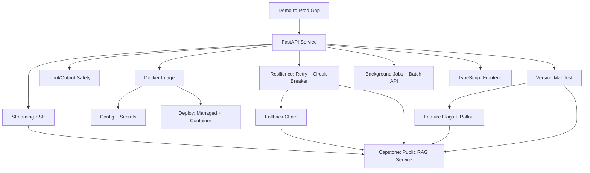

# Phase 06: Shipping It: Notebook to Production Service

14 lessons. ~15 hours. Close the demo-to-production gap and deploy a real AI service that handles the real world: noisy inputs, network failures, concurrent users, and evolving prompts.

## The through-line

Most AI demos work because the engineer controls everything. Production fails because users don't, networks drop, and APIs have bad days. This phase is about the engineering layer between "it works on my machine" and "it works for 10,000 users." Every lesson addresses one real failure mode.

## What you build

## Lessons

| # | Lesson | Artifact | Time |
|---|--------|----------|------|
| 01 | The Demo-to-Production Gap | `prompt-demo-to-prod-checklist.md` | ~45 min |
| 02 | Wrapping a Model in FastAPI | `skill-fastapi-ai-service.md` | ~60 min |
| 03 | Streaming Responses: SSE, Async, Concurrency | `skill-streaming-sse.md` | ~60 min |
| 04 | Input Validation & Safe Output Handling | `skill-input-output-safety.md` | ~45 min |
| 05 | Docker Image for an AI App | `skill-ai-app-dockerfile.md` | ~60 min |
| 06 | Config & Secrets Management | `skill-config-secrets-pattern.md` | ~45 min |
| 07 | Rate Limits, Retries, Backoff, Circuit Breakers | `skill-resilience-patterns.md` | ~60 min |
| 08 | Fallbacks & Model Failover | `skill-model-fallback-chain.md` | ~45 min |
| 09 | Background Jobs & Batch APIs | `skill-background-job-pattern.md` | ~45 min |
| 10 | A Minimal TypeScript Frontend | `skill-ai-frontend-template.md` | ~60 min |
| 11 | Deploying: Managed + Container Paths | `skill-deployment-decision-guide.md` | ~60 min |
| 12 | Versioning Prompts, Models, Configs in Production | `skill-version-manifest.md` | ~45 min |
| 13 | Feature Flags & Progressive Rollout | `skill-feature-flag-pattern.md` | ~45 min |
| 14 | Capstone: Deploy a RAG-or-Agent App Publicly | `runbook-production-deploy.md` | ~90 min |

## Prerequisites

Phase 01 (Prompt Engineering) for the model interaction patterns. Phase 02 (RAG) if using the RAG capstone path. Basic Python and familiarity with HTTP.

## Stack

- Python + `anthropic` SDK + `fastapi` + `uvicorn`
- `pydantic-settings` for config management
- `tenacity` for retry logic
- TypeScript (vanilla, no framework) for the frontend (L10)
- Docker for packaging and deployment
- Railway or Render for managed deployment (L11, L14)
