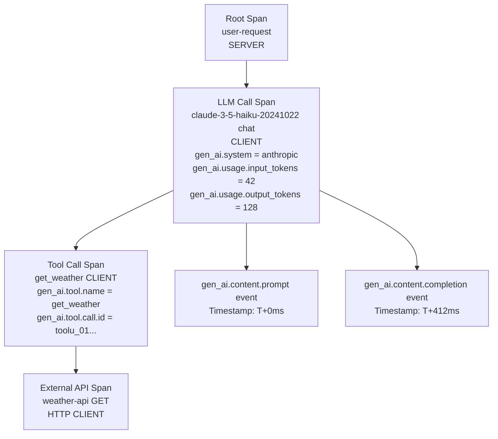

# أعراف GenAI في OpenTelemetry

> أضف التجهيز (instrument) مرة واحدة. واستعلِم في كل مكان. أعراف gen_ai.* هي العقد بين كودك وكل نظام مراقبة خلفي (backend).

**النوع:** بناء
**اللغات:** Python
**المتطلبات:** 07-01 (لماذا تختلف مراقبة LLM)، فهم أساسي لتتبّع HTTP (HTTP tracing)
**الوقت:** ~60 دقيقة
**أهداف التعلّم:**
- شرح ما هي أعراف OpenTelemetry الدلالية (semantic conventions) ولماذا تهم gen_ai.*
- إنشاء spans في OTel بسمات gen_ai.* الصحيحة لاستدعاء Anthropic API
- فهم سمات الـ span المطلوبة، واسم الـ span، ونوع الـ span (span kind) لاستدعاءات LLM
- تصدير الـ traces إلى وحدة التحكم (console) وتفسير مُخرَج الـ span

---

## المشكلة

تُجهِّز خدمة LLM لديك بـ logger مخصص (الدرس 01). يعمل. ثم تريد توجيه الـ traces إلى Langfuse للتحليل الخاص بـ LLM. لاحقًا، يريدها فريق المنصّة في Grafana Tempo. وبعد ستة أشهر، يعرض عليك مزوّد منتج Phoenix.

في كل مرة تبدّل فيها الـ backend، تعيد كتابة التجهيز لديك. أسماء حقولك المخصصة (`prompt_version` و`cost_usd`) لا تطابق ما يتوقعه كل backend. تكتب محوّلات (adapters). تنكسر المحوّلات حين تتغير إصدارات الـ SDK. تنفق وقت الهندسة على السباكة بدل المنتج.

الحل هو أعراف OpenTelemetry الدلالية لـ GenAI: مفردات موحّدة لـ traces الخاصة بـ LLM. حين تستخدم `gen_ai.request.model` بدل حقل `model` مخصص، يفهمها كل backend متوافق مع OTel دون أي تكييف. Jaeger وGrafana Tempo وLangfuse وPhoenix يقرؤون كلهم السمات نفسها. تُجهِّز مرة واحدة وتبدّل الـ backends بتغيير متغير بيئة (environment variable).

---

## المفهوم

### ما هو OpenTelemetry

OpenTelemetry (OTel) معيار مفتوح لجمع الـ traces والمقاييس (metrics) والسجلّات (logs) من التطبيقات. الـ trace شجرة من spans. يمثّل الـ span وحدة عمل: طلب HTTP، أو استعلام قاعدة بيانات، أو استدعاء LLM API.

لكل span:
- اسم (مثل `claude-3-5-haiku-20241022 chat`)
- نوع (CLIENT أو SERVER أو INTERNAL، إلخ)
- سمات (أزواج مفتاح-قيمة تصف العمل)
- أحداث (events: سجلّات فرعية ذات طابع زمني داخل الـ span)
- طوابع زمنية للبداية والنهاية

### أعراف gen_ai.* الدلالية

تُعرِّف مجموعة عمل GenAI في OpenTelemetry أسماء سمات قياسية لعمليات الذكاء الاصطناعي/LLM. استخدام هذه الأسماء يعني أن traces لديك مقروءة لأي backend متوافق مع OTel دون ترجمة.

**السمات المطلوبة (يجب أن تحتوي عليها كل span لاستدعاء LLM):**

| Attribute | Example Value | Description |
|-----------|---------------|-------------|
| `gen_ai.system` | `"anthropic"` | مزوّد الذكاء الاصطناعي |
| `gen_ai.request.model` | `"claude-3-5-haiku-20241022"` | النموذج المطلوب |
| `gen_ai.usage.input_tokens` | `42` | الـ tokens التي استهلكها الـ prompt |
| `gen_ai.usage.output_tokens` | `128` | الـ tokens التي استهلكها الإكمال (completion) |

**السمات المُوصى بها:**

| Attribute | Example Value | Description |
|-----------|---------------|-------------|
| `gen_ai.response.model` | `"claude-3-5-haiku-20241022"` | النموذج الذي خدم فعلًا (قد يختلف) |
| `gen_ai.request.max_tokens` | `512` | الحد الأقصى للـ tokens المطلوب |
| `gen_ai.response.finish_reasons` | `["end_turn"]` | سبب توقف التوليد |
| `gen_ai.operation.name` | `"chat"` | نوع العملية |

**عُرف تسمية الـ span:** `{gen_ai.request.model} {gen_ai.operation.name}`
مثال: `claude-3-5-haiku-20241022 chat`

**نوع الـ span:** دائمًا `SpanKind.CLIENT` لاستدعاءات LLM API الصادرة.

**أحداث لالتقاط المحتوى:**

| Event Name | When to Emit | Attributes |
|------------|-------------|------------|
| `gen_ai.content.prompt` | بعد بناء الـ prompt | `gen_ai.prompt` (نص الـ prompt) |
| `gen_ai.content.completion` | بعد استلام الاستجابة | `gen_ai.completion` (نص الاستجابة) |

أحداث المحتوى اختيارية في الإنتاج (لتفادي تسجيل بيانات حساسة) لكنها بالغة الأهمية في التصحيح (debugging).

### تسلسل الـ Spans لاستدعاء LLM متعدد الخطوات



يمثّل الـ span الجذري (root span) طلب HTTP الخاص بالمستخدم. وspan استدعاء LLM هو الابن، وفيه كل سمات gen_ai.*. وإذا استدعى النموذج أدوات، يصبح كل استدعاء أداة span ابنًا لـ span الخاص بـ LLM. هذه البنية الشجرية تتيح لك رؤية أين أُنفق الوقت بالضبط وأين وقعت الأعطال.

---

## البناء

سننشئ يدويًا spans في OTel بسمات gen_ai.* الصحيحة لاستدعاء Anthropic API، ثم نُصدّرها إلى وحدة التحكم. لا تجهيز تلقائي (auto-instrumentation) بعد: البناء يدويًا أولًا هو الطريق لفهم ما يفعله التجهيز التلقائي نيابةً عنك.

### الخطوة 1: تثبيت OTel SDK

```bash
pip install opentelemetry-sdk anthropic
```

### الخطوة 2: تهيئة مُصدِّر وحدة التحكم (console exporter)

يطبع مُصدِّر وحدة التحكم الـ spans بصيغة JSON إلى stdout. وهو أسرع طريقة للتحقق من تجهيزك دون backend.

```python
from opentelemetry import trace
from opentelemetry.sdk.trace import TracerProvider
from opentelemetry.sdk.trace.export import ConsoleSpanExporter, SimpleSpanProcessor

def setup_tracer() -> trace.Tracer:
    """Configure OTel with a console exporter for local development."""
    provider = TracerProvider()
    provider.add_span_processor(SimpleSpanProcessor(ConsoleSpanExporter()))
    trace.set_tracer_provider(provider)
    return trace.get_tracer("appliedai.phase07", "1.0.0")
```

### الخطوة 3: إنشاء span لاستدعاء Anthropic API

```python
import anthropic
from opentelemetry.trace import SpanKind, Status, StatusCode

def call_with_span(
    tracer: trace.Tracer,
    client: anthropic.Anthropic,
    prompt: str,
    model: str = "claude-3-5-haiku-20241022",
    max_tokens: int = 512,
) -> str:
    """
    Make an Anthropic API call wrapped in an OTel span with gen_ai.* attributes.
    Span name follows the convention: "{model} chat"
    Span kind: CLIENT (outbound call to an external API)
    """
    span_name = f"{model} chat"

    with tracer.start_as_current_span(
        name=span_name,
        kind=SpanKind.CLIENT,
    ) as span:
        # Required gen_ai.* attributes -- set these before the API call
        span.set_attribute("gen_ai.system", "anthropic")
        span.set_attribute("gen_ai.request.model", model)
        span.set_attribute("gen_ai.request.max_tokens", max_tokens)
        span.set_attribute("gen_ai.operation.name", "chat")

        # Emit the prompt as an event (optional: disable in production for PII)
        span.add_event(
            "gen_ai.content.prompt",
            attributes={"gen_ai.prompt": prompt},
        )

        try:
            response = client.messages.create(
                model=model,
                max_tokens=max_tokens,
                messages=[{"role": "user", "content": prompt}],
            )

            # Required usage attributes
            span.set_attribute("gen_ai.usage.input_tokens", response.usage.input_tokens)
            span.set_attribute("gen_ai.usage.output_tokens", response.usage.output_tokens)

            # Recommended response attributes
            span.set_attribute("gen_ai.response.model", response.model)
            span.set_attribute(
                "gen_ai.response.finish_reasons",
                [response.stop_reason or "unknown"],
            )

            response_text = response.content[0].text

            # Emit the completion as an event
            span.add_event(
                "gen_ai.content.completion",
                attributes={"gen_ai.completion": response_text},
            )

            span.set_status(Status(StatusCode.OK))
            return response_text

        except anthropic.APIError as exc:
            span.set_status(Status(StatusCode.ERROR, description=str(exc)))
            span.record_exception(exc)
            raise
```

### الخطوة 4: إضافة span جذري يمثّل طلب المستخدم

في الإنتاج، يمثّل الـ span الجذري طلب HTTP الذي أطلق استدعاء LLM. وspan الخاص بـ LLM هو ابن. علاقة الأب-الابن هذه هي ما يجعل الـ traces قابلة للتنقّل.

```python
import time

def handle_user_request(
    tracer: trace.Tracer,
    client: anthropic.Anthropic,
    user_question: str,
) -> str:
    """
    Simulates an HTTP request handler.
    Root span = the user request.
    Child span = the LLM API call (created inside call_with_span).
    """
    with tracer.start_as_current_span("user-request") as root:
        root.set_attribute("user.question_length", len(user_question))
        root.set_attribute("http.method", "POST")
        root.set_attribute("http.route", "/ask")

        answer = call_with_span(tracer, client, user_question)

        root.set_attribute("response.length", len(answer))
        return answer
```

> **اختبار من الواقع:** يقول زميل: "أرى سمات gen_ai.* في الـ span، لكني أرى أيضًا نص الـ prompt في حدث gen_ai.content.prompt. في الإنتاج، قد تحتوي prompts المستخدمين على PII. كيف أُجهِّز بشكل صحيح دون تسجيل بيانات حساسة؟"

### الخطوة 5: شغّله واقرأ مُخرَج وحدة التحكم

```python
def main():
    tracer = setup_tracer()
    client = anthropic.Anthropic()

    print("=== OTel GenAI Span Demo ===\n")
    answer = handle_user_request(
        tracer,
        client,
        "What is the difference between a trace and a log in observability?",
    )
    print(f"\nAnswer: {answer[:200]}...")
    print("\nSee the spans above. Look for:")
    print("  gen_ai.system = anthropic")
    print("  gen_ai.request.model = claude-3-5-haiku-20241022")
    print("  gen_ai.usage.input_tokens (set)")
    print("  gen_ai.usage.output_tokens (set)")
    print("  gen_ai.content.prompt event")
    print("  gen_ai.content.completion event")
```

سيطبع مُصدِّر وحدة التحكم كل span ككتلة JSON بعد انتهائه. وspan استدعاء LLM متداخل داخل span الخاص بـ user-request في الـ trace (يتشاركان `trace_id` نفسه، و`parent_id` الخاص بـ span الخاص بـ LLM يطابق `span_id` الخاص بالـ span الجذري).

---

## الاستخدام

يُظهر النهج اليدوي أعلاه بالضبط كيف تبدو سمات gen_ai.*. للإنتاج، يستبدل `opentelemetry-sdk` مع مُصدِّر OTLP مُصدِّرَ وحدة التحكم باتصال backend حقيقي.

**الانتقال من تصدير وحدة التحكم إلى تصدير OTLP:**

```python
# pip install opentelemetry-exporter-otlp-proto-grpc
from opentelemetry.exporter.otlp.proto.grpc.trace_exporter import OTLPSpanExporter
from opentelemetry.sdk.trace.export import BatchSpanProcessor

def setup_tracer_otlp(endpoint: str = "http://localhost:4317") -> trace.Tracer:
    """
    Configure OTel with OTLP/gRPC export.
    Works with Langfuse, Phoenix, Jaeger, Grafana Tempo -- any OTel backend.
    Only the endpoint changes between backends.
    """
    provider = TracerProvider()
    exporter = OTLPSpanExporter(endpoint=endpoint)
    # BatchSpanProcessor: buffers spans and sends in batches for performance
    provider.add_span_processor(BatchSpanProcessor(exporter))
    trace.set_tracer_provider(provider)
    return trace.get_tracer("appliedai.phase07", "1.0.0")

# Langfuse OTLP endpoint (from their docs):
# endpoint = "https://cloud.langfuse.com/api/public/otel/v1/traces"
# Requires OTEL_EXPORTER_OTLP_HEADERS for authentication
```

**ما الذي يمنحك إياه المعيار:**

| Approach | Backend change cost |
|----------|-------------------|
| Custom logger (Lesson 01) | إعادة كتابة كل أسماء الحقول لكل backend |
| gen_ai.* OTel spans | تغيير متغير بيئة واحد (OTLP endpoint) |

أعراف gen_ai.* موحّدة كي تعمل traces لديك في أي backend متوافق مع OTel دون إعادة تنسيق. استثمِر في المعيار مرة واحدة؛ وبدّل الـ backends بحرية.

> **نقلة في المنظور:** يقول مهندس المنصّة لديك: "عندنا Jaeger أصلًا للتتبّع الموزّع (distributed tracing) للخدمات المصغّرة (microservices). هل تستطيع traces الخاصة بـ LLM أن تدخل في نسخة Jaeger نفسها، أم نحتاج أداة منفصلة خاصة بـ LLM مثل Langfuse؟" ما المفاضلة الصادقة بين backend عام لـ OTel وآخر خاص بـ LLM؟

**متى تستخدم backend عامًا لـ OTel (Jaeger أو Grafana Tempo):**
- تريد traces الخاصة بـ LLM جنبًا إلى جنب مع traces الخدمة-إلى-الخدمة لرؤية كاملة لمسار الطلب
- فريق منصّتك يدير بنية OTel أصلًا
- تحتاج ربطًا عبر الخدمات (span الخاص بـ LLM كجزء من شجرة استدعاءات خدمة أكبر)

**متى تستخدم backend خاصًا بـ LLM (Langfuse أو Phoenix):**
- تريد لوحات خاصة بـ LLM: التكلفة لكل نموذج، ومقارنة إصدارات الـ prompts، وتقييم الجودة (quality scoring)
- تحتاج مسارات عمل لمراجعة بشرية لجودة المُخرَج
- تريد ميزات "ساحة تجريب prompts" (playground) والتقييم (evaluation)

كلاهما يقبل OTLP. استخدم الاثنين معًا إن احتجت القدرتين: المُصدِّر نفسه يستطيع التوزيع (fan out) إلى عدة backends.

---

## التسليم

يُنتج هذا الدرس مهارة قابلة لإعادة الاستخدام لإنشاء spans في OTel بسمات gen_ai.* الصحيحة.

**المُخرَج (Artifact):** `outputs/skill-otel-genai-spans.md`

ملف `code/main.py` في هذا الدرس هو التنفيذ المرجعي. انسخ `call_with_span` و`setup_tracer` إلى خدمتك. للإنتاج، استبدل `ConsoleSpanExporter` بـ `OTLPSpanExporter` واضبط الـ endpoint عبر متغير بيئة. أسماء سمات gen_ai.* مستقرة: فهي جزء من مواصفة OTel، لا امتداد خاص بمزوّد معيّن.

---

## التقييم

التجهيز الذي يُسقِط spans بصمت أو يضبط سمات خاطئة أسوأ من غياب التجهيز: فهو يُنتج لوحات مُضلِّلة.

**الفحص 1: وجود السمات المطلوبة**

بعد تشغيل استدعاء مُتتبَّع، حلّل مُخرَج وحدة التحكم وتحقّق من ضبط كل سمات gen_ai.* المطلوبة:

```python
import json
import subprocess

# Run the demo and capture console output
# In a real test, use an in-memory span exporter
required_attributes = [
    "gen_ai.system",
    "gen_ai.request.model",
    "gen_ai.usage.input_tokens",
    "gen_ai.usage.output_tokens",
]
# Verify these appear in the span JSON output
print("Manually verify in console output: all 4 required gen_ai.* attributes present")
```

**الفحص 2: نوع الـ span هو CLIENT**

تحقّق من أن span استدعاء LLM نوعه kind=CLIENT (القيمة 3 في تعداد OTel). نوع INTERNAL أو SERVER يكسر سياق التتبّع الموزّع لأدوات مثل Grafana التي تستخدم النوع لتحديد طوبولوجيا الخدمة:

```python
from opentelemetry.trace import SpanKind
assert SpanKind.CLIENT.value == 3  # CLIENT is the correct kind for outbound API calls
print("SpanKind.CLIENT confirmed")
```

**الفحص 3: علاقة الأب-الابن**

تحقّق من أن `parent_span_id` الخاص بـ span الخاص بـ LLM يطابق `span_id` الخاص بالـ span الجذري. هذا ما يجعل الـ trace قابلًا للتنقّل كشجرة:

```python
# Use InMemorySpanExporter for unit testing
from opentelemetry.sdk.trace.export.in_memory_span_exporter import InMemorySpanExporter
from opentelemetry.sdk.trace import TracerProvider
from opentelemetry.sdk.trace.export import SimpleSpanProcessor

exporter = InMemorySpanExporter()
provider = TracerProvider()
provider.add_span_processor(SimpleSpanProcessor(exporter))
trace.set_tracer_provider(provider)
test_tracer = trace.get_tracer("test")

client = anthropic.Anthropic()
handle_user_request(test_tracer, client, "Hello")

spans = exporter.get_finished_spans()
assert len(spans) == 2, f"Expected 2 spans (root + LLM call), got {len(spans)}"

root = next(s for s in spans if s.name == "user-request")
llm = next(s for s in spans if "chat" in s.name)

assert llm.parent is not None, "LLM span must have a parent"
assert llm.parent.span_id == root.context.span_id, "LLM span parent must be root span"

print("Parent-child relationship verified")
```

**الفحص 4: عدّادات الـ tokens غير صفرية في الاستدعاءات الناجحة**

عدّادات tokens صفرية في استدعاء ناجح تدل على أن السمات لم تُضبط أبدًا:

```python
for span in spans:
    if "chat" in span.name:
        attrs = span.attributes
        assert attrs.get("gen_ai.usage.input_tokens", 0) > 0, \
            "input_tokens must be > 0 on successful call"
        assert attrs.get("gen_ai.usage.output_tokens", 0) > 0, \
            "output_tokens must be > 0 on successful call"
        print(f"Token counts: {attrs['gen_ai.usage.input_tokens']}in / {attrs['gen_ai.usage.output_tokens']}out")
```
