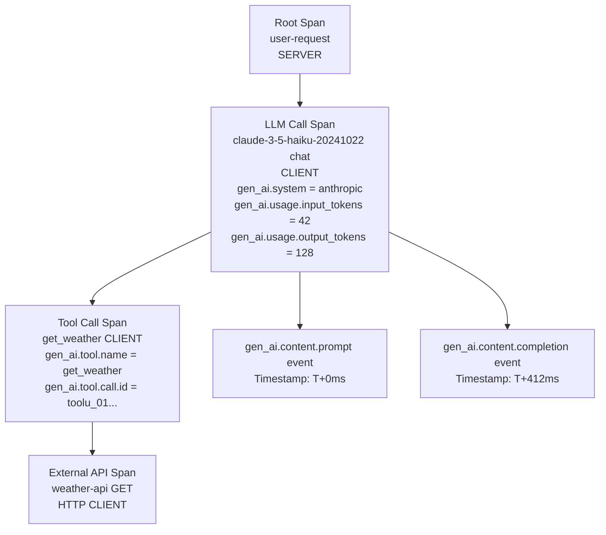

# OpenTelemetry GenAI Conventions

> Instrument once. Query everywhere. The gen_ai.* conventions are the contract between your code and every observability backend.

**Type:** Build
**Languages:** Python
**Prerequisites:** 07-01 (Why LLM Observability Differs), basic understanding of HTTP tracing
**Time:** ~60 min
**Learning Objectives:**
- Explain what OpenTelemetry semantic conventions are and why gen_ai.* matters
- Create OTel spans with correct gen_ai.* attributes for an Anthropic API call
- Understand the required span attributes, span name, and span kind for LLM calls
- Export traces to the console and interpret the span output

---

## The Problem

You instrument your LLM service with a custom logger (Lesson 01). It works. Then you want to route traces to Langfuse for LLM-specific analysis. Later, your platform team wants them in Grafana Tempo. Six months later, a vendor pitches Phoenix.

Each time you switch backends, you rewrite your instrumentation. Your custom field names (`prompt_version`, `cost_usd`) do not match what each backend expects. You write adapters. The adapters break when SDK versions change. You spend engineering time on plumbing instead of on product.

The solution is the OpenTelemetry GenAI semantic conventions: a standardized vocabulary for LLM traces. When you use `gen_ai.request.model` instead of a custom `model` field, every OTel-compatible backend understands it without adaptation. Jaeger, Grafana Tempo, Langfuse, and Phoenix all read the same attributes. You instrument once and switch backends by changing an environment variable.

---

## The Concept

### What OpenTelemetry Is

OpenTelemetry (OTel) is an open standard for collecting traces, metrics, and logs from applications. A trace is a tree of spans. A span represents a unit of work: an HTTP request, a database query, or an LLM API call.

Each span has:
- A name (e.g., `claude-3-5-haiku-20241022 chat`)
- A kind (CLIENT, SERVER, INTERNAL, etc.)
- Attributes (key-value pairs describing the work)
- Events (timestamped sub-records within the span)
- Start and end timestamps

### The gen_ai.* Semantic Conventions

The OpenTelemetry GenAI working group defines standard attribute names for AI/LLM operations. Using these names means your traces are legible to any OTel-compatible backend without translation.

**Required attributes (every LLM call span must have these):**

| Attribute | Example Value | Description |
|-----------|---------------|-------------|
| `gen_ai.system` | `"anthropic"` | The AI provider |
| `gen_ai.request.model` | `"claude-3-5-haiku-20241022"` | The requested model |
| `gen_ai.usage.input_tokens` | `42` | Tokens consumed by the prompt |
| `gen_ai.usage.output_tokens` | `128` | Tokens consumed by the completion |

**Recommended attributes:**

| Attribute | Example Value | Description |
|-----------|---------------|-------------|
| `gen_ai.response.model` | `"claude-3-5-haiku-20241022"` | Model that actually served (may differ) |
| `gen_ai.request.max_tokens` | `512` | Max tokens requested |
| `gen_ai.response.finish_reasons` | `["end_turn"]` | Why generation stopped |
| `gen_ai.operation.name` | `"chat"` | Type of operation |

**Span naming convention:** `{gen_ai.request.model} {gen_ai.operation.name}`
Example: `claude-3-5-haiku-20241022 chat`

**Span kind:** Always `SpanKind.CLIENT` for outbound LLM API calls.

**Events for content capture:**

| Event Name | When to Emit | Attributes |
|------------|-------------|------------|
| `gen_ai.content.prompt` | After building the prompt | `gen_ai.prompt` (the prompt text) |
| `gen_ai.content.completion` | After receiving response | `gen_ai.completion` (the response text) |

Content events are optional in production (to avoid logging sensitive data) but critical for debugging.

### Span Hierarchy for a Multi-Step LLM Call



The root span represents the user's HTTP request. The LLM call span is the child, with all gen_ai.* attributes. If the LLM calls tools, each tool call becomes a child span of the LLM span. This tree structure lets you see exactly where time was spent and where failures occurred.

---

## Build It

We will manually create OTel spans with correct gen_ai.* attributes for an Anthropic API call, then export them to the console. No auto-instrumentation yet: building manually first is how you understand what auto-instrumentation does for you.

### Step 1: Install the OTel SDK

```bash
pip install opentelemetry-sdk anthropic
```

### Step 2: Configure the console exporter

The console exporter prints spans as JSON to stdout. It is the fastest way to verify your instrumentation without a backend.

```python
from opentelemetry import trace
from opentelemetry.sdk.trace import TracerProvider
from opentelemetry.sdk.trace.export import ConsoleSpanExporter, SimpleSpanProcessor

def setup_tracer() -> trace.Tracer:
    """Configure OTel with a console exporter for local development."""
    provider = TracerProvider()
    provider.add_span_processor(SimpleSpanProcessor(ConsoleSpanExporter()))
    trace.set_tracer_provider(provider)
    return trace.get_tracer("appliedai.phase07", "1.0.0")
```

### Step 3: Create a span for an Anthropic API call

```python
import anthropic
from opentelemetry.trace import SpanKind, Status, StatusCode

def call_with_span(
    tracer: trace.Tracer,
    client: anthropic.Anthropic,
    prompt: str,
    model: str = "claude-3-5-haiku-20241022",
    max_tokens: int = 512,
) -> str:
    """
    Make an Anthropic API call wrapped in an OTel span with gen_ai.* attributes.
    Span name follows the convention: "{model} chat"
    Span kind: CLIENT (outbound call to an external API)
    """
    span_name = f"{model} chat"

    with tracer.start_as_current_span(
        name=span_name,
        kind=SpanKind.CLIENT,
    ) as span:
        # Required gen_ai.* attributes -- set these before the API call
        span.set_attribute("gen_ai.system", "anthropic")
        span.set_attribute("gen_ai.request.model", model)
        span.set_attribute("gen_ai.request.max_tokens", max_tokens)
        span.set_attribute("gen_ai.operation.name", "chat")

        # Emit the prompt as an event (optional: disable in production for PII)
        span.add_event(
            "gen_ai.content.prompt",
            attributes={"gen_ai.prompt": prompt},
        )

        try:
            response = client.messages.create(
                model=model,
                max_tokens=max_tokens,
                messages=[{"role": "user", "content": prompt}],
            )

            # Required usage attributes
            span.set_attribute("gen_ai.usage.input_tokens", response.usage.input_tokens)
            span.set_attribute("gen_ai.usage.output_tokens", response.usage.output_tokens)

            # Recommended response attributes
            span.set_attribute("gen_ai.response.model", response.model)
            span.set_attribute(
                "gen_ai.response.finish_reasons",
                [response.stop_reason or "unknown"],
            )

            response_text = response.content[0].text

            # Emit the completion as an event
            span.add_event(
                "gen_ai.content.completion",
                attributes={"gen_ai.completion": response_text},
            )

            span.set_status(Status(StatusCode.OK))
            return response_text

        except anthropic.APIError as exc:
            span.set_status(Status(StatusCode.ERROR, description=str(exc)))
            span.record_exception(exc)
            raise
```

### Step 4: Add a root span to represent the user request

In production, the root span represents the HTTP request that triggered the LLM call. The LLM span is a child. This parent-child relationship is what makes traces navigable.

```python
import time

def handle_user_request(
    tracer: trace.Tracer,
    client: anthropic.Anthropic,
    user_question: str,
) -> str:
    """
    Simulates an HTTP request handler.
    Root span = the user request.
    Child span = the LLM API call (created inside call_with_span).
    """
    with tracer.start_as_current_span("user-request") as root:
        root.set_attribute("user.question_length", len(user_question))
        root.set_attribute("http.method", "POST")
        root.set_attribute("http.route", "/ask")

        answer = call_with_span(tracer, client, user_question)

        root.set_attribute("response.length", len(answer))
        return answer
```

> **Real-world check:** A colleague says: "I can see the gen_ai.* attributes in my span, but I also see my prompt text in the gen_ai.content.prompt event. In production, user prompts may contain PII. How do I instrument correctly without logging sensitive data?"

### Step 5: Run it and read the console output

```python
def main():
    tracer = setup_tracer()
    client = anthropic.Anthropic()

    print("=== OTel GenAI Span Demo ===\n")
    answer = handle_user_request(
        tracer,
        client,
        "What is the difference between a trace and a log in observability?",
    )
    print(f"\nAnswer: {answer[:200]}...")
    print("\nSee the spans above. Look for:")
    print("  gen_ai.system = anthropic")
    print("  gen_ai.request.model = claude-3-5-haiku-20241022")
    print("  gen_ai.usage.input_tokens (set)")
    print("  gen_ai.usage.output_tokens (set)")
    print("  gen_ai.content.prompt event")
    print("  gen_ai.content.completion event")
```

The console exporter will print each span as a JSON block after it ends. The LLM call span is nested inside the user-request span in the trace (they share the same `trace_id`, and the LLM span's `parent_id` matches the root span's `span_id`).

---

## Use It

The manual approach above shows exactly what gen_ai.* attributes look like. For production, the `opentelemetry-sdk` plus an OTLP exporter replaces the console exporter with a real backend connection.

**Switching from console to OTLP export:**

```python
# pip install opentelemetry-exporter-otlp-proto-grpc
from opentelemetry.exporter.otlp.proto.grpc.trace_exporter import OTLPSpanExporter
from opentelemetry.sdk.trace.export import BatchSpanProcessor

def setup_tracer_otlp(endpoint: str = "http://localhost:4317") -> trace.Tracer:
    """
    Configure OTel with OTLP/gRPC export.
    Works with Langfuse, Phoenix, Jaeger, Grafana Tempo -- any OTel backend.
    Only the endpoint changes between backends.
    """
    provider = TracerProvider()
    exporter = OTLPSpanExporter(endpoint=endpoint)
    # BatchSpanProcessor: buffers spans and sends in batches for performance
    provider.add_span_processor(BatchSpanProcessor(exporter))
    trace.set_tracer_provider(provider)
    return trace.get_tracer("appliedai.phase07", "1.0.0")

# Langfuse OTLP endpoint (from their docs):
# endpoint = "https://cloud.langfuse.com/api/public/otel/v1/traces"
# Requires OTEL_EXPORTER_OTLP_HEADERS for authentication
```

**What the standard buys you:**

| Approach | Backend change cost |
|----------|-------------------|
| Custom logger (Lesson 01) | Rewrite all field names per backend |
| gen_ai.* OTel spans | Change one env var (OTLP endpoint) |

The gen_ai.* conventions are standardized so your traces work in any OTel-compatible backend without reformatting. Invest in the standard once; switch backends freely.

> **Perspective shift:** Your platform engineer says: "We already have Jaeger for distributed tracing of our microservices. Can the LLM traces go in the same Jaeger instance, or do we need a separate LLM-specific tool like Langfuse?" What is the honest trade-off between a general OTel backend and an LLM-specific one?

**When to use a general OTel backend (Jaeger, Grafana Tempo):**
- You want LLM traces alongside service-to-service traces for full request flow visibility
- Your platform team already manages OTel infrastructure
- You need cross-service correlation (LLM span as part of a larger service call tree)

**When to use an LLM-specific backend (Langfuse, Phoenix):**
- You want LLM-specific dashboards: cost per model, prompt version comparison, quality scoring
- You need human review workflows for output quality
- You want prompt playground and evaluation features

Both accept OTLP. Use both if you need both capabilities: the same exporter can fan out to multiple backends.

---

## Ship It

This lesson produces a reusable skill for creating OTel spans with correct gen_ai.* attributes.

**Artifact:** `outputs/skill-otel-genai-spans.md`

The `code/main.py` in this lesson is the reference implementation. Copy `call_with_span` and `setup_tracer` into your service. For production, swap `ConsoleSpanExporter` for `OTLPSpanExporter` and set the endpoint via environment variable. The gen_ai.* attribute names are stable: they are part of the OTel specification, not a vendor extension.

---

## Evaluate It

Instrumentation that silently drops spans or sets wrong attributes is worse than no instrumentation: it produces misleading dashboards.

**Check 1: Required attributes present**

After running a traced call, parse the console output and verify all required gen_ai.* attributes are set:

```python
import json
import subprocess

# Run the demo and capture console output
# In a real test, use an in-memory span exporter
required_attributes = [
    "gen_ai.system",
    "gen_ai.request.model",
    "gen_ai.usage.input_tokens",
    "gen_ai.usage.output_tokens",
]
# Verify these appear in the span JSON output
print("Manually verify in console output: all 4 required gen_ai.* attributes present")
```

**Check 2: Span kind is CLIENT**

Verify the LLM call span has kind=CLIENT (value 3 in the OTel enum). A INTERNAL or SERVER kind breaks distributed trace context for tools like Grafana that use kind to determine service topology:

```python
from opentelemetry.trace import SpanKind
assert SpanKind.CLIENT.value == 3  # CLIENT is the correct kind for outbound API calls
print("SpanKind.CLIENT confirmed")
```

**Check 3: Parent-child relationship**

Verify the LLM span's parent_span_id matches the root span's span_id. This is what makes the trace navigable as a tree:

```python
# Use InMemorySpanExporter for unit testing
from opentelemetry.sdk.trace.export.in_memory_span_exporter import InMemorySpanExporter
from opentelemetry.sdk.trace import TracerProvider
from opentelemetry.sdk.trace.export import SimpleSpanProcessor

exporter = InMemorySpanExporter()
provider = TracerProvider()
provider.add_span_processor(SimpleSpanProcessor(exporter))
trace.set_tracer_provider(provider)
test_tracer = trace.get_tracer("test")

client = anthropic.Anthropic()
handle_user_request(test_tracer, client, "Hello")

spans = exporter.get_finished_spans()
assert len(spans) == 2, f"Expected 2 spans (root + LLM call), got {len(spans)}"

root = next(s for s in spans if s.name == "user-request")
llm = next(s for s in spans if "chat" in s.name)

assert llm.parent is not None, "LLM span must have a parent"
assert llm.parent.span_id == root.context.span_id, "LLM span parent must be root span"

print("Parent-child relationship verified")
```

**Check 4: Token counts are non-zero on successful calls**

Zero token counts on a successful call indicate the attributes were never set:

```python
for span in spans:
    if "chat" in span.name:
        attrs = span.attributes
        assert attrs.get("gen_ai.usage.input_tokens", 0) > 0, \
            "input_tokens must be > 0 on successful call"
        assert attrs.get("gen_ai.usage.output_tokens", 0) > 0, \
            "output_tokens must be > 0 on successful call"
        print(f"Token counts: {attrs['gen_ai.usage.input_tokens']}in / {attrs['gen_ai.usage.output_tokens']}out")
```
