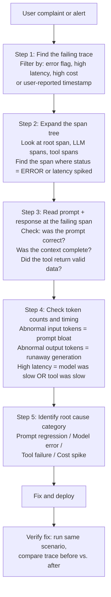

# الـ Trace كوحدة للتصحيح (Debugging)

> حين يقول مستخدم "الإجابة كانت خاطئة"، يكون الـ trace هو الأثر الوحيد القادر على إثبات السبب.

**النوع:** تعلّم
**اللغات:** Python
**المتطلبات:** 07-03 (تجهيز تطبيق)، إلمام بسجلّات JSONL
**الوقت:** ~60 دقيقة
**أهداف التعلّم:**
- تطبيق مسار العمل المؤلَّف من 5 خطوات لمراجعة الـ trace لتصحيح عطل إنتاجي في الذكاء الاصطناعي
- بناء TraceAnalyzer يكتشف الشذوذ (anomalies) في سجلّات traces بصيغة JSONL
- تحديد أصناف الشذوذ الأربعة: زمن استجابة مرتفع، تكلفة مرتفعة، spans بأخطاء، كفاءة tokens منخفضة
- استخدام Langfuse API لسحب الـ traces الفاشلة برمجيًا

---

## المشكلة

يرسل مستخدم بريدًا للدعم: "أعطاني الذكاء الاصطناعي اتجاهات خاطئة تمامًا." لديك traces مُفعّلة. تذهب إلى لوحة Langfuse. لديك 12,000 trace من الأمس. من أين تبدأ؟

هذه هي فجوة المهارة الحقيقية في مراقبة LLM: جمع الـ traces سهل، لكن معرفة كيفية استخدامها لتصحيح عطل إنتاجي محدد ليست سهلة. المهندسون الذين لم يفعلوا هذا من قبل يبدؤون بتمرير قائمة الـ traces، والتصفية حسب الوقت، ثم قراءة JSON خام. ينفقون 45 دقيقة على ما ينبغي أن يستغرق 5. وفي الوقت نفسه، الـ prompt الذي سبّب العطل ما زال حيًّا.

الـ trace أثر مُهيكل. والـ trace الفاشل له أنماط: span بخطأ، أو قفزة في عدد الـ tokens، أو أداة أرجعت بيانات غير متوقعة. مسار العمل المؤلَّف من 5 خطوات إجراء قابل للتكرار للانتقال من شكوى المستخدم إلى الـ span الذي هو سبب الجذر في أقل من 10 دقائق.

---

## المفهوم

### مسار عمل التصحيح من 5 خطوات للـ Trace



### أصناف الشذوذ الأربعة التي ينبغي فحص كل trace مقابلها

| Class | Signal in Trace | Root Cause Category |
|-------|----------------|-------------------|
| زمن استجابة مرتفع | مدة الـ span الجذري > ضعف خط الأساس | أداة بطيئة، انتهاء مهلة النموذج، سياق كبير |
| تكلفة مرتفعة | input_tokens + output_tokens >> خط الأساس | تضخّم الـ prompt، توليد جامح، غياب الـ cache |
| span بخطأ | حالة أي span = ERROR | عطل API، استثناء أداة، خطأ مصادقة |
| كفاءة tokens منخفضة | مُدخل كبير، مُخرج صغير | prompt محشوّ بإفراط، سياق غير ذي صلة مُدرَج |

### ما يربط بينه الـ Trace

```
User complaint ("answer was wrong")
        |
        v
Trace ID (from API response or support ticket)
        |
        v
Root span: timestamp, total latency, HTTP status
        |
        +-- LLM call span: model, prompt version, input/output tokens
        |       |
        |       +-- gen_ai.content.prompt event: EXACT prompt sent
        |       +-- gen_ai.content.completion event: EXACT response received
        |
        +-- Tool call span (if applicable): tool name, arguments, result
        |
        v
Root cause: the exact prompt + context + tool result that produced the failure
```

بدون الـ traces، أنت تعمل بالعكس انطلاقًا من شكوى عميل دون دليل. ومع الـ traces، يمكن إعادة بناء العطل كاملًا.

---

## البناء

سنبني `TraceAnalyzer` يقرأ ملف JSONL من سجلّات الـ traces (كما ينتجها الـ logger في الدرس 01، أو كما تُصدَّر من Langfuse/Phoenix) ويحدّد الشذوذ.

### الخطوة 1: تعريف مخطط سجل الـ trace

```python
import json
import statistics
from dataclasses import dataclass
from typing import Optional

@dataclass
class TraceRecord:
    """A single trace record from JSONL export."""
    trace_id: str
    model: str
    prompt_version: str
    input_tokens: int
    output_tokens: int
    cost_usd: float
    latency_ms: float
    cache_hit: bool
    error: Optional[str]
    # Optional: content captured from gen_ai.* events
    prompt_text: Optional[str] = None
    completion_text: Optional[str] = None

def load_traces(path: str) -> list[TraceRecord]:
    """Load trace records from a JSONL file."""
    records = []
    with open(path) as f:
        for line in f:
            line = line.strip()
            if not line:
                continue
            data = json.loads(line)
            records.append(TraceRecord(
                trace_id=data.get("trace_id", "unknown"),
                model=data.get("model", "unknown"),
                prompt_version=data.get("prompt_version", "unknown"),
                input_tokens=data.get("input_tokens", 0),
                output_tokens=data.get("output_tokens", 0),
                cost_usd=data.get("cost_usd", 0.0),
                latency_ms=data.get("latency_ms", 0.0),
                cache_hit=data.get("cache_hit", False),
                error=data.get("error"),
                prompt_text=data.get("prompt_text"),
                completion_text=data.get("completion_text"),
            ))
    return records
```

### الخطوة 2: بناء كاشف الشذوذ

```python
@dataclass
class Anomaly:
    trace_id: str
    anomaly_type: str  # "high_latency" | "high_cost" | "error" | "low_token_efficiency"
    severity: str      # "warning" | "critical"
    detail: str
    record: TraceRecord

class TraceAnalyzer:
    """
    Analyzes a batch of trace records for anomalies.
    Baselines are computed from the provided records (P50/P95 approach).
    Override with explicit thresholds for tighter alerting.
    """

    def __init__(
        self,
        records: list[TraceRecord],
        latency_threshold_ms: Optional[float] = None,
        cost_threshold_usd: Optional[float] = None,
        token_efficiency_threshold: Optional[float] = None,
    ):
        self.records = records
        # Compute baselines from data
        successful = [r for r in records if r.error is None and r.input_tokens > 0]
        if successful:
            self.p95_latency = statistics.quantiles(
                [r.latency_ms for r in successful], n=20
            )[-1] if len(successful) >= 20 else max(r.latency_ms for r in successful)
            self.p95_cost = statistics.quantiles(
                [r.cost_usd for r in successful], n=20
            )[-1] if len(successful) >= 20 else max(r.cost_usd for r in successful)
        else:
            self.p95_latency = 0.0
            self.p95_cost = 0.0

        # Use explicit thresholds if provided, else 2x the P95 baseline
        self.latency_threshold = latency_threshold_ms or (self.p95_latency * 2)
        self.cost_threshold = cost_threshold_usd or (self.p95_cost * 2)
        # Token efficiency: output_tokens / input_tokens
        # Low ratio = large prompt, tiny response = likely prompt bloat
        self.efficiency_threshold = token_efficiency_threshold or 0.05

    def analyze(self) -> list[Anomaly]:
        """Scan all records and return a list of detected anomalies."""
        anomalies = []
        for record in self.records:
            anomalies.extend(self._check_record(record))
        return sorted(anomalies, key=lambda a: (a.severity == "critical", a.anomaly_type), reverse=True)

    def _check_record(self, r: TraceRecord) -> list[Anomaly]:
        found = []

        # Check 1: error spans
        if r.error is not None:
            found.append(Anomaly(
                trace_id=r.trace_id,
                anomaly_type="error",
                severity="critical",
                detail=f"API error: {r.error} | prompt_version={r.prompt_version}",
                record=r,
            ))

        # Check 2: high latency
        if r.latency_ms > self.latency_threshold:
            found.append(Anomaly(
                trace_id=r.trace_id,
                anomaly_type="high_latency",
                severity="warning" if r.latency_ms < self.latency_threshold * 2 else "critical",
                detail=f"latency={r.latency_ms:.0f}ms (threshold={self.latency_threshold:.0f}ms)",
                record=r,
            ))

        # Check 3: high cost
        if r.cost_usd > self.cost_threshold and r.cost_threshold > 0:
            found.append(Anomaly(
                trace_id=r.trace_id,
                anomaly_type="high_cost",
                severity="warning",
                detail=(
                    f"cost=${r.cost_usd:.6f} (threshold=${self.cost_threshold:.6f}) | "
                    f"tokens={r.input_tokens}in/{r.output_tokens}out"
                ),
                record=r,
            ))

        # Check 4: low token efficiency
        if r.input_tokens > 100 and r.output_tokens > 0:
            efficiency = r.output_tokens / r.input_tokens
            if efficiency < self.efficiency_threshold:
                found.append(Anomaly(
                    trace_id=r.trace_id,
                    anomaly_type="low_token_efficiency",
                    severity="warning",
                    detail=(
                        f"efficiency={efficiency:.3f} "
                        f"(threshold={self.efficiency_threshold:.3f}) | "
                        f"{r.input_tokens}in / {r.output_tokens}out"
                    ),
                    record=r,
                ))

        return found

    def summary(self) -> dict:
        """Return a summary of the analysis."""
        anomalies = self.analyze()
        return {
            "total_traces": len(self.records),
            "error_count": sum(1 for r in self.records if r.error),
            "cache_hit_rate": sum(1 for r in self.records if r.cache_hit) / max(len(self.records), 1),
            "p95_latency_ms": self.p95_latency,
            "p95_cost_usd": self.p95_cost,
            "anomaly_count": len(anomalies),
            "critical_count": sum(1 for a in anomalies if a.severity == "critical"),
        }
```

> **اختبار من الواقع:** تشغّل الـ TraceAnalyzer على traces الأمس فتجد 47 شذوذًا من نوع زمن الاستجابة المرتفع، كلها من نافذة الـ 20 دقيقة نفسها بين 14:30 و14:50 بتوقيت UTC. استخدمت كل الـ 47 trace إصدار الـ prompt نفسه. يرسل لك مديرك التنفيذي بريدًا الساعة 09:00 صباح اليوم التالي يسأل لماذا "تعطّل البوت أمس بعد الظهر." كيف تستخدم بيانات الـ traces هذه لإعطاء إجابة دقيقة مبنية على الأدلة في غضون 5 دقائق؟

### الخطوة 3: شغّل مسار العمل من 5 خطوات على trace شاذ

```python
def debug_trace(trace_id: str, records: list[TraceRecord]) -> None:
    """
    Apply the 5-step workflow to a specific trace ID.
    In production, you would fetch this from the Langfuse API (see Use It).
    Here we look it up from a local JSONL file.
    """
    record = next((r for r in records if r.trace_id == trace_id), None)
    if not record:
        print(f"Trace {trace_id} not found")
        return

    print(f"=== 5-Step Trace Debug: {trace_id} ===\n")

    # Step 1: Find
    print("Step 1: Found trace")
    print(f"  model={record.model} | prompt_version={record.prompt_version}")
    print(f"  error={'NONE' if not record.error else record.error}")
    print()

    # Step 2: Span tree (simplified -- single-span record)
    print("Step 2: Span tree")
    status = "ERROR" if record.error else "OK"
    print(f"  [root] status={status} | latency={record.latency_ms:.0f}ms")
    print(f"    [LLM call] {record.model} | input={record.input_tokens} | output={record.output_tokens}")
    print()

    # Step 3: Prompt + response content
    print("Step 3: Prompt + response")
    if record.prompt_text:
        print(f"  Prompt: {record.prompt_text[:200]}...")
    else:
        print("  Prompt: not captured (enable gen_ai.content.prompt events)")
    if record.completion_text:
        print(f"  Response: {record.completion_text[:200]}...")
    else:
        print("  Response: not captured (enable gen_ai.content.completion events)")
    print()

    # Step 4: Token counts and timing
    print("Step 4: Token counts and timing")
    if record.input_tokens > 0:
        efficiency = record.output_tokens / record.input_tokens
        print(f"  input_tokens={record.input_tokens} | output_tokens={record.output_tokens}")
        print(f"  token efficiency={efficiency:.3f} | cost=${record.cost_usd:.6f}")
        print(f"  cache_hit={record.cache_hit}")
    print()

    # Step 5: Root cause
    print("Step 5: Root cause")
    if record.error:
        print(f"  CATEGORY: API/tool failure -- {record.error}")
    elif record.input_tokens > 2000:
        print("  CATEGORY: Prompt bloat -- input token count is high, review context injection")
    elif record.latency_ms > 5000:
        print("  CATEGORY: Model latency spike -- check for model provider incidents")
    else:
        print("  CATEGORY: Unclear from single record -- need content events enabled")
    print()
```

---

## الاستخدام

في الإنتاج، اسحب الـ traces الفاشلة من Langfuse برمجيًا باستخدام Python SDK الخاص به. هذا يتيح كشف الشذوذ والتنبيه آليًا دون مراجعة يدوية للوحة.

```python
from langfuse import Langfuse

def pull_failing_traces(hours_back: int = 24) -> list[dict]:
    """
    Pull traces with errors or high latency from Langfuse.
    Returns a list of trace dicts for further analysis.
    """
    lf = Langfuse()

    # Fetch recent traces with errors
    # Langfuse SDK: fetch_traces returns a paginated response
    error_traces = lf.fetch_traces(
        limit=100,
        # Filter by session tags or user IDs in production
    ).data

    # Filter for anomalies client-side
    failing = []
    for t in error_traces:
        observations = lf.fetch_observations(trace_id=t.id).data
        for obs in observations:
            if obs.level == "ERROR" or (obs.latency and obs.latency > 5000):
                failing.append({
                    "trace_id": t.id,
                    "timestamp": t.timestamp.isoformat(),
                    "latency_ms": obs.latency,
                    "error": obs.status_message,
                    "model": obs.model,
                })
                break  # one entry per trace

    return failing


def print_failing_traces(traces: list[dict]) -> None:
    """Print a summary of failing traces for triage."""
    print(f"Found {len(traces)} failing traces in the last 24 hours\n")
    for t in traces[:10]:  # show top 10
        print(
            f"  {t['timestamp'][:19]} | "
            f"trace={t['trace_id'][:16]}... | "
            f"latency={t.get('latency_ms', 'N/A')}ms | "
            f"error={t.get('error', 'none')}"
        )
```

> **نقلة في المنظور:** يقول مهندس: "بدل سحب الـ traces من Langfuse API، يجب أن نستعلم فقط من ملفات سجلّات JSONL الخام لدينا. نحن نملكها، ولا يوجد حدّ معدّل (rate limit) لـ API، ولا نحتاج اعتمادًا على مزوّد." ما المزايا المشروعة لـ Langfuse API على استعلامات JSONL الخام، ومتى يكون نهج الملف الخام أفضل؟

---

## التسليم

يُنتج هذا الدرس مهارة قابلة لإعادة الاستخدام لمسار عمل تصحيح الـ traces.

**المُخرَج (Artifact):** `outputs/skill-trace-debug-workflow.md`

يحتوي ملف `code/main.py` في هذا الدرس على صنف `TraceAnalyzer` ودالة `debug_trace()` ذات الـ 5 خطوات. انسخها إلى أدوات التشغيل (ops tooling) لديك. غذِّها بصادرات JSONL من Langfuse أو Phoenix أو من logger المُهيكل الخاص بك. يمكن دفع مُخرَج دالة `summary()` إلى لوحة المراقبة لديك كنقطة نهاية لفحص الصحة (health check).

---

## التقييم

مسار عمل التصحيح مفيد فقط إذا أظهر فعلًا الأعطال الصحيحة ولم يُغرقك في إيجابيات كاذبة (false positives).

**الفحص 1: دقة كشف الشذوذ**

أدخِل شذوذًا معروفًا في ملف traces تركيبي وتحقّق من اكتشافه:

```python
import json
import tempfile

# Create synthetic traces with known anomalies
synthetic_traces = [
    # Normal trace
    {"trace_id": "t001", "model": "claude-3-5-haiku-20241022", "prompt_version": "v1",
     "input_tokens": 50, "output_tokens": 100, "cost_usd": 0.0002,
     "latency_ms": 300, "cache_hit": False, "error": None},
    # Error trace
    {"trace_id": "t002", "model": "claude-3-5-haiku-20241022", "prompt_version": "v1",
     "input_tokens": 0, "output_tokens": 0, "cost_usd": 0.0,
     "latency_ms": 50, "cache_hit": False, "error": "RateLimitError"},
    # High latency trace
    {"trace_id": "t003", "model": "claude-3-5-haiku-20241022", "prompt_version": "v2",
     "input_tokens": 50, "output_tokens": 100, "cost_usd": 0.0002,
     "latency_ms": 15000, "cache_hit": False, "error": None},
    # Low efficiency trace
    {"trace_id": "t004", "model": "claude-3-5-haiku-20241022", "prompt_version": "v1",
     "input_tokens": 3000, "output_tokens": 10, "cost_usd": 0.003,
     "latency_ms": 800, "cache_hit": False, "error": None},
]

with tempfile.NamedTemporaryFile(mode="w", suffix=".jsonl", delete=False) as f:
    for t in synthetic_traces:
        f.write(json.dumps(t) + "\n")
    tmppath = f.name

records = load_traces(tmppath)
analyzer = TraceAnalyzer(records, latency_threshold_ms=5000, cost_threshold_usd=0.01)
anomalies = analyzer.analyze()

# Verify expected detections
error_ids = {a.trace_id for a in anomalies if a.anomaly_type == "error"}
latency_ids = {a.trace_id for a in anomalies if a.anomaly_type == "high_latency"}
efficiency_ids = {a.trace_id for a in anomalies if a.anomaly_type == "low_token_efficiency"}

assert "t002" in error_ids, "Error trace not detected"
assert "t003" in latency_ids, "High latency trace not detected"
assert "t004" in efficiency_ids, "Low efficiency trace not detected"
assert "t001" not in error_ids, "Normal trace incorrectly flagged as error"

print(f"Anomaly detection check passed: {len(anomalies)} anomalies detected correctly")
```

**الفحص 2: اكتمال مسار العمل من 5 خطوات**

احسب وقتك وأنت تشغّل مسار العمل من 5 خطوات على trace فاشل حقيقي. الهدف هو أقل من 10 دقائق من معرّف الـ trace إلى تحديد سبب الجذر:

```
Target: < 10 minutes from "user complaint received" to "root cause identified"
Metric: time from opening Langfuse to identifying the failing span's prompt content
Baseline: > 30 minutes without a structured workflow
```

**الفحص 3: معدّل الإيجابيات الكاذبة**

شغّل المُحلِّل على نافذة traces سليمة مدتها ساعة واحدة وتحقّق من أن معدّل الشذوذ الحرج أقل من 2% من إجمالي الـ traces:

```python
# On a known-healthy window
healthy_records = [r for r in records if r.error is None]
analyzer_healthy = TraceAnalyzer(healthy_records)
critical_anomalies = [a for a in analyzer_healthy.analyze() if a.severity == "critical"]
false_positive_rate = len(critical_anomalies) / max(len(healthy_records), 1)
assert false_positive_rate < 0.02, \
    f"False positive rate {false_positive_rate:.1%} exceeds 2% -- thresholds too tight"
print(f"False positive rate: {false_positive_rate:.1%} (target < 2%)")
```
