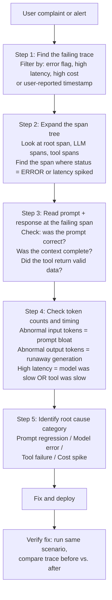

# The Trace as the Unit of Debugging

> When a user says "the answer was wrong," the trace is the only artifact that can prove why.

**Type:** Learn
**Languages:** Python
**Prerequisites:** 07-03 (Instrument an App), familiarity with JSONL logs
**Time:** ~60 min
**Learning Objectives:**
- Apply the 5-step trace review workflow to debug a production AI failure
- Build a TraceAnalyzer that detects anomalies in JSONL trace logs
- Identify the four anomaly classes: high latency, high cost, error spans, low token efficiency
- Use the Langfuse API to programmatically pull failing traces

---

## The Problem

A user emails support: "The AI gave me completely wrong directions." You have traces enabled. You go to your Langfuse dashboard. You have 12,000 traces from yesterday. Where do you start?

This is the real skill gap in LLM observability: collecting traces is easy, but knowing how to use them to debug a specific production failure is not. Engineers who have not done this before start by scrolling the trace list, filtering by time, and then reading raw JSON. They spend 45 minutes on something that should take 5. Meanwhile, the prompt that caused the failure is still live.

The trace is a structured artifact. A failing trace has patterns: an error span, a token count spike, a tool that returned unexpected data. The 5-step workflow is a repeatable procedure for going from a user complaint to the root cause span in under 10 minutes.

---

## The Concept

### The 5-Step Trace Debug Workflow



### The 4 Anomaly Classes Every Trace Should Be Checked Against

| Class | Signal in Trace | Root Cause Category |
|-------|----------------|-------------------|
| High latency | Root span duration > 2x baseline | Slow tool, model timeout, large context |
| High cost | input_tokens + output_tokens >> baseline | Prompt bloat, runaway generation, missing cache |
| Error span | Any span status = ERROR | API failure, tool exception, auth error |
| Low token efficiency | Large input, small output | Over-padded prompt, irrelevant context injected |

### What the Trace Connects

```
User complaint ("answer was wrong")
        |
        v
Trace ID (from API response or support ticket)
        |
        v
Root span: timestamp, total latency, HTTP status
        |
        +-- LLM call span: model, prompt version, input/output tokens
        |       |
        |       +-- gen_ai.content.prompt event: EXACT prompt sent
        |       +-- gen_ai.content.completion event: EXACT response received
        |
        +-- Tool call span (if applicable): tool name, arguments, result
        |
        v
Root cause: the exact prompt + context + tool result that produced the failure
```

Without traces, you are working backward from a customer complaint with no evidence. With traces, the failure is reconstructable in full.

---

## Build It

We will build a `TraceAnalyzer` that reads a JSONL file of trace records (as produced by the logger in Lesson 01, or exported from Langfuse/Phoenix) and identifies anomalies.

### Step 1: Define the trace record schema

```python
import json
import statistics
from dataclasses import dataclass
from typing import Optional

@dataclass
class TraceRecord:
    """A single trace record from JSONL export."""
    trace_id: str
    model: str
    prompt_version: str
    input_tokens: int
    output_tokens: int
    cost_usd: float
    latency_ms: float
    cache_hit: bool
    error: Optional[str]
    # Optional: content captured from gen_ai.* events
    prompt_text: Optional[str] = None
    completion_text: Optional[str] = None

def load_traces(path: str) -> list[TraceRecord]:
    """Load trace records from a JSONL file."""
    records = []
    with open(path) as f:
        for line in f:
            line = line.strip()
            if not line:
                continue
            data = json.loads(line)
            records.append(TraceRecord(
                trace_id=data.get("trace_id", "unknown"),
                model=data.get("model", "unknown"),
                prompt_version=data.get("prompt_version", "unknown"),
                input_tokens=data.get("input_tokens", 0),
                output_tokens=data.get("output_tokens", 0),
                cost_usd=data.get("cost_usd", 0.0),
                latency_ms=data.get("latency_ms", 0.0),
                cache_hit=data.get("cache_hit", False),
                error=data.get("error"),
                prompt_text=data.get("prompt_text"),
                completion_text=data.get("completion_text"),
            ))
    return records
```

### Step 2: Build the anomaly detector

```python
@dataclass
class Anomaly:
    trace_id: str
    anomaly_type: str  # "high_latency" | "high_cost" | "error" | "low_token_efficiency"
    severity: str      # "warning" | "critical"
    detail: str
    record: TraceRecord

class TraceAnalyzer:
    """
    Analyzes a batch of trace records for anomalies.
    Baselines are computed from the provided records (P50/P95 approach).
    Override with explicit thresholds for tighter alerting.
    """

    def __init__(
        self,
        records: list[TraceRecord],
        latency_threshold_ms: Optional[float] = None,
        cost_threshold_usd: Optional[float] = None,
        token_efficiency_threshold: Optional[float] = None,
    ):
        self.records = records
        # Compute baselines from data
        successful = [r for r in records if r.error is None and r.input_tokens > 0]
        if successful:
            self.p95_latency = statistics.quantiles(
                [r.latency_ms for r in successful], n=20
            )[-1] if len(successful) >= 20 else max(r.latency_ms for r in successful)
            self.p95_cost = statistics.quantiles(
                [r.cost_usd for r in successful], n=20
            )[-1] if len(successful) >= 20 else max(r.cost_usd for r in successful)
        else:
            self.p95_latency = 0.0
            self.p95_cost = 0.0

        # Use explicit thresholds if provided, else 2x the P95 baseline
        self.latency_threshold = latency_threshold_ms or (self.p95_latency * 2)
        self.cost_threshold = cost_threshold_usd or (self.p95_cost * 2)
        # Token efficiency: output_tokens / input_tokens
        # Low ratio = large prompt, tiny response = likely prompt bloat
        self.efficiency_threshold = token_efficiency_threshold or 0.05

    def analyze(self) -> list[Anomaly]:
        """Scan all records and return a list of detected anomalies."""
        anomalies = []
        for record in self.records:
            anomalies.extend(self._check_record(record))
        return sorted(anomalies, key=lambda a: (a.severity == "critical", a.anomaly_type), reverse=True)

    def _check_record(self, r: TraceRecord) -> list[Anomaly]:
        found = []

        # Check 1: error spans
        if r.error is not None:
            found.append(Anomaly(
                trace_id=r.trace_id,
                anomaly_type="error",
                severity="critical",
                detail=f"API error: {r.error} | prompt_version={r.prompt_version}",
                record=r,
            ))

        # Check 2: high latency
        if r.latency_ms > self.latency_threshold:
            found.append(Anomaly(
                trace_id=r.trace_id,
                anomaly_type="high_latency",
                severity="warning" if r.latency_ms < self.latency_threshold * 2 else "critical",
                detail=f"latency={r.latency_ms:.0f}ms (threshold={self.latency_threshold:.0f}ms)",
                record=r,
            ))

        # Check 3: high cost
        if r.cost_usd > self.cost_threshold and r.cost_threshold > 0:
            found.append(Anomaly(
                trace_id=r.trace_id,
                anomaly_type="high_cost",
                severity="warning",
                detail=(
                    f"cost=${r.cost_usd:.6f} (threshold=${self.cost_threshold:.6f}) | "
                    f"tokens={r.input_tokens}in/{r.output_tokens}out"
                ),
                record=r,
            ))

        # Check 4: low token efficiency
        if r.input_tokens > 100 and r.output_tokens > 0:
            efficiency = r.output_tokens / r.input_tokens
            if efficiency < self.efficiency_threshold:
                found.append(Anomaly(
                    trace_id=r.trace_id,
                    anomaly_type="low_token_efficiency",
                    severity="warning",
                    detail=(
                        f"efficiency={efficiency:.3f} "
                        f"(threshold={self.efficiency_threshold:.3f}) | "
                        f"{r.input_tokens}in / {r.output_tokens}out"
                    ),
                    record=r,
                ))

        return found

    def summary(self) -> dict:
        """Return a summary of the analysis."""
        anomalies = self.analyze()
        return {
            "total_traces": len(self.records),
            "error_count": sum(1 for r in self.records if r.error),
            "cache_hit_rate": sum(1 for r in self.records if r.cache_hit) / max(len(self.records), 1),
            "p95_latency_ms": self.p95_latency,
            "p95_cost_usd": self.p95_cost,
            "anomaly_count": len(anomalies),
            "critical_count": sum(1 for a in anomalies if a.severity == "critical"),
        }
```

> **Real-world check:** You run the TraceAnalyzer on yesterday's traces and find 47 high-latency anomalies, all from the same 20-minute window between 14:30 and 14:50 UTC. All 47 traces used the same prompt version. Your CEO emails you at 09:00 the next morning asking why the chatbot "was broken yesterday afternoon." How do you use this trace data to give a precise, evidence-based answer within 5 minutes?

### Step 3: Run the 5-step workflow on an anomalous trace

```python
def debug_trace(trace_id: str, records: list[TraceRecord]) -> None:
    """
    Apply the 5-step workflow to a specific trace ID.
    In production, you would fetch this from the Langfuse API (see Use It).
    Here we look it up from a local JSONL file.
    """
    record = next((r for r in records if r.trace_id == trace_id), None)
    if not record:
        print(f"Trace {trace_id} not found")
        return

    print(f"=== 5-Step Trace Debug: {trace_id} ===\n")

    # Step 1: Find
    print("Step 1: Found trace")
    print(f"  model={record.model} | prompt_version={record.prompt_version}")
    print(f"  error={'NONE' if not record.error else record.error}")
    print()

    # Step 2: Span tree (simplified -- single-span record)
    print("Step 2: Span tree")
    status = "ERROR" if record.error else "OK"
    print(f"  [root] status={status} | latency={record.latency_ms:.0f}ms")
    print(f"    [LLM call] {record.model} | input={record.input_tokens} | output={record.output_tokens}")
    print()

    # Step 3: Prompt + response content
    print("Step 3: Prompt + response")
    if record.prompt_text:
        print(f"  Prompt: {record.prompt_text[:200]}...")
    else:
        print("  Prompt: not captured (enable gen_ai.content.prompt events)")
    if record.completion_text:
        print(f"  Response: {record.completion_text[:200]}...")
    else:
        print("  Response: not captured (enable gen_ai.content.completion events)")
    print()

    # Step 4: Token counts and timing
    print("Step 4: Token counts and timing")
    if record.input_tokens > 0:
        efficiency = record.output_tokens / record.input_tokens
        print(f"  input_tokens={record.input_tokens} | output_tokens={record.output_tokens}")
        print(f"  token efficiency={efficiency:.3f} | cost=${record.cost_usd:.6f}")
        print(f"  cache_hit={record.cache_hit}")
    print()

    # Step 5: Root cause
    print("Step 5: Root cause")
    if record.error:
        print(f"  CATEGORY: API/tool failure -- {record.error}")
    elif record.input_tokens > 2000:
        print("  CATEGORY: Prompt bloat -- input token count is high, review context injection")
    elif record.latency_ms > 5000:
        print("  CATEGORY: Model latency spike -- check for model provider incidents")
    else:
        print("  CATEGORY: Unclear from single record -- need content events enabled")
    print()
```

---

## Use It

In production, pull failing traces from Langfuse programmatically using its Python SDK. This enables automated anomaly detection and alerting without manual dashboard review.

```python
from langfuse import Langfuse

def pull_failing_traces(hours_back: int = 24) -> list[dict]:
    """
    Pull traces with errors or high latency from Langfuse.
    Returns a list of trace dicts for further analysis.
    """
    lf = Langfuse()

    # Fetch recent traces with errors
    # Langfuse SDK: fetch_traces returns a paginated response
    error_traces = lf.fetch_traces(
        limit=100,
        # Filter by session tags or user IDs in production
    ).data

    # Filter for anomalies client-side
    failing = []
    for t in error_traces:
        observations = lf.fetch_observations(trace_id=t.id).data
        for obs in observations:
            if obs.level == "ERROR" or (obs.latency and obs.latency > 5000):
                failing.append({
                    "trace_id": t.id,
                    "timestamp": t.timestamp.isoformat(),
                    "latency_ms": obs.latency,
                    "error": obs.status_message,
                    "model": obs.model,
                })
                break  # one entry per trace

    return failing


def print_failing_traces(traces: list[dict]) -> None:
    """Print a summary of failing traces for triage."""
    print(f"Found {len(traces)} failing traces in the last 24 hours\n")
    for t in traces[:10]:  # show top 10
        print(
            f"  {t['timestamp'][:19]} | "
            f"trace={t['trace_id'][:16]}... | "
            f"latency={t.get('latency_ms', 'N/A')}ms | "
            f"error={t.get('error', 'none')}"
        )
```

> **Perspective shift:** An engineer says: "Instead of pulling traces from Langfuse's API, we should just query our raw JSONL log files. We own them, there's no API rate limit, and we don't need a vendor dependency." What are the legitimate advantages of the Langfuse API over raw JSONL queries, and when is the raw file approach better?

---

## Ship It

This lesson produces a reusable trace debugging workflow skill.

**Artifact:** `outputs/skill-trace-debug-workflow.md`

The `code/main.py` in this lesson contains the `TraceAnalyzer` class and the 5-step `debug_trace()` function. Copy these into your ops tooling. Feed them JSONL exports from Langfuse, Phoenix, or your own structured logger. The `summary()` method output can be pushed to your monitoring dashboard as a health check endpoint.

---

## Evaluate It

A debugging workflow is only useful if it actually surfaces the right failures and does not drown you in false positives.

**Check 1: Anomaly detection precision**

Inject known anomalies into a synthetic trace file and verify they are detected:

```python
import json
import tempfile

# Create synthetic traces with known anomalies
synthetic_traces = [
    # Normal trace
    {"trace_id": "t001", "model": "claude-3-5-haiku-20241022", "prompt_version": "v1",
     "input_tokens": 50, "output_tokens": 100, "cost_usd": 0.0002,
     "latency_ms": 300, "cache_hit": False, "error": None},
    # Error trace
    {"trace_id": "t002", "model": "claude-3-5-haiku-20241022", "prompt_version": "v1",
     "input_tokens": 0, "output_tokens": 0, "cost_usd": 0.0,
     "latency_ms": 50, "cache_hit": False, "error": "RateLimitError"},
    # High latency trace
    {"trace_id": "t003", "model": "claude-3-5-haiku-20241022", "prompt_version": "v2",
     "input_tokens": 50, "output_tokens": 100, "cost_usd": 0.0002,
     "latency_ms": 15000, "cache_hit": False, "error": None},
    # Low efficiency trace
    {"trace_id": "t004", "model": "claude-3-5-haiku-20241022", "prompt_version": "v1",
     "input_tokens": 3000, "output_tokens": 10, "cost_usd": 0.003,
     "latency_ms": 800, "cache_hit": False, "error": None},
]

with tempfile.NamedTemporaryFile(mode="w", suffix=".jsonl", delete=False) as f:
    for t in synthetic_traces:
        f.write(json.dumps(t) + "\n")
    tmppath = f.name

records = load_traces(tmppath)
analyzer = TraceAnalyzer(records, latency_threshold_ms=5000, cost_threshold_usd=0.01)
anomalies = analyzer.analyze()

# Verify expected detections
error_ids = {a.trace_id for a in anomalies if a.anomaly_type == "error"}
latency_ids = {a.trace_id for a in anomalies if a.anomaly_type == "high_latency"}
efficiency_ids = {a.trace_id for a in anomalies if a.anomaly_type == "low_token_efficiency"}

assert "t002" in error_ids, "Error trace not detected"
assert "t003" in latency_ids, "High latency trace not detected"
assert "t004" in efficiency_ids, "Low efficiency trace not detected"
assert "t001" not in error_ids, "Normal trace incorrectly flagged as error"

print(f"Anomaly detection check passed: {len(anomalies)} anomalies detected correctly")
```

**Check 2: 5-step workflow completeness**

Time yourself running the 5-step workflow on a real failing trace. The goal is under 10 minutes from trace ID to identified root cause:

```
Target: < 10 minutes from "user complaint received" to "root cause identified"
Metric: time from opening Langfuse to identifying the failing span's prompt content
Baseline: > 30 minutes without a structured workflow
```

**Check 3: False positive rate**

Run the analyzer on a healthy 1-hour window of traces and verify the critical anomaly rate is below 2% of total traces:

```python
# On a known-healthy window
healthy_records = [r for r in records if r.error is None]
analyzer_healthy = TraceAnalyzer(healthy_records)
critical_anomalies = [a for a in analyzer_healthy.analyze() if a.severity == "critical"]
false_positive_rate = len(critical_anomalies) / max(len(healthy_records), 1)
assert false_positive_rate < 0.02, \
    f"False positive rate {false_positive_rate:.1%} exceeds 2% -- thresholds too tight"
print(f"False positive rate: {false_positive_rate:.1%} (target < 2%)")
```
