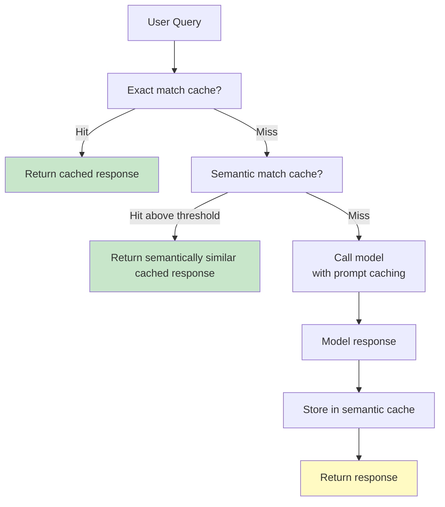

# تعمّق في الـ Caching: التخزين المؤقت للـ Prompt/Prefix والتخزين المؤقت الدلالي (Semantic)

> ذاكرتا تخزين مؤقت لمشكلتين مختلفتين. الـ prompt caching يوفّر الـ tokens. والـ semantic caching يوفّر رحلات الذهاب والإياب (round-trips). كلاهما مطلوب في الإنتاج.

**النوع:** بناء
**اللغات:** Python
**المتطلبات:** المرحلة 07 الدرسان 01، 06 (أساسيات Observability، هندسة التكلفة)
**الوقت:** ~75 دقيقة
**أهداف التعلّم:**
- تطبيق prompt caching من Anthropic مع نقاط فاصلة (breakpoints) عبر `cache_control` وفهم نموذج TTL ذي الخمس دقائق
- تطبيق semantic caching باستخدام sentence embeddings و cosine similarity
- قياس معدّلات الإصابة (hit rates) ووفورات التكلفة لكل طبقة caching على مجموعة استعلامات عيّنة
- اختيار طبقة الـ caching الصحيحة لحالة استخدام معيّنة

---

## المشكلة

منتج المساعد الذكي لديك له system prompt بطول 2,000 token. يشغّل 100,000 محادثة يوميًا. كل رسالة واحدة في كل محادثة تُرسِل تلك الـ 2,000 token إلى النموذج. هذا 200 مليون input token يوميًا فقط من أجل system prompt لا يتغيّر أبدًا.

بسعر Haiku ($0.80 لكل مليون input token)، هذا $160 يوميًا، و $4,800 شهريًا، على tokens لا تحمل أي معلومة جديدة.

وبشكل منفصل: مساعد دعم العملاء لديك يعالج أسئلة FAQ. "How do I reset my password?" يصل 800 مرة يوميًا بـ 800 صياغة مختلفة. تستدعي النموذج 800 مرة، وتدفع مقابل التوليد في كل مرة، بينما الإجابة هي نفسها دائمًا.

هاتان مشكلتان مختلفتان بحلّين مختلفين. يبني هذا الدرس كليهما.

---

## المفهوم

### طبقتا caching، مشكلتان



**الـ Prompt/prefix caching** يعمل داخل استدعاء الـ API. يخزّن Anthropic حالة الـ KV المحسوبة لبادئة الـ prompt لديك (system prompt، أو المستندات الكبيرة) كي تتخطى الاستدعاءات اللاحقة بالبادئة نفسها إعادة معالجة تلك الـ tokens. تدفع ~10% من تكلفة الـ token العادية لقراءات الـ cache.

**الـ Semantic caching** يعمل خارج الـ API. قبل استدعاء النموذج، حوّل استعلام المستخدم إلى embedding وافحص ما إذا كان استعلام مشابه دلاليًا قد أُجيب عنه مؤخرًا. إذا نعم، أرجِع الإجابة المخزَّنة. لا يُستدعى النموذج أبدًا.

```
+----------------------+----------------------------+-----------------------------------+
| Layer                | What it saves              | When to use                       |
+----------------------+----------------------------+-----------------------------------+
| Prompt/prefix cache  | Token processing cost for  | Long static context: system       |
|                      | repeated long prefixes     | prompts, docs, few-shot examples  |
+----------------------+----------------------------+-----------------------------------+
| Semantic cache       | Full model round-trip      | FAQ-style queries where many      |
|                      | (tokens + latency)         | phrasings have the same answer    |
+----------------------+----------------------------+-----------------------------------+
| Both together        | Maximum savings on         | High-volume assistants with a     |
|                      | query-heavy workloads      | fixed knowledge base              |
+----------------------+----------------------------+-----------------------------------+
```

### الـ Prompt Caching: كيف يعمل

يتيح لك prompt caching من Anthropic وسم كتل المحتوى بـ `cache_control: {type: "ephemeral"}`. الاستدعاء الأول يكتب الـ cache (يكلّف 125% من سعر الـ input token العادي). وكل الاستدعاءات اللاحقة خلال نافذة 5 دقائق التي تُرسِل البادئة نفسها تدفع فقط 10% من العادي.

قواعد إصابات الـ cache:
1. يجب أن يظهر المحتوى المخزَّن في بداية مصفوفة الرسائل (أو في الـ system prompt)
2. يجب أن يكون المحتوى مطابقًا بايتًا بايت حتى نقطة `cache_control` الفاصلة وشاملًا لها
3. الـ TTL خمس دقائق. الكتابة الجديدة تُجدّد الـ TTL.

```
First call   → cache WRITE: full tokens + 25% surcharge
Calls 2-N    → cache READ:  10% of normal token cost
After 5 min  → TTL expires, next call is a write again
```

نقطة التعادل (break-even) لـ system prompt بطول 2,000 token تقريبًا:

```
Write cost:   2000 * 1.25 = 2500 effective tokens
Read cost:    2000 * 0.10 = 200 effective tokens
Break-even:   1 write + 2 reads (1 write = 2500, 2 reads = 400; net saving starts at 3rd call)
```

### الـ Semantic Caching: كيف يعمل

```
Query → embed (sentence-transformers) → cosine similarity vs cached queries
      → if similarity > threshold (e.g. 0.92) → return cached answer
      → else → call model → embed query → store {embedding, query, answer, ts}
```

العتبة (threshold) هي المعامل الأساسي:
- عالية جدًا (0.99): تلتقط فقط الاستعلامات شبه المتطابقة، معدّل إصابة منخفض
- منخفضة جدًا (0.80): قد تُرجع إجابات خاطئة لاستعلامات متشابهة لكن غير متكافئة
- نقطة بداية جيدة: 0.90-0.93 لمحتوى على نمط FAQ

---

## البناء

### الخطوة 1: مُغلِّف الـ Prompt Cache

```python
import anthropic
from typing import Optional

client = anthropic.Anthropic()

def call_with_prompt_cache(
    user_message: str,
    system_prompt: str,
    model: str = "claude-3-5-haiku-20241022",
) -> tuple[str, dict]:
    """
    Make a Claude API call with the system prompt marked for caching.
    Returns (response_text, usage_dict).

    The system prompt is sent with cache_control so Anthropic caches
    its KV state. Repeat calls with the same system prompt pay 10%
    of normal input token cost for the system prompt portion.
    """
    response = client.messages.create(
        model=model,
        max_tokens=1024,
        system=[
            {
                "type": "text",
                "text": system_prompt,
                "cache_control": {"type": "ephemeral"},
            }
        ],
        messages=[{"role": "user", "content": user_message}],
    )

    text = response.content[0].text if response.content else ""
    usage = {
        "input_tokens": response.usage.input_tokens,
        "output_tokens": response.usage.output_tokens,
        "cache_creation_input_tokens": getattr(
            response.usage, "cache_creation_input_tokens", 0
        ),
        "cache_read_input_tokens": getattr(
            response.usage, "cache_read_input_tokens", 0
        ),
    }
    return text, usage


def cache_hit_rate(usage_records: list[dict]) -> dict:
    """Compute cache hit/miss stats from a list of usage dicts."""
    total = len(usage_records)
    hits = sum(1 for u in usage_records if u.get("cache_read_input_tokens", 0) > 0)
    writes = sum(1 for u in usage_records if u.get("cache_creation_input_tokens", 0) > 0)
    return {
        "total_calls": total,
        "cache_writes": writes,
        "cache_hits": hits,
        "cache_misses": total - hits - writes,
        "hit_rate": hits / total if total > 0 else 0.0,
    }
```

### الخطوة 2: مقارنة التكلفة للـ Prompt Caching

```python
from dataclasses import dataclass


@dataclass
class CostComparison:
    calls: int
    without_cache_usd: float
    with_cache_usd: float
    savings_usd: float
    savings_pct: float


def compare_prompt_cache_cost(
    system_prompt_tokens: int,
    calls: int,
    model: str = "claude-3-5-haiku-20241022",
    input_price_per_million: float = 0.80,
    cache_write_multiplier: float = 1.25,
    cache_read_multiplier: float = 0.10,
) -> CostComparison:
    """
    Compute cost with and without prompt caching for N calls.
    Assumes the cache stays warm across all calls (1 write, N-1 reads).
    """
    price_per_token = input_price_per_million / 1_000_000

    # Without caching: pay full price for every call
    without = calls * system_prompt_tokens * price_per_token

    # With caching: 1 write (125%), N-1 reads (10%)
    write_cost = system_prompt_tokens * cache_write_multiplier * price_per_token
    read_cost = (calls - 1) * system_prompt_tokens * cache_read_multiplier * price_per_token
    with_cache = write_cost + read_cost

    savings = without - with_cache
    return CostComparison(
        calls=calls,
        without_cache_usd=round(without, 6),
        with_cache_usd=round(with_cache, 6),
        savings_usd=round(savings, 6),
        savings_pct=round(savings / without * 100, 1) if without > 0 else 0.0,
    )
```

> **اختبار من الواقع:** يقول زميلك: "نحدّث الـ system prompt مع كل نشر، وهذا يحدث 3-4 مرات يوميًا. هل لا يزال الـ prompt caching ينفعنا؟" استعرض الحساب لـ system prompt بطول 2,000 token مع 500 استدعاء في الساعة، حيث يُبطَل الـ cache كل 6 ساعات.

### الخطوة 3: الـ Semantic Cache

```python
import hashlib
import json
import time
from dataclasses import dataclass, field
from typing import Optional
import numpy as np
from sentence_transformers import SentenceTransformer


@dataclass
class CacheEntry:
    query: str
    answer: str
    embedding: np.ndarray
    ts: float = field(default_factory=time.time)
    hit_count: int = 0


class SemanticCache:
    """
    Cache model responses by semantic similarity of the query.

    Before calling the model, embed the query and check if any cached
    query is semantically similar above the threshold. If yes, return
    the cached answer. If no, call the model and cache the result.

    threshold: cosine similarity above which a cached answer is returned.
    ttl_seconds: how long entries live. None means entries never expire.
    """

    def __init__(
        self,
        model_name: str = "all-MiniLM-L6-v2",
        threshold: float = 0.92,
        ttl_seconds: Optional[float] = None,
        max_entries: int = 1000,
    ):
        self.model = SentenceTransformer(model_name)
        self.threshold = threshold
        self.ttl = ttl_seconds
        self.max_entries = max_entries
        self._cache: list[CacheEntry] = []
        self._hits = 0
        self._misses = 0

    def _embed(self, text: str) -> np.ndarray:
        vec = self.model.encode([text], normalize_embeddings=True)
        return vec[0]

    def _is_expired(self, entry: CacheEntry) -> bool:
        if self.ttl is None:
            return False
        return (time.time() - entry.ts) > self.ttl

    def _evict_expired(self) -> None:
        self._cache = [e for e in self._cache if not self._is_expired(e)]

    def get(self, query: str) -> Optional[str]:
        """
        Return cached answer if a semantically similar query exists above threshold.
        Returns None on a miss.
        """
        self._evict_expired()
        if not self._cache:
            self._misses += 1
            return None

        query_vec = self._embed(query)
        # Batch cosine similarity: cache embeddings are pre-normalized
        cache_vecs = np.array([e.embedding for e in self._cache])
        scores = cache_vecs @ query_vec  # dot product = cosine sim (normalized)

        best_idx = int(np.argmax(scores))
        best_score = float(scores[best_idx])

        if best_score >= self.threshold:
            self._hits += 1
            self._cache[best_idx].hit_count += 1
            return self._cache[best_idx].answer

        self._misses += 1
        return None

    def put(self, query: str, answer: str) -> None:
        """Store a query-answer pair in the cache."""
        self._evict_expired()
        if len(self._cache) >= self.max_entries:
            # Evict the least-recently-hit entry
            self._cache.sort(key=lambda e: e.hit_count)
            self._cache.pop(0)

        embedding = self._embed(query)
        self._cache.append(CacheEntry(query=query, answer=answer, embedding=embedding))

    def stats(self) -> dict:
        total = self._hits + self._misses
        return {
            "entries": len(self._cache),
            "hits": self._hits,
            "misses": self._misses,
            "hit_rate": self._hits / total if total > 0 else 0.0,
            "threshold": self.threshold,
        }
```

---

## الاستخدام

مع وجود كلتا الذاكرتين، يتّبع مُغلِّف استدعاء الـ LLM لديك هذا النمط:

```python
def smart_call(
    user_query: str,
    system_prompt: str,
    semantic_cache: SemanticCache,
    model: str = "claude-3-5-haiku-20241022",
) -> tuple[str, str]:
    """
    Returns (answer, source) where source is 'semantic_cache' or 'model'.
    """
    # Layer 1: semantic cache
    cached = semantic_cache.get(user_query)
    if cached is not None:
        return cached, "semantic_cache"

    # Layer 2: call model (with prompt caching for the system prompt)
    answer, usage = call_with_prompt_cache(user_query, system_prompt, model)

    # Store in semantic cache for future similar queries
    semantic_cache.put(user_query, answer)

    return answer, "model"
```

**مقارنة معدّلات الإصابة على مجموعة بيانات FAQ:**

```python
from collections import Counter

queries = [
    "How do I reset my password?",
    "I forgot my password, how do I recover it?",
    "Can I change my login password?",
    "Password reset instructions",
    "How do I cancel my subscription?",
    "I want to cancel my account",
    "How do I unsubscribe?",
    "Where can I download my invoice?",
    "How do I get a receipt for my payment?",
    "Download invoice for last month",
]

cache = SemanticCache(threshold=0.92)
sources = []

for q in queries:
    answer = cache.get(q)
    if answer is None:
        answer = f"[Model answer for: {q}]"
        cache.put(q, answer)
        sources.append("model")
    else:
        sources.append("semantic_cache")

print(Counter(sources))
print(cache.stats())
```

> **نقلة في المنظور:** يراجع مهندس أقدم هذا ويقول: "الـ semantic caching بعتبة تشابه خطير. إذا سأل أحدهم 'How do I cancel my free trial?' وأرجع الـ cache إجابة 'How do I cancel my subscription?'، فقد تكون هاتان إجابتين مختلفتين. كيف ستبني ثقة بأن عتبتك آمنة؟"

---

## التسليم

**القطعة:** `outputs/skill-caching-strategy.md`

ينتج هذا الدرس تطبيقَي cache. `PromptCacheWrapper` (عبر `call_with_prompt_cache`) قابل للاستخدام فورًا لأي مشروع ذي system prompt طويل. و `SemanticCache` هو cache جاهز للاستخدام قبل الاستدعاء (drop-in pre-call) لتطبيقات على نمط FAQ.

تعالج الذاكرتان محرّكات تكلفة متعامدة (orthogonal). انشر الـ prompt caching أولًا (فهو إضافي بحت، بلا خطر إرجاع إجابات خاطئة). انشر الـ semantic caching فقط بعد تأسيس مجموعة اختبار مُعنونة (labeled) للتحقق من عتبتك.

---

## التقييم

**التحقق 1: كتابات الـ prompt cache تظهر في الـ usage**

بعد الاستدعاء الأول بـ system prompt موسوم بـ `cache_control`، ينبغي أن يكون `cache_creation_input_tokens` غير صفري. وبعد الاستدعاء الثاني خلال 5 دقائق، ينبغي أن يكون `cache_read_input_tokens` غير صفري.

```python
_, usage1 = call_with_prompt_cache("Hello", system_prompt)
assert usage1["cache_creation_input_tokens"] > 0, "First call should write cache"

_, usage2 = call_with_prompt_cache("What is 2+2?", system_prompt)
assert usage2["cache_read_input_tokens"] > 0, "Second call should read cache"
```

**التحقق 2: الـ semantic cache يُرجع إصابات لإعادات الصياغة (paraphrases)**

```python
cache = SemanticCache(threshold=0.92)
cache.put("How do I reset my password?", "Go to Settings > Security > Reset password.")

result = cache.get("I forgot my password, how do I get a new one?")
assert result is not None, "Paraphrase should hit cache"
```

**التحقق 3: الـ semantic cache لا يُرجع إصابات لاستعلامات غير ذات صلة**

```python
result = cache.get("How do I export my data?")
assert result is None, "Unrelated query should miss cache"
```

**التحقق 4: وفورات التكلفة قابلة للقياس**

شغّل `compare_prompt_cache_cost` لطول الـ system prompt الفعلي لديك وحجم الاستدعاءات اليومي. إذا كانت الوفورات دون $5/شهر، فوثّق الحساب وتخطَّ الـ caching (تكلفة الصيانة تتجاوز الوفورات). وإذا كانت الوفورات فوق $50/شهر، فهي استثمار من اليوم الأول.
