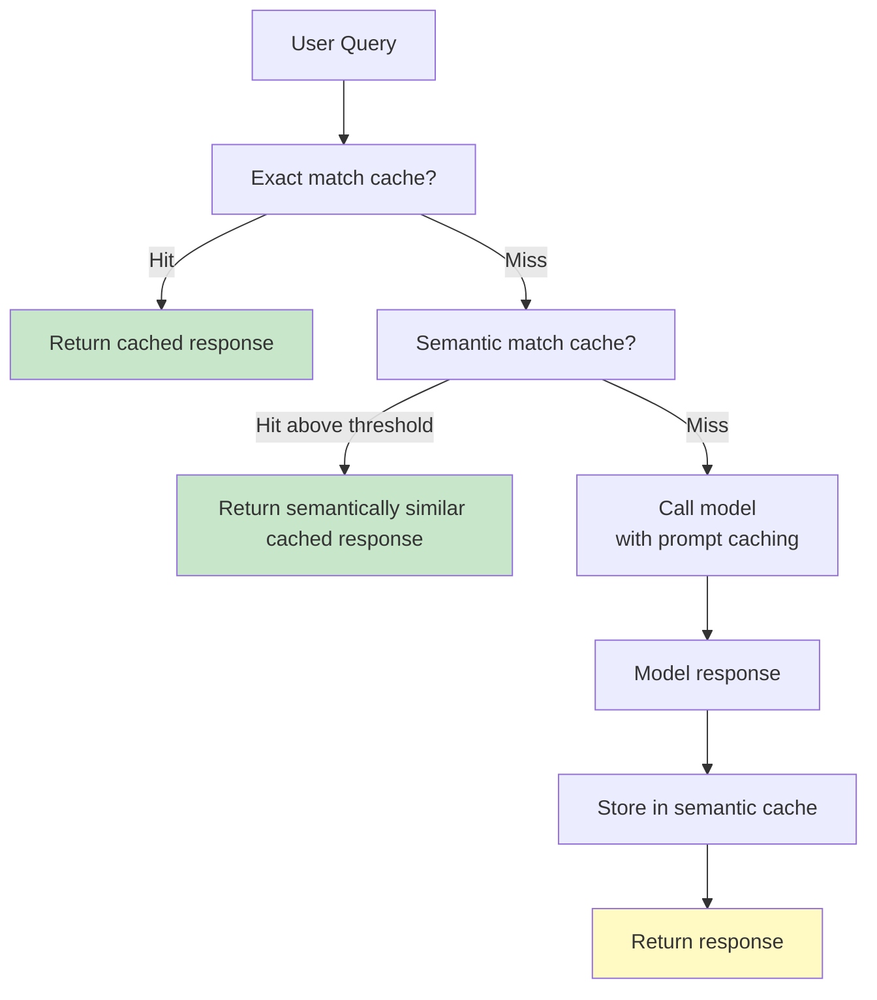

# Caching Deep-Dive: Prompt/Prefix and Semantic Caching

> Two caches for two different problems. Prompt caching saves tokens. Semantic caching saves round-trips. Both are needed in production.

**Type:** Build
**Languages:** Python
**Prerequisites:** Phase 07 Lessons 01, 06 (Observability fundamentals, cost engineering)
**Time:** ~75 min
**Learning Objectives:**
- Implement Anthropic prompt caching with `cache_control` breakpoints and understand the 5-minute TTL model
- Implement semantic caching using sentence embeddings and cosine similarity
- Measure hit rates and cost savings for each caching layer on a sample query set
- Choose the right caching layer for a given use case

---

## The Problem

Your AI assistant product has a 2,000-token system prompt. It runs 100,000 conversations per day. Every single message in every conversation sends those 2,000 tokens to the model. That is 200 million input tokens per day just for a system prompt that never changes.

At Haiku pricing ($0.80 per million input tokens), that is $160 per day, $4,800 per month, on tokens that carry zero new information.

Separately: your customer support assistant handles FAQ questions. "How do I reset my password?" comes in 800 times per day in 800 different phrasings. You call the model 800 times, paying for generation each time, when the answer is always the same.

These are two different problems with two different solutions. This lesson builds both.

---

## The Concept

### Two Caching Layers, Two Problems



**Prompt/prefix caching** operates inside the API call. Anthropic caches the computed KV state of your prompt prefix (system prompt, large documents) so subsequent calls with the same prefix skip re-processing those tokens. You pay ~10% of the normal token cost for cache reads.

**Semantic caching** operates outside the API. Before calling the model, embed the user query and check if a semantically similar query was answered recently. If yes, return the cached answer. The model is never called.

```
+----------------------+----------------------------+-----------------------------------+
| Layer                | What it saves              | When to use                       |
+----------------------+----------------------------+-----------------------------------+
| Prompt/prefix cache  | Token processing cost for  | Long static context: system       |
|                      | repeated long prefixes     | prompts, docs, few-shot examples  |
+----------------------+----------------------------+-----------------------------------+
| Semantic cache       | Full model round-trip      | FAQ-style queries where many      |
|                      | (tokens + latency)         | phrasings have the same answer    |
+----------------------+----------------------------+-----------------------------------+
| Both together        | Maximum savings on         | High-volume assistants with a     |
|                      | query-heavy workloads      | fixed knowledge base              |
+----------------------+----------------------------+-----------------------------------+
```

### Prompt Caching: How It Works

Anthropic's prompt caching lets you mark content blocks with `cache_control: {type: "ephemeral"}`. The first call writes the cache (costs 125% of normal input token price). All subsequent calls within a 5-minute window that send the same prefix pay only 10% of normal.

Rules for cache hits:
1. The cached content must appear at the start of the messages array (or in the system prompt)
2. The content must be byte-identical up to and including the `cache_control` breakpoint
3. The TTL is 5 minutes. A new write refreshes the TTL.

```
First call   → cache WRITE: full tokens + 25% surcharge
Calls 2-N    → cache READ:  10% of normal token cost
After 5 min  → TTL expires, next call is a write again
```

The break-even point for a 2,000-token system prompt is approximately:

```
Write cost:   2000 * 1.25 = 2500 effective tokens
Read cost:    2000 * 0.10 = 200 effective tokens
Break-even:   1 write + 2 reads (1 write = 2500, 2 reads = 400; net saving starts at 3rd call)
```

### Semantic Caching: How It Works

```
Query → embed (sentence-transformers) → cosine similarity vs cached queries
      → if similarity > threshold (e.g. 0.92) → return cached answer
      → else → call model → embed query → store {embedding, query, answer, ts}
```

The threshold is the key parameter:
- Too high (0.99): only catches near-identical queries, low hit rate
- Too low (0.80): may return wrong answers for queries that are similar but not equivalent
- Good starting point: 0.90-0.93 for FAQ-style content

---

## Build It

### Step 1: Prompt Cache Wrapper

```python
import anthropic
from typing import Optional

client = anthropic.Anthropic()

def call_with_prompt_cache(
    user_message: str,
    system_prompt: str,
    model: str = "claude-3-5-haiku-20241022",
) -> tuple[str, dict]:
    """
    Make a Claude API call with the system prompt marked for caching.
    Returns (response_text, usage_dict).

    The system prompt is sent with cache_control so Anthropic caches
    its KV state. Repeat calls with the same system prompt pay 10%
    of normal input token cost for the system prompt portion.
    """
    response = client.messages.create(
        model=model,
        max_tokens=1024,
        system=[
            {
                "type": "text",
                "text": system_prompt,
                "cache_control": {"type": "ephemeral"},
            }
        ],
        messages=[{"role": "user", "content": user_message}],
    )

    text = response.content[0].text if response.content else ""
    usage = {
        "input_tokens": response.usage.input_tokens,
        "output_tokens": response.usage.output_tokens,
        "cache_creation_input_tokens": getattr(
            response.usage, "cache_creation_input_tokens", 0
        ),
        "cache_read_input_tokens": getattr(
            response.usage, "cache_read_input_tokens", 0
        ),
    }
    return text, usage


def cache_hit_rate(usage_records: list[dict]) -> dict:
    """Compute cache hit/miss stats from a list of usage dicts."""
    total = len(usage_records)
    hits = sum(1 for u in usage_records if u.get("cache_read_input_tokens", 0) > 0)
    writes = sum(1 for u in usage_records if u.get("cache_creation_input_tokens", 0) > 0)
    return {
        "total_calls": total,
        "cache_writes": writes,
        "cache_hits": hits,
        "cache_misses": total - hits - writes,
        "hit_rate": hits / total if total > 0 else 0.0,
    }
```

### Step 2: Cost Comparison for Prompt Caching

```python
from dataclasses import dataclass


@dataclass
class CostComparison:
    calls: int
    without_cache_usd: float
    with_cache_usd: float
    savings_usd: float
    savings_pct: float


def compare_prompt_cache_cost(
    system_prompt_tokens: int,
    calls: int,
    model: str = "claude-3-5-haiku-20241022",
    input_price_per_million: float = 0.80,
    cache_write_multiplier: float = 1.25,
    cache_read_multiplier: float = 0.10,
) -> CostComparison:
    """
    Compute cost with and without prompt caching for N calls.
    Assumes the cache stays warm across all calls (1 write, N-1 reads).
    """
    price_per_token = input_price_per_million / 1_000_000

    # Without caching: pay full price for every call
    without = calls * system_prompt_tokens * price_per_token

    # With caching: 1 write (125%), N-1 reads (10%)
    write_cost = system_prompt_tokens * cache_write_multiplier * price_per_token
    read_cost = (calls - 1) * system_prompt_tokens * cache_read_multiplier * price_per_token
    with_cache = write_cost + read_cost

    savings = without - with_cache
    return CostComparison(
        calls=calls,
        without_cache_usd=round(without, 6),
        with_cache_usd=round(with_cache, 6),
        savings_usd=round(savings, 6),
        savings_pct=round(savings / without * 100, 1) if without > 0 else 0.0,
    )
```

> **Real-world check:** Your teammate says: "We update our system prompt every deploy, which happens 3-4 times per day. Does prompt caching still help us?" Walk through the math for a 2,000-token system prompt with 500 calls per hour, where the cache is invalidated every 6 hours.

### Step 3: Semantic Cache

```python
import hashlib
import json
import time
from dataclasses import dataclass, field
from typing import Optional
import numpy as np
from sentence_transformers import SentenceTransformer


@dataclass
class CacheEntry:
    query: str
    answer: str
    embedding: np.ndarray
    ts: float = field(default_factory=time.time)
    hit_count: int = 0


class SemanticCache:
    """
    Cache model responses by semantic similarity of the query.

    Before calling the model, embed the query and check if any cached
    query is semantically similar above the threshold. If yes, return
    the cached answer. If no, call the model and cache the result.

    threshold: cosine similarity above which a cached answer is returned.
    ttl_seconds: how long entries live. None means entries never expire.
    """

    def __init__(
        self,
        model_name: str = "all-MiniLM-L6-v2",
        threshold: float = 0.92,
        ttl_seconds: Optional[float] = None,
        max_entries: int = 1000,
    ):
        self.model = SentenceTransformer(model_name)
        self.threshold = threshold
        self.ttl = ttl_seconds
        self.max_entries = max_entries
        self._cache: list[CacheEntry] = []
        self._hits = 0
        self._misses = 0

    def _embed(self, text: str) -> np.ndarray:
        vec = self.model.encode([text], normalize_embeddings=True)
        return vec[0]

    def _is_expired(self, entry: CacheEntry) -> bool:
        if self.ttl is None:
            return False
        return (time.time() - entry.ts) > self.ttl

    def _evict_expired(self) -> None:
        self._cache = [e for e in self._cache if not self._is_expired(e)]

    def get(self, query: str) -> Optional[str]:
        """
        Return cached answer if a semantically similar query exists above threshold.
        Returns None on a miss.
        """
        self._evict_expired()
        if not self._cache:
            self._misses += 1
            return None

        query_vec = self._embed(query)
        # Batch cosine similarity: cache embeddings are pre-normalized
        cache_vecs = np.array([e.embedding for e in self._cache])
        scores = cache_vecs @ query_vec  # dot product = cosine sim (normalized)

        best_idx = int(np.argmax(scores))
        best_score = float(scores[best_idx])

        if best_score >= self.threshold:
            self._hits += 1
            self._cache[best_idx].hit_count += 1
            return self._cache[best_idx].answer

        self._misses += 1
        return None

    def put(self, query: str, answer: str) -> None:
        """Store a query-answer pair in the cache."""
        self._evict_expired()
        if len(self._cache) >= self.max_entries:
            # Evict the least-recently-hit entry
            self._cache.sort(key=lambda e: e.hit_count)
            self._cache.pop(0)

        embedding = self._embed(query)
        self._cache.append(CacheEntry(query=query, answer=answer, embedding=embedding))

    def stats(self) -> dict:
        total = self._hits + self._misses
        return {
            "entries": len(self._cache),
            "hits": self._hits,
            "misses": self._misses,
            "hit_rate": self._hits / total if total > 0 else 0.0,
            "threshold": self.threshold,
        }
```

---

## Use It

With both caches in place, your LLM call wrapper follows this pattern:

```python
def smart_call(
    user_query: str,
    system_prompt: str,
    semantic_cache: SemanticCache,
    model: str = "claude-3-5-haiku-20241022",
) -> tuple[str, str]:
    """
    Returns (answer, source) where source is 'semantic_cache' or 'model'.
    """
    # Layer 1: semantic cache
    cached = semantic_cache.get(user_query)
    if cached is not None:
        return cached, "semantic_cache"

    # Layer 2: call model (with prompt caching for the system prompt)
    answer, usage = call_with_prompt_cache(user_query, system_prompt, model)

    # Store in semantic cache for future similar queries
    semantic_cache.put(user_query, answer)

    return answer, "model"
```

**Comparing hit rates on a FAQ dataset:**

```python
from collections import Counter

queries = [
    "How do I reset my password?",
    "I forgot my password, how do I recover it?",
    "Can I change my login password?",
    "Password reset instructions",
    "How do I cancel my subscription?",
    "I want to cancel my account",
    "How do I unsubscribe?",
    "Where can I download my invoice?",
    "How do I get a receipt for my payment?",
    "Download invoice for last month",
]

cache = SemanticCache(threshold=0.92)
sources = []

for q in queries:
    answer = cache.get(q)
    if answer is None:
        answer = f"[Model answer for: {q}]"
        cache.put(q, answer)
        sources.append("model")
    else:
        sources.append("semantic_cache")

print(Counter(sources))
print(cache.stats())
```

> **Perspective shift:** A senior engineer reviews this and says: "Semantic caching with a similarity threshold is dangerous. If someone asks 'How do I cancel my free trial?' and the cache returns the answer to 'How do I cancel my subscription?', those might be different answers. How would you build confidence that your threshold is safe?"

---

## Ship It

**Artifact:** `outputs/skill-caching-strategy.md`

This lesson produces two cache implementations. `PromptCacheWrapper` (via `call_with_prompt_cache`) is usable immediately for any project with a long system prompt. `SemanticCache` is a drop-in pre-call cache for FAQ-style applications.

The two caches address orthogonal cost drivers. Deploy prompt caching first (it is purely additive, no risk of returning wrong answers). Deploy semantic caching only after establishing a labeled test set to validate your threshold.

---

## Evaluate It

**Verification 1: Prompt cache writes appear in usage**

After the first call with a system prompt marked `cache_control`, `cache_creation_input_tokens` should be non-zero. After the second call within 5 minutes, `cache_read_input_tokens` should be non-zero.

```python
_, usage1 = call_with_prompt_cache("Hello", system_prompt)
assert usage1["cache_creation_input_tokens"] > 0, "First call should write cache"

_, usage2 = call_with_prompt_cache("What is 2+2?", system_prompt)
assert usage2["cache_read_input_tokens"] > 0, "Second call should read cache"
```

**Verification 2: Semantic cache returns hits for paraphrases**

```python
cache = SemanticCache(threshold=0.92)
cache.put("How do I reset my password?", "Go to Settings > Security > Reset password.")

result = cache.get("I forgot my password, how do I get a new one?")
assert result is not None, "Paraphrase should hit cache"
```

**Verification 3: Semantic cache does not return hits for unrelated queries**

```python
result = cache.get("How do I export my data?")
assert result is None, "Unrelated query should miss cache"
```

**Verification 4: Cost savings are measurable**

Run `compare_prompt_cache_cost` for your actual system prompt length and daily call volume. If savings are under $5/month, document the calculation and skip caching (the maintenance cost exceeds the savings). If savings are over $50/month, it is a day-one investment.
