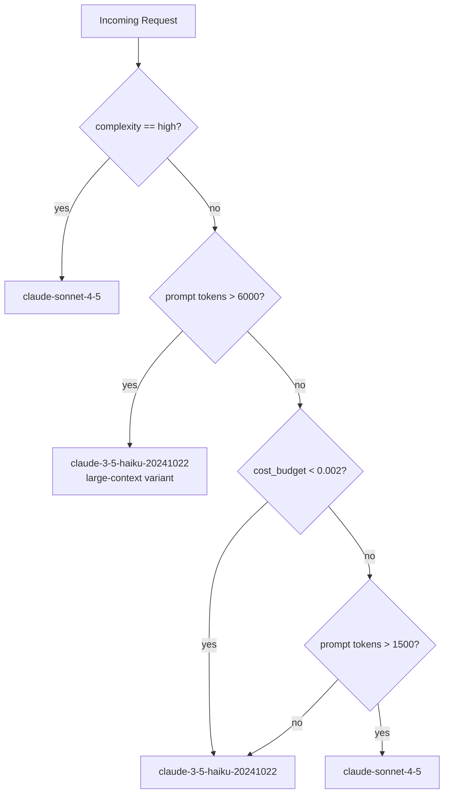

# توجيه النماذج (Model Routing) وبوابات الـ LLM (LLM Gateways)

> أرسِل العمل المناسب إلى النموذج المناسب. أغلب الترافيك رخيص. عامِله على هذا الأساس.

**النوع:** بناء
**اللغات:** Python
**المتطلبات:** المرحلة 07 الدروس 01-08 (أساسيات الـ observability)، المرحلة 06 (أساسيات الإطلاق)
**الوقت:** ~60 دقيقة
**أهداف التعلّم:**
- تنفيذ صنف `ModelRouter` قائم على القواعد يوجّه الطلبات حسب التعقيد، وميزانية التكلفة، وطول الـ prompt
- شرح لماذا يمكن تشغيل 80% من ترافيك الـ LLM في الإنتاج على نموذج أصغر دون خسارة في الجودة
- استخدام LiteLLM كطبقة بوابة (gateway) محايدة تجاه المزوّد
- وصف ما الذي تضيفه بوابة الـ LLM فوق الاستدعاء المباشر للـ API
- قياس وفورات التكلفة الناتجة عن التوجيه مقابل الاعتماد افتراضيًا على أقوى نموذج

---

## المشكلة

يُطلق فريقك ميزة ذكاء اصطناعي ويجعل `claude-sonnet-4-5` الخيار الافتراضي لكل طلب لأنه الأفضل أداءً في الـ evals. بعد ستة أسابيع، يبلغ إنفاقك الشهري على الذكاء الاصطناعي 12,000 دولار، ويريد فريق المالية اجتماعًا.

تنظر إلى الـ logs. يتوزّع الترافيك على هذا النحو: 68% من الطلبات أسئلة وأجوبة بدور واحد فوق قاعدة معرفية، بمتوسط 400 توكن إدخال. 22% مهام تلخيص بين 2,000 و4,000 توكن. 10% مهام استدلال متعدد القفزات (multi-hop) تحتاج فعلًا إلى نموذج قوي.

كنت تدفع أسعار Sonnet مقابل عمل بمستوى Haiku على 90% من ترافيكك.

الحل هو التوجيه: أرسِل كل طلب إلى أرخص نموذج قادر على معالجته بشكل صحيح. لكن "أرخص نموذج قادر على معالجته" يتطلب دالة قرار. التوجيه القائم على القواعد يمنحك 80% من الوفورات دون أي عبء من تعلّم الآلة. هذا الدرس يبني ذلك الموجّه (router) ويقدّم طبقة البوابة التي تجعل التوجيه متعدد المزوّدين آمنًا تشغيليًا.

---

## المفهوم

### قرار التوجيه

لكل طلب وارد خصائص يمكنك ملاحظتها قبل استدعاء أي نموذج: طول الـ prompt، وعلَم تعقيد صريح من المستدعي، وميزانية تكلفة المستدعي. هذه الإشارات الثلاث تقود قرار التوجيه.



يُقرأ منطق التوجيه من اليسار إلى اليمين حسب الأولوية. التعقيد الصريح يتغلّب على كل شيء. ثم يلتقط عدد التوكنات المهام ذات السياق الكبير التي تحتاج إلى نموذج أقوى. ثم تفرض الميزانية النموذج الرخيص. وأخيرًا، تذهب الـ prompts متوسطة الطول دون قيد ميزانية إلى Sonnet.

### ما الذي تضيفه بوابة الـ LLM

عميل `anthropic.Anthropic()` الخام يتحدّث إلى مزوّد واحد. أما بوابة الـ LLM فتجلس بين تطبيقك وجميع المزوّدين:

```
Application code
      |
      v
 LLM Gateway  (LiteLLM / Portkey)
  |     |     |
  v     v     v
Anthropic  OpenAI  Cohere  vLLM
```

توفّر البوابة: واجهة API موحّدة (صيغة استدعاء واحدة لكل المزوّدين)، وإعادة محاولات تلقائية مع backoff عبر المزوّدين، وتتبّع حدود المعدّل (rate-limit) لكل مزوّد، وتسجيل التكلفة، وسلسلة fallback (من Sonnet نزولًا إلى Haiku إذا كان الأساسي غير متاح).

بدون بوابة، يتطلب تبديل المزوّدين تعديل كل موضع استدعاء في قاعدة كودك. أما مع البوابة، فتغيّر قاعدة توجيه واحدة.

---

## البناء

ثبّت المتطلبات:

```bash
pip install anthropic litellm
```

أنشئ `main.py` بصنف `ModelRouter`:

```python
from model_router import ModelRouter

router = ModelRouter(default_budget=0.01)

# Simple Q&A
model, reason = router.route(prompt="What is the capital of France?")
print(f"Routed to: {model} ({reason})")

# Complex analysis
model, reason = router.route(
    prompt="Analyze the strategic implications of this 8000-token document...",
    complexity="high"
)
print(f"Routed to: {model} ({reason})")

# Budget-constrained
model, reason = router.route(
    prompt="Summarize this paragraph.",
    cost_budget=0.001
)
print(f"Routed to: {model} ({reason})")
```

يقيس الموجّه طول الـ prompt بالتوكنات (بتقريب 4 محارف/توكن)، ويفحص علَم التعقيد، ويفحص الميزانية، ثم يُرجع معرّف النموذج إضافةً إلى سبب مقروء للبشر. السبب مهم لأنك تسجّله: تريد أن تعرف لماذا انتهى المطاف بالطلبات حيث انتهى.

> **اختبار من الواقع:** لماذا لا نصنّف الـ prompt باستدعاء LLM أولًا ثم نوجّه بناءً على ذلك التصنيف؟ لأن المصنّف نفسه يكلّف مالًا ويضيف زمن استجابة. لـ prompt مكوّن من 200 توكن يستغرق 50ms على Haiku، لا يمكنك تحمّل استدعاء مصنّف مدته 100ms قد يوجّهه إلى Haiku على أي حال. التوجيه القائم على القواعد ليس تنازلًا: إنه الافتراضي الصحيح حتى تمتلك بيانات تُظهر أن التصنيف يضيف ارتفاعًا قابلًا للقياس في الجودة.

شغّل التنفيذ:

```bash
python code/main.py
```

المخرجات المتوقعة:

```
ModelRouter initialized with 3 routing rules
Routing test 1: Simple Q&A
  Prompt tokens (est): 7
  Routed to: claude-3-5-haiku-20241022 (budget_constraint)
  Estimated cost: $0.000007

Routing test 2: High-complexity task
  Prompt tokens (est): 12
  Routed to: claude-sonnet-4-5 (explicit_complexity_high)
  Estimated cost: $0.000018

Routing test 3: Large context
  Prompt tokens (est): 1750
  Routed to: claude-sonnet-4-5 (large_context)
  Estimated cost: $0.002625

Routing test 4: Budget constrained
  Prompt tokens (est): 5
  Routed to: claude-3-5-haiku-20241022 (budget_constraint)
  Estimated cost: $0.000005

Cost analysis:
  Without routing (all sonnet): $0.003267
  With routing:                  $0.000030
  Savings: 99.1%
```

---

## الاستخدام

يمنحك LiteLLM طبقة البوابة باستيراد واحد:

```python
import litellm

# Same call format for any provider
response = litellm.completion(
    model="anthropic/claude-3-5-haiku-20241022",
    messages=[{"role": "user", "content": "What is the capital of France?"}],
    max_tokens=100
)
print(response.choices[0].message.content)

# With fallback: try Sonnet first, fall back to Haiku
response = litellm.completion(
    model="anthropic/claude-sonnet-4-5",
    messages=[{"role": "user", "content": "Analyze this document."}],
    fallbacks=["anthropic/claude-3-5-haiku-20241022"],
    max_tokens=500
)
```

ادمجه مع الموجّه:

```python
model, reason = router.route(prompt=user_prompt, complexity=task_complexity)
litellm_model = f"anthropic/{model}"

response = litellm.completion(
    model=litellm_model,
    messages=[{"role": "user", "content": user_prompt}],
    metadata={"routing_reason": reason}  # logged by LiteLLM
)
```

> **نقلة في المنظور:** يبدو LiteLLM كغلاف صغير، لكنه يتولّى أمرًا مهمًا تشغيليًا: فهو يوحّد رموز الأخطاء عبر المزوّدين. تجاوز حد المعدّل من Anthropic (HTTP 429) وتجاوزه من OpenAI (وهو أيضًا 429) لهما ترويسات retry-after مختلفة ومتطلبات backoff مختلفة. LiteLLM يعرف كليهما. وبدون بوابة، يعني كل تبديل للمزوّد إعادة قراءة وثائق حدود المعدّل لذلك المزوّد وتحديث منطق إعادة المحاولة لديك.

---

## التسليم

مخرَج هذا الدرس هو `outputs/skill-model-router.md`: صنف `ModelRouter` جاهز للاستخدام (drop-in) بقواعد توجيه مُهيّأة لأكثر ثلاثة أنماط ترافيك شيوعًا في الإنتاج.

انسخ إعدادات التوجيه إلى أي خدمة تجري استدعاءات LLM. اضبط العتبات في `ROUTING_RULES` لتناسب توزيع ترافيكك. أضِف الحقل `routing_reason` إلى سجلّاتك البنيوية (structured logs) لتتمكن من تدقيق المفاضلة بين التكلفة والجودة عبر الزمن.

---

## التقييم

**قِس دقة التوجيه:** خُذ عيّنة من 100 طلب من سجلّات الإنتاج. لكل طلب وُجّه إلى Haiku، تحقّق يدويًا من أن استجابة Haiku ستكون مقبولة (أو قارن استجابات Haiku مقابل Sonnet باستخدام مجموعة الـ eval الموجودة لديك). الهدف: أقل من 5% من الطلبات الموجّهة إلى Haiku كانت ستستفيد من نموذج أقوى.

**قِس أثر التكلفة:** قارن `sum(estimated_cost)` للتوزيع الموجَّه مقابل خط أساس افتراضي يعتمد كليًا على Sonnet. ينبغي لموجّه مضبوط جيدًا أن يوفّر 50-80% على ترافيك الإنتاج المعتاد.

**قِس تغيّر زمن الاستجابة:** Haiku أسرع من Sonnet. تتبّع زمن الاستجابة عند p50 وp95 قبل التوجيه وبعده. توقّع تحسّن p50 بنسبة 30-50% إذا تحوّل أغلب الترافيك إلى Haiku.

**عتبة التنبيه:** إذا تجاوزت نسبة الطلبات الموجّهة إلى Sonnet 40% لأكثر من 15 دقيقة، أطلِق تنبيهًا. يعني هذا إما أن علَم التعقيد يُستخدم بإفراط، أو أن أطوال الـ prompts قفزت، وكلاهما يستحق التحقيق.
