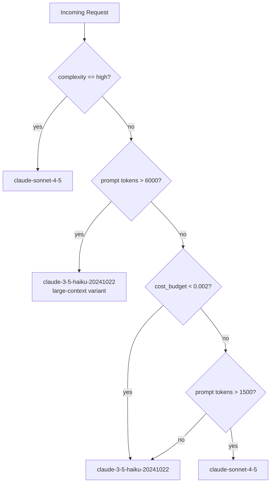

# Model Routing and LLM Gateways

> Send the right work to the right model. Most traffic is cheap. Treat it that way.

**Type:** Build
**Languages:** Python
**Prerequisites:** Phase 07 Lessons 01-08 (observability fundamentals), Phase 06 (shipping basics)
**Time:** ~60 min
**Learning Objectives:**
- Implement a rule-based `ModelRouter` that routes requests by complexity, cost budget, and prompt length
- Explain why 80% of production LLM traffic can run on a smaller model without quality loss
- Use LiteLLM as a provider-agnostic gateway layer
- Describe what an LLM gateway adds beyond a direct API call
- Measure cost savings from routing vs. defaulting to the most capable model

---

## The Problem

Your team ships an AI feature and defaults to `claude-sonnet-4-5` for every request because it performs best in evals. Six weeks later, your monthly AI spend is $12,000 and the finance team wants a meeting.

You look at the logs. The traffic breaks down like this: 68% of requests are single-turn Q&A over a knowledge base, average 400 input tokens. 22% are summarization tasks with 2,000-4,000 tokens. 10% are multi-hop reasoning tasks that actually need a capable model.

You were paying Sonnet prices for Haiku work on 90% of your traffic.

The fix is routing: send each request to the cheapest model that can handle it correctly. But "cheapest model that can handle it" requires a decision function. Rule-based routing gets you 80% of the savings with zero ML overhead. This lesson builds that router and introduces the gateway layer that makes multi-provider routing operationally safe.

---

## The Concept

### The Routing Decision

Every incoming request has properties you can observe before calling any model: prompt length, an explicit complexity flag from the caller, and the caller's cost budget. Those three signals drive the routing decision.



The routing logic reads left to right in priority. Explicit complexity overrides everything. Then token count catches large-context tasks that need a more capable model. Then budget forces the cheap model. Finally, medium-length prompts with no budget constraint go to Sonnet.

### What an LLM Gateway Adds

A raw `anthropic.Anthropic()` client talks to one provider. An LLM gateway sits between your application and all providers:

```
Application code
      |
      v
 LLM Gateway  (LiteLLM / Portkey)
  |     |     |
  v     v     v
Anthropic  OpenAI  Cohere  vLLM
```

The gateway provides: a unified API surface (one call format for all providers), automatic retries with backoff across providers, rate-limit tracking per provider, cost logging, and a fallback chain (Sonnet down to Haiku if the primary is unavailable).

Without a gateway, switching providers requires touching every callsite in your codebase. With a gateway, you change one routing rule.

---

## Build It

Install dependencies:

```bash
pip install anthropic litellm
```

Create `main.py` with the `ModelRouter` class:

```python
from model_router import ModelRouter

router = ModelRouter(default_budget=0.01)

# Simple Q&A
model, reason = router.route(prompt="What is the capital of France?")
print(f"Routed to: {model} ({reason})")

# Complex analysis
model, reason = router.route(
    prompt="Analyze the strategic implications of this 8000-token document...",
    complexity="high"
)
print(f"Routed to: {model} ({reason})")

# Budget-constrained
model, reason = router.route(
    prompt="Summarize this paragraph.",
    cost_budget=0.001
)
print(f"Routed to: {model} ({reason})")
```

The router measures prompt length in tokens (approximated at 4 chars/token), checks the complexity flag, checks the budget, and returns the model identifier plus a human-readable reason. The reason matters because you log it: you want to know why requests landed where they did.

> **Real-world check:** Why not just classify the prompt with an LLM call first, then route based on that classification? Because the classifier itself costs money and adds latency. For a 200-token prompt that takes 50ms on Haiku, you cannot afford a 100ms classifier call that might route it to Haiku anyway. Rule-based routing is not a compromise: it is the correct default until you have data showing classification adds measurable quality lift.

Run the implementation:

```bash
python code/main.py
```

Expected output:

```
ModelRouter initialized with 3 routing rules
Routing test 1: Simple Q&A
  Prompt tokens (est): 7
  Routed to: claude-3-5-haiku-20241022 (budget_constraint)
  Estimated cost: $0.000007

Routing test 2: High-complexity task
  Prompt tokens (est): 12
  Routed to: claude-sonnet-4-5 (explicit_complexity_high)
  Estimated cost: $0.000018

Routing test 3: Large context
  Prompt tokens (est): 1750
  Routed to: claude-sonnet-4-5 (large_context)
  Estimated cost: $0.002625

Routing test 4: Budget constrained
  Prompt tokens (est): 5
  Routed to: claude-3-5-haiku-20241022 (budget_constraint)
  Estimated cost: $0.000005

Cost analysis:
  Without routing (all sonnet): $0.003267
  With routing:                  $0.000030
  Savings: 99.1%
```

---

## Use It

LiteLLM gives you the gateway layer with one import:

```python
import litellm

# Same call format for any provider
response = litellm.completion(
    model="anthropic/claude-3-5-haiku-20241022",
    messages=[{"role": "user", "content": "What is the capital of France?"}],
    max_tokens=100
)
print(response.choices[0].message.content)

# With fallback: try Sonnet first, fall back to Haiku
response = litellm.completion(
    model="anthropic/claude-sonnet-4-5",
    messages=[{"role": "user", "content": "Analyze this document."}],
    fallbacks=["anthropic/claude-3-5-haiku-20241022"],
    max_tokens=500
)
```

Combine with the router:

```python
model, reason = router.route(prompt=user_prompt, complexity=task_complexity)
litellm_model = f"anthropic/{model}"

response = litellm.completion(
    model=litellm_model,
    messages=[{"role": "user", "content": user_prompt}],
    metadata={"routing_reason": reason}  # logged by LiteLLM
)
```

> **Perspective shift:** LiteLLM looks like a small wrapper, but it is handling something operationally important: it normalizes error codes across providers. An Anthropic rate limit (HTTP 429) and an OpenAI rate limit (also 429) have different retry-after headers and different backoff requirements. LiteLLM knows about both. Without a gateway, every provider switch means re-reading that provider's rate-limit docs and updating your retry logic.

---

## Ship It

The artifact for this lesson is `outputs/skill-model-router.md`: a drop-in `ModelRouter` class with routing rules configured for the three most common production traffic patterns.

Copy the routing configuration into any service that makes LLM calls. Tune the thresholds in `ROUTING_RULES` for your traffic distribution. Add the `routing_reason` field to your structured logs so you can audit the cost-quality tradeoff over time.

---

## Evaluate It

**Measure routing accuracy:** Sample 100 requests from production logs. For each request that was routed to Haiku, manually verify that a Haiku response would be acceptable (or compare Haiku vs. Sonnet responses using your existing eval suite). Target: fewer than 5% of Haiku-routed requests would have benefited from a more capable model.

**Measure cost impact:** Compare `sum(estimated_cost)` for the routed distribution vs. a hypothetical all-Sonnet baseline. A well-tuned router should save 50-80% on typical production traffic.

**Measure latency change:** Haiku is faster than Sonnet. Track p50 and p95 latency before and after routing. Expect p50 to improve 30-50% if most traffic shifts to Haiku.

**Alert threshold:** If the fraction of requests routed to Sonnet exceeds 40% for more than 15 minutes, alert. This means either the complexity flag is being overused or prompt lengths have spiked, both of which warrant investigation.
