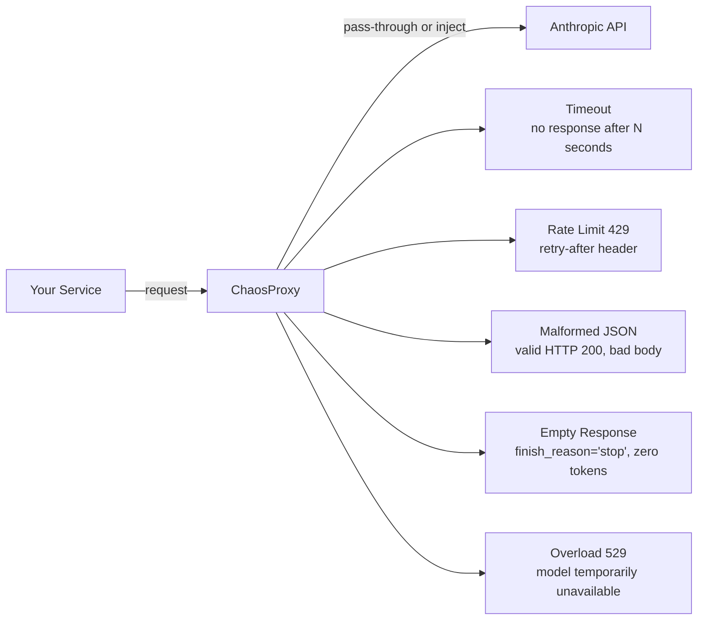
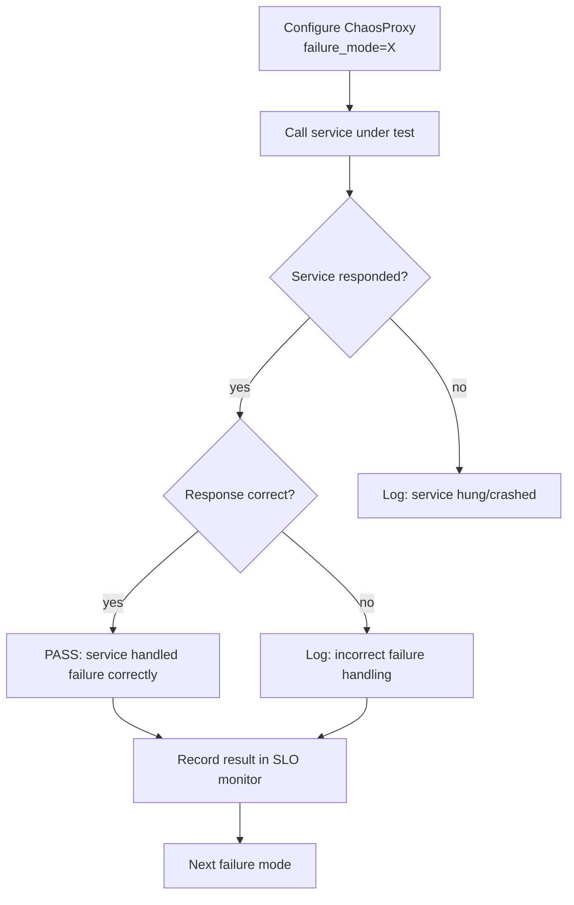

# الفوضى وحقن الأعطال (Chaos and Failure Injection)

> إن لم تختبر الـ fallback لديك، فهو لا يعمل. الـ circuit breaker الذي لا يُفعَّل إلا في الإنتاج هو عبء.

**النوع:** بناء
**اللغات:** Python
**المتطلبات:** المرحلة 07 الدروس 01-11 (الـ observability، والـ SLOs)، المرحلة 06 (الإطلاق)
**الوقت:** ~45 دقيقة
**أهداف التعلّم:**
- تسمية أنماط الفشل الخمسة الخاصة بواجهات الـ LLM البرمجية ووصف ما يكسره كل نمط
- تنفيذ `ChaosProxy` يحقن أيًّا من الأعطال الخمسة عند الطلب
- كتابة مجموعة اختبارات تُمرّن كل سيناريو فشل وتتحقّق من التعافي الصحيح
- التمييز بين الأعطال التي ينبغي للخدمة معالجتها بصمت وتلك التي ينبغي إظهارها للمستخدم
- ربط نتائج الـ chaos بمراقبة الـ SLO من الدرس 11

---

## المشكلة

لديك circuit breaker في خدمة الـ LLM. مُهيّأ ليُفتح بعد 5 أخطاء متتالية ويعود إلى استجابة مخزّنة (cached). أنت واثق من أنه يعمل. قد قرأت الكود.

لكنك لم تشغّله قط.

في الساعة الثانية صباحًا، تواجه واجهة Anthropic البرمجية انقطاعًا جزئيًا. تبدأ الطلبات بإرجاع 529 (الخدمة محمّلة فوق طاقتها). من المفترض أن يُفتح الـ circuit breaker لديك ويقدّم استجابات مخزّنة. لكن بدلًا من ذلك، تطلق خدمتك استثناءً غير مُعالَج عند أول 529. الـ circuit breaker لا يُفعَّل قط لأنه يعالج HTTP 5xx فقط كخطأ، لا 529 تحديدًا. يرى جميع المستخدمين خطأ 500 لمدة 40 دقيقة.

هذه هي فجوة الاختبار التي تملؤها هندسة الفوضى (chaos engineering). كود الـ fallback الذي لا يُنفَّذ قط في اختبار هو كود غير مُختبَر. أعطال الإنتاج هي أسوأ توقيت ممكن لاكتشاف أن معالِج الاستثناء لديك كُتب لـ HTTP 500 لا لـ HTTP 529.

لواجهات الـ LLM البرمجية مجموعة محددة من أنماط الفشل تختلف عن واجهات REST المعيارية. هذا الدرس يبني وكيلًا (proxy) يحقن كل نمط ويتحقّق من أن خدمتك تعالجه بشكل صحيح قبل أن يحدث الفشل في الإنتاج.

---

## المفهوم

### أنماط الفشل الخمسة الخاصة بالـ LLM



| الفشل | حالة HTTP | ما يُكسَر | السلوك الصحيح |
|---------|-------------|-------------|-----------------|
| Timeout | (انتهاء مهلة الاتصال) | يتعلّق إلى ما لا نهاية | أطلِق بعد timeout_seconds؛ أعِد المحاولة مرة |
| Rate limit | 429 | يقصف الـ API عند إعادة المحاولة | Backoff باستخدام ترويسة retry-after؛ بحد أقصى 3 محاولات |
| Malformed JSON | 200 | محلّل الـ JSON يطلق خطأً | التقط خطأ التحليل؛ أرجِع استجابة خطأ للمستخدم |
| Empty response | 200 | المرحلة اللاحقة تتوقّع محتوى | تحقّق من output_tokens > 0؛ أعِد المحاولة مرة |
| Overload | 529 | غالبًا غير مُعالَج | عامِله كمؤقّت؛ exponential backoff؛ افتح الدائرة بعد 5 متتالية |

### حلقة اختبار الفوضى (Chaos Test Loop)



---

## البناء

ثبّت المتطلبات:

```bash
pip install anthropic
```

يغلّف `ChaosProxy` عميل Anthropic ويعترض الاستدعاءات لحقن الأعطال:

```python
from chaos_proxy import ChaosProxy, FailureMode, LLMServiceUnderTest

# Test rate limit handling
proxy = ChaosProxy(failure_mode=FailureMode.RATE_LIMIT, failure_rate=1.0)
service = LLMServiceUnderTest(llm_client=proxy)

result = service.answer_question("What is 2+2?")
print(f"Status: {result.status}")         # should be "error" or "fallback"
print(f"Message: {result.message}")       # should NOT be an unhandled exception
print(f"Retry count: {result.retry_count}")  # should be > 0
```

شغّل مجموعة اختبارات الفوضى الكاملة:

```bash
python code/main.py
```

المخرجات المتوقعة:

```
Running chaos test suite...

[PASS] timeout: Service returned fallback response after 2 retries. Duration: 3.2s
[PASS] rate_limit: Service backed off and retried after 429. Retry-after respected. Retries: 2
[PASS] malformed_json: Service caught parse error and returned structured error to caller.
[PASS] empty_response: Service detected zero output tokens and retried once. Second attempt OK.
[PASS] overload_529: Service applied exponential backoff. Circuit opened after 5 consecutive failures.

Results: 5/5 passed
```

إذا لم تعالج خدمتك الأنماط الخمسة جميعًا، تُظهر المخرجات ما فشل:

```
[FAIL] timeout: Service hung for 32 seconds with no response. Expected: response within 5s.
```

> **اختبار من الواقع:** ما الفرق بين الاختبار في وضع الفوضى مقابل الـ mocking؟ الـ mock يستبدل الكائن الحقيقي بكائن وهمي يُرجع قيمًا محددة مسبقًا. أما وكيل الفوضى (chaos proxy) فيغلّف الكائن الحقيقي ويعترض الاستدعاءات، ما يعني أنك تختبر إعدادات العميل الحقيقي، ومنطق إعادة المحاولة الحقيقي، ومسار معالجة الاستثناءات الحقيقي. اختبار mock لحد المعدّل قد ينجح حتى لو كان معالِج إعادة المحاولة الفعلي لديك به خطأ، لأن الـ mock يتجاوز مسار الكود الذي يستدعي `time.sleep(retry_after)`. أما وكيل الفوضى فلا يتجاوزه.

شغّل مقابل خدمة حقيقية بعميل Anthropic:

```bash
ANTHROPIC_API_KEY=your_key python code/main.py --real-client
```

---

## الاستخدام

ادمج مجموعة اختبارات الفوضى في خط أنابيب الـ CI لديك:

```python
import pytest
from chaos_proxy import ChaosProxy, FailureMode

@pytest.mark.parametrize("mode", list(FailureMode))
def test_llm_service_handles_failure(mode, llm_service):
    proxy = ChaosProxy(failure_mode=mode, failure_rate=1.0)
    llm_service.client = proxy

    result = llm_service.answer_question("Test prompt")

    # Service must never raise an unhandled exception
    assert result is not None
    # Service must return a structured response, not a raw exception
    assert result.status in ("ok", "error", "fallback")
    # Service must not hang: result must return within the timeout
    # (enforced by the pytest timeout decorator in your suite)
```

> **نقلة في المنظور:** أغلب أطر هندسة الفوضى (Chaos Monkey، Gremlin) مبنية للبنية التحتية: أوقِف خادمًا، اقطع شبكة. فوضى الـ LLM مختلفة لأن الأعطال على مستوى بروتوكول التطبيق، لا على مستوى البنية التحتية. لا يمكنك "إيقاف" استجابة API؛ بل تحقن استجابات مشوّهة محددة داخل عملية قيد التشغيل. هذا يعني أن اختبار الفوضى لديك يعيش في مجموعة اختبارات تطبيقك، لا في أدوات بنيتك التحتية. تولَّ أمره هناك.

---

## التسليم

مخرَج هذا الدرس هو `outputs/skill-chaos-test-suite.md`: قالب مجموعة اختبارات فوضى بكل أنماط الفشل الخمسة وأنماط التحقق (assertion patterns) لكل منها. انسخه إلى دليل اختبارات خدمتك واملأ منطق التحقق الخاص بخدمتك.

---

## التقييم

**بوابة التغطية:** اشترط نجاح أنماط الفشل الخمسة جميعًا في الـ CI قبل أي نشر. فشل نمط واحد فقط هو حاجز أمام النشر.

**اكتشاف أنماط الفشل:** كل حادث إنتاج يتضمّن خطأ في واجهة الـ LLM البرمجية يصبح اختبار فوضى جديدًا. بعد الحادث، أضِف نمط `ChaosProxy` يعيد إنتاج الفشل بالضبط وأضِفه إلى المجموعة. خلال 6 أشهر، ستغطي مجموعتك أنماط فشل لم تتوقّعها بعد.

**أثر الأعطال على الـ SLO:** لكل نمط فشل، قِس أثره على الـ SLI: كم دقيقة من ميزانية الأخطاء سيستهلك هذا العطل لو عمل بمعدّل 1% لمدة ساعة واحدة؟ استخدم هذا لتحديد أولوية أنماط الفشل التي تحتاج إلى مسارات تعافٍ أسرع. الـ timeout الذي يحرق 30 دقيقة من ميزانية الأخطاء في ساعة واحدة أهم في التحسين من خطأ malformed JSON يحرق دقيقتين.
