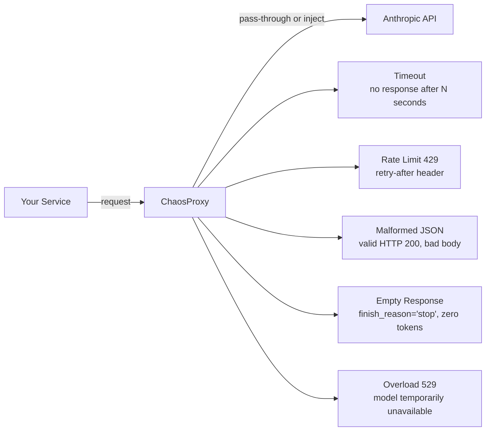
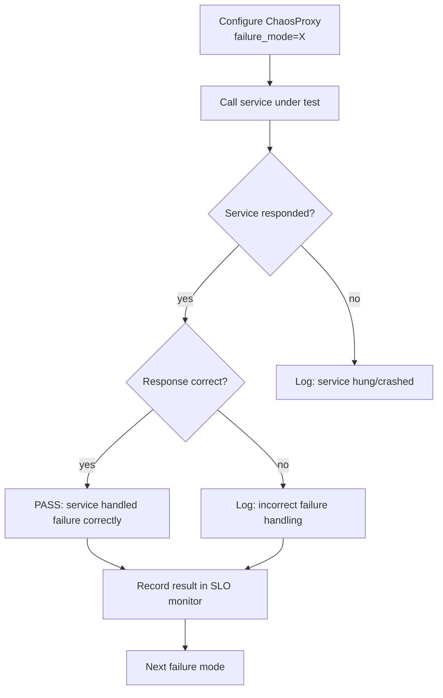

# Chaos and Failure Injection

> If you have not tested your fallback, it does not work. The circuit breaker that only trips in production is a liability.

**Type:** Build
**Languages:** Python
**Prerequisites:** Phase 07 Lessons 01-11 (observability, SLOs), Phase 06 (shipping)
**Time:** ~45 min
**Learning Objectives:**
- Name the 5 failure modes specific to LLM APIs and describe what each one breaks
- Implement a `ChaosProxy` that injects any of the 5 failures on demand
- Write a test suite that exercises each failure scenario and verifies correct recovery
- Distinguish between failures the service should handle silently vs. failures that should surface to the user
- Connect chaos results to the SLO monitoring from Lesson 11

---

## The Problem

You have a circuit breaker in your LLM service. It is configured to open after 5 consecutive errors and fall back to a cached response. You are confident it works. You have read the code.

You have never run it.

At 2 a.m. the Anthropic API has a partial outage. Requests start returning 529 (service overloaded). Your circuit breaker is supposed to open and serve cached responses. Instead, your service throws an unhandled exception on the first 529. The circuit breaker never fires because it only handles HTTP 5xx as an error, not 529 specifically. All users see a 500 error for 40 minutes.

This is the test gap chaos engineering fills. Fallback code that is never executed in a test is untested code. Production failures are the worst possible time to discover that your exception handler was written for HTTP 500, not HTTP 529.

LLM APIs have a specific set of failure modes that differ from standard REST APIs. This lesson builds a proxy that injects each one and verifies that your service handles it correctly before the failure happens in production.

---

## The Concept

### The 5 LLM-Specific Failure Modes



| Failure | HTTP Status | What breaks | Correct behavior |
|---------|-------------|-------------|-----------------|
| Timeout | (connection times out) | Hangs indefinitely | Raise after timeout_seconds; retry once |
| Rate limit | 429 | Hammers API on retry | Backoff using retry-after header; max 3 retries |
| Malformed JSON | 200 | JSON parser throws | Catch parse error; return error response to user |
| Empty response | 200 | Downstream expects content | Check output_tokens > 0; retry once |
| Overload | 529 | Often unhandled | Treat as temporary; exponential backoff; open circuit after 5 consecutive |

### The Chaos Test Loop



---

## Build It

Install dependencies:

```bash
pip install anthropic
```

The `ChaosProxy` wraps the Anthropic client and intercepts calls to inject failures:

```python
from chaos_proxy import ChaosProxy, FailureMode, LLMServiceUnderTest

# Test rate limit handling
proxy = ChaosProxy(failure_mode=FailureMode.RATE_LIMIT, failure_rate=1.0)
service = LLMServiceUnderTest(llm_client=proxy)

result = service.answer_question("What is 2+2?")
print(f"Status: {result.status}")         # should be "error" or "fallback"
print(f"Message: {result.message}")       # should NOT be an unhandled exception
print(f"Retry count: {result.retry_count}")  # should be > 0
```

Run the full chaos test suite:

```bash
python code/main.py
```

Expected output:

```
Running chaos test suite...

[PASS] timeout: Service returned fallback response after 2 retries. Duration: 3.2s
[PASS] rate_limit: Service backed off and retried after 429. Retry-after respected. Retries: 2
[PASS] malformed_json: Service caught parse error and returned structured error to caller.
[PASS] empty_response: Service detected zero output tokens and retried once. Second attempt OK.
[PASS] overload_529: Service applied exponential backoff. Circuit opened after 5 consecutive failures.

Results: 5/5 passed
```

If your service does not handle all 5, the output shows what failed:

```
[FAIL] timeout: Service hung for 32 seconds with no response. Expected: response within 5s.
```

> **Real-world check:** What is the difference between testing in chaos mode vs. mocking? A mock replaces the real object with a fake that returns predefined values. A chaos proxy wraps the real object and intercepts calls, which means you are testing the real client configuration, the real retry logic, and the real exception handling path. A mock test of a rate limit might pass even if your actual retry handler has a bug, because the mock bypasses the code path that calls `time.sleep(retry_after)`. The chaos proxy does not.

Run against a real service with the Anthropic client:

```bash
ANTHROPIC_API_KEY=your_key python code/main.py --real-client
```

---

## Use It

Integrate the chaos test suite into your CI pipeline:

```python
import pytest
from chaos_proxy import ChaosProxy, FailureMode

@pytest.mark.parametrize("mode", list(FailureMode))
def test_llm_service_handles_failure(mode, llm_service):
    proxy = ChaosProxy(failure_mode=mode, failure_rate=1.0)
    llm_service.client = proxy

    result = llm_service.answer_question("Test prompt")

    # Service must never raise an unhandled exception
    assert result is not None
    # Service must return a structured response, not a raw exception
    assert result.status in ("ok", "error", "fallback")
    # Service must not hang: result must return within the timeout
    # (enforced by the pytest timeout decorator in your suite)
```

> **Perspective shift:** Most chaos engineering frameworks (Chaos Monkey, Gremlin) are built for infrastructure: kill a server, partition a network. LLM chaos is different because the failures are at the application protocol level, not the infrastructure level. You cannot "kill" an API response; you inject specific malformed responses into a running process. This means your chaos testing lives in your application test suite, not in your infrastructure tooling. Own it there.

---

## Ship It

The artifact for this lesson is `outputs/skill-chaos-test-suite.md`: a chaos test suite template with all 5 failure modes and the assertion patterns for each one. Copy it into your service's test directory and fill in your service-specific assertion logic.

---

## Evaluate It

**Coverage gate:** Require all 5 failure modes to pass in CI before any deploy. A single failure mode FAIL is a deploy blocker.

**Failure mode discovery:** Every production incident involving an LLM API error becomes a new chaos test. After the incident, add a `ChaosProxy` mode that reproduces the exact failure and add it to the suite. Over 6 months, your suite will cover failure modes you have not yet anticipated.

**SLO impact of failures:** For each failure mode, measure the SLI impact: how many error budget minutes would this failure consume if it ran at 1% rate for 1 hour? Use this to prioritize which failure modes need faster recovery paths. A timeout that burns 30 minutes of error budget in one hour is more important to optimize than a malformed JSON error that burns 2 minutes.
