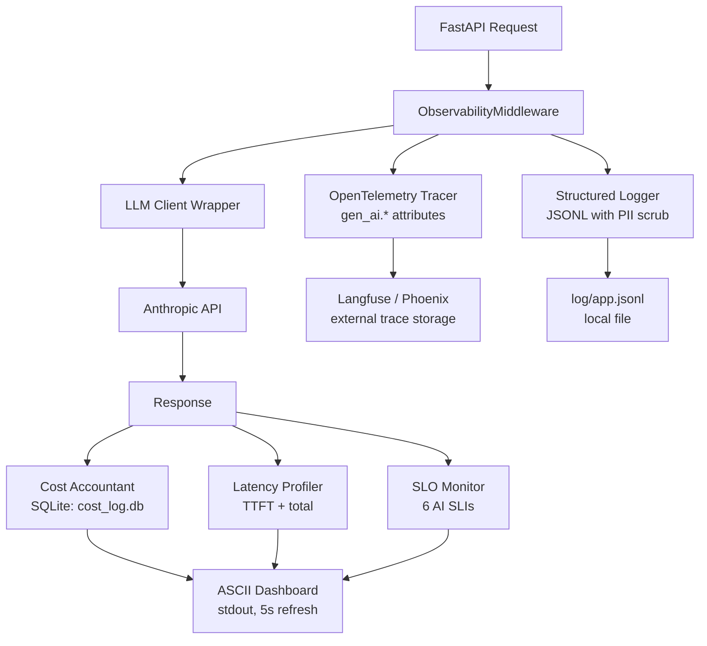

# المشروع الختامي: لوحة Observability وتكلفة كاملة

> اربط كل شيء معًا. النظام الذي لا تستطيع مراقبته هو نظام لا تستطيع الوثوق به.

**النوع:** بناء
**اللغات:** Python
**المتطلبات:** المرحلة 07 الدروس 01-12 (جميع دروس الـ observability)، خدمة RAG الختامية في المرحلة 06
**الوقت:** ~90 دقيقة
**أهداف التعلّم:**
- تجميع تتبّع OTel، والتسجيل البنيوي، ومحاسبة التكلفة، وتحليل زمن الاستجابة، ومراقبة الـ SLO في وحدة واحدة قابلة للاستيراد
- دمج وحدة الـ observability في خدمة FastAPI في أقل من 20 سطرًا
- عرض لوحة ASCII حيّة تُظهر 6 مقاييس أساسية على stdout
- تشغيل مجموعة اختبارات الفوضى من المرحلة 12 مقابل الخدمة الختامية والتحقق من نجاح أنماط الفشل الخمسة جميعًا
- تشغيل حزمة الـ observability الكاملة: البدء، والتهيئة، وضبط عتبات الـ SLO، وقراءة اللوحة

---

## المشكلة

تعلّمت سبع مهارات observability عبر المرحلة 07: تتبّع OTel، والتسجيل البنيوي، ومحاسبة التكلفة، وتحليل زمن الاستجابة، وتخزين الـ prompt في الكاش (prompt caching)، ومراقبة الـ SLO، وتوجيه النماذج، واختبار الحمل، واختبار الفوضى. كل مهارة تعمل بمعزل. لا واحدة منها متصلة بالأخرى أو بخدمة حقيقية.

يحتاج نظام الإنتاج إلى كل هذه تعمل معًا، مربوطةً في حلقة الأحداث (event loop) نفسها، تكتب إلى ملف الـ log نفسه، تغذّي اللوحة نفسها. التوصيل ليس تلقائيًا. يتطلب طبقة تكامل واحدة تستوردها خدمة FastAPI لديك مرة واحدة ثم تنساها.

يبني هذا المشروع الختامي تلك الطبقة: وحدة `observability.py` تضعها في أي خدمة. تُجهّز (instruments) كل استدعاء LLM، وتدفق المقاييس إلى قاعدة بيانات تكلفة SQLite، وتغذّي مراقب الـ SLO، وتعرض لوحة حيّة على stdout. ثم توصلها بخدمة RAG من المرحلة 06 وتشغّل مجموعة الفوضى للتحقق من أن الحزمة الكاملة تعالج الأعطال بشكل صحيح.

---

## المفهوم

### معمارية الـ Observability



تتشارك جميع المكوّنات كائن `ObservabilityContext` واحدًا يُنشأ عند بدء الخدمة ويُمرَّر عبر الـ middleware. يكتب كل مكوّن إلى منفذه الخاص (SQLite، أو ملف log، أو stdout) لكنه يقرأ من حدث الطلب نفسه.

### ملخّص المكوّنات

```
Component          Source lesson  What it adds
-----------------  -----------   ----------------------------------------
OTel tracer        L02            Distributed traces with gen_ai.* attrs
Structured logger  L05            JSONL logs with PII field scrubbing
Cost accountant    L06            Per-call cost to SQLite, hourly rollups
Latency profiler   L08            TTFT + total latency per request
SLO monitor        L11            6 AI SLIs with error budget tracking
Model router       L09            Route by complexity/cost/length
Chaos proxy        L12            Inject failures in tests (not imported in prod)
ASCII dashboard    (this lesson)  Live stdout view of all 6 metrics
```

---

## البناء

ثبّت المتطلبات:

```bash
pip install -r code/requirements.txt
```

صنف `ObservabilityModule` هو نقطة التكامل الوحيدة:

```python
from observability import ObservabilityModule, ObsConfig

obs = ObservabilityModule(ObsConfig(
    service_name="rag-service",
    db_path="data/cost_log.db",
    log_path="logs/app.jsonl",
    langfuse_enabled=False,  # set True with LANGFUSE_PUBLIC_KEY env var
))

# Wrap any LLM call
with obs.trace_llm_call(operation="rag_retrieve", user_id="u123") as ctx:
    response = anthropic_client.messages.create(
        model="claude-3-5-haiku-20241022",
        messages=[{"role": "user", "content": prompt}],
        max_tokens=500,
    )
    ctx.record(response)  # captures cost, latency, tokens, cache status
```

ابدأ لوحة الـ ASCII في خيط (thread) في الخلفية:

```python
obs.start_dashboard(refresh_seconds=5)
```

تعرض اللوحة على stdout كل 5 ثوانٍ:

```
+--------------------------------------------------+
|  RAG Service Observability Dashboard             |
|  2026-05-26 14:32:11  |  uptime: 2h 14m         |
+--------------------------------------------------+
|  Requests/min:    42   |  Error rate:   0.3%    |
|  TTFT p50:       380ms |  TTFT p95:    890ms    |
|  Total lat p50: 2.1s   |  Total lat p95:  5.2s  |
|  Cost/hr:      $0.18   |  Cache hits:   52%     |
|  Eval score:    0.87   |  SLO status:    OK     |
+--------------------------------------------------+
|  ALERTS: none                                    |
+--------------------------------------------------+
```

> **اختبار من الواقع:** لماذا نعرض اللوحة على stdout بدلًا من واجهة مستخدم حقيقية؟ لأن stdout يذهب إلى سجلّات الحاوية (container logs) لديك، وهي مجمّعة أصلًا بواسطة بنيتك التحتية (CloudWatch، أو Datadog، أو GCP Logging). يستطيع الإنسان قراءة سطر log واحد عبر tail -f في ثانيتين. أما لوحة Grafana فتتطلب فتح متصفّح، والعثور على اللوحة الصحيحة، وضبط النطاق الزمني. في أول 30 دقيقة من الحادث، stdout أسرع. ابنِ التكامل مع Grafana حين يكون لديك مستخدمون يحتاجون إلى لوحات خدمة ذاتية، لا قبل ذلك.

شغّل العرض التوضيحي المستقل:

```bash
python code/main.py --demo
```

شغّله مدمجًا مع خدمة FastAPI:

```bash
uvicorn code.main:app --port 8080
```

ثم اختبر في طرفية أخرى:

```bash
curl -X POST http://localhost:8080/query \
  -H "Content-Type: application/json" \
  -d '{"question": "What is RAG?"}'
```

---

## الاستخدام

أوصِل الوحدة بخدمة RAG من المرحلة 06. يستغرق التكامل أربعة أسطر:

```python
# In your FastAPI app startup
from observability import ObservabilityModule, ObsConfig

obs = ObservabilityModule(ObsConfig(service_name="rag-service"))
app.state.obs = obs
obs.start_dashboard()

# In your route handler
with app.state.obs.trace_llm_call(operation="rag_generate") as ctx:
    response = client.messages.create(...)
    ctx.record(response)
```

شغّل مجموعة اختبارات الفوضى مقابل الخدمة المدمجة:

```bash
python -m pytest code/test_chaos_integration.py -v
```

المخرجات المتوقعة:

```
test_chaos_integration.py::test_timeout PASSED
test_chaos_integration.py::test_rate_limit PASSED
test_chaos_integration.py::test_malformed_json PASSED
test_chaos_integration.py::test_empty_response PASSED
test_chaos_integration.py::test_overload_529 PASSED

5 passed in 12.4s
```

> **نقلة في المنظور:** تبدو وحدة الـ observability ثقيلة حين تضيفها إلى خدمة تعمل على ما يرام. لا يظهر العائد حتى يحدث خطب ما. النموذج الذهني الصحيح هو التأمين: تدفع عبئًا صغيرًا (10-20ms لكل طلب للتجهيز) وتحصل على تقليص محدد لزمن التعافي (ينخفض الـ MTTR من ساعات إلى دقائق لأنك تعرف بالضبط أي مكوّن تعطّل). التكلفة ثابتة؛ والفائدة تظهر في أسوأ لحظاتك. الفرق التي تتجاوز الـ observability تقضي وقتًا أطول بأربعة أضعاف على الحوادث.

---

## التسليم

مخرَج هذا الدرس هو `outputs/runbook-observability-setup.md`: دليل التشغيل (operations runbook) الذي يغطي البدء، والتهيئة، وضبط تنبيهات الـ SLO، وتفسير اللوحة، وإجراءات الاستجابة للحوادث لحزمة الـ observability الكاملة.

---

## التقييم

**اختبار دخان للتكامل (smoke test):** بعد دمج `observability.py` في أي خدمة، تحقّق من أن: (1) اللوحة تُعرض خلال 10 ثوانٍ من البدء، (2) قاعدة بيانات التكلفة فيها مدخل واحد على الأقل بعد أول استدعاء LLM، (3) ملف الـ log يحتوي JSONL صالحًا، و(4) مراقب الـ SLO يُبلّغ بحالة OK.

**بوابة مجموعة الفوضى:** يجب أن تنجح أنماط فشل الفوضى الخمسة جميعًا قبل أي نشر إنتاجي. هذه بوابة CI، لا فحص يدوي.

**دقة اللوحة:** افحص مقاييس اللوحة بالمقارنة مع بيانات الـ log الخام مرة في الأسبوع خلال الشهر الأول. إذا انحرفت تكلفة/الساعة في اللوحة عن فاتورة الـ API الفعلية بأكثر من 15%، فهناك خطأ في عدّ التوكنات أو في التسعير يجب إصلاحه.

**ضبط عتبات الـ SLO:** راجع عتبات التنبيه بعد أول أسبوعين من ترافيك الإنتاج. إذا كان أي SLI يُطلق تنبيهًا أكثر من مرتين يوميًا دون حادث حقيقي، فوسّع العتبة. وإذا وقع أي حادث دون تنبيه مسبق، فشدّد العتبة. وثّق العتبات النهائية في دليل التشغيل.
