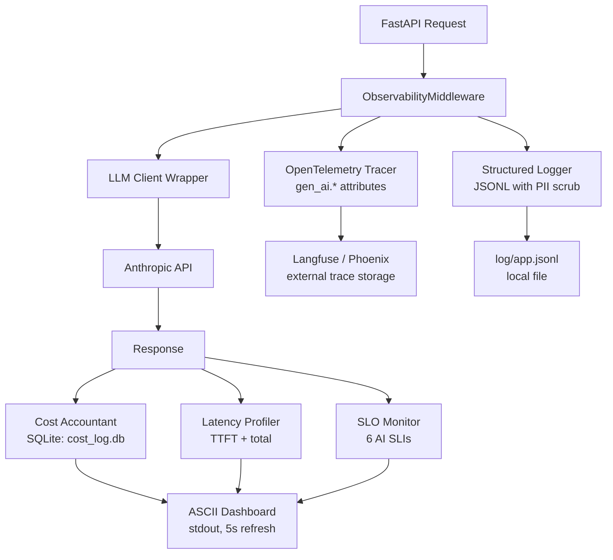

# Capstone: Full Observability and Cost Dashboard

> Wire everything together. A system you cannot observe is a system you cannot trust.

**Type:** Build
**Languages:** Python
**Prerequisites:** Phase 07 Lessons 01-12 (all observability lessons), Phase 06 capstone RAG service
**Time:** ~90 min
**Learning Objectives:**
- Assemble OTel tracing, structured logging, cost accounting, latency profiling, and SLO monitoring into a single importable module
- Integrate the observability module into a FastAPI service in under 20 lines
- Render a live ASCII dashboard showing 6 key metrics to stdout
- Run the Phase 12 chaos test suite against the capstone service and verify all 5 failure modes pass
- Operate the complete observability stack: start, configure, tune SLO thresholds, and read the dashboard

---

## The Problem

You have learned seven observability skills across Phase 07: OTel tracing, structured logging, cost accounting, latency profiling, prompt caching, SLO monitoring, model routing, load testing, and chaos testing. Each skill works in isolation. None of them are connected to each other or to a real service.

A production system needs all of these working together, wired into the same event loop, writing to the same log file, feeding the same dashboard. The plumbing is not automatic. It requires a single integration layer that your FastAPI service imports once and then forgets about.

This capstone builds that layer: an `observability.py` module you drop into any service. It instruments every LLM call, streams metrics to a SQLite cost database, feeds the SLO monitor, and renders a live dashboard to stdout. You then plug it into the Phase 06 RAG service and run the chaos suite to verify the full stack handles failures correctly.

---

## The Concept

### Observability Architecture



All components share a single `ObservabilityContext` object that is created at service startup and passed through middleware. Each component writes to its own sink (SQLite, log file, stdout) but reads from the same request event.

### Component Summary

```
Component          Source lesson  What it adds
-----------------  -----------   ----------------------------------------
OTel tracer        L02            Distributed traces with gen_ai.* attrs
Structured logger  L05            JSONL logs with PII field scrubbing
Cost accountant    L06            Per-call cost to SQLite, hourly rollups
Latency profiler   L08            TTFT + total latency per request
SLO monitor        L11            6 AI SLIs with error budget tracking
Model router       L09            Route by complexity/cost/length
Chaos proxy        L12            Inject failures in tests (not imported in prod)
ASCII dashboard    (this lesson)  Live stdout view of all 6 metrics
```

---

## Build It

Install dependencies:

```bash
pip install -r code/requirements.txt
```

The `ObservabilityModule` class is the single integration point:

```python
from observability import ObservabilityModule, ObsConfig

obs = ObservabilityModule(ObsConfig(
    service_name="rag-service",
    db_path="data/cost_log.db",
    log_path="logs/app.jsonl",
    langfuse_enabled=False,  # set True with LANGFUSE_PUBLIC_KEY env var
))

# Wrap any LLM call
with obs.trace_llm_call(operation="rag_retrieve", user_id="u123") as ctx:
    response = anthropic_client.messages.create(
        model="claude-3-5-haiku-20241022",
        messages=[{"role": "user", "content": prompt}],
        max_tokens=500,
    )
    ctx.record(response)  # captures cost, latency, tokens, cache status
```

Start the ASCII dashboard in a background thread:

```python
obs.start_dashboard(refresh_seconds=5)
```

The dashboard renders to stdout every 5 seconds:

```
+--------------------------------------------------+
|  RAG Service Observability Dashboard             |
|  2026-05-26 14:32:11  |  uptime: 2h 14m         |
+--------------------------------------------------+
|  Requests/min:    42   |  Error rate:   0.3%    |
|  TTFT p50:       380ms |  TTFT p95:    890ms    |
|  Total lat p50: 2.1s   |  Total lat p95:  5.2s  |
|  Cost/hr:      $0.18   |  Cache hits:   52%     |
|  Eval score:    0.87   |  SLO status:    OK     |
+--------------------------------------------------+
|  ALERTS: none                                    |
+--------------------------------------------------+
```

> **Real-world check:** Why render the dashboard to stdout instead of a proper UI? Because stdout goes into your container logs, which are already aggregated by your infrastructure (CloudWatch, Datadog, GCP Logging). A human can read a single tail -f log line in 2 seconds. A Grafana dashboard requires opening a browser, finding the right dashboard, and adjusting the time range. For the first 30 minutes of an incident, stdout is faster. Build the Grafana integration when you have users who need self-service dashboards, not before.

Run the standalone demo:

```bash
python code/main.py --demo
```

Run integrated with the FastAPI service:

```bash
uvicorn code.main:app --port 8080
```

Then test in another terminal:

```bash
curl -X POST http://localhost:8080/query \
  -H "Content-Type: application/json" \
  -d '{"question": "What is RAG?"}'
```

---

## Use It

Plug the module into the Phase 06 RAG service. The integration takes four lines:

```python
# In your FastAPI app startup
from observability import ObservabilityModule, ObsConfig

obs = ObservabilityModule(ObsConfig(service_name="rag-service"))
app.state.obs = obs
obs.start_dashboard()

# In your route handler
with app.state.obs.trace_llm_call(operation="rag_generate") as ctx:
    response = client.messages.create(...)
    ctx.record(response)
```

Run the chaos test suite against the integrated service:

```bash
python -m pytest code/test_chaos_integration.py -v
```

Expected output:

```
test_chaos_integration.py::test_timeout PASSED
test_chaos_integration.py::test_rate_limit PASSED
test_chaos_integration.py::test_malformed_json PASSED
test_chaos_integration.py::test_empty_response PASSED
test_chaos_integration.py::test_overload_529 PASSED

5 passed in 12.4s
```

> **Perspective shift:** The observability module feels heavy when you add it to a service that is working fine. The payoff is not visible until something goes wrong. The right mental model is insurance: you pay a small overhead (10-20ms per request for instrumentation) and get a specific recovery time reduction (MTTR goes from hours to minutes because you know exactly which component broke). The cost is constant; the benefit appears at your worst moment. Teams that skip observability spend 4x longer on incidents.

---

## Ship It

The artifact for this lesson is `outputs/runbook-observability-setup.md`: the operations runbook covering startup, configuration, SLO alert tuning, dashboard interpretation, and incident response procedures for the complete observability stack.

---

## Evaluate It

**Integration smoke test:** After integrating `observability.py` into any service, verify that: (1) the dashboard renders within 10 seconds of startup, (2) the cost database has at least one entry after the first LLM call, (3) the log file contains valid JSONL, and (4) the SLO monitor reports OK status.

**Chaos suite gate:** All 5 chaos failure modes must pass before any production deploy. This is a CI gate, not a manual check.

**Dashboard accuracy:** Spot-check the dashboard metrics against raw log data once per week for the first month. If dashboard cost/hr diverges from actual API billing by more than 15%, there is a token counting or pricing bug to fix.

**SLO threshold tuning:** Review alert thresholds after the first two weeks of production traffic. If any SLI is alerting more than twice per day without a real incident, widen the threshold. If any incident occurred without a prior alert, tighten the threshold. Document the final thresholds in the runbook.
